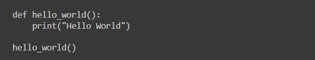

# 代码补全的预训练模型地址收集


## 1、PyCodeGPT

地址：https://github.com/microsoft/PyCodeGPT

A pre-trained GPT model for Python code completion and generation

### **What is it?**

PyCodeGPT is efficient and effective GPT-Neo-based model for python code generation task, which is similar to [OpenAI Codex](https://openai.com/blog/openai-codex/), [Github Copliot](https://copilot.github.com/), [CodeParrot](https://huggingface.co/blog/codeparrot), [AlphaCode](https://deepmind.com/blog/article/Competitive-programming-with-AlphaCode).

### **Pretrained models**

we aims to train median-large pre-trained models (model size with 110M) based on GPT-Neo:

- PyCodeGPT-110M: derived from GPT-Neo 125M with a vocabulary size of 32K. [Download PyCodeGPT 110M](https://github.com/microsoft/PyCodeGPT/releases/tag/PyCodeGPT-110M). We also continue-pretrained PyCodeGPT for Libary oriented scenarios, called [CERT](https://github.com/microsoft/PyCodeGPT/tree/main/cert), the models can be downloaded [here](https://github.com/microsoft/PyCodeGPT/releases).


## 2、GPT-Neo

地址：https://github.com/EleutherAI/gpt-neo

### **Pretrained Models**

**Update 21/03/2021:**

We're proud to release two pretrained GPT-Neo models trained on The Pile, the weights and configs can be freely downloaded from [the-eye.eu](https://the-eye.eu/public/AI/gptneo-release/).

1.3B: https://mystic.the-eye.eu/public/AI/gptneo-release/GPT3_XL/

2.7B: https://mystic.the-eye.eu/public/AI/gptneo-release/GPT3_2-7B/

For more information on how to get these set up, see the colab notebook, or read through the rest of the readme.


## 3、CodeGen

地址：https://github.com/salesforce/CodeGen

### **HuggingFace**

The model is available on the [HuggingFace Hub](https://huggingface.co/models?search=salesforce+codegen) with a Colab demo [here](https://colab.research.google.com/drive/11YU00W-JLNXn-3YckJGOSxFf_TQfCXYr?usp=sharing).

```python
import torch
from transformers import AutoTokenizer, AutoModelForCausalLM
tokenizer = AutoTokenizer.from_pretrained("Salesforce/codegen-2B-mono")
model = AutoModelForCausalLM.from_pretrained("Salesforce/codegen-2B-mono")
inputs = tokenizer("# this function prints hello world", return_tensors="pt").to(0)
sample = model.generate(**inputs, max_length=128)
print(tokenizer.decode(sample[0], truncate_before_pattern=[r"\n\n^#", "^'''", "\n\n\n"]))
```

### **Colab**

This [Google Colab notebook](https://colab.research.google.com/drive/1fQI8OgzMAR0bquCrvhlAtXSw6iMFbVgI) allows for sampling from the CodeGen models.

### **Released Models**

We release models of various sizes trained on various datasets. The models are named in the following format:

```
codegen-{model-size}-{data}
```

`model-size` has 4 options: `350M`, `2B`, `6B`, `16B`, which represent the number of parameters in each model.

`data` has 3 options: `nl`, `multi`, `mono`.

- `nl` models are randomly initialized and trained on [The Pile](https://github.com/EleutherAI/the-pile), a 825.18 GB English text corpous.
- `multi` models are initialized from `nl` models and then trained on a corpus with code data consisting of multiple programming languages.
- `mono` models are initialized from `multi` models and then trained on a corpus with Python code data.

The model names can be provided to the `--model` flag for `sample.py`. See a sample usage above in Setup.





## 4、InCoder

Github地址：https://github.com/dpfried/incoder/blob/main/README.md

官网地址：https://sites.google.com/view/incoder-code-models

Demo：https://huggingface.co/spaces/facebook/incoder-demo

This repository hosts example code showing how to use the model using HuggingFace's `transformers` library. Code to replicate the evaluation results in our paper (in Fairseq, which we used to train the model) is coming soon!

See [our project site](https://sites.google.com/view/incoder-code-models) for more information, or [our paper](https://arxiv.org/abs/2204.05999), or [examples](https://sites.google.com/view/incoder-code-models/home/examples).

### **Models**

You can obtain the models from HuggingFace's hub:

- 6.7B parameter model: [facebook/incoder-6B](https://huggingface.co/facebook/incoder-6B)
- 1.3B parameter model: [facebook/incoder-1B](https://huggingface.co/facebook/incoder-1B)


## 5、Code RL

GitHub地址：https://github.com/salesforce/CodeRL

### **Models**

We employ [CodeT5](https://github.com/salesforce/CodeT5) (a family of encoder-decoder language models for code from the [paper](https://arxiv.org/pdf/2109.00859.pdf)) as the foundation model for CodeRL. We release two large-sized CodeT5 checkpoints at Hugging Face: [Salesforce/codet5-large](https://huggingface.co/Salesforce/codet5-large) and [Salesforce/codet5-large-ntp-py](https://huggingface.co/Salesforce/codet5-large-ntp-py).

- CodeT5-large was pretrained using Masked Span Prediction objective on CSN and achieved new SOTA results on several CodeXGLUE benchmarks. See Appendix A.1 of the [paper](https://arxiv.org/pdf/2207.01780.pdf) for more details.
- CodeT5-large-ntp-py was first pretrained using Masked Span Prediction objective on CSN and GCPY, followed by using Next Token Prediction objective on GCPY. *This checkpoint was especially optimized for Python code generation tasks and employed by CodeRL*.

We will release the following finetuned model checkpoints:

- CodeRL+CodeT5: the above pretrained CodeT5 model which is finetuned on APPS following our CodeRL training framework
- Critic: a CodeT5 model which is initialized from a CodeT5-base and trained as a classifier to predict unit test outcomes. The critic is used to estimate returns and facilitate RL finetuning.

Download all files into the `models` folder.


## 6、Codex

无开源模型


## 7、AlphaCode

无开源模型