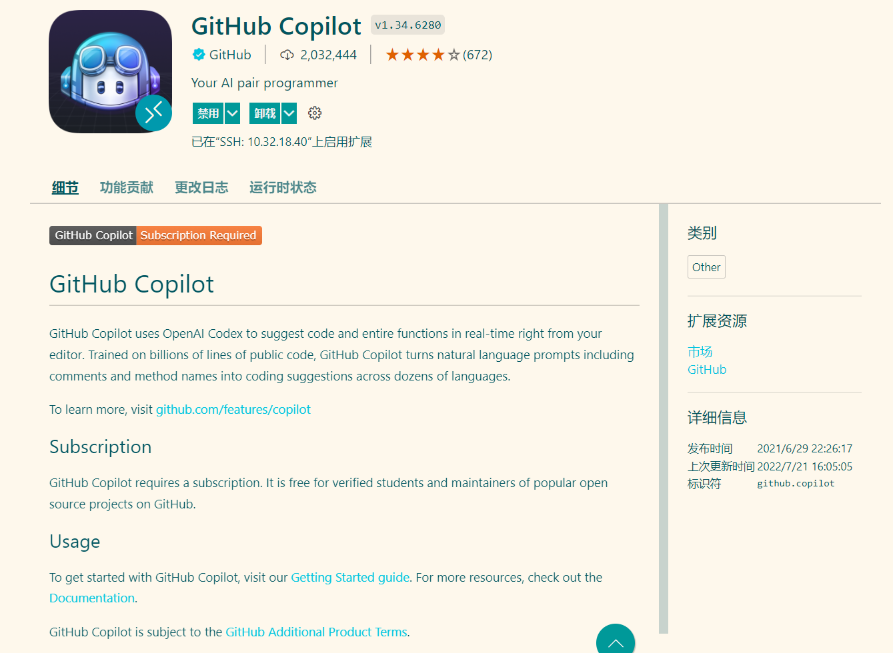

# 代码补全的预训练模型评估

### 目录：

- 性能对比的Benchmark
- 1、PyCodeGPT
- 2、GPT-NEO
- 3、CodeGen
- 4、InCoder
- 预训练模型的本地部署实践
  - CodeGen(已验证：可行)
  - InCoder  (已验证：可行)

## **作为对比的Benchmark:**

- GitHub Copilot

  


## 1、PyCodeGPT(<span style='color:brown'>结论：暂未验证可用性</span>)

地址：https://github.com/microsoft/PyCodeGPT

预训练模型已下载：

- PyCodeGPT-110M

### **Evaluation**

1. Install requirements (python 3.7)

```
$ pip install -r requirements.txt
```

1. Install [HumanEval](https://github.com/openai/human-eval)

- Note that you can successfully evaluate your model after uncommenting 58th line of `human-eval/human_eval/execution.py`

```
$ git clone https://github.com/openai/human-eval
$ pip install -e human-eval
```

1. Run `eval_human_eval.py` to generate programs

   - Arguments

     - `model_name_or_path` : Path to the model checkpoint to be evaluated.
     - `output_dir` : Path to save generated programs
     - `num_completions` : The number of program to be generated
     - `temperature` : Temperature for sampling
     - `top_p` : p value for nucleus sampling
     - `max_new_tokens` : Maximum number of generated token

   - Example usage

     ```
     $ python eval_human_eval.py \
     	--model_name_or_path PyCodeGPT-110M/ \
     	--output_dir results/ \
     	--num_completions 100 \
     	--temperature 0.2 \
     	--top_p 0.95 \
     	--max_new_tokens 100 \
     	--gpu_device 0
     ```

2. Evaluate functional correctness

   ```
   $ evaluate_functional_correctness <samples_path>
   # Example
   $ evaluate_functional_correctness results/human_eval.t0.2.p0.95.l100.n100.samples.jsonl
   ```


## 2、GPT-NEO(<span style='color:brown'>结论：不可用</span>)

地址：https://github.com/EleutherAI/gpt-neo

预训练模型已下载：

- GPT-NEO，体积较大。

说明：

- 使用Mesh-tensorflow库的模型并行GPT-2和GPT-3式模型的实现。

此处的预训练模型为在The Pile数据集上进行训练的模型，无法直接进行代码补全的推理使用。


## 3、CodeGen(<span style='color:brown'>结论：可直接使用</span>)

地址：https://github.com/salesforce/CodeGen

### **HuggingFace**

The model is available on the [HuggingFace Hub](https://huggingface.co/models?search=salesforce+codegen) with a Colab demo [here](https://colab.research.google.com/drive/11YU00W-JLNXn-3YckJGOSxFf_TQfCXYr?usp=sharing).

> 说明：
>
> CODEGEN-NL模型为在ThePile数据集上训练的模型;
>
> CODEGEN-MULTI模型为在BigQuery数据集上训练的多语言模型；
>
> CODEGEN-MONO模型为在单一数据集BIGPYTHON上训练的单语言模型；
>
> 


- codegen-350M-nl
- codegen-350M-multi
- codegen-350M-mono
- codegen-2B-nl
- codegen-2B-multi
- codegen-2B-mono
- codegen-6B-nl
- codegen-6B-multi
- codegen-6B-mono
- codegen-16B-nl
- codegen-16B-multi
- codegen-16B-mono

```python
import torch
from transformers import AutoTokenizer, AutoModelForCausalLM
tokenizer = AutoTokenizer.from_pretrained("Salesforce/codegen-2B-mono")
model = AutoModelForCausalLM.from_pretrained("Salesforce/codegen-2B-mono")
inputs = tokenizer("# this function prints hello world", return_tensors="pt").to(0)
sample = model.generate(**inputs, max_length=128)
print(tokenizer.decode(sample[0], truncate_before_pattern=[r"\n\n^#", "^'''", "\n\n\n"]))
```


### **Colab**

This [Google Colab notebook](https://colab.research.google.com/drive/1fQI8OgzMAR0bquCrvhlAtXSw6iMFbVgI) allows for sampling from the CodeGen models.


## 4、InCoder(<span style='color:brown'>结论：可直接使用</span>)

Github地址：https://github.com/dpfried/incoder/blob/main/README.md

官网地址：https://sites.google.com/view/incoder-code-models

Demo：https://huggingface.co/spaces/facebook/incoder-demo

### **Models**

You can obtain the models from HuggingFace's hub:

- 6.7B parameter model: [facebook/incoder-6B](https://huggingface.co/facebook/incoder-6B)
- 1.3B parameter model: [facebook/incoder-1B](https://huggingface.co/facebook/incoder-1B)

