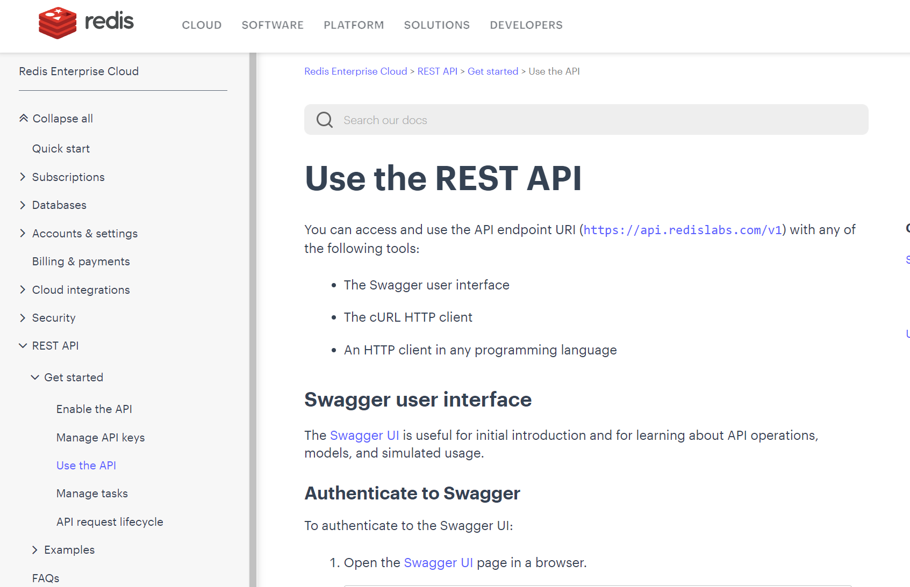

# 02--Flask 使用Redis 服务器

**参考链接：**

- Github -- [redis / redis-py](https://github.com/redis/redis-py)
- Github -- [flask-restful-example](https://github.com/qzq1111/flask-restful-example)
- Flask 使用 [Redis 数据库](https://blog.csdn.net/qq_22034353/article/details/89107062)
- [redis-py documentation](https://redis.readthedocs.io/en/stable/index.html)
- Redis -- [Use the REST API](https://docs.redis.com/latest/rc/api/get-started/use-rest-api/)





## <span style='color:brown'>redis-py</span>

### 1、Installation

```shell
$ pip install redis
```

为了获得更快的性能，请安装支持hiredis的redis，这提供了一个编译的响应解析器，并且在大多数情况下需要零代码更改。默认情况下，如果hiredis >= 1.0 可用，redis-py 将尝试使用它进行响应解析。

```shell
$ pip install redis[hiredis]
```


### 2、Usage

**Basic Example**

```python
>>> import redis
>>> r = redis.Redis(host='localhost', port=6379, db=0)
>>> r.set('foo', 'bar')
True
>>> r.get('foo')
b'bar'
```

上面的代码连接到 localhost 的 6379 端口，在 Redis 中设置一个值，然后检索它。在 Python 中，所有响应都以字节形式返回，要接收解码的字符串，请设置 `decode_responses=True`。For this, and more connection options, see [these examples](https://redis.readthedocs.io/en/stable/examples.html).

**Connection Pools**

默认情况下，redis-py使用一个连接池来管理连接。每个 Redis 类的实例都会收到它自己的连接池。然而，你可以定义你自己的 redis.ConnectionPool：

```python
>>> pool = redis.ConnectionPool(host='localhost', port=6379, db=0)
>>> r = redis.Redis(connection_pool=pool)
```

Alternatively, you might want to look at [Async connections](https://redis.readthedocs.io/en/stable/examples/asyncio_examples.html), or [Cluster connections](https://redis.readthedocs.io/en/stable/connections.html#cluster-client), or even [Async Cluster connections](https://redis.readthedocs.io/en/stable/connections.html#async-cluster-client).

**Redis Commands**

There is built-in support for all of the [out-of-the-box Redis commands](https://redis.io/commands). They are exposed using the raw Redis command names (`HSET`, `HGETALL`, etc.) except where a word (i.e del) is reserved by the language. The complete set of commands can be found [here](https://github.com/redis/redis-py/tree/master/redis/commands), or [the documentation](https://redis.readthedocs.io/en/stable/commands.html).


### 3、Advanced Topics

[官方的 Redis 命令文档](https://redis.io/commands)对每条命令都做了很好的详细解释。redis-py 试图遵守官方的命令语法。但有几个例外：

- MULTI/EXEC

  这些是作为 Pipeline 类的一部分实现的。管道在执行时默认使用 MULTI 和 EXEC 语句包装，可以通过指定 transaction=False 来禁用。请参阅下面的有关管道的更多信息。

- SUBSCRIBE/LISTEN

  与管道类似，PubSub 被实现为一个单独的类，因为它将底层连接置于无法执行非 pubsub 命令的状态。从 Redis 客户端调用 pubsub 方法将返回一个 PubSub 实例，你可以在其中订阅频道并收听消息。你只能从 Redis 客户端调用 PUBLISH（有关详细信息，请参阅关于问题 #151 的评论）。

For more details, please see the documentation on [advanced topics page](https://redis.readthedocs.io/en/stable/advanced_features.html).

**Pipelines**

以下是 [Redis pipeline](https://redis.io/docs/manual/pipelining/) 的基本示例，这是一种优化往返调用的方法，通过批处理 Redis 命令并将其结果作为列表接收。

```python
>>> pipe = r.pipeline()
>>> pipe.set('foo', 5)
>>> pipe.set('bar', 18.5)
>>> pipe.set('blee', "hello world!")
>>> pipe.execute()
[True, True, True]
```


**PubSub**

下面的例子显示了如何利用Redis Pub/Sub来订阅特定的通道。

```python
>>> r = redis.Redis(...)
>>> p = r.pubsub()
>>> p.subscribe('my-first-channel', 'my-second-channel', ...)
>>> p.get_message()
{'pattern': None, 'type': 'subscribe', 'channel': b'my-second-channel', 'data': 1}
```


## Python 使用 Redis

1. 安装 Python Redis 

   ```shell
   $ pip install redis
   ```

   

2. 简单使用

   ```python
   import redis
   
   # 获取redis数据库连接
   r = redis.StrictRedis(host='127.0.0.1', port=6379, db=0)
   
   # redis 存入键值对
   r.set(name="key", value="value")
   
   # 读取键值对
   print(r.get("key"))
   
   # 删除
   print(r.delete("key"))
   
   # redis存入Hash值
   r.hash(name="name", key="key1", value="value1")
   r.hash(name="name", key="key2", value="value2")
   
   # 获取所有Hash表中的字段
   print(r.hgetall("name"))
   
   # 获取所有给定字段的值
   print(r.hmget("name", "key1", "key2"))
   
   # 获取存储在Hash表中指定字段的值
   print(r.hmget("name", "key1"))
   
   # 删除一个或多个Hash表字段
   print(r.hdel("name", "key1"))
   
   # 过期时间：60秒后过期
   r.expire("name", 60)
   ```

   

## Flask 使用 Redis

1、Redis数据库连接的初始设定

```python
from flask import Flask
from test import bp

app = Flask(__name__)
# Redis数据库地址
app.config['REDIS_HOST = "127.0.0.1"  
# REDIS 端口
app.config['REDIS_PORT'] = 6379
# 数据库名
app.config['REDIS_DB'] = 0
# Redis过期时间为60秒
app.config['REDIS_EXPIRE'] = 60
# 注册接口
app.register_blueprint(bp)
```


2、封装Redis

```python
from falsk import current_app
import redis

calss Redis(object):
    @staticmethod
    def _get_r():
        host = current_app.config['REDIS_HOST']
        port=current_app.config['REDIS_PORT']
        db=current_app.config['REDIS_DB']
        r = redis.StrictRedis(host, port, db)
        return r
    
    @classmethod
    def write(cls, key, value, expire=None):
        if expire:
            expire_in_seconds = expire
        else:
            expire_in_seconds = current_app.config['REDIS_EXPIRE']
        r = cls._get_r()
        r.set(key, value, ex=expire_in_seconds)
        
    @classmethod
    def read(cls, key):
        r = cls._get_r()
        value = r.get(key)
        return value.decode('utf-8') if value else value
    
    @classmethod
    def hset(cls, name, key, value):
        r = cls._get_r()
        r.hset(name. key, value)
    
    @classmethod
    def hmset(cls, key, *value):
        r = cls._get_r()
        value = r.hmset(key, *value)
        return value
    
    @classmethod
    def hget(cls, name, key):
        r = cls._get_r()
        value = r.hget(name, key)
        return value.decode('utf-8') if value else value
    
    @classmethod
    def hgetall(cls, name):
        r = cls._get_r()
        return r.hgetall(name)
    
    @classmethod
    def delete(cls, *names):
        r = cls._get_r()
        r.delete(*names)
        
    @classmethod
    def hdel(cls, name, key):
        r = cls._get_r()
        r.hdel(name, key)
        
    @classmethod
    def expire(cls, name, expire=None):
        if expire:
            expire_in_seconds = expire
        else:
            expire_in_seconds = current_app.config['REDIS_EXPIRE']
        r = cls._get_r()
        r.expire(name, expire_in_seconds)
```


## <span style='color:brown'>**内网环境使用Flask 部署 Redis 实践**</span>

**预备条件：**

```shell
$ pip install flask
$ pip install flask_restful
```


```python
from flask import Flask
from flask import request
import json
import requests
import redis

# 获取redis数据库连接
r = redis.StrictRedis(host='localhost', port=6379, db=0)

torchserve_url = 'http://0.0.0.0:7000/predictions/codegen'
headers = {'Content-Type':'application/json'}

app = Flask(__name__)

@app.route("/", methods=["POST"])
def query():
    content = request.json
    codehint = content['data']
    # 查询 Redis数据库
    if r.exists(codehint):
        predict = r.get(codehint)
        return predict
    # 转发请求，TorchServe进行推理
    else:
        dict = {}
        dict['data'] = codehint
        # 转发请求，使用Torchserve进行模型推理
        response = requests.post(torchserve_url, data=json.dumps(dict), headers=headers)
        predict = response.text
        # 将结果作为键值对的形式存储到Redis
        r.set(codehint, predict)
        return predict
  

@app.route("update", methods=["POST"])
def update():
    content = request.json
    key = content['codehint']
    value = content['predict']
    r.set(key, value)
    return json.dumps({"success":True}), 200, {"Content-Type":"application/json"}

if __name__ == "__main__":
    app.run(host='0.0.0.0', port=5000)
```


