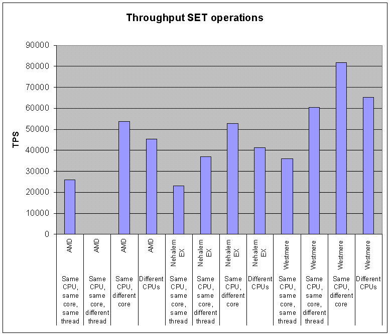
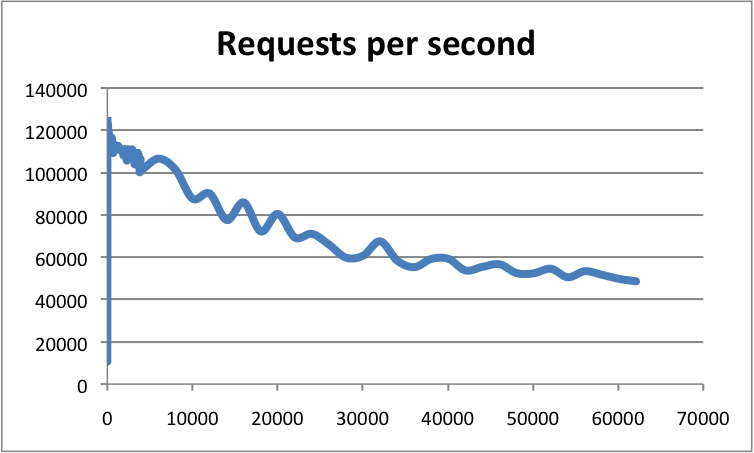

# 03 -- Redis Performance 相关调研


**Reference:**

- [Redis benchmark](https://redis.io/docs/reference/optimization/benchmarks/)


## Redis benchmark

使用redis-benchmark工具对Redis服务器进行基准测试。

Redis包括redis-benchmark工具，模拟运行N个客户端所做的命令，同时发送M个总查询。该工具提供了一套默认的测试，或者你可以提供一套自定义的测试。

支持以下选项：

```shell
Usage: redis-benchmark [-h <host>] [-p <port>] [-c <clients>] [-n <requests]> [-k <boolean>]

 -h <hostname>      Server hostname (default 127.0.0.1)
 -p <port>          Server port (default 6379)
 -s <socket>        Server socket (overrides host and port)
 -a <password>      Password for Redis Auth
 -c <clients>       Number of parallel connections (default 50)
 -n <requests>      Total number of requests (default 100000)
 -d <size>          Data size of SET/GET value in bytes (default 3)
 --dbnum <db>       SELECT the specified db number (default 0)
 -k <boolean>       1=keep alive 0=reconnect (default 1)
 -r <keyspacelen>   Use random keys for SET/GET/INCR, random values for SADD
  Using this option the benchmark will expand the string __rand_int__
  inside an argument with a 12 digits number in the specified range
  from 0 to keyspacelen-1. The substitution changes every time a command
  is executed. Default tests use this to hit random keys in the
  specified range.
 -P <numreq>        Pipeline <numreq> requests. Default 1 (no pipeline).
 -q                 Quiet. Just show query/sec values
 --csv              Output in CSV format
 -l                 Loop. Run the tests forever
 -t <tests>         Only run the comma separated list of tests. The test
                    names are the same as the ones produced as output.
 -I                 Idle mode. Just open N idle connections and wait.
```

在启动基准测试之前，你需要有一个正在运行的Redis实例。你可以像这样运行基准测试工具。

```shell
$ redis-benchmark -q -n 100000
```

<span style='color:brown'>**只运行一部分测试**</span>

不需要每次执行 redis-benchmark 时都运行所有默认测试。例如，要仅选择测试子集，请使用 -t 选项，如下例所示：

```shell
$ redis-benchmark -t set,lpush -n 100000 -q
SET: 74239.05 requests per second
LPUSH: 79239.30 requests per second
```

此示例运行 SET 和 LPUSH 命令的测试并使用安静模式（请参阅 -q 开关）。

甚至可以对特定命令进行基准测试：

```shell
$ redis-benchmark -n 100000 -q script load "redis.call('set', 'foo', 'bar')"
script load redis.call('set', 'foo', 'bar'): 69881.20 requests per second
```

<span style='color:brown'>**选择 key 空间的大小**</span>

默认情况下，基准测试针对单个键运行。在 Redis 中，这种合成基准和真实基准之间的差异并不大，因为它是一个内存系统，但是可能会强调缓存未命中，并且通常通过使用大键来模拟更真实的工作负载空间。

这是通过使用 -r 开关获得的。例如，如果我想运行一百万个 SET 操作，对 100k 个可能的键中的每个操作使用一个随机键，我将使用以下命令行：

```shell
$ redis-cli flushall
OK

$ redis-benchmark -t set -r 100000 -n 1000000
====== SET ======
  1000000 requests completed in 13.86 seconds
  50 parallel clients
  3 bytes payload
  keep alive: 1

99.76% `<=` 1 milliseconds
99.98% `<=` 2 milliseconds
100.00% `<=` 3 milliseconds
100.00% `<=` 3 milliseconds
72144.87 requests per second

$ redis-cli dbsize
(integer) 99993
```


<span style='color:brown'>**Using pipelining**</span>

默认情况下，每个客户端（如果没有使用 -c 指定，基准模拟 50 个客户端）仅在收到前一个命令的回复时发送下一个命令，这意味着服务器可能需要读取调用才能读取每个命令来自每一位客户。 RTT 也是付费的。

Redis 支持 <span style='color:blue'>**pipelining** </span>，因此可以一次发送多个命令，这是现实世界应用程序经常利用的功能。 Redis 流水线能够显着提高服务器每秒能够交付的操作数。

考虑一下这个使用16条命令的流水线运行基准的例子：

```shell
$ redis-benchmark -n 1000000 -t set,get -P 16 -q
SET: 403063.28 requests per second
GET: 508388.41 requests per second
```

使用流水线可以显着提高性能。


### <span style='color:brown'>**陷阱和误解 -- Pitfalls and misconceptions**</span>

第一点很明显：一个有用的基准的黄金法则是**只比较苹果和苹果**。你可以在相同的工作负载上比较不同版本的Redis，或者同一版本的Redis，但有不同的选项。如果你打算将Redis与其他东西进行比较，那么就必须评估功能和技术上的差异，并将它们考虑在内：

- Redis是一个服务器：所有的命令都涉及网络或IPC的往返。将其与嵌入式数据存储进行比较是没有意义的，因为大多数操作的成本主要在网络/协议管理上。
- Redis命令对所有通常的命令都会返回一个确认。其他一些数据存储则不然。将Redis与涉及单向查询的存储进行比较，只有轻微的作用。
- 直观地在同步Redis命令上迭代并不能为Redis本身提供基准，而是测量你的网络（或IPC）延迟和客户端库的内在延迟。要真正测试Redis，你需要多个连接（如redis-benchmark）和/或使用流水线来聚合几个命令和/或多个线程或进程。
- Redis是一个内存数据存储，有一些可选的持久性选项。如果你打算将它与事务性服务器（MySQL、PostgreSQL等......）进行比较，那么你应该考虑激活AOF并决定一个合适的fsync策略。
- 从命令执行的角度来看，Redis主要是一个单线程服务器（实际上现代版本的Redis使用线程来做不同的事情）。它的设计不是为了从多个CPU核心中获益。如果需要，人们应该启动几个Redis实例，在几个核心上进行扩展。将一个单一的Redis实例与一个多线程的数据存储进行比较其实并不公平。

redis-benchmark程序是一种快速而有用的方法，可以获得一些数据，并评估Redis实例在特定硬件上的性能。然而，<span style='color:brown'>**在默认情况下，它并不代表Redis实例所能承受的最大吞吐量**</span>。实际上，通过使用流水线和快速客户端（hiredis），编写一个产生比 redis-benchmark 更多吞吐量的程序是相当容易的。redis-benchmark的默认行为是仅通过利用并发性来实现吞吐量（即，它创建了几个连接到服务器）。如果没有通过-P参数明确启用，它根本不使用流水线或任何并行性（每个连接最多只有一个待定查询，没有多线程）。因此，以某种方式使用redis-benchmark，并同时在后台触发例如BGSAVE操作，将为用户提供更接近最坏情况的数字，而不是最好的情况。

要使用流水线模式运行基准测试（并实现更高的吞吐量），你需要明确使用 -P 选项。请注意，这仍然是一个现实的行为，因为很多基于Redis的应用程序都积极使用流水线来提高性能。然而，你应该使用一个或多或少是你在应用中能够使用的平均管道长度的管道大小，以便获得现实的数字。

基准应该应用相同的操作，并以相同的方式对你想要比较的多个数据存储进行工作。将redis-benchmark的结果与另一个基准程序的结果进行比较并进行推断是绝对没有意义的。

例如，单线程模式下的Redis和memcached可以在GET/SET操作上进行比较。两者都是内存数据存储，在协议层面的工作方式基本相同。只要它们各自的基准应用是以同样的方式（流水线）聚合查询，并使用类似的连接数，这种比较实际上是有意义的。

当你对 Redis 这样的高性能内存数据库进行基准测试时，可能很难让服务器达到饱和。有时，性能瓶颈是在客户端，而不是在服务器端。在这种情况下，客户端（即基准测试程序本身）必须被固定，或者可能被放大，以达到最大吞吐量。


### <span style='color:brown'>**Factors impacting Redis performance**</span>

有多种因素对Redis的性能有直接影响。我们在这里提到它们，因为它们可以改变任何基准测试的结果。然而，请注意，一个典型的Redis实例运行在一个低端的、未经调整的盒子上，通常为大多数应用程序提供足够好的性能。

- 网络带宽和延迟通常对性能有直接影响。在启动基准测试之前，使用ping程序快速检查客户端和服务器主机之间的延迟是正常的，这是一个好的做法。关于带宽，一般来说，估计以Gbit/s为单位的吞吐量并与网络的理论带宽相比较是很有用的。例如，在Redis中以100000 q/s的速度设置4 KB字符串的基准，实际上会消耗3.2 Gbit/s的带宽，可能适合10 Gbit/s的链接，但不适合1 Gbit/s的链接。在许多实际场景中，Redis的吞吐量在被CPU限制之前就已经被网络限制了。为了在一台服务器上整合几个高吞吐量的Redis实例，值得考虑放置一个10Gbit/s的网卡或多个带有TCP/IP绑定的1Gbit/s网卡。

- CPU是另一个非常重要的因素。由于是单线程，Redis偏爱有大缓存的快速CPU，而且核心不多。在这场游戏中，英特尔CPU是目前的赢家。与使用Redis的类似Nehalem EP/Westtmere EP/Sandy Bridge英特尔CPU相比，在AMD Opteron CPU上只获得一半的性能是很常见的。当客户端和服务器运行在同一个盒子上时，CPU是Redis-benchmark的限制因素。

- RAM的速度和内存带宽对全局性能似乎不那么重要，特别是对小对象而言。对于大对象（>10 KB），它可能会变得很明显。通常情况下，购买昂贵的快速内存模块来优化Redis并不划算。

- Redis在虚拟机上的运行速度比使用相同硬件不使用虚拟化的情况下要慢。如果你有机会在物理机上运行Redis，这是首选。然而，这并不意味着Redis在虚拟化环境中很慢，交付的性能仍然很好，你在虚拟化环境中可能产生的大多数严重的性能问题都是由于过度配置、具有高延迟的非本地磁盘或具有缓慢的分叉系统调用实现的旧管理程序软件。

- 当服务器和客户基准程序运行在同一个盒子上时，TCP/IP环回和unix域套接字都可以被使用。根据不同的平台，unix域套接字可以达到比TCP/IP环回多50%左右的吞吐量（例如在Linux上）。redis-benchmark的默认行为是使用TCP/IP环回。

- 当大量使用流水线时（即长流水线），unix域套接字与TCP/IP环回相比，其性能优势往往会下降。

- 当使用以太网网络访问Redis时，当数据大小保持在以太网数据包大小（约1500字节）以下时，使用流水线聚合命令特别有效。实际上，处理10字节、100字节或1000字节的查询几乎会产生相同的吞吐量。请看下面的图表。

  

- 在多CPU套接字服务器上，Redis的性能变得依赖于NUMA配置和进程位置。最明显的影响是Redis的测试结果似乎是非确定性的，因为客户和服务器进程是随机分布在核心上的。为了得到确定性的结果，需要使用进程放置工具（在Linux上：taskset或numactl）。最有效的组合是将客户端和服务器放在同一个CPU的两个不同的核心上，以便从L3缓存中获益。下面是3个服务器CPU（AMD Istanbul, Intel Nehalem EX, and Intel Westmere）的4KB SET基准测试的一些结果，有不同的相对位置。请注意这个基准不是为了在CPU型号之间进行比较（CPU的确切型号和频率因此没有披露）。

  

- 在高端配置中，客户端连接数也是一个重要因素。由于基于epoll/kqueue，Redis的事件循环是相当可扩展的。Redis已经在超过60000个连接的情况下进行了基准测试，并且在这些条件下仍然能够维持50000q/s。作为一个经验法则，一个拥有30000个连接的实例只能处理100个连接所能达到的一半的吞吐量。下面是一个例子，显示了一个Redis实例在每个连接数上的吞吐量。

  

- 对于高端配置，可以通过调整网卡配置和相关中断来实现更高的吞吐量。通过设置Rx/Tx网卡队列和CPU核心之间的亲和力，以及激活RPS（接收包转向）支持，可以实现最佳吞吐量。更多信息请见此文。当使用大型对象时，巨量帧也可能提供性能提升。

- 根据平台的不同，Redis可以针对不同的内存分配器（libc malloc, jemalloc, tcmalloc）进行编译，这些分配器在原始速度、内部和外部碎片方面可能有不同的行为。如果你没有自己编译Redis，你可以使用INFO命令来检查mem_allocator字段。请注意，大多数基准测试的运行时间不足以产生显著的外部碎片（与生产Redis实例相反）。


### <span style='color:brown'>**Other things to consider**</span>

任何基准测试的一个重要目标是获得可重复的结果，因此它们可以与其他测试的结果进行比较。

- 一个好的做法是尽可能地在隔离的硬件上运行测试。如果不可能，那么必须对系统进行监控，以检查基准是否受到某些外部活动的影响。
- 一些配置（台式机和笔记本电脑是肯定的，一些服务器也是）有一个可变的CPU核心频率机制。控制这一机制的策略可以在操作系统层面上设置。一些CPU型号在使CPU核心的频率适应工作负载方面比其他型号更积极。为了获得可重复的结果，最好为参与基准测试的所有CPU内核设置尽可能高的固定频率。
- 重要的一点是要根据基准来确定系统的大小。系统必须有足够的内存，而且不能有交换。在Linux上，不要忘记正确设置overcommit_memory参数。请注意32位和64位Redis实例的内存占用不一样。
- 如果你计划使用RDB或AOF作为基准，请检查系统中是否有其他I/O活动。避免将RDB或AOF文件放在NAS或NFS共享上，或放在任何其他影响网络带宽和/或延迟的设备上（例如，亚马逊EC2的EBS）。
- 将Redis的日志级别（loglevel参数）设置为警告或通知。避免将生成的日志文件放在远程文件系统上。
- 避免使用会改变基准测试结果的监控工具。例如，定期使用INFO来收集统计数据可能是好的，但MONITOR会对测量的性能产生很大影响。


### **Other Redis benchmarking tools**

There are several third-party tools that can be used for benchmarking Redis. Refer to each tool's documentation for more information about its goals and capabilities.

- [memtier_benchmark](https://github.com/redislabs/memtier_benchmark) from [Redis Ltd.](https://twitter.com/RedisInc) is a NoSQL Redis and Memcache traffic generation and benchmarking tool.
- [rpc-perf](https://github.com/twitter/rpc-perf) from [Twitter](https://twitter.com/twitter) is a tool for benchmarking RPC services that supports Redis and Memcache.
- [YCSB](https://github.com/brianfrankcooper/YCSB) from [Yahoo @Yahoo](https://twitter.com/Yahoo) is a benchmarking framework with clients to many databases, including Redis.


## Diagnosing latency issues

如果你遇到Redis的延迟问题，本文件将帮助你了解问题可能是什么。

在这种情况下，延迟是指从客户端发出命令到客户端收到命令的回复之间的最大延迟。通常Redis的处理时间极低，在亚微秒的范围内，但有一些条件会导致更高的延迟数字。

### <span style='color:brown'>I've little time, give me the checklist</span>

为了以低延迟的方式运行Redis，下面的文档非常重要。然而我明白我们都是大忙人，所以让我们从快速检查清单开始。如果你按照这些步骤操作失败，请回到这里阅读完整的文档。

1. 确保你没有运行阻挡服务器的慢速命令。使用Redis [慢速日志功能](https://redis.io/commands/slowlog)来检查这一点。
2. 对于EC2用户，确保你使用基于HVM的现代EC2实例，如m3.medium。否则fork()就太慢了。
3. 必须从内核禁用透明大页面。使用 `echo never > /sys/kernel/mm/transparent_hugepage/enabled` 禁用它们，然后重新启动 Redis 进程。
4. 如果你使用的是虚拟机，有可能你有一个与Redis无关的内在延迟。使用 `./redis-cli --intrinsic-latency 100` 检查你可以从你的运行时环境中期望的最小延迟。注意：你需要在服务器上运行这个命令，而不是在客户端。
5. 启用并使用Redis的 [延迟监控功能](https://redis.io/topics/latency-monitor)，以便获得关于Redis实例中延迟事件和原因的可读描述。

一般来说，使用下表中的耐久性VS延迟/性能权衡，从更强的安全性到更好的延迟排序。

1. AOF + fsync always

   这非常慢，只有在你知道自己在做什么的情况下才应该使用它。

2. AOF + fsync every second

   这是一个很好的折衷办法。

3. AOF + fsync every second + no-appendfsync-on-rewrite option set to yes

   这和上面的方法一样，但避免了在重写时进行fsync以降低磁盘压力。

4. AOF + fsync never

   在这种设置下，Fsyncing是由内核决定的，甚至可以减少磁盘压力和延迟峰值的风险。

5. RDB

   在这里，你有一个广泛的权衡，取决于你配置的保存触发器。


### **Measuring latency**

如果你遇到了延迟问题，你可能知道如何在你的应用背景下测量它，或者你的延迟问题甚至在宏观上非常明显。然而redis-cli可以用来测量Redis服务器的延迟（以毫秒为单位），只要尝试一下。

```shell
$ redis-cli --latency -h 'host' -p 'port'
```

**Using the internal Redis latency monitoring subsystem**

自Redis 2.8.13以来，Redis提供了延迟监控功能，能够对不同的执行路径进行采样，以了解服务器的阻塞情况。这使得本文档中说明的问题的调试变得更加简单，所以我们建议尽快启用延迟监控。请参考[延迟监控文档](https://redis.io/topics/latency-monitor)。

虽然延迟监测采样和报告功能将使你更简单地了解你的Redis系统中的延迟来源，但仍然建议你广泛地阅读本文档，以更好地了解Redis和延迟峰值的主题。

**Latency baseline**

有一种延迟是你运行 Redis 的环境中固有的一部分，那是你的操作系统内核提供的延迟，如果你使用的是虚拟化，则是你使用的管理程序提供的延迟。

虽然这个延迟无法消除，但研究它很重要，因为它是基线，或者换句话说，由于内核或管理程序的实现或设置，你将无法实现Redis延迟优于你环境中运行的每个进程将经历的延迟。

我们将这种延迟称为固有延迟，从 Redis 2.8.7 版本开始的 redis-cli 可以测量它。这是在入门级服务器上运行的 Linux 3.11.0 下运行的示例。

> **Note:**
>
> 参数100是测试将被执行的秒数。我们运行测试的时间越长，我们就越有可能发现延迟高峰。100秒通常是合适的，但是你可能想在不同的时间进行几次运行。请注意，该测试是CPU密集型的，很可能会使你的系统中的一个核心达到饱和。

```shell
$ ./redis-cli --intrinsic-latency 100
Max latency so far: 1 microseconds.
Max latency so far: 16 microseconds.
Max latency so far: 50 microseconds.
Max latency so far: 53 microseconds.
Max latency so far: 83 microseconds.
Max latency so far: 115 microseconds.
```

> Note:
>
> redis-cli 在这种特殊情况下需要在你运行或计划运行 Redis 的服务器中运行，而不是在客户端。在这种特殊模式下，redis-cli 根本不会连接到 Redis 服务器：它只会尝试测量内核不提供 CPU 时间给 redis-cli 进程本身运行的最大时间。

在上面的例子中，系统的内在延迟只有0.115毫秒（或115微秒），这是一个好消息，然而请记住，内在延迟可能随着时间的推移而变化，这取决于系统的负载。

虚拟化环境不会显示这么好的数字，特别是在高负载或有嘈杂的邻居的情况下。下面是在一个运行Redis和Apache的Linode 4096实例上的运行情况。

```shell
$ ./redis-cli --intrinsic-latency 100
Max latency so far: 573 microseconds.
Max latency so far: 695 microseconds.
Max latency so far: 919 microseconds.
Max latency so far: 1606 microseconds.
Max latency so far: 3191 microseconds.
Max latency so far: 9243 microseconds.
Max latency so far: 9671 microseconds.
```

这里我们有一个9.7毫秒的内在延迟：这意味着我们不能要求Redis比这更好。然而，在不同的虚拟化环境中，在不同的时间，在更高的负载或嘈杂的邻居中运行，很容易显示出更糟糕的数值。我们能够在其他明显正常运行的系统中测量到高达40毫秒的时间。


**Latency induced by network and communication**

客户端使用TCP/IP连接或Unix域连接来连接Redis。1 Gbit/s网络的典型延迟约为200us，而Unix域套接字的延迟可低至30us。这实际上取决于你的网络和系统硬件。在通信本身的基础上，系统会增加一些延迟（由于线程调度、CPU缓存、NUMA放置等原因......）。系统引起的延迟在虚拟化环境中比在物理机上高得多。

其结果是，即使Redis在亚微秒范围内处理大多数命令，客户端在服务器上进行多次往返，将不得不为这些网络和系统相关的延迟付费。

因此，一个高效的客户端将试图通过将几个命令编排在一起来限制往返次数。这是服务器和大多数客户端完全支持的。像MSET/MGET这样的聚合命令也可以用于这一目的。从Redis 2.4开始，一些命令也支持所有数据类型的变量参数。

这里有一些准则：

- 如果你能负担得起，最好用物理机而不是虚拟机来托管服务器。
- 不要系统地连接/断开与服务器的连接（对于基于网络的应用程序尤其如此）。尽可能让你的连接保持长久。
- 如果你的客户端与服务器在同一主机上，则使用Unix域套接字。
- 倾向于使用聚合命令（MSET/MGET），或带有变量参数的命令（如果可能的话）而不是流水线。
- 倾向于使用流水线（如果可能）而不是往返序列。
- Redis 支持 Lua 服务器端脚本以涵盖不适合原始流水线的情况（例如，当命令的结果是以下命令的输入时）。

在Linux上，有些人可以通过处理进程安排（taskset）、cgroups、实时优先级（chrt）、NUMA配置（numactl），或者使用低延迟内核来实现更好的延迟。请注意香草Redis并不真正适合绑定在一个CPU核心上。Redis可以分叉后台任务，像BGSAVE或BGREWRITEAOF这样的任务会非常耗费CPU。这些任务决不能与主事件循环在同一个核心上运行。

在大多数情况下，这些系统级的优化是不需要的。只有在你需要它们，并且熟悉它们的情况下才做。


**Single threaded nature of Redis**

Redis主要采用了单线程设计。这意味着，一个单一的进程为所有的客户端请求提供服务，使用一种叫做<span style='color:brown'>**复用的技术**</span>。这意味着Redis可以在每个给定的时刻服务一个请求，所以所有的请求都是按顺序服务的。这与Node.js的工作方式也非常相似。然而，这两种产品都不常被认为是慢的。这部分是由于完成一个请求的时间很小，但主要是因为这些产品被设计为在系统调用时不阻塞，例如从套接字中读取数据或将数据写入套接字。

我说Redis大部分是单线程的，因为实际上从Redis 2.4开始，我们在Redis中使用线程，以便在后台执行一些缓慢的I/O操作，主要与磁盘I/O有关，但这并没有改变Redis使用单线程服务所有请求的事实。


**Latency generated by slow commands**

单线程的后果是，当一个请求的服务速度很慢时，所有其他的客户端都会等待这个请求被服务。当执行正常的命令时，如GET或SET或LPUSH，这根本不是一个问题，因为这些命令是在恒定（非常小）的时间内执行的。然而，有一些命令对许多元素进行操作，如SORT、LREM、SUNION和其他。例如，取两个大集合的交集可能需要相当多的时间。

所有命令的算法复杂性都有记录。一个好的做法是，在使用你不熟悉的命令时，系统地检查它。

如果你有延迟方面的顾虑，你应该不对由许多元素组成的值使用慢速命令，或者你应该使用Redis复制运行一个副本，在那里运行你所有的慢速查询。

可以使用 Redis [慢速日志功能](https://redis.io/commands/slowlog)来监控慢速命令。

此外，你可以使用你最喜欢的每个进程监控程序（top, htop, prstat, etc...）来快速检查主Redis进程的CPU消耗。如果它很高，而流量却不高，这通常是使用慢速命令的迹象。

> **IMPORTANT NOTE:**
>
> 在生产环境中使用KEYS命令，是执行慢速命令产生延迟的一个非常常见的来源。正如Redis文档中所记载的，KEYS只能用于调试目的。自Redis 2.8以来，引入了一个新的命令，以便增量地迭代密钥空间和其他大型集合，请查看SCAN、SSCAN、HSCAN和ZSCAN命令以了解更多信息。


### <span style='color:brown'>Latency due to AOF and disk I/O</span>

另一个延迟的来源是由于 Redis 上的 Append Only File 支持。AOF基本上使用两个系统调用来完成其工作。一个是 write(2)，用于将数据写入只读文件，另一个是 fdatasync(2) ，用于刷新磁盘上的内核文件缓冲区，以确保用户指定的耐久性水平。

Write(2) 和 fdatasync(2) 的调用都可以成为延迟的来源。例如，当有一个系统范围内的同步正在进行时，或者当输出缓冲区已满，内核需要在磁盘上刷新以接受新的写入时，write(2) 都会阻塞。

fdatasync(2) 调用是一个更糟糕的延迟来源，因为在许多内核和文件系统的组合中，它可能需要几毫秒到几秒钟才能完成，特别是在一些其他进程进行I/O的情况下。出于这个原因，自Redis 2.4以来，Redis尽可能在不同的线程中进行fdatasync(2)调用。

我们将看到配置如何影响使用AOF文件时的延迟量和延迟源。

AOF可以使用appendfsync配置选项，以三种不同的方式在磁盘上执行fsync（这个设置可以在运行时使用CONFIG SET命令修改）。

- 当appendfsync被设置为no时，Redis不执行fsync。在这种配置下，延迟的唯一来源可能是write(2)。当这种情况发生时，通常没有解决办法，因为磁盘无法应付Redis接收数据的速度，然而，如果磁盘没有被其他进程的I/O严重拖累，这种情况就不常见。
- 当appendfsync被设置为everysec的值时，Redis每秒钟执行一次fsync。它使用一个不同的线程，如果fsync仍在进行中，Redis使用一个缓冲区来延迟write(2)的调用，最多2秒（因为如果对同一文件的fsync正在进行中，在Linux上写会被阻塞）。然而，如果fsync耗时过长，Redis最终会执行write(2)调用，即使fsync仍在进行中，这可能是延迟的一个来源。
- 当appendfsync被设置为始终值时，在每次写操作时都会执行fsync，然后用OK代码回复给客户端（实际上Redis会尝试将许多同时执行的命令集中到一个fsync中）。在这种模式下，一般来说性能非常低，强烈建议使用快速磁盘和文件系统实现，以便在短时间内执行fsync。

大多数Redis用户将使用appendfsync配置指令的no或everysec设置。关于最小延迟的建议是避免其他进程在同一系统中进行I/O。使用SSD磁盘也会有帮助，但通常情况下，如果磁盘是空闲的，即使是非SSD磁盘，在仅有append文件的情况下也表现良好，因为Redis写到仅有append文件时不需要执行任何搜索。

如果你想调查你的延迟问题，只与append文件有关，你可以在Linux下使用strace命令：

```shell
sudo strace -p $(pidof redis-server) -T -e trace=fdatasync
```

上面的命令将显示Redis在主线程中执行的所有 fdatasync(2) 系统调用。当 appendfsync 配置选项设置为 everysec 时，通过上面的命令你不会看到后台线程执行的 fdatasync 系统调用。为了做到这一点，只需在strace中添加 -f 开关。

如果愿意，还可以使用以下命令同时查看 fdatasync 和 write 系统调用：

```shell
sudo strace -p $(pidof redis-server) -T -e trace=fdatasync,write
```

然而，由于write(2)也被用来向客户端套接字写数据，这可能会显示太多与磁盘I/O无关的东西。显然，没有办法告诉strace只显示缓慢的系统调用，所以我使用了以下命令：

```shell
sudo strace -f -p $(pidof redis-server) -T -e trace=fdatasync,write 2>&1 | grep -v '0.0' | grep -v unfinished
```


### **Latency generated by expires**

Redis 以两种方式驱逐过期的密钥：

- 一种懒惰的方式是，当命令要求使用一个密钥，但发现它已经过期时，就会将其过期；
- 一种活动方式每 100 毫秒使几个密钥过期。

主动过期被设计为自适应的。每 100 毫秒（每秒 10 次）启动一个过期周期，并将执行以下操作：

- 样本ACTIVE_EXPIRE_CYCLE_LOOKUPS_PER_LOOP键，驱逐所有已经过期的键；
- 如果发现超过 25% 的密钥已过期，请重复。

鉴于 ACTIVE_EXPIRE_CYCLE_LOOKUPS_PER_LOOP 默认设置为 20，并且该过程每秒执行 10 次，通常每秒只有 200 个密钥被主动过期。即使长时间未访问已过期的密钥，这也足以足够快地清理数据库，因此惰性算法无济于事。同时，每秒仅过期 200 个键对 Redis 实例的延迟没有影响。

然而，该算法是自适应的，如果它发现在采样的钥匙集中有超过25%的钥匙已经过期，它就会循环。但考虑到我们每秒运行该算法十次，这意味着我们的随机样本中超过25%的钥匙至少在同一秒内过期的不吉利事件。

基本上这意味着，如果数据库有很多很多的键在同一秒内过期，而且这些键至少占当前有过期集的键的25%，Redis可以阻止，以使已经过期的键的百分比低于25%。

为了避免对已经过期的钥匙使用过多的内存，这种方法是需要的，而且通常是绝对无害的，因为大量的钥匙要在同一精确的秒内过期是很奇怪的，但是用户在同一Unix时间内大量使用EXPIREAT也不是不可能的。

> **简而言之：**
>
> 要注意许多钥匙在同一时刻到期，这可能是一个延迟的来源。


