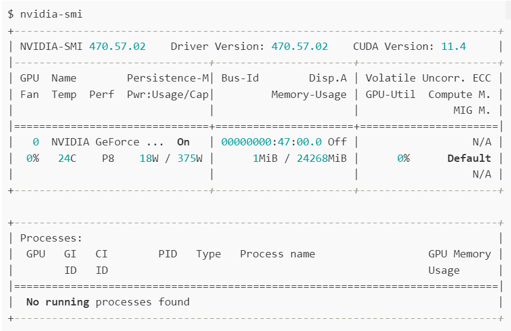
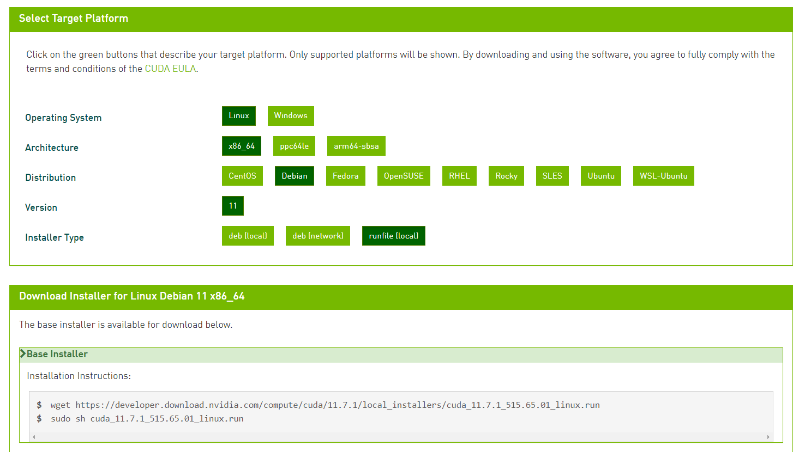
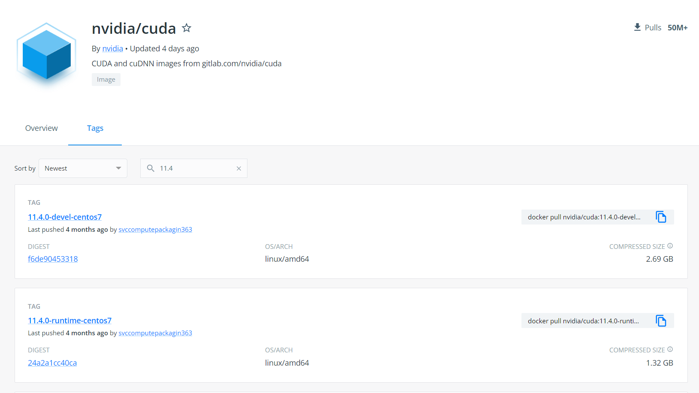
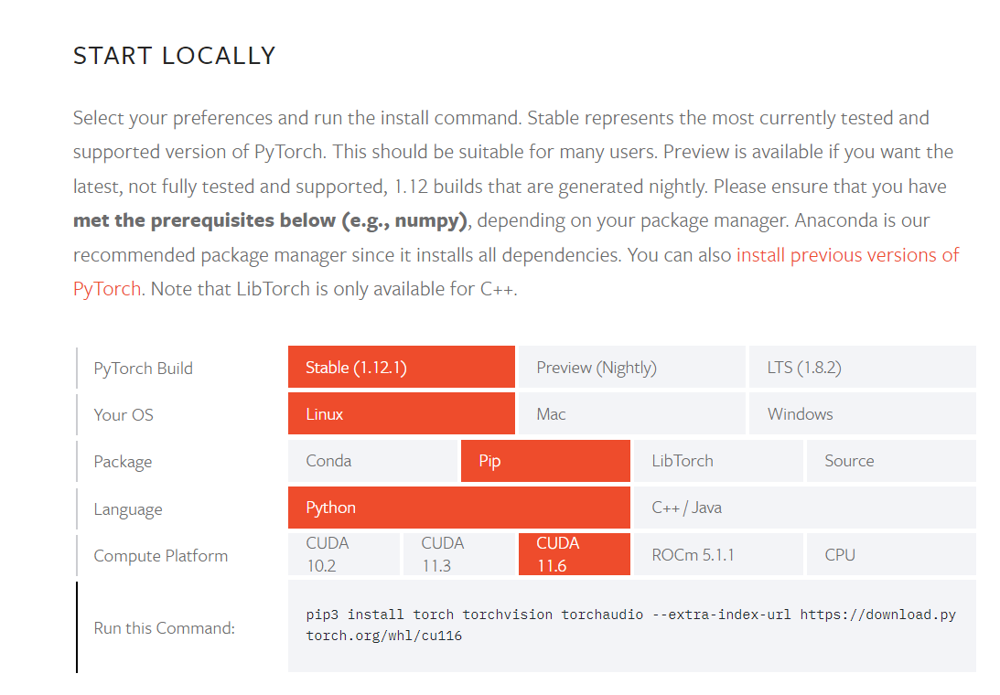

# Torchserve内网部署之 PyTorch + CUDA版本问题研究


## PyTorch + CUDA 11.4

- [Link-address](https://discuss.pytorch.org/t/pytorch-cuda-11-4/137900/6)

> 
>
> **Question from deutschgraf :** 
>
> Does Pytorch supports CUDA 11.4 toolkit? Or could I build pytorch with cuda 11.4 support?
>
> **Answer from ptrblck (<span style='color:brown'>Solution</span>):**
>
> Yes, you can build PyTorch from source using all released CUDA versions between 10.2 and 11.5.
>
> We are not backporting new library support for old releases. The already released PyTorch versions are supporting the CUDA toolkits which were supported at that time.
> With that being said, if no changes e.g. between CUDA 11.3 and 11.4 were needed, you might be able to use the newer CUDA toolkit, but there is no guarantee.
>
> **Question from koprupu62 :**
>
> Pytorch for CUDA 11.4 can’t be build because MAGMA-CUDA114 is needed from [pytorch :: Anaconda.org 151](https://anaconda.org/pytorch/) but it does not exist. Is there any solution? I’m working in a VM with vGPU 13.1 that supports CUDA 11.4 and I can’t change the drivers because I’m not not admin.
>
> **Answer from ptrblck :**
>
> MAGMA is not a requirement and PyTorch can be built with CUDA11.4.
> You could try to either install MAGMA with CUDA11.3, 11.5, or build it from source, if needed.
>
> 


## PyTorch + CUDA 11.6

- [Link-address](https://discuss.pytorch.org/t/pytorch-cuda-11-6/149647)

> 
>
> **Question from yellowislight :**
>
> As a follow-up to this question [PyTorch + CUDA 11.4 227](https://discuss.pytorch.org/t/pytorch-cuda-11-4/137900)
> I have installed these Nvidia drivers version 510.60.02 along with Cuda 11.6.
> I’d like to install Pytorch in a conda virtual environment, and I’ve found in the Pytorch website that we couldn’t choose a stable version that relies on the latest versions of Cuda (the older version is 11.3) [Start Locally | PyTorch 110](https://pytorch.org/get-started/locally)
>
> How can I install/build Pytorch with the latest version of Cuda in my conda virtual env ?
>
> **Answer from ptrblck(<span style='color:brown'>Solution</span>) :**
>
> You could build PyTorch from source following [these instructions 794](https://github.com/pytorch/pytorch#from-source) or install the nightly binaries with CUDA11.6 via:
>
> ```shell
> pip install torch --pre --extra-index-url https://download.pytorch.org/whl/nightly/cu116
> ```
>
> **Question from jianlong_Huang :**
>
> Hi, sir. I have one question: If I installed cuda 113 version pytorch, but my GPU is cuda 11.6. Is this mismatch of version affect the reproducibility of code. Since I set all random seeds and no deterministic algorithms used in code, but the training loss between different running times is still around 1%.
>
> **Answer from ptrblck :**
>
> No, your locally installed libraries should not introduce non-determinism as they should not be used since the PyTorch binaries ship with their own CUDA runtime, cuDNN, cublas etc. and will use these.
>
> 


## CUDA error: no kernel image is available for execution on the device

- [Link-address](https://forum.opennmt.net/t/cuda-error-no-kernel-image-is-available-for-execution-on-the-device/4644)

> 
>
> **Question from argosopentech :**
>
> I’m trying to run [OpenNMT-py 5](https://github.com/OpenNMT/OpenNMT-py) on an RTX 3090 from [vast.ai 1](https://vast.ai/) and getting a CUDA error:
>
> ```shell
> Traceback (most recent call last):
>   File "/home/argosopentech/env/bin/onmt_train", line 11, in <module>
>     load_entry_point('OpenNMT-py', 'console_scripts', 'onmt_train')()
>   File "/home/argosopentech/OpenNMT-py/onmt/bin/train.py", line 172, in main
>     train(opt)
>   File "/home/argosopentech/OpenNMT-py/onmt/bin/train.py", line 157, in train
>     train_process(opt, device_id=0)
>   File "/home/argosopentech/OpenNMT-py/onmt/train_single.py", line 109, in main
>     trainer.train(
>   File "/home/argosopentech/OpenNMT-py/onmt/trainer.py", line 224, in train
>     for i, (batches, normalization) in enumerate(
>   File "/home/argosopentech/OpenNMT-py/onmt/trainer.py", line 166, in _accum_batches
>     num_tokens = batch.tgt[1:, :, 0].ne(
> RuntimeError: CUDA error: no kernel image is available for execution on the device
> CUDA kernel errors might be asynchronously reported at some other API call,so the stacktrace below might be incorrect.
> For debugging consider passing CUDA_LAUNCH_BLOCKING=1.
> ```
>
> I’m using a `nvidia/cuda:11.3.0-devel-ubuntu20.04` Docker container and installing OpenNMT-py from source:
>
> 
>
> The issue looks related to [this PyTorch issue 34](https://github.com/pytorch/pytorch/issues/31285), but I’m using a newer graphics card than the people in that issue. OpenNMT-py uses `torch>=1.6.0` and the newest version of torch is `1.9.0` is that the issue?
>
> **Answer from ymoslem(<span style='color:brown'>Solution</span>) :**
>
> I do not know if updating PyTorch will help, but in the case it will, I have the following:
>
> ```shell
> torch==1.9.0+cu111
> torchaudio==0.9.0
> torchtext==0.5.0
> torchvision==0.10.0+cu111
> ```
>
> In my case, I got an error around [this 137](https://pytorch.org/docs/stable/generated/torch.floor_divide.html), but I do not remember in which file. I solved it by simply changing the problematic line.
>
> **Response from argosopentech :**
>
> Looking on the [PyTorch version selector 189](https://pytorch.org/get-started/locally/) it looks like the default version is for CUDA 10 while I had CUDA 11, getting the right version of torch looks like it fixes the issue.
>
> ```shell
> pip install torch==1.9.0+cu111 -f https://download.pytorch.org/whl/torch_stable.html
> ```
>
> 


## Build PyTorch to be supported by Cuda 11.4

- [Link-address](https://github.com/pytorch/pytorch/issues/75992)

> 
>
> **Question from aliasad20:**
>
> While my  PC has CUDA 11.4 installed for my nVidia and various other dependent apps run on it. Presently on the official site the PyTorch just seems compatible with CUDA 11.3 and nothing else in Cuda 11.x. Please update it so it serves the purpose to be installed and use GPU properly.
>
> **Answer from kyoungseoun:**
>
> I have CUDA version 11.6 and PyTorch is working without any problem.
>
> But I guess by default, PyTorch is delivered with CUDA version 10.x.
>
> Could you install PyTorch with following command? (in the website explicitly configure CUDA version to 11.3)
>
> ```shell
> pip3 install torch --extra-index-url https://dpwmload.pytorch.org/whl/cu113
> ```
>
> 


## <span style='color:brown'>解决方案探究</span>

### Nvidia 官方 cuda下载地址：

- [CUDA Toolkit 11.7 Update 1 Downloads](https://developer.nvidia.com/cuda-downloads?target_os=Linux&target_arch=x86_64&Distribution=Debian&target_version=11&target_type=runfile_local)

  


### Nvidia Docker Hub 地址：

- [nvidia/cuda--11.4](https://hub.docker.com/r/nvidia/cuda/tags?page=1&name=11.4)

  


### PyTorch 官方安装教程：

- [Start locally](https://pytorch.org/get-started/locally/#linux-from-source)

  


#### **测试验证基于 Torch-cu116 版本的镜像是否可以进行正常的推理使用(<span style='color:brown'>已验证可用</span>):**

- 原因分析：
  - 根据PyTorch官网的指南，此处与Torch版本直接相关

- 解决方法：

  - 使用 docker commit 直接在外网容器中进行版本替换，然后进行容器到镜像的转化即可；

- 镜像名称：yangdafu/torchserve-cu116:gpu

  ```shell
  $ docker pull yangdafu/torchserve-cu116:gpu
  ```

  


