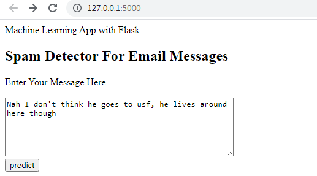
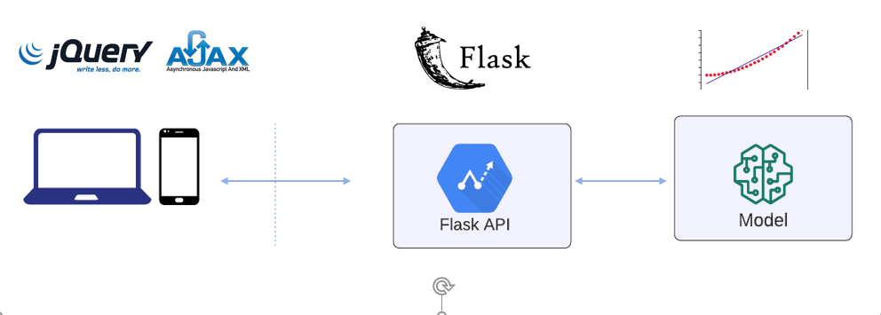
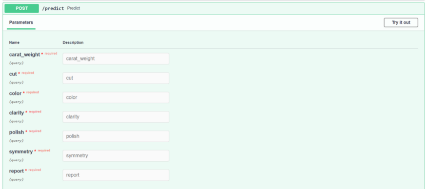
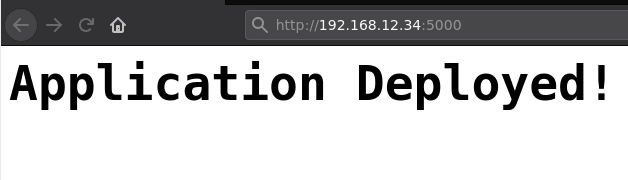

# 	ML Model Deployment Strategies--调研

### 目录：

1. Deploy NLP model Using Flask
2. Deploy Machine Learing Model and Integrate it in a Web Application
3. From ML model building to Model Deployment
4. Deploy Flask The Easy Way With Gunicorn and Nginx!


## 1、Deploy NLP model Using  Flask

原文地址：[Deploy NLP model Using Flask](https://pub.towardsai.net/deploy-nlp-model-using-flask-7be1350e6ebe)

将模型部署到自己的模型并制作 Web 应用程序后，机器学习领域变得更加有趣。使用这种新方法，学习过程变得更快。

部署文件的结构如下所示：

```txt
/web-app
|
|--static/
|   |--style.css
|--templates/
|   |--home.html
|   |--result.html
|--app.py
|--spam.csv
```

我们将只在flask应用文件中制作一个模型，而不是在jupyter或spyder IDE中制作。了解在应用文件中制作模型的过程也很有意思。

app文件python代码如下所示：

```python
from flask import Flask,render_template,url_for,request
import pandas as pd
import pickle
from sklearn.feature_extraction.text import CountVectorizer
from sklearn.naive_bayes import MultinomialNB
import pickle
app = Flask(__name__)
@app.route('/')
def home():
    return render_template('home.html')

@app.route('/predict',methods=['POST'])
def predict():
    df= pd.read_csv("spam.csv", encoding="latin-1")
    # Features and Labels
    df['label'] = df['class'].map({'ham': 0, 'spam': 1})
    X = df['message']
    y = df['label']
    
    # Extract Feature With CountVectorizer
    cv = CountVectorizer()
    X = cv.fit_transform(X) 
    from sklearn.model_selection import train_test_split
    Xtrain, Xtest, ytrain, ytest = train_test_split(X, y,
                                  test_size=0.25, random_state=42)
    #Naive Bayes Classifier
    from sklearn.naive_bayes import MultinomialNB
    clf = MultinomialNB()
    clf.fit(Xtrain,ytrain)
    clf.score(Xtest,ytest)
    if request.method == 'POST':
        message = request.form['message']
        data = [message]
        vect = cv.transform(data).toarray()
        my_prediction = clf.predict(vect)
    return render_template('result.html',prediction = my_prediction)
if __name__ == '__main__':
    app.run(debug=True)
```


### <span style='color:brown'>HTML page design</span>

在这个页面上，我们设计了两个 HTML 页面来预测文本。第一个带有 home.html 的工作表用于从用户那里获取消息。home.HTML 的代码如下所示：

```html
<!DOCTYPE html>
<html>
<head>
    <title>Home</title>
    
    <link rel="stylesheet" type="text/css" href="{{
                  url_for('static', filename='css/styles.css') }}">
</head>
<body>
    <header>
       <div class="container">
        <div id="brandname">
              Machine Learning App with Flask
        </div>
        <h2>Spam Detector For Email Messages</h2>
       </div>
       </header>
       
       <div class="ml-container">
           <form action="{{ url_for('predict')}}" method="POST">
            <p>Enter Your Message Here</p>
            <!-- <input type="text" name="comment"/> -->
            <textarea name="message" rows="6" cols="50"></textarea>
            <br/>
            <input type="submit" class="btn-info" value="predict">
         </form>
       </div>
</body>
</html>
```

这个带有 result.html 的第二个 Sheet 用于从主页获得预测的结果。result.HTML的代码如下所示：

```html
<!DOCTYPE html>
<html>
<head>
    <title></title>
    <link rel="stylesheet" type="text/css" href="{{ 
                url_for('static', filename='css/styles.css') }}">
</head>
<body>
    <header>
      <div class="container">
        <div id="brandname">
            ML App
        </div>
        <h2>Spam Detector For SMS Messages</h2>
      </div>
    </header>
    <p style="color:blue;font-size:20;text-align: center;"
    <b>Results for Comment</b></p>
       <div class="results">
          
          <h2 style="color:red;">Spam</h2>
          
          <h2 style="color:blue;">Not a Spam (It is a Ham)</h2>
          
       </div>
</body>
</html>
```


### <span style='color:brown'>CSS page</span>

CSS是一个层叠样式表，用于增强HTML页面的外观。CSS代码如下所示：

```css
body{
     font:15px/1.5 Arial, Helvetica,sans-serif;
     padding: 0px;
     background-color:#f4f3f3;
}
.container{
     width:100%;
     margin: auto;
     overflow: hidden;
}
header{
     background:#03A9F4;#35434a;
     border-bottom:#448AFF 3px solid;
     height:120px;
     width:100%;
     padding-top:30px;
}
.main-header{
     text-align:center;
     background-color: blue;
     height:100px;
     width:100%;
     margin:0px;
}
#brandname{
    float:left;
    font-size:30px;
    color: #fff;
    margin: 10px;
}
header h2{
    text-align:center;
    color:#fff;
}
.btn-info {
    background-color: #2196F3;
    height:40px;
    width:100px;} /* Blue */
    
.btn-info:hover {background: #0b7dda;}
.resultss{
    border-radius: 15px 50px;
    background: #345fe4;
    padding: 20px;
    width: 200px;
    height: 150px;
}
```


### <span style='color:brown'>**Deploy in local machine**</span>

为了在本地机器上部署，我们使用了 Visual Studio 代码编辑器。运行应用程序文件的命令如下所示：

```shell
python app.py
```

得到如上图所示的链接后，将其粘贴到浏览器中。然后页面会打开如下图：




## 2、Deploy Machine Learing Model and Integrate it in a Web Application

原文地址：[Deploy Machine Learing Model and Integrate it in a Web Application](https://blog.devgenius.io/deploy-machine-learning-model-as-a-rest-api-in-a-web-application-e802b9785db6)



实现此目的的一种方法是构建 REST API。通过为模型构建 REST API，您可以在不同的平台（如 Web 或移动平台）中使用它。我们将使用 [Flask RESTful](https://flask-restful.readthedocs.io/en/latest/) 将简单的线性回归模型部署为 REST API。

完整的代码可在 [GitHub](https://github.com/hnawaz007/pythondataanalysis/tree/main/Deploy%20Model%20as%20API) 上找到。随附的视频教程可在 [YouTube](https://www.youtube.com/watch?v=AZfJ8buL5II) 上找到。

### <span style='color:brown'>**The Project**</span>

让我们在Pycharm或你喜欢的IDE中创建一个新项目。Pycharm会自动为我们建立一个虚拟环境。我们可以通过发出以下命令，用pip安装必要的库：

```shell
pip install flask
pip install flask-restful
pip install pandas
pip install -U flask-cors
```

为了获得模型预测，我们来定义一个预测类。这需要一个资源--资源是Flask RESTful APIs的主要构建模块。每个类都可以有对应于HTTP方法的方法，如。GET、POST。GET将是主要的方法，因为我们的目标是为模型预测服务。我们从网络上接收传入的预算值。让我们为测试目的打印预算金额并将其转换为整数类型。现在我们在pickle库的帮助下加载模型。确保模型文件与你的python脚本在同一目录下。我们将利用predict函数来进行销售预测并返回。

```python
class prediction(Resource):
    def get(self, budget):
        print(budget)
        # Load the model
        budget = [int(budget)]
        df = pf.DataFrame(budget, columns=['Marketing Budget'])
        model = pickle.load(open('simple_linear_regression.pkl', 'rb'))
        prediction = model.predict(df)
        prediction = int(prediction[0])
        return str(prediction)
```

让我们把这个预测类映射到一个带有从API添加资源功能的端点。

> *api.add_resource(prediction, ‘/prediction/’)*

这将为传入的GET请求提供模型预测。Flask默认运行在5000端口。因此，一旦我们启动了这个API，我们就可以通过以下URL来访问它。

> http://127.0.0.1:5000/prediction/*?*


### Web Integration

我们将把 REST API 集成到一个普通的 html 网站中。在 Web 应用程序中，我们输入了预算值，单击按钮我们调用 API 的端点。我们借助 jQuery Ajax 将 API 集成到这个 Web 应用程序中。我们调用 API 端点并将预算金额附加到它。如果调用成功，那么我们访问返回值并将其设置为带有 sectionPrediction id 的 HTML 标记。

```js
$.ajax({
    type: "GET",
    dataType: "json",
    crossDomain: true,
    //api url with parameter
    url: "http://127.0.0.1:5000/prediction/" + providedBudget,
    success: function(data) {
        console.log(data);
        let predictedElement = document.getElementById('sectionPredicted');
        predictedElement.innerHTML += data + "M";
    }
})
```

这就是我们如何将ML模型整合到我们的网络应用中。一旦这个API被部署，它就可以被网络、桌面或移动应用程序所消费。只要向这个API提出一个请求，现在你团队中的任何人都可以在他们的应用程序中整合销售预测模型，而不必用Python编码或经历模型构建的麻烦。

除了将模型部署为 REST API 之外，我们还使用 jQuery Ajax 将其集成到 Web 应用程序中。

The full code can be found [here](https://github.com/hnawaz007/pythondataanalysis/tree/main/Deploy Model as API).


## 3、From ML model building to Model Deployment

原文地址：[From Machine Learning model building to Model Deployment](https://moez-62905.medium.com/from-machine-learning-model-building-to-model-deployment-ee041d896561)

- FastAPI：https://fastapi.tiangolo.com/#performance
- FastAPI-GitHub：https://github.com/tiangolo/fastapi


在 Python 中使用 PyCaret 和 FastAPI 构建和部署端到端机器学习管道的分步指南.

NOTE: 此处省略掉模型训练部分，主要关注于模型部署阶段的管道。

### <span style='color:brown'>**Deployment**</span>

机器学习模型的部署是使模型在生产中可用的过程，其中 Web 应用程序、企业软件和其他 API 可以通过提供新数据点并获得预测来使用经过训练的模型。机器学习模型通常具有预测结果的能力（二进制值，例如 1 或 0，用于分类，连续值用于回归，标签用于聚类等）。可以通过以下两种方式之一生成预测：批量预测或实时预测。本文将演示如何使用 API 部署机器学习模型以进行实时预测。

让我们看一个如何使用 FastAPI 框架创建 API 的示例：

```python
# 1、Library imports
import pandas as pd
from pycaret.regression import load_model, predict_model
from fastapi import FastAPI
import uvicorn

# 2、Create the app object
app = FastAPI()

# Load the model
model = load_model('diamond-pipeline')

# Define predict function
@app.post('/predict')
def predict(carat_weight, cut, color, clarity, symmetry, report):
    data = pd.DataFrame([[carat_weight, cut, color, clarity, polish, symmetry, report]])
    data.columns = ['Carat Weight', 'Cut', 'Color', 'Clarity', 'Polish', 'Symmetry', 'Report']
    predictions = predict_model(model, data=data)
    return {'prediction': int(predictions['Label'][0])}

if __name__ == '__main__':
    uvicorn.run(app, host='127.0.0.1', port=8000)
```

代码的前几行是简单的导入。第 8 行通过调用 FastAPI() 来初始化应用程序。第 11 行正在从您的磁盘加载经过训练的模型 diamond-pipeline（您的脚本必须与文件位于同一文件夹中）。第 15-20 行定义了一个名为 predict 的函数，它将接受输入并在内部使用 PyCaret 的 predict_model 函数来生成预测并将值作为字典返回（第 20 行）。

然后，你可以通过在命令提示符下运行以下命令来运行这个脚本。在执行这个命令之前，你必须与python脚本和模型pickle文件在同一个目录中。

```shell
uvicorn main:app --reload
```

这将在你的本地主机上初始化一个API服务。在你的浏览器上输入http://localhost:8000/docs，它应该显示类似这样的内容。



<center>http://localhost:8000/docs</center>


## <span style='color:brown'>**4、Deploy Flask The Easy Way With Gunicorn and Nginx**</span>

原文地址：[Deploy Flask The Easy Way With Gunicorn and Nginx](https://dev.to/brandonwallace/deploy-flask-the-easy-way-with-gunicorn-and-nginx-jgc)

### **Introduction**

在创建了一个Flask应用程序后，你可能希望人们能看到它。本教程将告诉你如何用Gunicorn在Linux服务器Nginx上部署你的Flask应用程序。

### **Requirements**

- A Server
- Nginx
- Gunicorn
- Pipenv

这个过程的第一步是安装pip ：

```shell
$ sudo apt update
$ sudo apt install python3-pip
```

我们需要使用 pipenv 创建一个虚拟环境：

```shell
$ pip3 install pipenv
```

通过检查版本来检查pipenv是否正确安装：

```shell
$ pipenv --version
```

创建目录来存储你的工程文件，`/var/www/`是一个好的地址。

```shell
$ sudo mkdir /var/www/myproject
```

目录的默认权限设置为 root。

```shell
$ ls -ld /var/www/myproject
drwxr-xr-x 2 root root 4096 Jan 27 12:37 /var/www/myproject/
```

将用户和组的权限改为你的用户名和组www-data：

```shell
$ sudo chown -R $USER:www-data /var/www/myproject
```

检查以查看权限是否更改为用户名 Brandon 和组名 www-data。

```shell
$ ls -ld /var/www/myproject
drwxr-xr-x 2 brandon www-data 4096 Jan 27 12:37 /var/www/myproject/
```

进入文件目录：

```shell
$ cd /var/www/myproject
```

创建一个 .env 文件来保存环境变量。

```shell
$ touch .env
```

编辑 .env 文件以添加 FLASK_APP 和 FLASK_ENV 环境变量。添加这两行：

`$ vim .env`

```env
FLASK_APP=wsgi.py
FLASK_ENV=production
```

启动虚拟环境。 Pipenv 将自动加载 .env 文件中的变量。

```shell
$ pipenv shell

[...]
✔ Successfully created virtual environment! 
Virtualenv location: /var/www/myproject/.venv
Creating a Pipfile for this project…
Launching subshell in virtual environment…
 . /var/www/myproject/.venv/bin/activate

(myproject) brandon@server:/var/www/myproject $
```

使用 pipenv 安装所需的依赖库：

```shell
$ pipenv install flask gunicorn
```

为了建立一个最小的Flask应用程序，创建两个文件application.py和wsgi.py。主要的Flask应用程序将被存储在application.py中。wsgi.py将被用来让应用程序运行。

```shell
$ touch application.py wsgi.py
```

用你选择的编辑器编辑application.py。添加一个最小的Flask应用程序的代码，其中有一个用于索引页的路由。

`$ vim application.py`

```python
from flask import Flask
app = Flask(__name__)

@app.route('/')
def index():
    '''Index page route''
    return '<h1>Application Deployed!</h1>'
```

编辑 wsgi.py 文件。添加此代码 wsgi.py 以使应用程序运行。

`$ vim wsgi.py`

```python
from application import app

if __name__ == '__main__':
    app.run(debug=False)
```

让我们测试运行 Flask 应用程序！通过指定地址“0.0.0.0”使 Flask 应用程序监听所有服务器接口。

```shell
$ flask run --host '0.0.0.0'

 * Serving Flask app "wsgi.py" (lazy loading)
 * Environment: production
 * Debug mode: off
 * Running on http://0.0.0.0:5000/ (Press CTRL+C to quit)
 * Restarting with stat
```

现在你可以从另一台电脑上使用浏览器访问该应用程序，导航到服务器的IP地址，端口为 $5000$ 。确保 $5000$ 端口没有被防火墙封锁，这样你就可以访问 Flask 应用程序了。

由于我的服务器的 IP 地址是 192.168.12.34，我使用以下地址通过浏览器从笔记本电脑访问 Flask 应用程序：

`http://192.168.12.34:5000`

你将在浏览器看到如下内容：


如果你能够成功地运行Flask开发服务器，使用这个命令来测试运行使用Gunicorn的应用程序。

```shell
$ gunicorn --workers 4 --bind 0.0.0.0:5000 wsgi:app
```

`--workers N`

将 --workers 设置为服务器中核心数的两倍。如果您有任何问题，请稍后调整数字。不要超过12个。

`--bind 0.0.0.0:5000`

这将在所有服务器网络接口上监听5000端口。

`wsgi:app`

wsgi是没有.py扩展名的文件名。app是文件中Flask应用程序的实例。你应该看到下面类似的输出：

```shell
$ hunicorn --workers 4 --bind 0.0.0.0:5000 wsgi:app

[2021-01-27 14:28:00 -0500] [24662] [INFO] Starting gunicorn 20.0.4
[2021-01-27 14:28:00 -0500] [24662] [INFO] Listening at: http://0.0.0.0:5000 (24662)
[2021-01-27 14:28:00 -0500] [24662] [INFO] Using worker: sync
[2021-01-27 14:28:00 -0500] [24695] [INFO] Booting worker with pid: 24695
```

在虚拟环境中检查 gunicorn 的路径。记下这条路径。你需要知道 `gunicorn` 的路径才能配置 systemd 服务文件。我的路径是 `/var/www/myproject/.venv/bin/gunicorn` 你的路径可能是 `/home/$USER/.local/share/virtualenvs/myproject-544gQc4M/.venv/bin/gunicorn`。

```shell
$ which gunicorn

/var/www/myproject/.venv/bin/gunicorn
```

现在你已经有一个基本的Flask应用程序在Gunicorn上运行，我们可以设置Nginx。

Install Nginx：

```shell
$ sudo apt install nginx
$ sudo systemctl enable nginx
$ sudo systemctl start nginx
```

通过运行此命令检查 Nginx 是否正在运行：

```shell
$ sudo systemctl status nginx

● nginx.service - A high performance web server and a reverse proxy server
   Loaded: loaded (/lib/systemd/system/nginx.service; enabled; vendor preset: enabled)
   Active: active (running) since Wed 2021-01-27 15:58:49 EST; 
   [...]
```

现在我们创建将 Gunicorn 作为服务运行的 systemd 文件。添加以下代码，但更改所有路径和用户名，使其与您的设置相对应。请特别注意 `Environment=` 和` ExecStart=` 变量。 `Environment= `变量应该指向虚拟环境中的 bin 目录。 `ExecStart=` 路径应该指向 gunicorn 在虚拟环境中的安装位置。

`$ vim  /etc/systememd/system/myproject.service`

> [Unit]
> Description=`myproject`.service - A Flask application run with Gunicorn.
> After=network.target
>
> [Service]
> User=`brandon`
> Group=www-data
> Environment="PATH=`/var/www/myproject/.venv/bin"`
> WorkingDirectory=/var/www/`myproject`/
> ExecStart=`/var/www/myproject/.venv/bin/gunicorn` --workers 3 \
> --bind unix:/var/www/`myproject/myproject`.sock wsgi:app
>
> [Install]
> WantedBy=multi-user.target

`User`

设置对项目目录有权限的用户。

`Group`

设置对项目目录有权限的组。

`Environment`

设置虚拟环境中 bin 目录的路径。

`WorkingDirectory`

设置项目代码所在的基本目录。

`ExecStart`

设置虚拟环境中 gunicorn 可执行文件的路径以及 gunicorn 命令行选项。

现在我启用并启动 myproject systemd 服务。

```shell
$ systemctl enable myproject

$ systemctl start myproject
```

接下来我们需要在Nginx中创建服务器块/虚拟主机。用任何编辑器在 `/etc/nginx/sites-available/` 创建一个文件。添加以下内容。将名称 `myproject.conf` 改为你的项目名称。

```shell
$ vim /etc/nginx/sites-available/myproject.conf
```

```vim
server {
        listen 80;
        server_name myproject www.myproject;

        access_log /var/log/nginx/myproject.access.log;
        error_log /var/log/nginx/myproject.error.log;

        location / {
                include proxy_params;
                proxy_pass http://unix:/var/www/myproject/myproject.sock;
        }
}
```

`server_name`  是域名的位置。这是你将用来访问网络应用程序的地方。

`access_log` 和 `error_logs` 指定访问和错误日志的路径。

`location` 块是 `Nginx` 将代理反向返回到 Flask 应用程序的地方。

通过创建指向启用站点的目录的链接来启用网站：

```shell
$ sudo ln -s /etc/nginx/sites-available/myproject.conf /etc/nginx/sites-enabled/
```

确保链接已在启用站点的目录中创建：

```shell
$ ls -l /etc/nginx/sites-enabled/ | grep myproject

lrwxrwxrwx 1 root root 41 Jan 27 17:37 myproject.conf -> /etc/nginx/sites-available/myproject.conf
```

检查 nginx 配置是否有错误，然后重新启动服务：

```shell
$ nginx -t

$ sudo systemctl restart nginx

$ sudo systemctl status nginx
```

由于Flask应用程序现在由Gunicorn和Nginx提供服务，因此不再可以通过IP地址访问。要访问Flask应用程序，你需要使用你在Nginx服务器块中设置的名称，用于Nginx配置中的指令server_name。要访问网页可以在你的桌面/笔记本电脑上编辑主机文件，将域名指向你的服务器的IP地址。

编辑主机文件以将域名添加到服务器。由于我的服务器的 IP 地址是 192.168.12.34 我会将此行添加到主机文件：

`192.168.12.34   myproject  www.myproject`

Linux 的主机文件位置：

`/etc/hosts`

Windows 的主机文件位置：

`C:\Windows\System32\drivers\etc\hosts`

现在我可以通过名称使用浏览器访问 Flask 应用程序：

`http://myproject`

OR

`http://www.myproject`

你将看到相同的画面：




### <span style='color:brown'>**以下是一些故障排除步骤...**</span>

当事情不顺利时，你可以做一些事情来排除故障。

仔细检查你编辑的所有文件中是否有拼写错误是非常重要的。

Check systemd.

`$ sudo systemctl  status  myproject.service`

`$ sudo journalctl  -xe`

Restart the Gunicorn systemd service.

```shell
$ sudo systemctl restart myproject.service

$ sudo systemctl daemon-reload
```

通过更改 ExecStart 行将日志记录添加到 Gunicorn。

**From this :**

```vim
ExecStart=/var/www/myproject/.venv/bin/gunicorn --workers 3 --bind unix:/path/to/myproject/myproject.sock wsgi:app
```

**To this:**

```vim
ExecStart=/var/www/myproject/.venv/bin/gunicorn --workers 3 --bind unix:/path/to/myproject/myproject.sock wsgi:app --error-logfile /home/bw/bin/lanmanager/gunicorn.error.log --log-level debug
```

Check the log files:

`$ less  /var/www/nginx/error.log`

`$ less  /var/www/myproject/error.log`

Check to see if the Nginx server is listening on port 80.

```shell
$  ss  -lnt |  grep  80

LISTEN    0         511                0.0.0.0:80               0.0.0.0:* 
LISTEN    0         511                   [::]:80                  [::]:* 
```

Use curl to check for a 200 OK response.

`$  curl  -I  http://myproject`

```
HTTP/1.0 200 OK
Content-Type: text/html; charset=utf-8
Content-Length: 30
Server: Werkzeug/1.0.1 Python/2.7.16
Date: Wed, 03 Feb 2021 15:18:55 GMT
```


### **Conclusion**

你已经学会了如何配置Gunicorn来运行Flask应用程序。你学会了如何将Gunicorn作为一个systemd服务运行。你学会了在Nginx中配置一个虚拟主机。你应该能够将Flask应用程序部署到服务器上。


