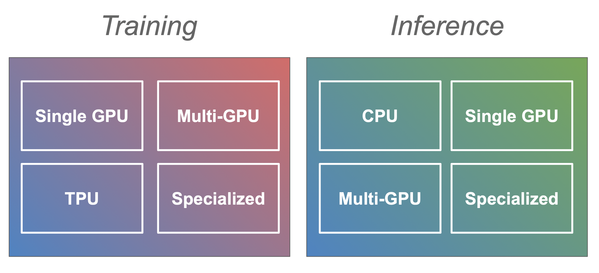
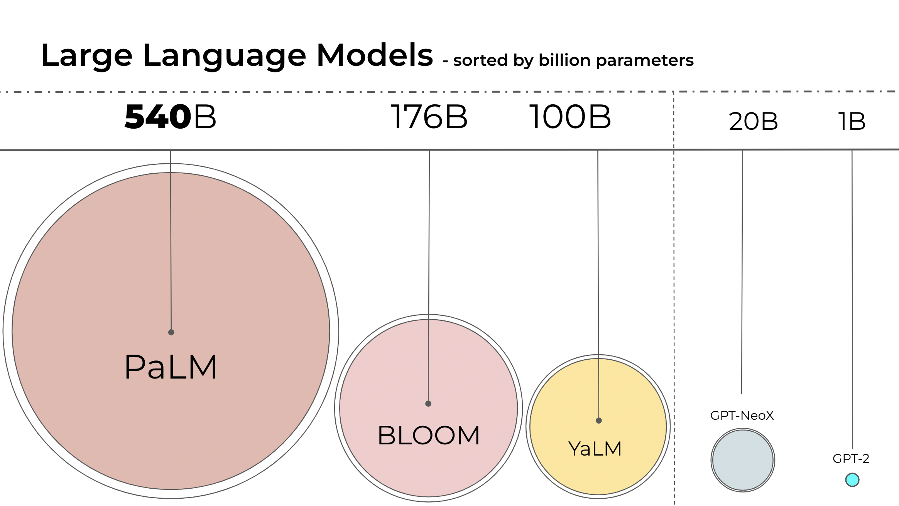
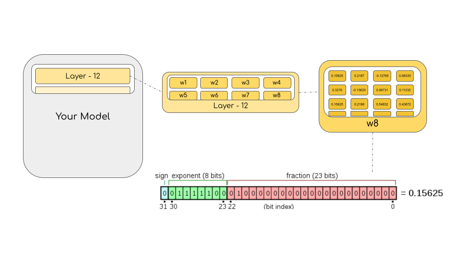
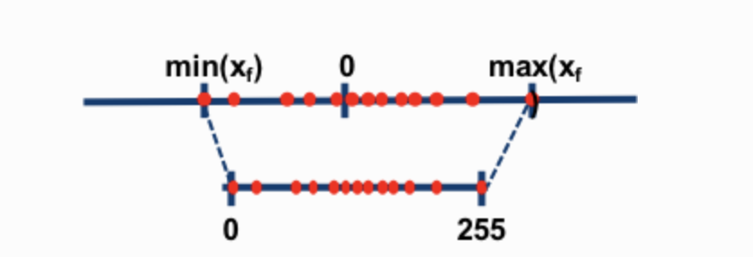
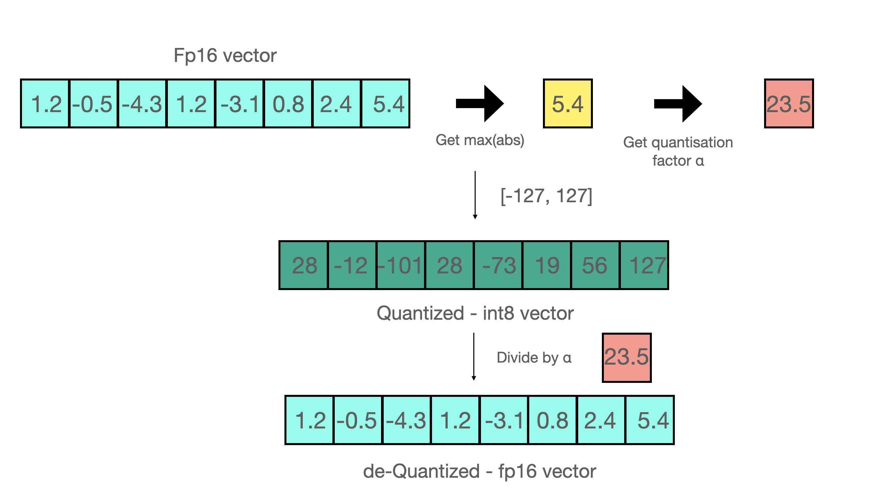
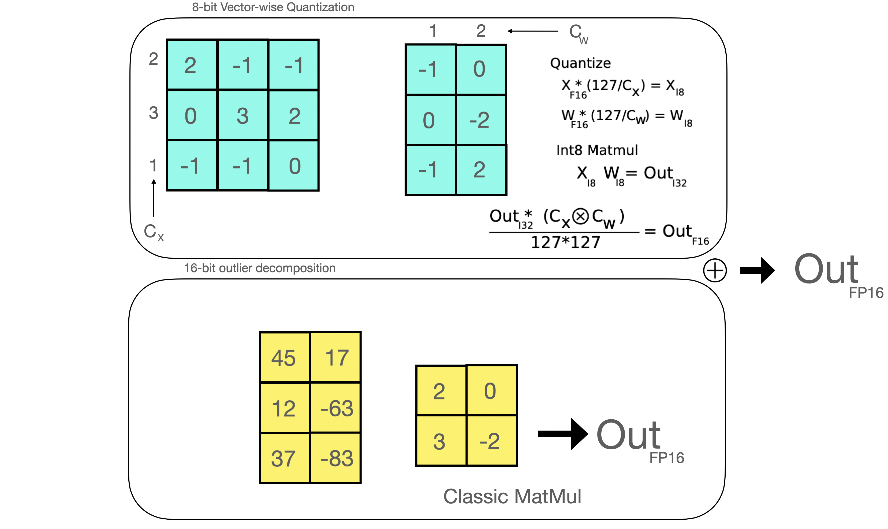

# 大模型部署及加速的实践研究

### <span style='color:brown'>主要的研究问题：</span>

- 针对大模型的多GPU卡的部署及加速方法研究；
- 半精度和全精度模型的性能差异的量化对比，及半精度模型的部署及推理的相关研究；


**参考资料：**

1. HuggingFace -- Transformers:  [Performance and Scalability](https://huggingface.co/docs/transformers/performance)


## 1. HuggingFace -- Performerce and Scalability

- [Performerce and Scalability](https://huggingface.co/docs/transformers/performance)

训练越来越大的 transformers 模型并将它们部署到生产中会带来一系列挑战。在训练期间，你的模型可能需要比可用内存更多的 GPU 内存，或者训练速度非常慢，并且当你部署它进行推理时，它可能会被生产环境所需的吞吐量淹没。本文档旨在帮助您应对这些挑战并找到适合你的用例的最佳设置。我们将指南分为训练和推理，因为它们具有不同的挑战和解决方案。然后在它们中的每一个中，我们都有针对不同类型硬件设置的单独指南 (例如，用于训练的单 GPU与多GPU或用于推理的 CPU与GPU)。



本文件是对可能对你的情况有用的方法的一个概述和切入点。


### <span style='color:brown'>**Training** </span>

有效地训练transformers模型需要一个加速器，如GPU或TPU。最常见的情况是只有一块GPU，但也有关于多GPU和CPU训练的部分(即将推出更多)。

> NOTE:  在单GPU部分介绍的大多数策略（如混合精度训练或梯度累积）都是通用的，适用于一般的训练模型，所以在深入多GPU或CPU训练等后续部分之前，请确保看一看。


#### Single GPU

在单个GPU上训练大型模型可能具有挑战性，但有许多工具和方法使其可行。本节讨论了混合精度训练、梯度积累和检查点、高效优化器等方法，以及确定最佳批次大小的策略。

- [Go to single GPU training section.](https://huggingface.co/docs/transformers/perf_train_gpu_one)

#### Multi-GPU

在某些情况下，单个GPU上训练太慢或者不适合大型模型。转到GPU设置时合乎逻辑的步骤，但同时在多个GPU上训练会带来新的决定：每个GPU是否都有模型的完整部分，还是模型本身也是分布式的？在这一节，我们将了解数据、张量和管道并行性。

- [Go to multi-GPU training section.](https://huggingface.co/docs/transformers/perf_train_gpu_many)

#### CPU Training

- [Go to CPU training section.](https://huggingface.co/docs/transformers/perf_train_cpu)


### <span style='color:brown'>**Inference**</span>

在生产环境中对大型模型进行有效的推理，其挑战性不亚于训练它们。在下面的章节中，我们将介绍在CPU和单/多GPU设置上运行推理的步骤。

#### CPU

- [Go to CPU inference section.](https://huggingface.co/docs/transformers/perf_infer_cpu)

#### Single GPU

- [Go to single GPU inference section.](https://huggingface.co/docs/transformers/perf_infer_gpu_one)

#### Multi-GPU

- [Go to multi-GPU inference section.](https://huggingface.co/docs/transformers/perf_infer_gpu_many)


### <span style='color:brown'>**Hardware**</span>

在硬件部分，你可以找到构建自己的深度学习设备时的技巧和窍门。

- [Go to hardware section.](https://huggingface.co/docs/transformers/perf_hardware)


## 2.  Efficient Inference on a Single GPU

This document will be completed soon with information on how to infer on a single GPU. In the meantime you can check out [the guide for training on a single GPU](https://huggingface.co/docs/transformers/perf_train_gpu_one) and [the guide for inference on CPUs](https://huggingface.co/docs/transformers/perf_infer_cpu).

**bitsandbytes integration for Int8 mixed-precision matrix decomposition**

- 用于Int8混合精度矩阵分解的bitsandbytes集成

请注意，这个功能也完全适用于多GPU设置。

从《[LLM.int8() : 8-bit Matrix Multiplication for Transformers at Scale](https://arxiv.org/abs/2208.07339)》一文中，我们用几行代码支持HuggingFace在Hub中所有模型的集成。对于浮动16和bfloat16权重，该方法将nn.Linear大小减少了2个，对于浮动32权重减少了4个，通过对半精度的离群值进行操作，对质量几乎没有影响。

Int8混合精度矩阵分解的工作原理是将一个矩阵乘法分成两个流：

1. 系统特征离群流矩阵乘以 fp16(0.01%)；
2. 常规流的 int8矩阵乘法(99.9%);

用这种方法，对于非常大的模型来说，没有预测性退化的 Int8 推理是可能的。关于该方法的更多细节，请查看[该论文](https://arxiv.org/abs/2208.07339)或我们关于整合的[博文](https://huggingface.co/blog/hf-bitsandbytes-integration)。


注意，你将需要一个GPU来运行混合8位的模型，因为内核只为GPU编译。在使用这个功能之前，请确保你有足够的GPU内存来存储模型的四分之一（或一半，如果你的模型权重是半精度的）。下面是一些帮助你使用这个模块的说明，或者按照 [Google colab](https://huggingface.co/docs/transformers/perf_infer_gpu_one#colab-demos)上的演示。

**Requirements**

- 请确保在支持8位张量核心的NVIDIA GPU上运行(Turing, Ampere or newer architectures - e.g. T4, RTX20s RTX30s, A40-A100)；

- Install the correct version of `bitsandbytes` by running: 

  ```shell
  $ pip install bitsandbytes>=0.31.5
  ```

- Install `accelarate` :

  ```shell
  $ pip install accelerate>=0.12.0
  ```

  

**Running mixed-int8 models - single GPU setup**

安装完所需的库后，加载你的混合8位模型的方法如下：

```python
model_name = "bigscience/bloom-2b5"
model_8bit = AutoModelForCausalLM.from_pretrained(model_name, device_map="auto", load_in_8bit=True)
```


**Running mixed-int8 models - multi GPU setup**

在多个GPU中加载你的混合8位模型的方法如下(与单GPU设置的命令相同)。

```python
model_name = "bigscience/bloom-2b5"
model_8bit = AutoModelForCausalLM.from_pretrained(model_name, device_map="auto", load_in_8bit=True)
```

但是你可以用 `accelerate` 来控制你想在每个GPU上分配的GPU RAM。使用 `max_memory` 参数的方法如下：

```python
max_memory_mapping = {0: "1GB", 1: "2GB"}
model_name = "bigscience/bloom-3b"
model_8bit = AutoModelForCausalLM.from_pretrained(
    model_name, device_map="auto", load_in_8bit=True, max_memory=max_memory_mapping)
```

在这个例子中，第一个GPU将使用1GB的内存，第二个则是2GB。


**Colab demos**

- [HuggingFace-bnb-int8-T5 Demo](https://colab.research.google.com/drive/1YORPWx4okIHXnjW7MSAidXN29mPVNT7F?usp=sharing)
- BLOOM-3B

使用这种方法，您可以 infer 以前无法在 Google Colab 上推断出的模型。查看运行 T5-11b（fp32 中的 42GB）的演示！在 Google Colab 上使用 8 位量化。

HuggingFace meets `bitsandbytes` for lighter models on GPU for inference

Running T5-11b on Google Colab:

```python
!pip install --quiet bitsandbytes
# Install latest version of transformers
!pip install --quiet git+https://github.com/huggingface/transformers.git
!pip install --quiet accelarate
!pip install --quiet sentencepiece
```

Choose the model:

```python
model_name = "t5-3b-sharded"  #@param ["t5-11b-sharded", "t5-3b-sharded"]
```

Use 8-bit models with `t5-3b-sharded` :

```python
from transformers import AutoModelForSeq2SeqLM, AutoTokenizer
import torch

# T5-3b and T5-11B are supported!
# We need sharded weights otherwise we get CPU OOM errors
model_id = f"ybelkada/{model_name}"
tokenizer = AutoTokenizer.from_pretrained(model_id)
model_8bit = AutoModelForSeq2SeqLM.from_pretrained(model_id, device_map="auto", load_in_8bit=True)
```

Let's check the memory footprint of this model !

```python
model_8bit.get_memory_footprint()
```

For `t5-3b` the int8 model is about ~2.9GB! Whereas the original model has 11 GB. For `t5-11b` the int8 model is about ~11GB vs 42 GB for the original model. Now let's generate and see the qualitative results of the 8 bit model !

```python
max_new_tokens = 50
input_ids = tokenizer("translate English to German: Hello my name is Younes and I am a Machine Learning Engineer at Hugging Face", return_tensors="pt").input_ids

outputs = model_8bit.generate(input_ids, max_new_tokens=max_new_tokens)
print(tokenizer.decode(outputs[0], skip_special_tokens=True))
```


<span style='color:brown'>**Or this demo for BLOOM-3B .**</span>

```python
!pip install --quiet bitsandbyte
# Install latest version of transformers
!pip install --quiet git+https://github.com/huggingface/transformers.git
!pip install --quiet accelerate
```

Hardware requirements:

- To run properly this feature you need to have GPU that supports 8-bit operation modules. Currently, Turing and Ampere GPUs (TRX20s, RTX30s, A40-A100, T4+) are supported, which means on colab we need to use a T4 GPU for this feature. You can check that using this code snippet and make sure you are using a supported GPU.

```python
gpu_info = !nvidia-smi
gpu_info = "\n".join(gpu_info)
if gpu_info.find("failed") >= 0:
    print("Not connected to a GPU")
else:
    print(gpu_info)
```

Utility variables & functions :

```python
name = "bigscience/bloom-3b"
text = "Hello my name is"
max_new_tokens = 20

def generate_from_model(model, tokenizer):
    encided_input = tokenizer(text, return_tensors='pt')
    output_sequences = model.generate(input_ids=encoded_input['input_ids'].cuda())
    return tokenizer.decode(output_sequences[0], skip_special_tokens=True)
```

Use 8bit models and `pipeline` :

- You can use 8bit quantized models together with `pipeline` as follows:

```python
from transformers import pipeline
pipe = pipeline(model=name, model_kwargs={"device_map":"auto", "load_in_8bit":True}, max_new_tokens=max_new_tokens)

# Check the output:
pipe(text)
```

Use 8bit model and `.generate` :

```python
from transformers import AutoModelForCausalLM, AutoTokenizer
import torch

model_8bit = AutoModelForCausalLM.from_pretrained(name, device_map="auto", load_in_8bit=True)
tokenizer = AutoTokenizer.from_pretrained(name)
```

```python
generate_from_model(model_8bit, tokenizer)
```

Let's compare the qualitative results between our quantized model and the original model:

```shell
model_bative = AutoModelForCausalLM.from_pretrained(name, device_map="auto", torch_dtype="auto")
generate_from_model(model_native, tokenizer)
```

**Memory footprint comparison:**

```python
mem_fp16 = model_native.get_memory_footprint()
mem_int8 = model_8bit.get_memory_footprint()
print("Memory footprint int8 model: {} | Memory footprint fp16 model: {} | Relative difference: {}".format(mem_int8, mem_fp16, mem_fp16/mem_int8))
```

We saved 1.65x memory for a 3-billion parameters models! Note that internally we replace all the linear layers by the ones implemented in `bitsandbytes`. By scaling up the model the number of linear layers will increase therefore the impact of saving memory on those layers will be huge for very large models. For example quantizing BLOOM-176( 176 Billion parameter model) giaves a gain of 1.96x memory footprint which can save a lot of compute power in practice.

> 我们为30亿个参数的模型节省了1.65倍的内存! 请注意，在内部我们用bitsandbytes中实现的线性层取代了所有的线性层。通过扩大模型的规模，线性层的数量将增加，因此对于非常大的模型来说，节省内存对这些层的影响将是巨大的。例如，量化BLOOM-176（176亿个参数的模型）可以获得1.96倍的内存占用率，在实践中可以节省大量的计算能力。

**Hyper-parameter tuning**

- Warning:  you may want to run these cells separately from previous cells to aviad Out Of Memory(OOM) issues.

You can play with the parameter `int8_threshold` and see its impact in the results of your model. You can directly specify this parameter when loading your model through. `.from_pretrained` method. By default we set this parameter to be `6.0` as described in the paper.

```python
from transformers import AutoModelForCausalLM, AutoTokenizer
import torch

model_8bit_thresh_4 = AutoModelForCausalLM.from_pretrained(name, device_map="auto", load_in_8bit=True, load_in_8bit_threshold=4.0)
model_8bit_thresh_2 = AutoModelForCausalLM.from_pretrained(name, device_map="auto", load_in_8bit=True, load_in_8bit_threshold=2.0)

tokenizer = AutoTokenizer.from_pretrained(name)
```

```python
generate_from_model(model_8bit_thresh_4, tokenizer)
# Hello my name is John and I am a student at the University of the West Indies. I am
```

```python
generate_from_model(model_8bit_thresh_2, tokenizer)
# Hello my name is John and I am a newbie to the forum. I have a question about
```

正如你所看到的，通过使用不同的阈值，世代会有轻微的变化。这是因为操作8位的参数会导致更容易被小的变化所扰乱! 降低阈值意味着fp16中的参数也会减少，所以将阈值降到0会导致int8中的完整模型。


## 2.  A Gentle Introduction to 8-bit Matrix Multiplication for transformers at scale using Hugging Face Transformers, Accelerate and bitsandbytes

原文地址：[hf-bitsandbytes-integration](https://huggingface.co/blog/hf-bitsandbytes-integration)


### Introduction

语言模型一直在变大。在写这篇文章的时候，PaLM有540B的参数，OPT、GPT-3和BLOOM有大约1760B的参数，而且我们正朝着更大的模型发展。下面是一个显示最近一些语言模型的大小的图表。




因此，这些模型很难在容易获得的设备上运行。例如，仅仅为了在BLOOM-176B上做推理，你就需要有8个80GB的A100 GPU（每个~15000美元）。为了对BLOOM-176B进行微调，你需要72个这样的GPU! 更大的模型，如PaLM将需要更多的资源。

由于这些巨大的模型需要大量的GPU才能运行，我们需要找到方法来减少这些要求同时保留模型的性能。已经开发出了各种试图缩小模型尺寸的技术，你可能听说过的量化和蒸馏，还有其他技术。

在完成BLOOM-176B的训练后，HuggingFace和BigScience正在寻找方法，使这个大模型更容易在更少的GPU上运行。通过BigScience社区，我们了解到关于Int8推理的研究，它不会降低大型模型的预测性能，并将大型模型的内存占用减少2倍。很快，我们开始合作进行这项研究，最后将其完全整合到Hugging Face变换器中。通过这篇博文，我们为所有Hugging Face模型提供了LLM.int8()的集成，我们在下面进行了更详细的解释。如果你想阅读更多关于我们的研究，你可以阅读我们的论文，[LLM.int8(): 8-bit Matrix Multiplication for Transformers at Scale](https://arxiv.org/abs/2208.07339).

本文主要是对这种量化技术做一个高层次的概括，概述了将其纳入Transformers库的困难，并拟定了这种合作关系的长期目标。在这里，你将了解到究竟是什么让一个大型模型使用了如此之多的内存？是什么让BLOOM-350GB？让我们首先逐步了解一些基本前提。

### **Common data types used in Machine Learning**

我们从对不同的浮点数据类型的基本理解开始，在机器学习的背景下，这些数据类型也被称为“精度”。

一个模型的大小由其参数的数量和它们的精度决定，通常是 float32、float16或bfloat16之一(如下图，image below from: https://blogs.nvidia.com/blog/2020/05/14/tensorfloat-32-precision-format/)。


Float32 (FP32) 代表了标准化的IEEE 32位浮点表示。使用这种数据类型，可以表示广泛的浮点数。在FP32中，8位被保留为 "指数"，23位为 "尾数"，1位为数字的符号。除此之外，大多数硬件都支持FP32操作和指令。

在 float16 (FP16) 数据类型中，指数保留 5 位，尾数保留 10 位。这使得 FP16 数字的可表示范围远低于 FP32。这使 FP16 数字面临溢出 (试图表示非常大的数字) 和下溢 (表示非常小的数字) 的风险。

例如，如果你做10k \* 10k，你最终会得到100k，这在FP16中是不可能表示的，因为最大的数字可能是64k。因此，你最终会得到NaN（Not a Number）的结果，如果你有像神经网络那样的顺序计算，所有的前期工作都会被破坏。通常情况下，损失比例被用来克服这个问题，但它并不总是很有效。

一种新格式被创建--bfloat16(BF16) 被创建来避免这些限制。在 BF16 中，8位被保留给指数( 这与FP32相同)，7位被保存给小数。

这意味着在BF16中，我们可以保留与FP32相同的动态范围，但我们失去了 3 比特的精度。现在，对于巨大的数字绝对没有问题，但这里的精度比FP16差。

在Ampere架构中，NVIDIA还没有引入TensorFloat-32(TF32)精度格式，结合了BF16的动态范围和FP16的精度，只用了19位。它目前仅在某些操作期间在内部使用。

在机器学习术语中，FP32 称为全精度（4 字节），而 BF16 和 FP16 称为半精度（2 字节）。最重要的是，int8 (INT8) 数据类型由一个 8 位表示组成，可以存储 2^8 个不同的值（对于有符号整数，介于 [0, 255] 或 [-128, 127] 之间）。

虽然理想情况下训练和推理应该在 FP32 中完成，但它比 FP16/BF16 慢两倍，因此使用混合精度方法，其中权重在 FP32 中作为精确的“主要权重”参考，而计算在对 FP16/BF16 进行前向和后向传递以提高训练速度。然后使用 FP16/BF16 梯度更新 FP32 主权重。

在训练过程中，主权重总是以FP32存储，但在实践中，单精度权重在推理过程中往往能提供与FP32对应的类似质量--只有在模型收到多次梯度更新时才需要模型的精度参考。这意味着我们可以使用半精度权重并使用一般的GPU来完成同样的结果。



为了计算以字节为单位的模型大小，人们将参数的数量乘以所选精度的字节的大小。例如，如果我们使用BLOOM-176B模型的 bfloat16版本，我们有$176*10^9*2 bytes = 352GB$ !正如前述，这对装入几个GPU来说是一个巨大的挑战。

但是，如果我们可以使用不同的数据类型，用更少的内存来存储这些权重呢？一种叫做量化的方法已经在深度学习中被广泛使用。


### **Introduction to model quantization**

通过实验我们发现，与其使用4字节的FP32精度，不如使用2字节的BF16/FP16半精度来获得几乎相同的推理结果，这样就可以将迷行大小减半。如果能进一步削减，那将是非常惊人的，但推理结果在较低的精度下开始急剧下降。

为了解决这个问题，我们引入了8位量化，此方法使用四分之一的精度，因此只需要模型大小的$1/4$ !但这不是通过仅丢弃另一半位来完成的。

量化基本上是通过从一种数据类型“rounding--舍入”到另一种数据类型来完成的。例如，如果一种数据类型的范围为 0..9，而另一种数据类型的范围为 0..4，则第一种数据类型中的值“4”将舍入为第二种数据类型中的“2”。但是，如果我们在第一种数据类型中有值“3”，它介于第二种数据类型的 1 和 2 之间，那么我们通常会四舍五入为“2”。这表明第一种数据类型的值“4”和“3”在第二种数据类型中具有相同的值“2”。这突出表明量化是一个嘈杂的过程，会导致信息丢失，这是一种有损压缩。

两种最常见的8位量化技术是零点量化和绝对最大(absmax)量化。零点量化和 absmax 量化将浮点值映射为更紧凑的 int8(1 byte)值。首先，这些方法通过量化常数对输入进行缩放，使其标准化。

例如，在零点量化中，如果我的范围是 $-1.0…1.0$，我想量化到 $-127…127$，我想缩放127倍，然后四舍五入到8位精度。要检索原始值，您需要将 int8 值除以相同的量化因子 127。例如，值 0.3 将缩放为 $0.3*127 = 38.1$。通过四舍五入，我们得到值 38。如果我们反转它，我们得到 38/127=0.2992——在这个例子中我们有一个 0.008 的量化误差。这些看似微小的错误在通过模型层传播时往往会累积和增长，从而导致性能下降。



<center>(Image taken from: https://intellabs.github.io/distiller/algo_quantization.html) </center>
现在让我们开看看absmax量化的细节。在absmax量化中，为了计算 fp16数字和其对应的 int8 数字之间的映射，你必须首先除以张量的绝对最大值，然后再乘以数据类型的总范围。

例如，假设你想在一个包含[1.2, -0.5, -4.3, 1.2, -3.1, 0.8, 2.4, 5.4]的向量中应用absmax量化。你提取它的绝对最大值，在这个例子中是5.4。Int8的范围是[-127, 127]，所以我们用127除以5.4，得到23.5的比例系数。因此，用原始向量乘以它，就得到了量化的向量[28, -12, -101, 28, -73, 19, 56, 127]。


要检索最新的，可以直接用量化因子全精度除以int8数字，但由于上面的结果是 "四舍五入 "的，所以会损失一些精度。



对于一个无符号的int8，我们将减去最小值，然后按绝对最大值进行缩放。这接近于零点量化的做法。它类似于最小-最大缩放，但后者保持了数值缩放的方式，使数值 "$0$ "总是由一个整数表示，没有任何量化误差。

当涉及矩阵乘法以获得更准确的结果时，可以通过多种方式组合这些技巧，例如，逐行或逐向量量化。查看矩阵乘法，A\*B=C，而不是通过每个张量的绝对最大值归一化的常规量化，向量量化找到 A 的每一行和 B 的每一列的绝对最大值。然后我们归一化 A 和B 通过划分这些向量。然后我们乘以 A*B 得到 C。最后，为了得到 FP16 值，我们通过计算 A 和 B 的绝对最大向量的外积来反规范化。关于这种技术的更多细节可以在 [**LLM.int8( ) 论文**](https://arxiv.org/abs/2208.07339)或 Tim 博客上关于量化和涌现特征的博客[**文章**](https://timdettmers.com/2022/08/17/llm-int8-and-emergent-features/)。

虽然这些基本技术使我们能够对深度学习模型进行量化，但对于较大的模型来说，它们通常会导致精度下降。<span style='color:blue'>**我们集成到Hugging Face Transformers和Accelerate库中的LLM.int8()实现是第一个即使对于具有176B参数的大型模型（如BLOOM）也不会降低性能的技术**</span>。

### <span style='color:brown'>**A gentle summary of LLM.int8():  zero degradation matrix multiplication for Large Language Models**</span>

在 LLM.int8() 中，我们已经证明，为了理解为什么传统的量化对大型模型来说是失败的，理解 transformers尺度依赖性的突现特性是至关重要的。我们证明了性能恶化是由离群特征引起的，我们在下一节解释。LLM.int8()算法本身可以解释如下。

本质上，LLM.int8()寻求通过三个步骤完成矩阵乘法计算：

1. 从输入的隐藏状态中，按列提取离群值(即大于某个阈值的值)；
2. 对FP16中的离群值和int8中的非离群值进行矩阵乘法；
3. 对非离群的结果进行反量化，并将离群和非离群的结果加在一起，得到FP16的完整结果。


这些步骤可以总结为如下动画：


**The importance of outlier features**

超出某些数字的全局分布范围的值通常称为异常值。离群值检测已被广泛使用并涵盖在当前文献中，并且事先了解特征的分布有助于完成离群值检测任务。更具体地说，我们观察到对于基于 Transformer 的模型 >6B 参数，经典的大规模量化失败。虽然较大的异常值特征也存在于较小的模型中，但我们观察到这些异常值来自变压器的每一层中存在的跨变压器的高度系统化模式。有关这些现象的更多详细信息，请参阅 [LLM.int8() ](https://arxiv.org/abs/2208.07339)论文和[紧急功能博客文章](https://timdettmers.com/2022/08/17/llm-int8-and-emergent-features/)。

如前所述，8 位精度受到极大限制，因此量化具有多个大值的向量会产生严重错误的结果。此外，由于将所有元素链接在一起的基于 transformers 的架构的内置特性，这些错误在跨多个层传播时往往会混合在一起。因此，已经开发了混合精度分解以促进对此类极端异常值进行有效量化。接下来讨论。

**Inside the MatMul**

一旦计算出隐藏状态，我们就用一个自定义的阈值来提取异常值，我们将矩阵分解成上述的两部分。我们发现，以这种方式提取所有幅度为 6或更大的离群值，可以恢复全部推理性能。异常值部分是在 fp16 中完成的，所以它是一个经典的矩阵乘法，而 8位矩阵乘法是通过使用矢量量化将权重和隐藏状态量化为 8位精度来完成的--也就是说，隐藏状态的行量化和权重矩阵的列量化。在这一步之后，结果被去量化并以半精度返回，以便将其加入到第一个矩阵乘法中。




**What does $0$ degradation mean ?**

我们怎样才能正确评估这种方法的性能下降呢？在使用8位模型时，我们在生成方面会损失多少质量呢？我们使用 lm-eval-harness 对 8 位和本机模型运行了几个常见的基准测试并报告了结果。

For OPT-175B:

| benchmarks |          |              |              |                | difference-value |
| :--------: | :------: | :----------: | :----------: | :------------: | :--------------: |
|    name    |  metric  | value - int8 | value - fp16 | std err - fp16 |        -         |
| hellaswag  | acc_norm |    0.7849    |    0.7849    |     0.0041     |        0         |
| hellaswag  |   acc    |    0.5921    |    0.5931    |     0.0049     |      0.001       |
|    piqa    |   acc    |    0.7965    |    0.7959    |     0.0094     |      0.0006      |
|    piqa    | acc_norm |    0.8101    |    0.8107    |     0.0091     |      0.0006      |
|  lambada   |   ppl    |    3.0142    |    3.0152    |     0.0552     |      0.001       |
|  lambada   |   acc    |    0.7464    |    0.7466    |     0.0061     |      0.0002      |
| winogrande |   acc    |    0.7174    |    0.7245    |     0.0125     |      0.0071      |


For BLOOM-176：

| benchmarks |          |              |              |                | difference-value |
| :--------: | :------: | :----------: | :----------: | :------------: | :--------------: |
|    name    |  metric  | value - int8 | value - fp16 | std err - fp16 |        -         |
| hellaswag  | acc_norm |    0.7274    |    0.7303    |     0.0044     |      0.0029      |
| hellaswag  |   acc    |    0.5563    |    0.5584    |     0.005      |      0.0021      |
|    piqa    |   acc    |    0.7835    |    0.7884    |     0.0095     |      0.0049      |
|    piqa    | acc_norm |    0.7922    |    0.7911    |     0.0095     |      0.0011      |
|  lambada   |   ppl    |    3.9191    |    3.931     |     0.0846     |      0.0119      |
|  lambada   |   acc    |    0.6808    |    0.6718    |     0.0065     |      0.009       |
| winogrande |   acc    |    0.7048    |    0.7048    |     0.0128     |        0         |

我们确实观察到这些模型的性能下降为0，因为指标的绝对差异都低于标准误差（除了BLOOM-int8，它比lambada上的本地模型略好）。关于对最先进的方法进行的更详细的性能评估，请看[论文](https://arxiv.org/abs/2208.07339)!


**Is it faster than native models ?**

LLM.int8()方法的主要目的是在不降低性能的情况下使大型模型更容易被访问。但是如果该方法非常慢的话，其作用就不大了。所以我们对多个模型的生成速度进行了基准测试。我们发现，使用LLM.int8()的BLOOM-176B比fp16版本慢了大约15%到23%--这还是相当可以接受的。我们发现较小的模型，如T5-3B和T5-11B，速度更慢。我们努力工作以加快这些小模型的速度。在一天之内，我们可以将T5-3B的每个标记的推理速度从312毫秒提高到173毫秒，T5-11B的推理速度从45毫秒提高到25毫秒。此外，已经发现了[一些问题](https://github.com/TimDettmers/bitsandbytes/issues/6#issuecomment-1211345635)，在即将发布的版本中，LLM.int8()对小模型来说可能还会更快。现在，目前的数字在下面的表格中。

| Precision | Number of parameters | Hardware     | Time per token in milliseconds for Batch Size 1 | Time per token in milliseconds for Batch Size 8 | Time per token in milliseconds for Batch Size 32 |
| --------- | -------------------- | ------------ | ----------------------------------------------- | ----------------------------------------------- | ------------------------------------------------ |
| bf16      | 176B                 | 8xA100 80GB  | 239                                             | 32                                              | 9.9                                              |
| int       | 176B                 | 4xA100 80GB  | 282                                             | 37.5                                            | 10.2                                             |
| bf16      | 176B                 | 14xA100 40GB | 285                                             | 36.5                                            | 10.4                                             |
| int8      | 176B                 | 5xA100 40GB  | 367                                             | 46.4                                            | OOM                                              |
| fp16      | 11B                  | 2xT4 15GB    | 11.7                                            | 1.7                                             | 0.5                                              |
| int8      | 11B                  | 1xT4 15GB    | 43.5                                            | 5.3                                             | 1.3                                              |
| fp32      | 3B                   | 2xT4 15GB    | 45                                              | 7.2                                             | 3.1                                              |
| int8      | 3B                   | 1xT4 15GB    | 312                                             | 39.1                                            | 10.2                                             |

>  The 3 models are BLOOM-176B, T5-11B and T5-3B.


### Hugging Face `transformers` integration nuances

接下来让我们讨论 Hugging Face  `transformers` 集成的细节。让我们看看您在尝试设置时可能遇到的用法和常见罪魁祸首。

**Usage**

负责本博文中描述的整个魔法的模块被称为 Linear8bitLt，你可以很容易地从 bitsandbytes 库中导入它。它源自一个经典的 torch.nn 模块，可以通过下面描述的代码轻松地在你的架构中使用和部署。

下面是一个关于以下用例的步骤：假设你想用bitsandbytes转换一个int8的小模型。

1. First we need the correct imports below!

   ```python
   import torch
   import torch.nn as nn
   
   import bitsandbytes as bnb
   from bnb.nn import Linear8bitLt
   ```

2. Then you can define your own model. Note that you can convert a checkpoint or model of any precision to 8-bit (FP16, BF16 or FP32) but, currently, the input of the model has to be FP16 for our Int8 module to work. So we treat our model here as a fp16 model.

   ```python
   fp16_model = nn.Sequential(nn.Linear(64, 64), nn.Linear(64, 64))
   ```

3. Let's say you have trained your model on your favorite dataset and task! Now time to save the model:

   ```python
   [... train the model ...]
   torch.save(fp16_model.state_dict(), "model.pt")
   ```

4. Now that your state_dict is saved, let us define an int8 model:

   ```python
   int8_model = nn.Sequential(
       Linear8bitLt(64, 64, has_fp16_weights=False),
       Linear8bitLt(64, 64, has_fp16_weights=False)
   )
   ```

   Here it is very important to add the flag `has_fp16_weights`. By default, this is set to `True` which is used to train in mixed Int8/FP16 precision. However, we are interested in memory efficient inference for which we need to use `has_fp16_weights=False`.

5. Now time to load your model in 8-bit !

   ```python
   int8_model.load_state_dict(torch.load("model.pt"))
   int8_model = int8_model.to(0) # Quantization happens here
   ```

   Note that the quantization step is done in the second line once the model is set on the GPU. If you print `int8_model[0].weight` before calling the `.to` function you get:

   ```python
   int8_model[0].weight
   Parameter containing:
   tensor([[ 0.0031, -0.0438,  0.0494,  ..., -0.0046, -0.0410,  0.0436],
           [-0.1013,  0.0394,  0.0787,  ...,  0.0986,  0.0595,  0.0162],
           [-0.0859, -0.1227, -0.1209,  ...,  0.1158,  0.0186, -0.0530],
           ...,
           [ 0.0804,  0.0725,  0.0638,  ..., -0.0487, -0.0524, -0.1076],
           [-0.0200, -0.0406,  0.0663,  ...,  0.0123,  0.0551, -0.0121],
           [-0.0041,  0.0865, -0.0013,  ..., -0.0427, -0.0764,  0.1189]],
          dtype=torch.float16)
   ```

   Whereas if you print it after the second line's call you get:

   ```python
   int8_model[0].weight
   Parameter containing:
   tensor([[   3,  -47,   54,  ...,   -5,  -44,   47],
           [-104,   40,   81,  ...,  101,   61,   17],
           [ -89, -127, -125,  ...,  120,   19,  -55],
           ...,
           [  82,   74,   65,  ...,  -49,  -53, -109],
           [ -21,  -42,   68,  ...,   13,   57,  -12],
           [  -4,   88,   -1,  ...,  -43,  -78,  121]],
           device='cuda:0', dtype=torch.int8, requires_grad=True)
   ```

   The weights values are "truncated" as we have seen when explaining quantization in the previous sections. Also, the values seem to be distributed between [-127, 127]. You might also wonder how to retrieve the FP16 weights in order to perform the outlier MatMul in fp16? You can simply do:

   ```python
   (int8_model[0].weight.CB * int8_model[0].weight.SCB) / 127
   ```

   And you will get:

   ```python
   tensor([[ 0.0028, -0.0459,  0.0522,  ..., -0.0049, -0.0428,  0.0462],
           [-0.0960,  0.0391,  0.0782,  ...,  0.0994,  0.0593,  0.0167],
           [-0.0822, -0.1240, -0.1207,  ...,  0.1181,  0.0185, -0.0541],
           ...,
           [ 0.0757,  0.0723,  0.0628,  ..., -0.0482, -0.0516, -0.1072],
           [-0.0194, -0.0410,  0.0657,  ...,  0.0128,  0.0554, -0.0118],
           [-0.0037,  0.0859, -0.0010,  ..., -0.0423, -0.0759,  0.1190]],
          device='cuda:0')
   ```

   Which is close enough to the original FP16 values (2 print outs up)!

6. Now you can safely infer using your model by making sure your input is on the correct GPU and is in FP16:

   ```python
   input_ = torch.randn(64, dtype=torch.float16)
   hidden_states = int8_model(input_.to(torch.device('cuda', 0)))
   ```

   Check out [the example script](https://huggingface.co/assets/96_hf_bitsandbytes_integration/example.py) for the full minimal code!

   As a side note, you should be aware that these modules differ slightly from the `nn.Linear` modules in that their parameters come from the `bnb.nn.Int8Params` class rather than the `nn.Parameter` class. You'll see later that this presented an additional obstacle on our journey!

   Now the time has come to understand how to integrate that into the `transformers` library!


### <span style='color:brown'>`accelerate` is all you need</span>

当处理巨大的模型时，加速库包括一些有用的实用程序。`init_empty_weights` 方法特别有用，因为任何模型，无论大小，都可以使用这个方法作为上下文管理器进行初始化，而不需要为模型权重分配任何内存。

```python
import torch.nn as nn
from accelerate import init_empty_weights

# This will tak ~0 RAM!
with init_empty_weights():
    model = nn.Sequential([nn.Linear(100000, 100000) for _ in range(1000)])
```

初始化的模型将放在PyTorch的元设备上，这是一种表示形状和dtype的底层机制，无需分配内存进行存储，酷！

最初，此函数在`.from_pretrained`函数内部调用，并将所有参数覆盖到`torch.nn.Parameter`。这不符合我们的要求，因为如上所述，我们希望在Linear8bitLt模块的案例中保留Int8Params类。我们设法在以下修改的PR上修复了该问题。

```python
module._parameters[name] = nn.Parameter(module._parameters[name].to(torch.device("meta")))
```

to :

```python
param_cls = type(module._parameters[name])
kwargs = module._parameters[name].__dict__
module.__parameters[name] = param_cls(module._parameters[name].to(torch.device("meta")), **kwargs)
```

现在这个问题已经解决了，我们可以很容易地利用这个上下文管理器，发挥它的作用，用一个自定义函数将所有的 `nn.Linear` 模块替换成 `bnb.nn.Linear8bitLt`，而无需耗费内存。

```python
def replace_8bit_linear(model, threshold=6.0, module_to_not_convert="lm_head"):
    for name. module in model.named_children():
        if len(list(module.children())) > 0:
            replace_8bit_linear(module, threshold, module_to_not_convert)
        if isinstance(module, nn.Linear) and name != module_to_not_convert:
            with init_empty_weights():
                model._modules[name] = bnb.nn.Linear8bitLt(
                    module.in_features,
                    module.out_features,
                    module.bias is not None,
                    has_fp16_weights=False,
                    thrashold=threshold,
                )
    return model            
```

这个函数递归地替换了元设备上初始化的一个给定模型的所有`nn.Linear` 层，并用一个 `Linear8bitLt` 模块替换它们。属性 `has_fp16_weights` 必须设置为 `False`，以便直接加载 `int8` 中的权重和量化统计。

我们也放弃了对一些模块 (这里是 `lm_head` ) 的替换，因为我们希望保持最新的原始精度，以获得更精确和稳定的结果。

但这还没有结束！上面的函数是在 `init_empty_weight`s上下文管理器下执行的，这意味着新模型将仍然在元设备中。对于在这个上下文管理器下初始化的模型，加速器将手动加载每个模块的参数并将它们移动到正确的设备中。在 `bitsandbytes` 中，设置 `Linear8bitLt` 模块的设备是一个关键步骤( 如果你很好奇，你可以查看[这里](https://github.com/TimDettmers/bitsandbytes/blob/bd515328d70f344f935075f359c5aefc616878d5/bitsandbytes/nn/modules.py#L94)的代码片段)，正如我们在玩具脚本中看到的。

这里量化步骤在调用两次时失败。我们必须想出一个` accelerate` 的 `set_module_tensor_to_device` 函数（称为 `set_module_8bit_tensor_to_device`）的实现，以确保我们不会调用它两次。让我们在下面的部分中详细讨论这个问题！


**Be very careful on how to set devices with accelerate**

在这里，我们在`accelerate`库中扮演了一个非常微妙的平衡角色! 一旦你加载了你的模型并在正确的设备上设置了它，有时你仍然需要调用set_module_tensor_to_device来在所有设备上用钩子分配模型。这是在加速器的dispatch_model函数中完成的，这可能需要多次调用.to，这是我们想要避免的。为了达到我们的目的，我们需要两个拉动请求。[这里](https://github.com/huggingface/accelerate/pull/539/)提出的最初的PR破坏了一些测试，但[这个PR](https://github.com/huggingface/accelerate/pull/576/)成功地修复了一切


### **Wrapping it all up**

因此最终的配方是：

1. 在元设备中使用正确的模块初始化一个模型；
2. 在正确的GPU设备上一个个地设置参数，并确保永远不要把这个程序做两次；
3. 将新的关键字参数放在正确的位置，并添加一些不错的文档；
4. 添加非常广泛的测试！在此处查看我们的测试以获取更多的详细信息，这听起来很简单，但我们一起经历了很多艰难的调试过程，通常涉及CUDA内核；


综上所述，这次整合冒险非常有趣，从深入研究和对不同的库做一些“手术”，到对齐所有的东西并使其运行起来。

现在是时候看看如何从这种整合中获益，以及如何在 `transformers` 库中使用它。


#### <span style='color:brown'>How to use it in `transformers`</span>

**硬件运行条件**

CPU不支持8位张量核心。`bitsandbytes`可以在支持8位张量核心的硬件上运行，这些硬件是图灵和安培GPU(RTX 20s、RTX 30s、A40-A100、T4+)。例如，Google Colab GPU通常是Nvidia T4 GPU，他们的新一代GPU确实支持8位张量核心。我们的演示基于Google Colab。

**Installation**

只需使用下面的命令安装最新版本的库(确保python>=3.8)，并运行下面的命令进行调试：

```shell
pip install accelerate
pip install bitsandbytes
pip install git+https://github.com/huggingface/transformers.git
```


### Example demos - running T5 11b on a Google Colab

Check out the Google Colab demos for running 8bit models on a BLOOM-3B model!

Here is the demo for running T5-11B. The T5-11B model checkpoint is in FP32 which uses 42GB of memory and does not fit on Google Colab. With our 8-bit modules it only uses 11GB and fits easily:

[](https://colab.research.google.com/drive/1YORPWx4okIHXnjW7MSAidXN29mPVNT7F?usp=sharing)

Or this demo for BLOOM-3B:

[](https://colab.research.google.com/github/huggingface/blog/blob/main/notebooks/HuggingFace_int8_demo.ipynb)


#### **Scope of improvements**

在我们看来，这种方法大大提高了对非常大的模型的访问。在没有性能下降的情况下，它使计算量较少的用户能够访问以前无法访问的模型。我们已经发现了几个需要改进的地方，可以在未来努力使这种方法对大型模型更加完善。


#### **Faster inference speed for smaller models**

正如我们在[基准测试](https://huggingface.co/blog/hf-bitsandbytes-integration#is-it-faster-than-native-models?)部分看到的，我们可以将小模型(<6B参数)的运行速度提升近2倍。然而，虽然推理速度对于像BLOOM-176B这样的大模型是稳健的，但对于小模型仍然有改动空间。我们已经发现了这些问题，并有可能恢复与 fp16 相同的性能，或者获得小的速度提升。将在未来几周内看到这些变化被整合。


#### **Support for Kepler GPSs (GTX 1080 etc)**

虽然我们支持过去四年的所有GPU，但一些老的GPU，如GTX 1080，仍有大量使用。虽然这些GPU没有Int8张量核心，但它们有Int8向量单元（一种 "弱 "张量核心）。因此，这些GPU也可以体验Int8加速。然而，这需要一个完全不同的软件栈来实现快速推理。虽然我们确实计划整合对开普勒GPU的支持，以使LLM.int8()功能更广泛地使用，但由于其复杂性，这需要一些时间来实现。


#### **Saving 8-bit state dicts on the Hub**

8位状态描述在被推送到Hub上后，目前不能直接加载到8位模型中。这是由于模型计算出的统计数据 (记得是weight.CB和weight.SCB) 目前没有被存储或考虑到状态字典里面，而且Linear8bitLt模块还不支持这个功能。我们认为，如果有能力将其保存并推送给Hub，可能有助于提高可访问性。


#### **CPU support**

正如本文开头所述，CPU 设备不支持 8 位内核。然而，我们能克服它吗？在 CPU 上运行此模块还将显着提高可用性和可访问性。


#### **Scaling up on other modalities**

目前，语言模型主导着非常大的模型。在非常大的视觉、音频和多模式模型上利用这种方法可能是一件有趣的事情，在未来几年里，随着这些模型变得更容易获得，会有更好的可访问性。


