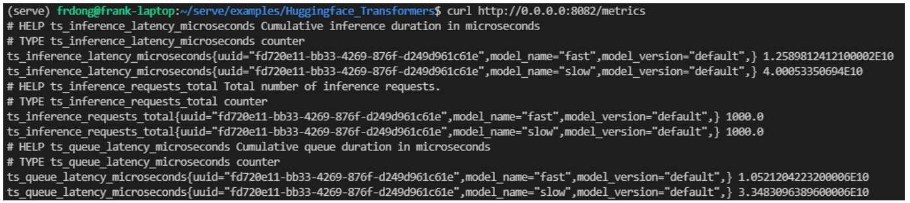
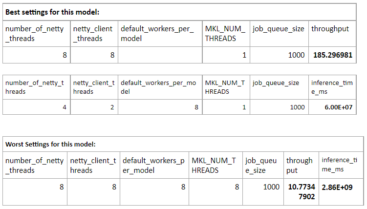
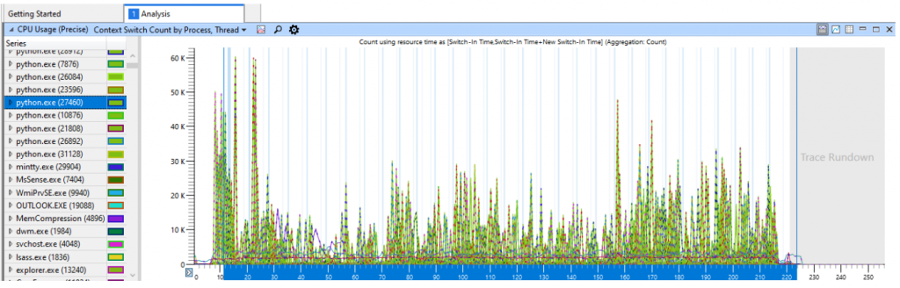
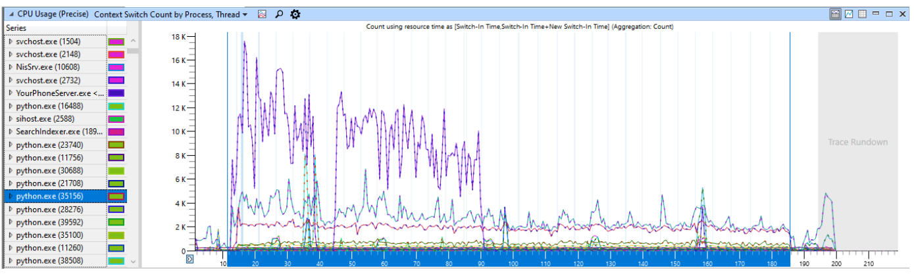

# 01--模型推理的性能测试文档

参考资料：

- [Model Performance Optimization with TorchServe](https://odsc.medium.com/model-performance-optimization-with-torchserve-cf68566d389c)


## Model Performance Optimization with TorchServe


在本博客中，我们将介绍 TorchServe，这是一个用于服务机器学习模型的功能丰富的框架。我们将通过各种实验来测试不同操作系统、线程设置和一些workers的性能，以发现根据环境配置优化模型的最佳方法。

本练习的灵感来自一位财富 500 强客户，他是 PyTorch 企业支持计划的成员。他们最近遇到了 MacOS、Linux 和 Windows 之间的性能差异问题。将 PyTorch 代码中的线程数设置为 1 在 Linux 和 Windows 上显着提高了性能，但对 MacOS 性能没有影响。让我们深入了解一下为什么会发生这种情况。

**为什么会出现基于操作系统的性能差异？**

为了深入挖掘并进行性能测试，我们需要查看一些不同的参数：用于自动缩放的线程和工作线程。用于调整和微调 TorchServe 性能的 3 组参数是：Netty 中的池大小、TorchServe 中的工作线程数和 PyTorch 中的线程数。 TorchServe 在前端和后端使用多个线程来加速整个推理过程。 PyTorch 在模型推理期间也有自己的线程设置。可以在 [**此处**](https://pytorch.org/docs/stable/notes/cpu_threading_torchscript_inference.html) 找到有关 PyTorch 线程的更多详细信息。

线程可能会显着影响整体推理性能。我们的理论是 Linux（和 Windows）上的默认设置创建了太多线程。当 PyTorch 模型较小且单个输入的推理成本较小时，线程的上下文切换时间会导致推理时间增加并降低性能。 [TorchServe Docs](https://pytorch.org/serve/configuration.html#other-properties) 向我们展示了我们可以设置属性来告诉 TorchServe 前端和后端使用多少线程。此外，我们可以设置用于 PyTorch 的线程数。我们将在测试中调整这些参数，以了解如何提高性能并找到客户报告的问题的根本原因：

- TorchServe Settings:

  - number_of_netty_threads:

    Number frontend Netty thread

  - netty_client_threads:

    Number of backend natty thread

  - default_workers_per_model:

    Number of workers to create for each model that loaded at startup time

- PyTorch Settings:

  - PyTorch number of threads:

    several [ways](https://github.com/pytorch/pytorch/issues/16894#issuecomment-461871456) to set number of threads used in torch.


### **Testing TorchServe Configurations to Optimize Performance**

1. Experiment $1$ : 

   在没有TorchServe的情况下，在Windows上直接提供PyTorch模型的性能测试。

   为了模拟 TorchServe 如何在模型上加载和执行推理，我们编写了一些包装器代码来使用 TorchServe 为模型提供服务。这将使我们能够隔离性能损失的位置。当我们使用包装代码直接在模型上执行推理时，将线程数设置为 $1$ 与将其保留为默认值没有区别。这表明有足够的计算能力来处理工作负载，并且这些值最适合此模型大小。但是，如果将线程数设置为较高的值，这仍然可能导致问题，稍后我们将更详细地讨论。可以使用以下脚本验证此结果并针对你的模型运行它。(此脚本可用于 Linux 和 Windows 的测试)

   ```python
   import sys
   from ts.metrics.metrics_store import MetricsStore
   from ts.torch_handler.base_handler import BaseHandler
   from uuid import uuid4
   from pprint import pprint
   
   class ModelContext:
       def __init__(self):
           self.manifest = {
               'model': {
                   'modelName': 'ptclassifier',
                   'serializedFile': '<ADD MODEL NAME HERE>',
                   'modelFile': 'model_ph.py'
               }
           }
           self.system_properties = {
               'model_dir': '<ADD COMPLETE MODEL PATH HERE>'
           }
           self.explain = False
           self.metrics = MetricsStore(uuid4(), self.manifest['model']['modelName'])
       def get_request_header(self, idx, exp):
           if exp == 'explain':
               return self.explain
           return False
       
   def main():
       if sys.argv[1] == 'fast':
           from ptclassifier.TransformerSeqClassificationHandler import TransformersSeqClassifierHandler as Classifier
       else:
           from ptclassifiernotr.TransformerSeqClassificationHandler import TransformersSeqClassifierHandler as Classifier
       ctxt = ModelContext()
       handler = Classifier()
       handler.initialize(ctxt)
       data = [{'data': 'To be or not to be, that is the question.'}]
       for i in range(1000):
           processed = handler.handle(data, ctxt)
           #print(processed)
       for m in ctxt.metrics.store:
           print(f'{m.name}: {m.value} {m.unit}')
           
   if __name__ == '__main__':
       main()
   ```

   

2. Experiment 2 : 

   在Linux上对一个较大的模型进行性能测试。

   我们使用了与官方 TorchServe HuggingFaces 样本不同的模型，并使用与上述相同的测试脚本来深入了解 Linux。由于 HuggingFace 模型比我们客户的模型重得多，因此我们可以在更长运行的实例上测试推理性能。

   

   对于较大的模型规模，上下文切换的成本与推理的成本相比要小。因此，性能差异较小。在下面的测试结果中，我们可以看到性能差异（3倍对10倍）。

3. Experiment 3 : 

   Linux 上不同线程设置组合的性能测试：

   这个实验显示了线程设置将如何影响整体推理性能。我们在具有4个物理核心和8个逻辑核心的WSL（Windows Subsystem Linux）上进行了测试。测试结果显示，足够的线程会提高性能，但过度的线程会大大损害推理性能和整体吞吐量。实验的最佳结果显示推理速度提高了50倍，吞吐量比最不有效的设置提高了18倍。最佳和最差的指标在下面的表格中说明。

   

   以下是用于创建这些测试结果的脚本：

   ```python
   import subprocess
   import itertools
   import time
   import os
   from time import sleep
   def do_test(number_of_netty_threads=1, netty_client_threads=1, default_workers_per_model=1, 
               job_queue_size=100, MKL_NUM_THREADS=1, test_parallelism=8):
       # generate config.properties files based on combination
       config_file_name = "config_file/" +
   f"config_{number_of_netty_threads}_{netty_client_threads}_{default_workers_per_model}_{job_queue_size}.properties"
       f = open(config_file_name, "w")
       f.write("load_models=all\n")
       f.write("inference_address=http://0.0.0.0:8080\n")
       f.write("management_address=http://0.0.0.0:8081\n")
       f.write("metrics_address=http://0.0.0.0:8082\n")
       f.write("model_store=<ADD COMPLETE MODEL PATH HERE>\n")
       f.write(f"number_of_netty_threads={number_of_netty_threads}\n")
       f.write(f"netty_client_threads={netty_client_threads}\n")
       f.write(f"default_workers_per_model={default_workers_per_model}\n")
       f.write(f"job_queue_size={job_queue_size}\n")
       f.close()
       # start the torch serve with proper config properties and other parameter settings
       subprocess.call(f"MKL_NUM_THREADS={str(MKL_NUM_THREADS)} torchserve --start 
   --model-store model-store --models model=<ADD MODEL NAME HERE> --ncs
   --ts-config {config_file_name}", shell=True, stdout=subprocess.DEVNULL)
       sleep(3)
       # test in parallel to inference API
       print("start to send test request...")
       start_time = time.time()
       print(time.ctime())
       subprocess.run(f"seq 1 1000 | xargs -n 1 -P {str(test_parallelism)} bash -c 
   'url=\"http://127.0.0.1:8080/predictions/model\"; curl -X POST $url -T
   input.txt'", shell=True, capture_output=True, text=True)
       total_time = int((time.time() - start_time)*1e6)
       print("total time in ms:", total_time)
       # get metrics of ts inference latency and ts query latency 
       output = subprocess.run("curl http://127.0.0.1:8082/metrics", shell=True,
   capture_output=True, text=True)
       inference_time=0
       query_time=0
       # capture inference latency and query latency from metrics
       for line in output.stdout.split('\n'):
           if line.startswith('ts_inference_latency_microseconds'):
               inference_time = line.split(' ')[1]
           if line.startswith('ts_queue_latency_microseconds'):
               query_time = line.split(' ')[1]
       # calculate the throughput
       throughput = 1000 / total_time * 1000000
       # write metrics to csv file for display
       f = open("test_result_short.csv", "a")
       f.write(f"{number_of_netty_threads},{netty_client_threads},{default_workers_per_model},
   {MKL_NUM_THREADS},{job_queue_size},{test_parallelism},{total_time},
   {inference_time},{query_time},{throughput}\n")
       f.close()
       # stop torchserve for this
       stop_result = os.system("torchserve --stop")
       print(stop_result)
       stop_result = os.system("torchserve --stop")
       print(stop_result)
       stop_result = os.system("torchserve --stop")
       print(stop_result)
               
   def main():
       # set the possible value, value range of each parameter
       number_of_netty_threads = [1, 2, 4, 8]
       netty_client_threads = [1, 2, 4, 8]
       default_workers_per_model = [1, 2, 4, 8]
       MKL_NUM_THREADS = [1, 2, 4, 8]
       job_queue_size = [1000] #[100, 200, 500, 1000]
       test_parallelism = [32] #[8, 16, 32, 64]
       # for each combination of parameters
       [do_test(a, b, c, d, e, f) for a, b, c, d, e, f in 
   itertools.product(number_of_netty_threads, netty_client_threads,
   default_workers_per_model, job_queue_size, MKL_NUM_THREADS, test_parallelism)]
               
   if __name__ == "__main__":
       main()
   ```

   

4. Experiment 4 : 

   使用 Windows 性能记录器在 Windows 上进行测试：

   我们也能够在Windows上复制这个性能问题。然后我们使用Windows性能记录器和Windows性能分析器来分析在模型上运行测试时的整体系统性能。

   下图显示了系统中进程和线程的上下文切换总数。所有 python 进程（由 TorchServe 创建的工作进程）都以绿色着色。

   

   上图显示了慢速情况下上下文切换的数量与时间的关系（当线程数设置为默认值时）。

   

   上图显示了线程数设置为 1 时的相同数据。

   <span style='color:brown'>**当线程数保留为默认值时，我们可以清楚地看到来自上下文切换数量显着增加的性能差异。**</span>

5. Experiment 5 : The MacOS Finding

   在 MacOS 上，PyTorch 有一个问题：在 macOS 上只使用一个线程。默认线程数是 $1$ 而不是逻辑核心数。这将导致更好的 TorchServe 性能，因为它将消除上下文切换成本。因此，MacOS 上不存在性能问题。

### **Summary**

事实证明，这个性能问题更多地是线程设置的问题。主要的收获是，在 PyTorch 中将线程数设置为 $1$ 具有减少系统上运行的线程总数的效果，从而减少了 Linux 和 Windows 上的上下文切换的总数。对于 MacOS，设置线程数的调用没有影响，因此我们没有看到性能差异。

许多因素会影响推理的最佳组合，例如：可用的核心数量、服务的模型数量以及模型的大小。找到最佳组合的最好方法是通过实验。目前还没有一个现有的工具/框架来自动设置每个参数的最佳值以达到平衡的性能和吞吐量。在使用TorchServe为模型提供服务时，通常需要进行调查，根据目标硬件微调线程设置，如TorchServe文档中所解释的。我们已经分享了测试脚本作为本博客的一部分，对你的模型推理进行这些性能测试。使用所提供的脚本进行试验，找到推理延迟和模型整体吞吐量的最佳设置平衡。


### **References**

- For full code samples check out [this GitHub repo](https://github.com/frank-dong-ms/torchserve-performance)
- [TorchServe Documentation](https://pytorch.org/serve/configuration.html#other-properties)
- [TorchServe Management API](https://pytorch.org/serve/management_api.html#scale-workers)
- [TorchServe HuggingFaces Sample](https://github.com/pytorch/serve/tree/master/examples/Huggingface_Transformers)


