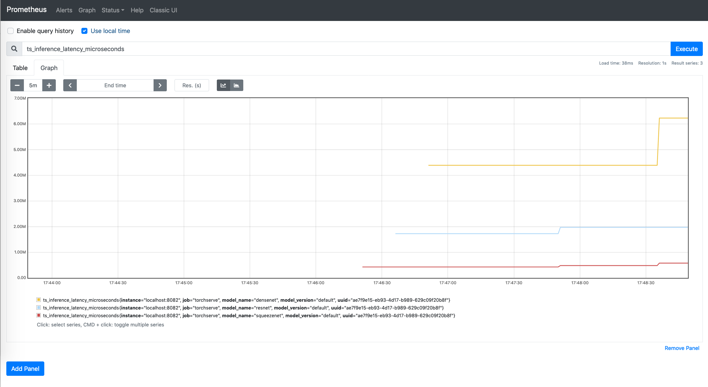

# TorchServe Documents


**目录：**

1. Advanced configuration
2. Metrics API
3. Inference API
4. Management API
5. TorchServe gRPC API

## <span style='color:brown'>1、Advanced configuration</span>

**参考资料：**

- [Advanced configuration](https://pytorch.org/serve/configuration.html)

### 5.2、Command line parameters

当你调用 `torchserve` 时，通过使用以下命令行参数来定制TorchServe行为。

- -ts-config

  如果没有设置 TS_CONFIG_FILE 环境变量，TorchServe 会加载指定的配置文件。

- -model-store

  覆盖 config.properties 文件中的 model_store 属性

- -models

  覆盖 config.properties 中的 load_models 属性

- -log-config

  覆盖默认 log4j2.xml

- -foreground

  在前台运行TorchServe。如果该选项被禁用，TorchServe将在后台运行。

有关 torchserve 命令行选项的更多详细信息，请参阅使用 [TorchServe 服务模型](https://pytorch.org/serve/server.html)。


### 5.3、config.properties file

TorchServe 使用 config.properties 文件来存储配置。TorchServe使用以下方式（按优先顺序）来定位这个config.properties文件：

1. 如果设置了 TS_CONFIG_FILE 环境变量，TorchServe 从环境变量指定的路径加载配置；
2. 如果--ts-config参数被传递给torchserve，TorchServe会从该参数指定的路径加载配置；
3. 如果在你调用 torchserve 的文件夹中存在 config.properties ，TorchServe 会从当前工作目录加载config.properties 文件；
4. 如果以上都没有指定，TorchServe 会加载一个带有默认值的内置配置。


### 5.3.2、Load models at stratup

你可以通过设置 model_store和 load_models属性来配置 TorchServe 在启动期间加载模型。以下数值是有效的：

- `load_models`
  - `standalone` :  默认值：N/A，启动时不加载模型。
  - `all` :  加载 `model_store` 中存在的所有模型。
  - `model1.mar`,  `model2.mar`  :  从 model_store 加载指定 MAR 文件中的模型。
  - `model1=model1.mar`,  `model2=model2.mar`  :  从 model_store 加载具有指定名称和 MAR 文件的模型。
- `model_store`
  - `standalone` : 默认值：N/A，禁用从本地磁盘加载模型。
  - `pathname` :  模型存储位置由路径名的值指定。

**NOTE:**

- model_store和load_models属性被命令行参数覆盖，如果指定的话。


### 5.3.3、Configure TorchServe listening address and port

TorchServe 本身不支持身份验证。为了避免未经授权的访问，TorchServe 默认只允许 localhost 访问。推理 API 正在侦听端口 8080。管理 API 正在侦听端口 8081。两者都期待 HTTP 请求。这些是默认端口。请参阅 [Enable SSL](https://pytorch.org/serve/configuration.html#enable-ssl) 以配置 HTTPS。

- `inference_address`  :  推理 API 绑定地址。默认值：http://127.0.0.1:8080
- `management_address`  :  管理 API 绑定地址。默认值：http://127.0.0.1:8081
- `metrics_address`  :  Metrics API 绑定地址。默认值：http://127.0.0.1:8082
- 要在公共 IP 地址上对模型运行预测，请将 IP 地址指定为 0.0.0.0。要对特定 IP 地址上的模型运行预测，请指定 IP 地址和端口。

```python
# bind inference API to all network interfaces with SSL enabled
inference_address=https://0.0.0.0:8443
```

```python
# bind inference API to private network interfaces
inference_address=https://172.16.1.10:8080
```


### 5.3.4、Configure TorchServe gRPC listening ports

默认情况下，推理 gRPC API 正在侦听端口 7070，管理 gRPC API 正在侦听端口 7071。

要配置不同的端口，请使用以下属性：

- `grpc_inference_port`  :  推理 gRPC API 绑定端口。默认值：7070
- `grpc_management_port`  :  管理 gRPC API 绑定端口。默认值：7071


### 5.3.7、Prefer direct buffer

配置参数 prefer_direct_buffer 控制模型服务器是否将使用 -XX:MaxDirectMemorySize 指定的直接内存。该参数仅用于模型服务器，不影响其他包对直接内存缓冲区的使用。默认值：false.

```properties
prefer_direct_buffer = true
```


### 5.3.10、Limit GPU USAGE

默认情况下，TorchServe 使用所有可用的 GPU 进行推理。使用 number_of_gpu 来限制 GPU 的使用。

- `number_of_gpu`  :  TorchServe 可用于推理的最大 GPU 数量。默认值：系统中所有可用的 GPU。


### 5.3.11、Nvidia control Visibility

设置 nvidia 环境变量。例如：

- export  CUDA_DEVICE_ORDER = "PCI_BUS_ID"
- export  CUDA_VISIBLE_DEVICES = '1, 3'


### 5.3.12、Enable metrics api

- `enable_metrics_api`

  启用或禁用指标 API，即它可以是真或假。默认值：true(启用).

- `metrics_format`

  用这个来指定指标报告的格式。目前，唯一支持的默认值是 `prometheus`  这与上面的 `enable_metrics_api` 选项一起使用。


### 5.3.13、Config model

- `models`  :  使用它来设置每个模型的配置，该值以 json 格式显示。

  ```properties
  {
      "modelName": {
          "version": {
              "parameterName1": parameterValue1,
              "parameterName2": parameterValue2,
              "parameterNameN": parameterValueN,
          }
      }
  }
  ```

- 模型的参数在 [**模型源代码**](https://github.com/pytorch/serve/blob/master/frontend/server/src/main/java/org/pytorch/serve/wlm/Model.java#L24) 中定义：

  > ```
  > minWorkers: the minimum number of workers of a model
  > maxWorkers: the maximum number of workers of a model
  > batchSize: the batch size of a model
  > maxBatchDelay: the maximum dalay in msec of a batch of a model
  > responseTimeout: the timeout in msec of a model's response
  > defaultVersion: the default version of a model
  > marName: the mar file name of a model
  > ```

- A model's configuration example

  ```properties
  models={\
    "noop": {\
      "1.0": {\
          "defaultVersion": true,\
          "marName": "noop.mar",\
          "minWorkers": 1,\
          "maxWorkers": 1,\
          "batchSize": 4,\
          "maxBatchDelay": 100,\
          "responseTimeout": 120\
      }\
    },\
    "vgg16": {\
      "1.0": {\
          "defaultVersion": true,\
          "marName": "vgg16.mar",\
          "minWorkers": 1,\
          "maxWorkers": 4,\
          "batchSize": 8,\
          "maxBatchDelay": 100,\
          "responseTimeout": 120\
      }\
    }\
  }
  ```

  

### 5.3.14. Other properties

以下大多数属性都是为性能调优而设计的。调整这些数字将影响可扩展性和吞吐量。

- `enable_envvars_config`

  启用通过环境变量配置TorchServe的功能。当这个选项被设置为 "true "时，TorchServe的所有静态配置也可以通过环境变量来实现。Default: false.

- `number_of_netty_threads`

  前端 netty 线程数。这指定了前端netty服务器的子EventLoopGroup中的线程数量。这个组提供EventLoop，用于处理来自接受连接的Netty通道事件（即推理和管理请求）。Default: number of logical processors available to the JVM.

- `netty_client_threads`

  后端网络线程数。这指定了WorkerThread [EventLoopGroup](https://livebook.manning.com/book/netty-in-action/chapter-8) 中的线程数，它将推理响应写入前端。

- `default_workers_per_model`

  为启动时加载的每个模型创建的工作者数量。默认值：系统中可用的GPU或JVM可用的逻辑处理器的数量。

- `job_queue_size`

  在后端提供服务之前，前端将排队的推理作业数量。默认值：$100$。

- `async_logging`

  启用异步日志以获得更高的吞吐量，如果启用该功能，日志输出可能会被延迟。默认值：false。

- `default_response_timeout`

  超时，以秒为单位，在模型的后端 workers 被视为无响应和重启之前，用于它们。默认：120秒。

- `unregister_model_timeout`

  超时（以秒为单位），在清理进程时处理注销模型请求时使用，然后才被视为无响应并发送错误响应。默认值：120 秒。

- `decode_input_request`

  当内容类型已知时，配置让后端工作者对请求进行解码。如果设置为 "true"，当内容类型为 "application/json "时，后端工作者会进行 "字节数到JSON对象 "的转换，当请求的内容类型被设置为 "text*"时，后端工作者会进行 "字节数到utf-8字符串 "的转换。默认值：true.

- `initial_worker_port`

  这是为工作进程自动分配端口的初始端口号。

- `model_store`

  模型存储目录的路径。

- `model_server_home`

  Torchserve 主目录。

- `max_request_size`

  Torchserve接受的最大允许的请求大小，单位是字节。默认值：6553500

- `max_response_size`

  Torchserve 发送的最大允许响应大小，以字节为单位。默认值：6553500

- `limit_max_image_pixels`

  默认值为 true（使用默认 PIL.Image.MAX_IMAGE_PIXELS）。如果设置为“false”，则在后端默认视觉处理程序中设置 PIL.Image.MAX_IMAGE_PIXELS = None 以获取大图像有效负载。

- `allowed_urls`

  可以注册模型的允许源 URL 的逗号分隔正则表达式。默认值：“file://.|http(s)?://.” （所有 URL 和本地文件系统）例如：要允许基本 URL `https://s3.amazonaws.com/` 和 `https://torchserve.pytorch.org/` 使用以下正则表达式字符串

- `workflow_store`

  工作流存储目录的路径。默认为模型存储目录。


#### <span style='color:brown'>NOTE</span>

All the above config properties can be set using environment variable as follows.

- set `enable_envvars_config` to true in config.properties

- export environment variable for property as`TS_`.

  eg: to set inference_address property run cmd `export TS_INFERENCE_ADDRESS="http://127.0.0.1:8082"`.


## <span style='color:brown'>2、Service APIs  --  METRICS API</span>

- [METRICS API](https://pytorch.org/serve/metrics_api.html)

Metrics API 正在侦听端口 8082，默认情况下只能从 localhost 访问。要更改默认设置，请参阅 [**TorchServe Configuration**](https://pytorch.org/serve/configuration.html)。默认指标端点返回 Prometheus 格式的指标。您可以使用 curl 请求查询指标或将 [**Prometheus Server**](https://pytorch.org/serve/metrics_api.html#prometheus-server) 指向端点并将 [**Grafana**](https://pytorch.org/serve/metrics_api.html#grafana) 用于仪表板。

默认情况下，这些 API 是启用的，但是可以通过在 torchserve config.properties 文件中设置 `enable_metrics_api=false` 来禁用相同的 API。有关详细信息，请参阅 [**Torchserve 配置文档**](https://pytorch.org/serve/configuration.html)。

```shell
curl http://127.0.0.1:8082/metrics

# HELP ts_inference_latency_microseconds Cumulative inference duration in microseconds
# TYPE ts_inference_latency_microseconds counter
ts_inference_latency_microseconds{uuid="d5f84dfb-fae8-4f92-b217-2f385ca7470b",model_name="noopversioned",model_version="1.11",} 1990.348
ts_inference_latency_microseconds{uuid="d5f84dfb-fae8-4f92-b217-2f385ca7470b",model_name="noop",model_version="default",} 2032.411
# HELP ts_inference_requests_total Total number of inference requests.
# TYPE ts_inference_requests_total counter
ts_inference_requests_total{uuid="d5f84dfb-fae8-4f92-b217-2f385ca7470b",model_name="noopversioned",model_version="1.11",} 1.0
ts_inference_requests_total{uuid="d5f84dfb-fae8-4f92-b217-2f385ca7470b",model_name="noop",model_version="default",} 1.0
# HELP ts_queue_latency_microseconds Cumulative queue duration in microseconds
# TYPE ts_queue_latency_microseconds counter
ts_queue_latency_microseconds{uuid="d5f84dfb-fae8-4f92-b217-2f385ca7470b",model_name="noopversioned",model_version="1.11",} 364.884
ts_queue_latency_microseconds{uuid="d5f84dfb-fae8-4f92-b217-2f385ca7470b",model_name="noop",model_version="default",} 82.349
```


```shell
curl "http://127.0.0.1:8082/metrics?name[]=ts_inference_latency_microseconds&name[]=ts_queue_latency_microseconds" --globoff

# HELP ts_inference_latency_microseconds Cumulative inference duration in microseconds
# TYPE ts_inference_latency_microseconds counter
ts_inference_latency_microseconds{uuid="d5f84dfb-fae8-4f92-b217-2f385ca7470b",model_name="noopversioned",model_version="1.11",} 1990.348
ts_inference_latency_microseconds{uuid="d5f84dfb-fae8-4f92-b217-2f385ca7470b",model_name="noop",model_version="default",} 2032.411
# HELP ts_queue_latency_microseconds Cumulative queue duration in microseconds
# TYPE ts_queue_latency_microseconds counter
ts_queue_latency_microseconds{uuid="d5f84dfb-fae8-4f92-b217-2f385ca7470b",model_name="noopversioned",model_version="1.11",} 364.884
ts_queue_latency_microseconds{uuid="d5f84dfb-fae8-4f92-b217-2f385ca7470b",model_name="noop",model_version="default",} 82.349
```


### Prometheus server

要在 Prometheus 服务器上查看这些指标，请使用 [**此处**](https://prometheus.io/download/#prometheus) 的说明下载并安装。如下创建一个最小的 `prometheus.yml`  配置文件并运行` ./prometheus` `--config.file=prometheus.yml`。

```yaml
global:
  scrape_interval:     15s
  evaluation_interval: 15s

scrape_configs:
  - job_name: 'prometheus'
    static_configs:
    - targets: ['localhost:9090']
  - job_name: 'torchserve'
    static_configs:
    - targets: ['localhost:8082'] #TorchServe metrics endpoint
```

在浏览器上导航到 http://localhost:9090/ 以执行查询并创建图表：




### Grafana

运行 Torchserve 和 Prometheus 服务器后，您可以进一步设置 Grafana，将其指向 Prometheus 服务器并导航到 http://localhost:3000/ 以创建仪表板和图表。

您可以使用下面给出的命令来启动 Grafana ：

```shell
$ sudo systemctl daemon-reload && sudo systemctl enable grafana-server && sudo systemctl start grafana-server
```


## <span style='color:brown'>3、Service APIs  --  INFERENCE API</span>

- [INFERENCE API](https://pytorch.org/serve/inference_api.html)

Inference API 正在侦听端口 8080，默认情况下只能从 localhost 访问。要更改默认设置，请参阅 TorchServe 配置。

TorchServe 服务器支持以下 API：

- API Description  -  获取可用 API 和选项的列表
- Health check API  -  获取正在运行的服务器的健康状态
- Predictions API  -  从服务模型获取预测
- Explanations API - 从服务模型中获取解释
- KServe Inference API - 从 KServe 获取服务模型的预测
- KServe Explanations API - 从 KServe 获取服务模型的解释


### API Description

要查看推理 API 的完整列表，可以使用以下命令：

```shell
$ curl  -X  OPTIONS  htts://localhost:8080
```

输出是OpenAPI 3.0.1的json格式。你可以用它来生成客户端代码，更多细节见 [swagger codegen](https://swagger.io/swagger-codegen/)。

- [Inference API description output](https://github.com/pytorch/serve/blob/master/frontend/server/src/test/resources/inference_open_api.json)


### Health check API

此 API 遵循 InferenceAPIsService.Ping gRPC API。它返回模型服务器中模型的状态。

TorchServe 支持 ping API，您可以调用它来检查正在运行的 TorchServe 服务器的健康状态：

```shell
$ curl http://localhost:8080/ping
```

如果服务器正常运行，将返回如下：

```json
{
  "status": "Healthy"
}
```


### Predictions API

此 API 遵循 InferenceAPIsService.Predictions gRPC API。它返回模型服务器中模型的状态。

要从每个加载模型的默认版本中获取预测，请对` /predictions/{model_name}` 进行 REST 调用：

- POST   /predictions/{model_name}

#### curl  Example

```shell
$ curl -O https://raw.githubusercontent.com/pytorch/serve/master/docs/images/kitten_small.jpg

$ curl http://localhost:8080/predictions/resnet-18 -T kitten_small.jpg

or:

$ curl http://localhost:8080/predictions/resnet-18 -F "data=@kitten_small.jpg"
```

从需要多个输入的加载模型中获取预测：

```shell
$ curl http://localhost:8080/predictions/squeezenet1_1 -F 'data=@docs/images/dogs-before.jpg' -F 'data=@docs/images/kitten_small.jpg'
```

```python
# or:
import requests
res = requests.post("http://localhost:8080/predictions/squeezenet1_1", files={'data': open('docs/images/dogs-before.jpg', 'rb'), 'data': open('docs/images/kitten_small.jpg', 'rb')})
```

要从每个加载模型的特定版本获取预测，请对 /predictions/{model_name}/{version} 进行 REST 调用：

- POST/predictions/{model_name}/{version}

#### curl  Example

```shell
$ curl -O https://raw.githubusercontent.com/pytorch/serve/master/docs/images/kitten_small.jpg

$ curl http://localhost:8080/predictions/resnet-18/2.0 -T kitten_small.jpg

or:

$ curl http://localhost:8080/predictions/resnet-18/2.0 -F "data=@kitten_small.jpg"
```

结果是 JSON，它告诉你该图像很可能是一只虎斑猫。最高预测是：

```json
{
    "class": "n02123045 tabby, tabby cat",
    "probability": 0.42514491081237793
}
```


### Explanations API

Torchserve利用Captum的功能来返回被服务的模型的解释。

要从每个加载模型的默认版本中获取解释，请对 /explanations/{model_name} 进行 REST 调用：

- POST    /explanations/{model_name}

#### curl  example

```shell
$ curl http://127.0.0.1:8080/explanations/mnist -T examples/image_classifier/mnist/test_data/0.png
```

结果是一个 json，它为你提供输入图像的解释：

```json
  [
    [
      [
        [
          0.004570948731989492,
          0.006216969640322402,
          0.008197565423679522,
          0.009563574612830427,
          0.008999274832810742,
          0.009673474804303854,
          0.007599905146155397, 
        ]
      ]
    ]
  ]
```


## <span style='color:brown'>4、Management API</span>

- [Management API](https://github.com/pytorch/serve/blob/master/docs/management_api.md)

Torchserve提供以下API，使你可以在运行时管理模型：

1. Register a model
2. Increase/decrease number of workers for specific model
3. Describe a model's status
4. Unregister a model
5. List registered models
6. Set default version of a model

Management API 在端口8081上听，默认情况下只能从Localhost访问。要更改默认设置，请参见 [Torchserve配置](https://github.com/pytorch/serve/blob/master/docs/configuration.md)。

### 1、Register a model

此 API 遵循 [ManagementApisservice.RegisterModel](https://github.com/pytorch/serve/blob/master/frontend/server/src/main/resources/proto/management.proto) GRPC API。

`POST  /models`

- `url` - 模型存档下载地址。支持以下位置：
  - 本地模型存档（.mar）；该文件必须在 model_store 文件夹中（而不是在子文件夹中）
  - 使用 HTTP(s) 协议的 URI。 TorchServe 可以从 Internet 下载 .mar 文件。
- `model_name` - 模型的名称；这个名称将作为{model_name}在其他API中作为路径的一部分使用。如果这个参数不存在，MANIFEST.json中的 `modelName` 将被使用。
- `handler` - 推理处理程序入口点。如果存在，此值将覆盖 MANIFEST.json 中的处理程序。注意：确保给定的 `handler` 程序在 `PYTHONPATH` 中。 handler 的格式是 `module_name:method_name`。
- `runtime` - 模型自定义服务代码的运行时。如果存在，此值将覆盖 MANIFEST.json 中的运行时。默认值为 `Python`。
- `batch_size` - 推理批次大小。默认值为 `1`。
- `max_batch_delay` - 批量聚合的最大延迟。默认值为 100 毫秒。
- `initial_workers` - 要创建的初始工作人员的数量。默认值为 0。在分配了至少一项工作之前，TorchServe 不会运行推理。
- `synchronous`  - 工作器的创建是否是同步的。默认值是false。TorchServe将创建新的 worker，而不需要等待前一个 worker 在线的确认。
- `response_timeout`  - 如果模型的后端工作器在这个超时时间内没有响应推理响应，工作器将被视为无响应并重启。单位是秒。默认值是120秒。

```shell
$ curl -X POST  "http://localhost:8081/models?url=https://torchserve.pytorch.org/mar_files/squeezenet1_1.mar"

{
  "status": "Model \"squeezenet_v1.1\" Version: 1.0 registered with 0 initial workers. Use scale workers API to add workers for the model."
}
```


#### **Encrypted model serving -- 加密的模型服务**

如果你想提供一个加密的模型，那么你需要用以下环境变量设置S3 SSE-KMS：

- AWS_ACCESS_KEY_ID
- AWS_SECRET_ACCESS_KEY
- AWS_DEFAULT_REGION

并在 HTTP 请求中设置“s3_sse_kms=true”。

例如：modelsqueezenet1_1 在 S3 上加密在你自己的私人账户下。 S3 上的模型 http url 是 https://torchserve.pytorch.org/sse-test/squeezenet1_1.mar。

- 如果 torchserve 将在 EC2 实例上运行（例如操作系统：ubuntu）

  1. 为 EC2 实例添加 IAM 角色 (AWSS3ReadOnlyAccess)
  2. 运行 ts_scripts/get_aws_credential.sh 以导出 AWS_ACCESS_KEY_ID 和 AWS_SECRET_ACCESS_KEY
  3. export AWS_DEFAULT_REGION=your_s3_bucket_region
  4. start torchserve
  5. Register encrypted model squeezenet1_1 by setting s3_sse_kms=true in curl command.

  ```shell
  $ curl -X POST  "http://localhost:8081/models?url=https://torchserve.pytorch.org/sse-test/squeezenet1_1.mar&s3_sse_kms=true"
  
  {
    "status": "Model \"squeezenet_v1.1\" Version: 1.0 registered with 0 initial workers. Use scale workers API to add workers for the model."
  }
  ```

  

### 2、Scale workers

此 API 遵循 [ManagementAPIsService.ScaleWorker](https://github.com/pytorch/serve/blob/master/frontend/server/src/main/resources/proto/management.proto) gRPC API。它返回模型服务器中模型的状态。

`PUT  /models/{model_name}`

- `min_worker`  -  （可选）工作进程的最小数量。 TorchServe 将尝试为指定模型保持此最小值。默认值为 `1`。
- `max_worker`  -  (可选）工作进程的最大数量。对于指定的模型，TorchServe将不会制造超过这个数量的工作进程。默认与 `min_worker` 的设置相同。
- `synchronous`  -  调用是否同步。默认值为假。
- `timeout`  -  a worker 完成所有未决请求的指定等待时间。如果超过了，工作进程将被终止。使用 `0` 来立即终止后端工作进程。使用`-1`可以无限期等待。默认值是`-1`。

使用Scale Worker API动态调整模型的任何版本的 worker 数量，以更好地服务于不同的推理请求负载。

这个 API 有两种不同的风格，同步和异步。

异步调用将立即返回 HTTP 代码 202：

```shell
$ curl -v -X PUT "http://localhost:8081/models/noop?min_worker=3"

< HTTP/1.1 202 Accepted
< content-type: application/json
< x-request-id: 42adc58e-6956-4198-ad07-db6c620c4c1e
< content-length: 47
< connection: keep-alive
< 
{
  "status": "Processing worker updates..."
}
```

在所有工作者都被调整后，同步调用以HTTP代码200返回。

```shell
$ curl -v -X PUT "http://localhost:8081/models/noop?min_worker=3&synchronous=true"

< HTTP/1.1 200 OK
< content-type: application/json
< x-request-id: b72b1ea0-81c6-4cce-92c4-530d3cfe5d4a
< content-length: 63
< connection: keep-alive
< 
{
  "status": "Workers scaled to 3 for model: noop"
}
```

要扩展一个模型的特定版本的工作人员，请使用URI：/models/{model_name}/{version} 。`PUT /models/{model_name}/{version}`。

在使用 HTTP 代码 200 调整模型“noop”的版本“2.0”的所有工作人员后，以下同步调用将返回。

```shell
$ curl -v -X PUT "http://localhost:8081/models/noop/2.0?min_worker=3&synchronous=true"

< HTTP/1.1 200 OK
< content-type: application/json
< x-request-id: 3997ccd4-ae44-4570-b249-e361b08d3d47
< content-length: 77
< connection: keep-alive
< 
{
  "status": "Workers scaled to 3 for model: noop, version: 2.0"
}
```


### 3、Describe model

此 API 遵循 [ManagementAPIsService.DescribeModel](https://github.com/pytorch/serve/blob/master/frontend/server/src/main/resources/proto/management.proto) gRPC API。它返回模型服务器中模型的状态。

`GET  /models/{model_name}`

使用 Describe Model API 获取模型默认版本的详细运行时状态：

```shell
$ curl http://localhost:8081/models/noop
[
    {
      "modelName": "noop",
      "modelVersion": "1.0",
      "modelUrl": "noop.mar",
      "engine": "Torch",
      "runtime": "python",
      "minWorkers": 1,
      "maxWorkers": 1,
      "batchSize": 1,
      "maxBatchDelay": 100,
      "workers": [
        {
          "id": "9000",
          "startTime": "2018-10-02T13:44:53.034Z",
          "status": "READY",
          "gpu": false,
          "memoryUsage": 89247744
        }
      ]
    }
]
```

`GET  /models/{model_name}/{version}`

使用 Describe Model API 获取特定模型版本的详细运行时状态：

```shell
$ curl http://localhost:8081/models/noop/2.0
[
    {
      "modelName": "noop",
      "modelVersion": "2.0",
      "modelUrl": "noop_2.mar",
      "engine": "Torch",
      "runtime": "python",
      "minWorkers": 1,
      "maxWorkers": 1,
      "batchSize": 1,
      "maxBatchDelay": 100,
      "workers": [
        {
          "id": "9000",
          "startTime": "2018-10-02T13:44:53.034Z",
          "status": "READY",
          "gpu": false,
          "memoryUsage": 89247744
        }
      ]
    }
]
```


`GET  /models/{model_name}/all`

使用 Describe Model API 获取模型所有版本的详细运行时状态：

```shell
$ curl http://localhost:8081/models/noop/all
[
    {
      "modelName": "noop",
      "modelVersion": "1.0",
      "modelUrl": "noop.mar",
      "engine": "Torch",
      "runtime": "python",
      "minWorkers": 1,
      "maxWorkers": 1,
      "batchSize": 1,
      "maxBatchDelay": 100,
      "workers": [
        {
          "id": "9000",
          "startTime": "2018-10-02T13:44:53.034Z",
          "status": "READY",
          "gpu": false,
          "memoryUsage": 89247744
        }
      ]
    },
    {
      "modelName": "noop",
      "modelVersion": "2.0",
      "modelUrl": "noop_2.mar",
      "engine": "Torch",
      "runtime": "python",
      "minWorkers": 1,
      "maxWorkers": 1,
      "batchSize": 1,
      "maxBatchDelay": 100,
      "workers": [
        {
          "id": "9000",
          "startTime": "2018-10-02T13:44:53.034Z",
          "status": "READY",
          "gpu": false,
          "memoryUsage": 89247744
        }
      ]
    }
]
```


`GET /models/{model_name}/{model_version}?customized=true` or `GET /models/{model_name}?customized=true`

使用 Describe Model API 获取模型版本的详细运行时状态和自定义元数据：

- Implement function describe_handler.  Eg.

  ```python
  def describe_handle(self):
      """Customized describe handler
          Returns:
              dict : A dictionary response.
          """
      output_describe = None
  
      logger.info("Collect customized metadata")
  
      return output_describe
  ```

- Implement function _is_describe if handler is not inherited from BaseHandler. And then, call _is_describe and describe_handle in handle.

  ```python
  def _is_describe(self):
      if self.context and self.context.get_request_header(0, "describe"):
          if self.context.get_request_header(0, "describe") == "True":
              return True
          return False
  
  def handle(self, data, context):
          if self._is_describe():
              output = [self.describe_handle()]
          else:
              data_preprocess = self.preprocess(data)
              
              if not self._is_explain():
                  output = self.inference(data_preprocess)
                  output = self.postprocess(output)
              else:
                  output = self.explain_handle(data_preprocess, data)
          return output
  ```

- Call function _is_describe and describe_handle in handle. Eg.

  ```python
  def handle(self, data, context):
          """Entry point for default handler. It takes the data from the input request and returns
             the predicted outcome for the input.
          Args:
              data (list): The input data that needs to be made a prediction request on.
              context (Context): It is a JSON Object containing information pertaining to
                                 the model artefacts parameters.
          Returns:
              list : Returns a list of dictionary with the predicted response.
          """
  
          # It can be used for pre or post processing if needed as additional request
          # information is available in context
          start_time = time.time()
  
          self.context = context
          metrics = self.context.metrics
  
          is_profiler_enabled = os.environ.get("ENABLE_TORCH_PROFILER", None)
          if is_profiler_enabled:
              output, _ = self._infer_with_profiler(data=data)
          else:
              if self._is_describe():
                  output = [self.describe_handle()]
              else:
                  data_preprocess = self.preprocess(data)
  
                  if not self._is_explain():
                      output = self.inference(data_preprocess)
                      output = self.postprocess(output)
                  else:
                      output = self.explain_handle(data_preprocess, data)
  
          stop_time = time.time()
          metrics.add_time('HandlerTime', round(
              (stop_time - start_time) * 1000, 2), None, 'ms')
          return output
  ```

- Here is an example. "customizedMetadata" shows the metadata from user's model. These metadata can be decoded into a dictionary.

  ```shell
  $ curl http://localhost:8081/models/noop-customized/1.0?customized=true
  [
      {
          "modelName": "noop-customized",
          "modelVersion": "1.0",
          "modelUrl": "noop-customized.mar",
          "runtime": "python",
          "minWorkers": 1,
          "maxWorkers": 1,
          "batchSize": 1,
          "maxBatchDelay": 100,
          "loadedAtStartup": false,
          "workers": [
            {
              "id": "9010",
              "startTime": "2022-02-08T11:03:20.974Z",
              "status": "READY",
              "memoryUsage": 0,
              "pid": 98972,
              "gpu": false,
              "gpuUsage": "N/A"
            }
          ],
          "customizedMetadata": "{\n  \"data1\": \"1\",\n  \"data2\": \"2\"\n}"
       }
  ]
  ```

- Decode customizedMetadata on client side. For example:

  ```python
  import requests
  import json
  
  response = requests.get('http://localhost:8081/models/noop-customized/?customized=true').json()
  customizedMetadata = response[0]['customizedMetadata']
  print(customizedMetadata)
  ```

  

### 4、Unregister a model

此 API 遵循 ManagementAPIsService.UnregisterModel gRPC API。它返回模型服务器中模型的状态。

`DELETE  /models/{model_name}/{version}`

使用Unregister Model API，通过从TorchServe取消注册特定版本的模型来释放系统资源。

```shell
$ curl -X DELETE http://localhost:8081/models/noop/1.0

{
  "status": "Model \"noop\" unregistered"
}
```


### 5、List  models

此 API 遵循 ManagementAPIsService.ListModels gRPC API。它返回模型服务器中模型的状态。

`GET  /models`

- `limit`  -  （可选）要返回的最大项目数。它作为查询参数传递。默认值为 100。
- `next_page_token`  -  （可选）查询下一页。它作为查询参数传递。该值由先前的 API 调用返回。

使用 Models API 查询当前注册模型的默认版本：

```shell
$ curl "http://localhost:8081/models"
```

此 API 支持分页：

```shell
$ curl "http://localhost:8081/models?limit=2&next_page_token=2"

{
  "nextPageToken": "4",
  "models": [
    {
      "modelName": "noop",
      "modelUrl": "noop-v1.0"
    },
    {
      "modelName": "noop_v0.1",
      "modelUrl": "noop-v0.1"
    }
  ]
}
```


### 5、API  Description

`OPTIONS /`

要查看推理和管理 API 的完整列表，可以使用以下命令：

```shell
# To view all inference APIs:
$ curl -X OPTIONS http://localhost:8080

# To view all management APIs:
$ curl -X OPTIONS http://localhost:8081
```


### 6、Set Default Version

此 API 遵循 ManagementAPIsService.SetDefault gRPC API。它返回模型服务器中模型的状态。

`PUT  /models/{model_name}/{version}/set-default`

要将模型的任何注册版本设置为默认版本，请使用：

```shell
$ curl -v -X PUT http://localhost:8081/models/noop/2.0/set-default
```


## <span style='color:brown'>5、TORCHSERVE GRPC API</span>

- [TorchServe gRPC API](https://pytorch.org/serve/grpc_api.html)

NOTE：

- 当前的 TorchServe gRPC 不支持工作流。

TorchServe 还支持用于推理和管理调用的 [gRPC API](https://github.com/pytorch/serve/tree/master/frontend/server/src/main/resources/proto)。

TorchServe 提供以下 gRPC api。

- Inference API
  - Ping  :  获取正在运行的服务器的健康状态
  - Predictions  :  从服务模型获取预测
- Management API
  - RegisterModel  :  在 TorchServe 上提供模型/模型版本
  - UnregisterModel  :  通过从 TorchServe 取消注册模型的特定版本来释放系统资源
  - ScaleWorker  :  动态调整任何版本的模型的workers数量，以更好地服务于不同的推理请求负载。
  - ListModels  :  查询当前注册模型的默认版本
  - DescribeModel  :  获取模型默认版本的详细运行时状态
  - SetDefault  :  将模型的任何注册版本设置为默认版本

默认情况下，TorchServe 侦听 gRPC 推理 API 的端口 7070 和 gRPC 管理 API 的 7071 端口。要在不同端口上配置 gRPC API，请参阅 [配置文档](https://pytorch.org/serve/configuration.html)。


