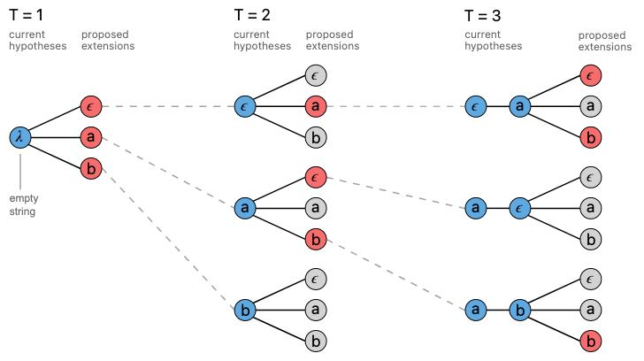

# A--性能测试的实验设计及数据分析

**本实验的目的：**

1. 研究TorchServe进行模型部署时候的性能影响因素，为后续的进一步性能提升奠定坚实的基础；
2. 研究目前的硬件设备环境下，如何设置部署的试验参数从而使得模型部署后的用户使用效果达到最佳；


**目前进行实验的相关准备工作：**

- 重新部署服务以便于监控日志的相关输出信息、及metrics端口的重置问题；

## <span style='color:brown'>**本测试实验的约束条件说明：**</span>

**Transformers_handler_generalized.py:**

1. preprocess 阶段的 encode 环节

   - 原设置

     ```python
     inputs = self.tokenizer.encode_plus(
         input_text,
         truncation=True,
         max_length=int(max_length),
         padding=True,
         add_special_tokens=True,
         return_tensors='pt',
     )
     ```

     

   - 快速推理的设置

     ```python
     inputs = self.tokenizer.encode_plus(
         input_text,
         max_length=int(max_length),
         return_tensors='pt'
     )
     ```

     

2. inference 阶段的代码长度生成的参数设置

   - 原设置

     ```python
     outputs = self.model.generate(input_ids_batch, max_length=50, do_sample=True, top_p=0.95, top_k=60)
     ```

     

   - 快速推理设置

     ```python
     outputs = self.model.generate(input_ids_batch, max_length=50)
     ```

     

## **实验设计：**

### Experiment  1:  (推进中)

<span style='color:brown'>**可设置参数：**</span>

- num_of_netty_threads
- netty_client_threads
- default_workers_per_model
- MKL_NUM_THREADS
- job_queue_size

| Settings for this model |                      |                           |                 |                |              |                    |
| ----------------------- | -------------------- | ------------------------- | --------------- | -------------- | ------------ | ------------------ |
| num_of_netty_threads    | netty_client_threads | default_workers_per_model | MKL_NUM_THREADS | job_queue_size | through  put | inference_times_ms |


### Experiment  2:  (已完成)

<span style='color:brown'>**可设置参数：**</span>

- minWorkers
- maxWorkers
- batch_size
  - 默认值为 1, 此处需多组测试
- maxBatchDelay
  - 100  ms
- responseTimeout
  - 默认值为120 s，此处可以缩短到30 s

<span style='color:brown'>**通过 config.properties 使用此配置的示例：**</span>

```shell
$ curl  http://0.0.0.0:7001/models/codegen
```


```properties
# The following command will register a model "resnet-152.mar" and configure TorchServe to use a batch_size of 8 and a max batch delay of 50 milli seconds, in the config.properties.

models={\
  "resnet-152": {\
    "1.0": {\
        "defaultVersion": true,\
        "marName": "resnet-152.mar",\
        "minWorkers": 1,\
        "maxWorkers": 1,\
        "batchSize": 8,\
        "maxBatchDelay": 50,\
        "responseTimeout": 120\
    }\
  }\
}
```

修改配置参数：

```shell
$ curl -X POST "http://0.0.0.0:7001/models?url=codegen.mar&batch_size=8&max_batch_delay=100"
```


### Experiment  3:   (后续推进，优先级较低)

- Intel  Extension for PyTorch

```properties
ipex_enable=true
cpu_launcher_enable=true
cpu_launcher_args=--use_logical_core --disable_numactl
```


## 数据记录及分析

### <span style='color:brown'>测试中的真实数据构建</span>

暂略

### <span style='color:brown'>Experiment  2:</span>

测试代码细节：

```python
import requests
import concurrent.futures
import json
import time

hints = ['def quicksort(): ', 'import numpy as ']

start = time.perf_counter()

base_url = 'http://'
headers = {'Content-Type': 'application/json'}

def do_requests(hint):
    dict = {}
    dict['data'] = hint
    t1 = time.perf_counter()
    r = requests.post(base_url, data=json.dumps(dict), headers=headers)
    t2 = time.perf_counter()
    use_time = t2 - t1
    print('This thread use {use_time} seconds...')
    return r.text

with concurrent.futures.ThreadPoolExecutor() as executor:
    f1 = {executor.submit(do_requests, 'import pandas as ') for _ in range(10)} 
    
finish = time_perf_counter()
print('The whole requests use time is : {}'.format(finish-start))
```


<center>并发性能测试实验数据记录表：</center>
| Requests | minWorkers | maxWorkers | batch_size | maxBatchDelay | 并发--completation time(seconds) | 串行--completation time(seconds) |      |
| :------: | :--------: | :--------: | :--------: | :-----------: | :------------------------------: | :------------------------------: | :--: |
|   100    |     1      |     1      |     8      |      50       |             22.0737              |             160.4679             |      |
|   1000   |     1      |     1      |     8      |      50       |             220.6617             |                \                 |      |
|   100    |     1      |     1      |     16     |      50       |             16.6735              |                \                 |      |
|   1000   |     1      |     1      |     16     |      50       |             168.5168             |                \                 |      |
|   100    |     1      |     1      |     8      |      100      |             32.4999              |                \                 |      |
|   1000   |     1      |     1      |     8      |      100      |             256.5326             |                \                 |      |
|   100    |     1      |     1      |     16     |      100      |             18.6565              |                                  |      |
|   1000   |     1      |     1      |     16     |      100      |             177.1625             |                                  |      |
|   100    |     1      |     1      |     32     |      50       |             10.7015              |                \                 |      |
|   1000   |     1      |     1      |     32     |      50       |             87.6813              |                \                 |      |
|   100    |     1      |     1      |     64     |      50       |             10.5107              |                \                 |      |
|   1000   |     1      |     1      |     64     |      50       |             160.4679             |                \                 |      |
|   100    |     1      |     1      |     32     |      100      |              9.7545              |                \                 |      |
|   1000   |     1      |     1      |     32     |      100      |             84.3032              |                \                 |      |
|   100    |     1      |     1      |     64     |      100      |             10.8641              |                \                 |      |
|   1000   |     1      |     1      |     64     |      100      |             94.5207              |                \                 |      |
|   100    |     1      |     1      |    256     |      50       |             11.7635              |                                  |      |
|   1000   |     1      |     1      |    256     |      50       |             102.0206             |                                  |      |
|   100    |     1      |     1      |    256     |      100      |             11.4438              |                                  |      |
|   1000   |     1      |     1      |    256     |      100      |             97.6421              |                                  |      |

>  注意点：本测试为同一台机器上运行的测试脚本

#### **对表格进行拆解：**

- 固定值：maxBatchDelay = 50 ms

| Requests | minWorkers | maxWorkers | batch_size | maxBatchDelay | 并发--completation time(seconds) | 串行--completation time(seconds) |      |
| :------: | :--------: | :--------: | :--------: | :-----------: | :------------------------------: | :------------------------------: | :--: |
|   100    |     1      |     1      |     8      |      50       |             22.0737              |             160.4679             |      |
|   1000   |     1      |     1      |     8      |      50       |             220.6617             |                \                 |      |
|   100    |     1      |     1      |     16     |      50       |             16.6735              |                \                 |      |
|   1000   |     1      |     1      |     16     |      50       |             168.5168             |                \                 |      |
|   100    |     1      |     1      |     32     |      50       |             10.7015              |                \                 |      |
|   1000   |     1      |     1      |     32     |      50       |             87.6813              |                \                 |      |
|   100    |     1      |     1      |     64     |      50       |             10.5107              |                \                 |      |
|   1000   |     1      |     1      |     64     |      50       |             160.4679             |                \                 |      |
|   100    |     1      |     1      |    256     |      50       |             11.7635              |                \                 |      |
|   1000   |     1      |     1      |    256     |      50       |             102.0206             |                \                 |      |


拆1：

| Requests | minWorkers | maxWorkers |               batch_size                | maxBatchDelay |       并发--completation time(seconds)       | 串行--completation time(seconds) |      |
| :------: | :--------: | :--------: | :-------------------------------------: | :-----------: | :------------------------------------------: | :------------------------------: | :--: |
|   100    |     1      |     1      |                    8                    |      50       |                   22.0737                    |             160.4679             |      |
|   100    |     1      |     1      |                   16                    |      50       |                   16.6735                    |                \                 |      |
|   100    |     1      |     1      |                   32                    |      50       |                   10.7015                    |                \                 |      |
|   100    |     1      |     1      | <span style='color:brown'>**64**</span> |      50       | <span style='color:brown'>**10.5107**</span> |                \                 |      |
|   100    |     1      |     1      |                   256                   |      50       |                   11.7635                    |                \                 |      |

拆2： 

| Requests | minWorkers | maxWorkers |               batch_size                | maxBatchDelay |       并发--completation time(seconds)       | 串行--completation time(seconds) |      |
| :------: | :--------: | :--------: | :-------------------------------------: | :-----------: | :------------------------------------------: | :------------------------------: | :--: |
|   1000   |     1      |     1      |                    8                    |      50       |                   220.6617                   |                \                 |      |
|   1000   |     1      |     1      |                   16                    |      50       |                   168.5168                   |                \                 |      |
|   1000   |     1      |     1      | <span style='color:brown'>**32**</span> |      50       | <span style='color:brown'>**87.6813**</span> |                \                 |      |
|   1000   |     1      |     1      |                   64                    |      50       |                   160.4679                   |                \                 |      |
|   1000   |     1      |     1      |                   256                   |      50       |                   102.0206                   |                \                 |      |

结论：基于上述测试数据，当 maxBatchDelay = 50ms 时，batch_size = 32 时候的性能最佳


- 固定值：maxBatchDelay = 100 ms

| Requests | minWorkers | maxWorkers | batch_size | maxBatchDelay | 并发--completation time(seconds) | 串行--completation time(seconds) |      |
| :------: | :--------: | :--------: | :--------: | :-----------: | :------------------------------: | :------------------------------: | :--: |
|   100    |     1      |     1      |     8      |      100      |             32.4999              |                \                 |      |
|   1000   |     1      |     1      |     8      |      100      |             256.5326             |                \                 |      |
|   100    |     1      |     1      |     16     |      100      |             18.6565              |                \                 |      |
|   1000   |     1      |     1      |     16     |      100      |             177.1625             |                \                 |      |
|   100    |     1      |     1      |     32     |      100      |              9.7545              |                \                 |      |
|   1000   |     1      |     1      |     32     |      100      |             84.3032              |                \                 |      |
|   100    |     1      |     1      |     64     |      100      |             10.8641              |                \                 |      |
|   1000   |     1      |     1      |     64     |      100      |             94.5207              |                \                 |      |
|   100    |     1      |     1      |    256     |      100      |             11.4438              |                \                 |      |
|   1000   |     1      |     1      |    256     |      100      |             97.6421              |                \                 |      |


拆1：

| Requests | minWorkers | maxWorkers |               batch_size                | maxBatchDelay |      并发--completation time(seconds)       | 串行--completation time(seconds) |      |
| :------: | :--------: | :--------: | :-------------------------------------: | :-----------: | :-----------------------------------------: | :------------------------------: | :--: |
|   100    |     1      |     1      |                    8                    |      100      |                   32.4999                   |                \                 |      |
|   100    |     1      |     1      |                   16                    |      100      |                   18.6565                   |                \                 |      |
|   100    |     1      |     1      | <span style='color:brown'>**32**</span> |      100      | <span style='color:brown'>**9.7545**</span> |                \                 |      |
|   100    |     1      |     1      |                   64                    |      100      |                   10.8641                   |                \                 |      |
|   100    |     1      |     1      |                   256                   |      100      |                   11.4438                   |                \                 |      |


拆2：

| Requests | minWorkers | maxWorkers |               batch_size                | maxBatchDelay |       并发--completation time(seconds)       | 串行--completation time(seconds) |      |
| :------: | :--------: | :--------: | :-------------------------------------: | :-----------: | :------------------------------------------: | :------------------------------: | :--: |
|   1000   |     1      |     1      |                    8                    |      100      |                   256.5326                   |                \                 |      |
|   1000   |     1      |     1      |                   16                    |      100      |                   177.1625                   |                \                 |      |
|   1000   |     1      |     1      | <span style='color:brown'>**32**</span> |      100      | <span style='color:brown'>**84.3032**</span> |                \                 |      |
|   1000   |     1      |     1      |                   64                    |      100      |                   94.5207                    |                \                 |      |
|   1000   |     1      |     1      |                   256                   |      100      |                   97.6421                    |                                  |      |


结论：当maxBatchDelay = 100ms 时，batch_size = 32 时候的性能最佳

综合上述的数据可以看出，maxBatchDelay = 100ms 、batch_size = 32 时性能最佳。

> 注： 
>
> - 数据的不足：需要补测batch_size 更大的情况下的测试数据，以增加说服性(已补全)。


## <span style='color:brown'>**Experiment 2--补充实验：**</span>

1、测试增加 maxBatchDelay ，是否可以快速完成一次性接收数据的实时推理；

2、尝试将Requests 降低到与 batch_size 相近的时候，模型的推理速度是否可以增加

**实验目的：**

- 为证明目前模型部署方式下的瞬时吞吐速度，为后续模型的工业级部署提供坚实的实践数据支撑；


### 实验设计：

1、增大maxBatchDelay

| Requests | minWorkers | maxWorkers | batch_size | maxBatchDelay | 并发--completation time(seconds) |        平均时间        |       max - avg        |
| :------: | :--------: | :--------: | :--------: | :-----------: | :------------------------------: | :--------------------: | :--------------------: |
|    32    |     1      |     1      |     32     |      50       |         8.19、6.40、7.82         |    5.51、4.75、5.27    |    2.26、1.33、1.54    |
|    32    |     1      |     1      |     32     |      100      |         4.29、4.40、4.39         |    2.14、2.19、2.18    |    0.25、0.33、0.29    |
|    32    |     1      |     1      |     32     |      200      |         4.53、5.31、4.55         |    2.23、2.76、2.28    |    0.31、0.45、0.27    |
|    32    |     1      |     1      |     32     |      300      |      8.35、5.05、4.87、4.6       | 4.43、2.53、2.39、2.26 | 1.26、0.41、0.42、0.30 |
|    32    |     1      |     1      |     32     |      400      |         7.05、4.99、4.86         |    3.52、2.51、2.42    |    0.66、0.32、0.25    |
|    32    |     1      |     1      |     32     |      500      |         6.08、5.72、5.53         |    3.36、3.09、2.83    |    0.35、0.35、0.29    |


| Requests | minWorkers | maxWorkers | batch_size | maxBatchDelay | 并发--completation time(seconds) |      平均时间      |    max - avg     |
| :------: | :--------: | :--------: | :--------: | :-----------: | :------------------------------: | :----------------: | :--------------: |
|    32    |     1      |     1      |    100     |      50       |         5.69、4.67、5.48         |  3.88、3.54、4.42  | 1.59、0.94、0.89 |
|   100    |     1      |     1      |    100     |      50       |       17.69、13.40、12.48        | 4.29、3.20、2.83、 | 4.04、1.70、1.55 |
|    32    |     1      |     1      |    100     |      100      |         5.42、5.42、5.72         |  3.09、3.58、3.78  | 0.41、1.59、1.59 |
|   100    |     1      |     1      |    100     |      100      |       14.22、11.93、11.72        |  3.37、2.94、2.74  | 1.81、0.80、0.76 |
|    32    |     1      |     1      |    100     |      200      |         5.85、4.66、4.75         |  3.34、2.29、2.35  | 0.43、0.33、0.36 |
|   100    |     1      |     1      |    100     |      200      |       10.74、10.52、13.21        |  2.59、2.59、3.25  | 0.50、0.21、1.55 |
|    32    |     1      |     1      |    100     |      300      |         6.45、5.21、5.17         |  3.56、2.44、2.46  | 0.42、0.64、0.56 |
|   100    |     1      |     1      |    100     |      300      |       12.75、13.75、11.33        |  3.14、3.48、2.75  | 0.59、1.94、0.42 |
|    32    |     1      |     1      |    100     |      400      |       18.65、14.92、12.89        |  9.17、7.48、6.46  | 5.32、4.29、3.58 |
|   100    |     1      |     1      |    100     |      400      |       43.40、40.74、47.38        | 10.39、9.74、11.51 | 3.71、2.74、4.79 |


2、增大batch_size

| Requests | minWorkers | maxWorkers | batch_size | maxBatchDelay | 并发--completation time(seconds)  |
| :------: | :--------: | :--------: | :--------: | :-----------: | :-------------------------------: |
|   100    |     1      |     1      |    256     |      100      |        13.27、13.15、10.82        |
|   100    |     1      |     1      |    256     |      200      |        11.55、14.75、17.85        |
|   100    |     1      |     1      |    256     |      300      |       11.57、10.314、13.986       |
|   100    |     1      |     1      |    256     |      400      |        17.72、12.80、12.38        |
|   100    |     1      |     1      |    256     |      500      | 16.37、14.24、13.93、21.04、12.93 |
|    20    |     1      |     1      |    256     |      500      |       3.5691、3.384、3.022        |


3、降低Request数量以测试实时处理能力

| Requests | minWorkers | maxWorkers | batch_size | maxBatchDelay |   并发--completation time(seconds)   |
| :------: | :--------: | :--------: | :--------: | :-----------: | :----------------------------------: |
|    20    |     1      |     1      |     32     |      100      |       3.80、4.518、4.64、4.388       |
|    20    |     1      |     1      |     32     |      200      |     3.987、3.332、3.698、4.1487      |
|    20    |     1      |     1      |     32     |      300      |    3.6516、2.9657、3.0699、3.5328    |
|    20    |     1      |     1      |     32     |      400      | 4.0121、3.0573、5.1333、5.3882、2.93 |
|    20    |     1      |     1      |     32     |      500      |  6.027、3.0504、3.339、3.006、3.678  |


4、增加workers数量进行性能测试

**表-4-1：**

| Requests | minWorkers | maxWorkers | batch_size | maxBatchDelay | 并发--completation time(seconds) |
| :------: | :--------: | :--------: | :--------: | :-----------: | :------------------------------: |
|    32    |     1      |     1      |     32     |      200      |  2.8951、2.8791、2.7707、2.9752  |
|    32    |     2      |     2      |     32     |      200      |  4.905、3.5285、2.9457、3.7489   |
|    32    |     3      |     3      |     32     |      200      |    3.859、3.672、2.703、3.639    |
|    32    |     4      |     4      |     32     |      200      |  4.7438、4.3082、5.0244、4.8302  |
|    32    |     5      |     5      |     32     |      200      |  4.3013、4.5594、4.4229、5.2403  |

> 备注：
>
> 此数据为单GPU的性能测试数据。


**表-4-2：**

| Requests | minWorkers | maxWorkers | batch_size | maxBatchDelay |               并发--completation time(seconds)               | 平均时间 | max - avg |
| :------: | :--------: | :--------: | :--------: | :-----------: | :----------------------------------------------------------: | -------- | :-------: |
|    32    |     1      |     1      |     32     |      200      |            5.8411、5.6611、6.0160、5.4359、4.2128            |          |           |
|    32    |     2      |     2      |     32     |      200      |            3.9449、3.0697、3.0607、3.2039、3.0314            |          |           |
|    32    |     3      |     3      |     32     |      200      | 3.0739、6.1493、3.3469、6.0644、3.2282、3.2074、3.6389、4.3375、4.2810、2.9192、 |          |           |
|    32    |     4      |     4      |     32     |      200      |           6.9191、3.9986、3.04127、3.8957、3.4288            |          |           |

#### <span style='color:brown'>**2022-09-30--再次测量的数据：**</span>

- 10.17.67.138

| Requests | minWorkers | maxWorkers | batch_size | maxBatchDelay | 并发--completation time(seconds) |      平均时间      |    max - avg     |
| :------: | :--------: | :--------: | :--------: | :-----------: | :------------------------------: | :----------------: | :--------------: |
|    32    |     1      |     1      |     32     |      200      |       14.38、14.98、15.56        | 7.05、7.39、7.64、 | 4.30、4.93、4.82 |
|    32    |     2      |     2      |     32     |      200      |        12.71、9.15、9.33         |  7.89、5.25、5.57  | 4.73、3.84、3.68 |
|    32    |     3      |     3      |     32     |      200      |       10.42、11.49、10.26        |  6.19、6.22、5.56  | 4.15、5.18、4.61 |
|    32    |     4      |     4      |     32     |      200      |        12.60、9.56、10.57        |  6.88、5.34、5.93  | 5.63、4.13、4.56 |


- 本机--10.17.68.105

| Requests | minWorkers | maxWorkers | batch_size | maxBatchDelay | 并发--completation time(seconds) |     平均时间     |    max - avg     |
| :------: | :--------: | :--------: | :--------: | :-----------: | :------------------------------: | :--------------: | :--------------: |
|    32    |     1      |     1      |     32     |      200      |       10.17、11.82、13.05        | 6.40、7.27、7.44 | 3.56、4.34、5.42 |
|    32    |     2      |     2      |     32     |      200      |        8.93、10.88、10.83        | 5.44、6.40、7.21 | 3.31、4.27、3.44 |
|    32    |     3      |     3      |     32     |      200      |        10.12、8.58、9.45         | 5.82、5.39、5.71 | 4.09、3.00、3.56 |
|    32    |     4      |     4      |     32     |      200      |         9.97、9.70、8.44         | 6.22、5.82、5.20 | 3.58、3.66、3.04 |


# <span style='color:brown'>新性能测试思路--以固定时间间隔进行请求操作</span>

**测试思路：**

- 每个固定时间间隔启动一个线程进行请求操作；

目前模型部署的时间窗口设置为：200 ms(maxBatchDelay, 1 seconds = 1000 milliseconds)

- 需求：一秒钟内发送100个请求操作

  分配给5个窗口，则每个200 ms 的时间窗口需要启动20个请求，则换算为每10 ms 启动一个请求操作；


**测试代码细节：**

```python
import requests
import concurrent.futures
import json
import time

hints = ['def quicksort():', 'import seaborn']
start = time.perf_counter()
base_url = 'http://10.17.68.105:7000/predictions/codegen'
headers = {'Content-type': 'application/json'}

def do_request(hint):
    dict = {}
    dict['data'] = hint
    t1 = time.perf_counter()
    r = requests.post(base_url, data=json.dumps(dict), headers=headers)
    t2 = time.perf_counter()
    use_time = t2 - t1
    print(f'This thread use {use_time} seconds...')
    return r.text

i = 0

while(i<10):
    i = i + 1
    time.sleep(0.01)
    with concurrent.futures.ThreadPoolExecutor() as executor:
        f1 = executor.submit(do_request, 'import os')
        
finish = time.perf_counter()
print('The whole use time is : {} .\n'.format(finish - start))
```


### **测试数据：**

<span style='color:brown'>**表2-1：**</span>

- 定量数据：
  - batch_size = 32
  - maxBatchDelay = 200

| Requests per second | 时间间隔--millisecond | minWorkers | maxWorkers | batch_size | maxBatchDelay | 完成时间--completation time(seconds) | 平均时间--average_time |    max - avg     |
| :-----------------: | :-------------------: | :--------: | :--------: | :--------: | :-----------: | :----------------------------------: | :--------------------: | :--------------: |
|         32          |          30           |     1      |     1      |     32     |      200      |           3.47、3.38、3.37           |    2.58、2.46、2.47    | 0.65、0.62、0.62 |
|         50          |          20           |     1      |     1      |     32     |      200      |           5.01、4.78、4.74           |    2.78、2.58、2.54    | 1.24、1.25、1.25 |
|         100         |          10           |     1      |     1      |     32     |      200      |           6.56、6.67、6.30           |    3.63、3.74、3.35    | 1.93、1.94、1.90 |
|         200         |           5           |     1      |     1      |     32     |      200      |                  \                   |           \            |        \         |

> 说明：
>
> 当每秒的请求数量超过100时，部分线程无响应而导致结果测试无效。


<span style='color:brown'>**表2-2：**</span>

- 定量数据：
  - batch_size =  100
  - maxBatchDelay = 200

| Requests per second | 时间间隔--millisecond | minWorkers | maxWorkers | batch_size | maxBatchDelay | 完成时间--completation time(seconds) | 平均时间--average_time |      max - avg      |
| :-----------------: | :-------------------: | :--------: | :--------: | :--------: | :-----------: | :----------------------------------: | :--------------------: | :-----------------: |
|         20          |          50           |     1      |     1      |    100     |      200      |           3.39、3.40、3.38           |   2.496、2.51、2.50    | 0.626、0.63、0.624  |
|         32          |          30           |     1      |     1      |    100     |      200      |         14.14、14.84、14.39          |    7.64、8.90、8.22    |  5.46、4.91、5.13   |
|         50          |          20           |     1      |     1      |    100     |      200      |         16.95、14.51、15.74          |    8.89、8.42、8.77    |  6.95、4.98、5.85   |
|         100         |          10           |     1      |     1      |    100     |      200      |         33.84、25.11、34.57          |  17.73、13.16、17.71   | 14.85、10.75、15.62 |
|         200         |           5           |     1      |     1      |    100     |      200      |                  \                   |           \            |          \          |


<span style='color:brown'>**表2-3 ：**</span>

- 定量数据
  - batch_size = 32
  - maxBatchDelay = 100

| Requests per second | 时间间隔--millisecond | minWorkers | maxWorkers | batch_size | maxBatchDelay | 完成时间--completation time(seconds) | 平均时间--average_time |    max - avg     |
| :-----------------: | :-------------------: | :--------: | :--------: | :--------: | :-----------: | :----------------------------------: | :--------------------: | :--------------: |
|         20          |          50           |     1      |     1      |     32     |      100      |           5.07、4.17、4.14           |    3.82、3.00、3.01    | 0.31、0.22、0.22 |
|         32          |          30           |     1      |     1      |     32     |      100      |           4.07、4.18、4.32           |    2.97、3.02、3.17    | 0.29、0.27、0.26 |
|         50          |          20           |     1      |     1      |     32     |      100      |           6.29、6.34、7.70           |    3.61、3.65、4.76    | 1.56、1.58、1.83 |
|         100         |          10           |     1      |     1      |     32     |      100      |           9.38、9.38、9.16           |    5.34、5.32、5.23    | 2.80、2.82、2.72 |
|         100         |           \           |     1      |     1      |     32     |      100      |           8.87、9.52、8.85           |    4.44、4.84、4.49    | 4.18、4.42、4.11 |


## 快速推理下的模型推理性能测试数据

### Beam search:




**推理参数设置：**

1. preprocess 阶段的 encode 环节

   ```python
   inputs = self.tokenizer.encode_plus(
       input_text,
       max_length=int(max_length),
       return_tensors='pt'
   )
   ```

   

2. inference 阶段的代码长度生成的参数设置

   ```python
   outputs = self.model.generate(input_ids_batch, max_length=50)
   ```


| Requests per second(设定) | min/max Workers | batch_size | maxBatchDelay |  实际请求量(个)  | 实际使用时间(seconds) | 实际请求速度--Total requests / finish_time(seconds) | 平均时间--average_delay | 成功率--success_rate |
| :-----------------------: | :-------------: | :--------: | :-----------: | :--------------: | :-------------------: | :-------------------------------------------------: | :---------------------: | :------------------: |
|     100 = 1000 / 10 s     |       3/3       |     16     |      200      |     999、999     |     60.36、54.2、     |                     14.2、15.5                      |      28.30、22.85       |       1.0、1.0       |
|     200 = 2000 / 10 s     |       3/3       |     16     |      200      |   1906、1915、   |      82.3、97.0       |                    12.37、10.33                     |      24.45、33.35       |      0.60、0.58      |
|            100            |       3/3       |     32     |      200      |  999、999、999   |  10.03、10.00、10.02  |                 94.1、93.49、93.34                  |    0.74、0.85、0.73     |         1.0          |
|            200            |       3/3       |     32     |      200      | 1726、1844、1803 |  10.38、10.74、10.83  |                150.5、152.31、150.09                |    0.97、1.05、1.05     |         1.0          |
|            300            |       3/3       |     32     |      200      | 2829、2420、2617 |  16.71、14.08、15.51  |               154.40、155.19、154.15                |    1.20、1.13、1.11     |         1.0          |
|            400            |       3/3       |     32     |      200      | 3962、3202、2180 |  23.69、18.87、12.99  |               157.02、156.35、152.07                |    1.19、1.12、1.02     |         1.0          |
|            500            |       3/3       |     32     |      200      | 3477、1873、3697 |  20.26、10.67、21.91  |               157.12、154.09、156.20                |    1.07、1.40、1.21     |         1.0          |
|            100            |       3/3       |     48     |      200      |     999、999     |     45.78、44.96      |                   17.91、18.17、                    |      22.27、21.06       |         1.0          |
|            200            |       3/3       |     48     |      200      |      1938、      |        53.51、        |                       17.52、                       |          21.10          |         0.58         |
|            100            |       3/3       |     64     |      200      |  999、999、999   |   50.0、64.2、42.9    |                 16.64、13.45、18.86                 |   23.74、35.40、20.42   |         1.0          |
|            200            |       3/3       |     64     |      200      | 1875、1873、1990 |   71.2、81.9、68.1    |                  16.1、12.2、14.3                   |    27.7、37.75、28.8    |   0.7、0.59、0.56    |
|            300            |       3/3       |     64     |      200      |    2090、2319    |      55.38、57.9      |                    16.79、15.83                     |       19.6、20.19       |      0.53、0.48      |
|            100            |       3/3       |    128     |      200      |     999、999     |     38.1、38.15、     |                    20.79、20.74                     |      18.51、19.17       |       1.0、1.0       |
|            200            |       3/3       |    128     |      200      |    1921、1828    |      59.1、44.48      |                    21.76、21.01                     |      25.47、17.63       |      0.78、0.63      |
|                           |                 |            |               |                  |                       |                                                     |                         |                      |
|                           |                 |            |               |                  |                       |                                                     |                         |                      |
|                           |                 |            |               |                  |                       |                                                     |                         |                      |

