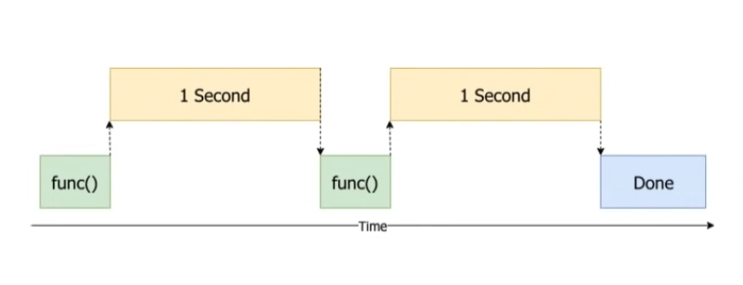
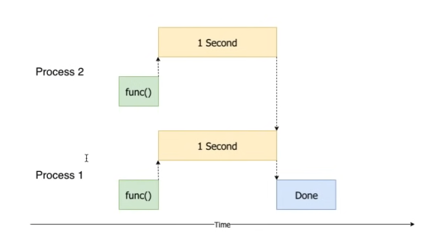

# B--Python并发计算的测试代码构建

**参考信息源：**

1. [Requests: HTTP for humans](https://requests.readthedocs.io/en/latest/)
2. [GitHub--psf/requests](https://github.com/psf/requests)
3. [怎样才能连续运行多个curl请求？](https://stackoverflow.com/questions/3110444/how-can-i-run-multiple-curl-requests-processed-sequentially)
4. [Make-batch-API-requests-via-Python](https://wenleicao.github.io/Make-batch-API-requests-via-Python/)
5. [how-to-send-concurrent-http-requests-in-python](https://blog.devgenius.io/how-to-send-concurrent-http-requests-in-python-d9cda284c86a)
6. [Software Testing Notes](https://softwaretestingnotes.substack.com/p/issue-40-software-testing-notes)
7. [concurrent.futures](https://docs.python.org/3/library/concurrent.futures.html)

Youtube 视频源：

- [Python Threading Tutorial: Run Code Concurrently Using the Threading ](https://www.youtube.com/watch?v=IEEhzQoKtQU)
- [Functional Programming in Python: Parallel Processing with "concurrents.futures"](https://www.youtube.com/watch?v=0NNV8FDuck8)

Python--Requests库--Issues：

- [Document threading contract for Session class](https://github.com/psf/requests/issues/2766)


## Thread v.s. Process

1. Thread v.s. Process

   进程与线程的区别：

   一个进程有一个主线程，并可能有其他线程；一个线程属于一个进程；**进程和线程都是底层操作系统提供的特性**。

2. Shared Memory v.s. Inter-Process Communication

   线程可以在进程内共享内存。

   进程不像线程那样共享内存，相反，状态必须被序列化并在进程之间传输，这被称为进程间的通信；尽管它发生在幕后，但它确实对可以共享的数据和状态施加了限制，并增加了共享数据的开销。线程之间的状态共享简单且轻量级，进程之间的状态共享更难且重量级。

3. GIL v.s. no GIL (global  interpreter lock)

   <span style='color:brown'>**GIL 是一种锁，它使用同步来确保在python进程中只有一个执行线程可以执行。**</span>

   ThreadPoolExecutor中的每个线程都受到GIL的约束，而ProcessPoolExecutor中的多个子进程不受GIL的约束。

   这意味着虽然我们在一个ThreadPoolExecutor中可能有多个线程，但是一次只能执行一个。

   GIL在每个Python进程中使用，但不能跨进程，这意味着一个ProcessPoolExecutor中的多个子进程可以同时执行，并且不受GIL的限制。

#### **Summary of Differences:**

<span style='color:brown'>ThreadPoolExecutor</span>

- Uses Threads, not processes.
- Lightweight workers, not heavyweight workers.
- Shared Memory, not inter-process communication.
- Subject to the GIL, not parallel execution.
- Suited to IO-bound Tasks, not CPU-bound tasks.
- <span style='color:brown'>**Create 10s to 1,000s Workers, not really constrained.**</span>(受约束的)

<span style='color:brown'>ProcessPoolExecutor</span>

- Uses Processes, not threads.
- Heavyweight Workers, not lightweight workers.
- Inter-Process Communication, not shared memory.
- Not Subject to the GIL, not constrained to sequential execution.
- Suited to CPU-bound Tasks, probably not IO-bound tasks.
- <span style='color:brown'>**Create 10s of Workers, not 100s or 1,000s of tasks.**</span>.

## 性能测试案例

**参考案例：**

```python
import sys
from ts.metrics.metrics_store import MetricsStore
from ts.torch_handler.base_handler import BaseHandler
from uuid import uuid4
from pprint import pprint

class ModelContext:
    def __init__(self):
        self.manifest = {
            'model': {
                'modelName': 'ptclassifier',
                'serializedFile': '<ADD MODEL NAME HERE>',
                'modelFile': 'model_ph.py'
            }
        }
        self.system_properties = {
            'model_dir': '<ADD COMPLETE MODEL PATH HERE>'
        }
        self.explain = False
        self.metrics = MetricsStore(uuid4(), self.manifest['model']['modelName'])
    def get_request_header(self, idx, exp):
        if exp == 'explain':
            return self.explain
        return False
    
def main():
    if sys.argv[1] == 'fast':
        from ptclassifier.TransformerSeqClassificationHandler import TransformersSeqClassifierHandler as Classifier
    else:
        from ptclassifiernotr.TransformerSeqClassificationHandler import TransformersSeqClassifierHandler as Classifier
    ctxt = ModelContext()
    handler = Classifier()
    handler.initialize(ctxt)
    data = [{'data': 'To be or not to be, that is the question.'}]
    for i in range(1000):
        processed = handler.handle(data, ctxt)
        #print(processed)
    for m in ctxt.metrics.store:
        print(f'{m.name}: {m.value} {m.unit}')
        
if __name__ == '__main__':
    main()
```

<span style='color:brown'>**上述测试方法的缺点：**</span>

- 将数据的推理直接写入主程序，将忽略在实际使用中面临的网络连接等方面的真实表现，此时测试出来的数据将与实际相分离，需要避免这种测试中出现的偏差；因此本实验的测试方法需要复现产品在真实使用中的场景，并在此基础上得出测试数据，这样的数据才具有更强的真实性。


### Curl 进行批量 requests 的Python 脚本的实现代码参考

- [Requests: HTTP for humans](https://requests.readthedocs.io/en/latest/)
- [GitHub--psf/requests](https://github.com/psf/requests)
- [怎样才能连续运行多个curl请求？](https://stackoverflow.com/questions/3110444/how-can-i-run-multiple-curl-requests-processed-sequentially)


同时进行两个POST请求：

```python
import requests
res = requests.post("http://localhost:8080/predictions/squeezenet1_1", files={'data': open('docs/images/dogs-before.jpg', 'rb'), 'data': open('docs/images/kitten_small.jpg', 'rb')})
```


```python
import requests
url = 'https://www.example.com/post'
payload = {
'key1': 'value1',
'key2': 'value2'
}

headers = {
'Content-Type': 'application/json'
}

r = requests.post(url, data=payload, headers=headers)
print(r.text)
```


```python
url = 'https://httpbin.org/post'
files = {'file': ('report.csv', 'some,data,to,send\nanother,row,to,send\n')}

r = requests.post(url, files=files)
r.text
{
  ...
  "files": {
    "file": "some,data,to,send\\nanother,row,to,send\\n"
  },
  ...
}
```


### <span style='color:brown'>Example : Batch API Requests via  Pyzillow</span>

- [Make-batch-API-requests-via-Python](https://wenleicao.github.io/Make-batch-API-requests-via-Python/)


```python
# write the results to csv file
with open(r'test.csv', 'w') as outfile:
    writer = csv.writer(outfile)
    with open(r'test2.csv', 'r') as csvfile:
        spamreader = csv.reader(csvfile, delimiter=',')
        next(spamreader)  #skip csv header
        for row in spamreader:
            try:
            	outrow = row+[get_zillowinfo(row[0], row[1])] # merge result of function call to the existing row
            	writer.writerow(outrow)
            except:
                outrow = row+["Data not available"]  # notice data is not available
                writer.writerow(outrow)
                continue
```


### <span style='color:brown'>**Example:  How to Seed Concurrent HTTP Requests in Python**</span>

- [how-to-send-concurrent-http-requests-in-python](https://blog.devgenius.io/how-to-send-concurrent-http-requests-in-python-d9cda284c86a)

#### 1、The built-in concurrent library  (<span style='color:brown'>**已验证有效**</span>)

从技术上讲，Python 是一种多线程语言，然而，由于 GIL（全局解释器锁）的存在，在实践中，它确实不是。所以，Python中的线程更多的是与并发性有关，而不是与并行性有关。 

并发库有一个叫做ThreadPoolExecutor的类，我们将用它来发送并发请求。在这个例子中，我使用的是Rick and Morty API。我们的目标是获得Rick and Morty动画片中各个角色的信息，而API是一个很好的开始。让我们看看一些代码，我将逐行解释。

```python
import requests
import concurrent
from concurrent.futures import ThreadPoolExecutor

characters = range(1, 100)
base_url = 'https://rickandmortyapi.com/api/character'
threads = 20

def get_character_info(character):
    r = requests.get(f'{base_url}/{character}')
    return r.json()

with ThreadPoolExecutor(max_workers=threads) as executor:
    future_to_url = {executor.submit(get_character_info, char) for char in characters}
    for future in concurrent.futures.as_completed(future_to_url):
        try:
            data = future.result()
            print(data)
        except Exception as e:
            print('Looks like something went wrong: ', e)
```


第1-3行是我们需要的导入库。我们将使用 [request](https://docs.python-requests.org/en/latest/) 库来向API发送HTTP请求，我们将使用 [concurrent](https://docs.python.org/3/library/concurrent.futures.html) 库来并发地执行这些请求。

characters 变量是从 1 到 99 的整数范围（请注意，我使用范围而不是列表，因为这样变量被延迟加载到内存中，这意味着它在内存方面更有效）。

base_url 是我们将调用的端点以及字符 id 后缀来获取我们的数据。

线程变量基本上告诉我们的ThreadPoolExecutor，我们希望最多有20个线程（但不是我说的真正的操作系统线程）被产生出来。第13-20行进行实际执行。

future_to_url 变量是一个带有有趣键值对的字典。关键是一个方法—— executor.submit 。更有趣的是该方法接受两个参数。一个是函数的名称 (get_character_info)，另一个是传递给该函数的参数。确保不要混淆，通过在括号中添加 char 参数，就像单独调用 get_character_info 函数时一样。字典的值基本上是一个元组推导式，这是我们通常不会用作字典值的东西。这里的重点是遍历所有字符 id，并为每个字符调用函数。

接下来，我们启动一个 for 循环，该循环将遍历 concurrent.futures.as_completed(future_to_url)，简单来说，这意味着 — 将这些调用的结果作为完成。

try/except 块会将数据变量声明为 HTTP 请求的结果，希望不会失败。如果是这样，我们将打印一条简单的错误消息，看看出了什么问题。

如果你运行这段代码，你可能已经看到它的执行速度有多快。我们在不到一秒钟的时间里得到了100个API结果。如果我们一个一个地做，可能要花1分钟以上。


#### 2、The Asyncio library (<span style='color:brown'>**已验证有效**</span>)

[Asyncio](https://docs.python.org/3/library/asyncio.html) 模块也是内置的，但为了在 HTTP 调用中使用它，我们需要安装一个异步 HTTP 库，称为 [aiohttp](https://docs.aiohttp.org/en/stable/)。原因是我们之前使用的 requests 库不是异步工作的，所以这里不会有任何作用。

Asyncio的工作方式与ThreadPoolExecutor不同，它使用一种叫做事件循环的东西。这与NodeJs的工作方式类似，所以如果你来自JavaScript，你可能对这种方式很熟悉。

```python
import aiohttp
import asyncio

characters = range(1, 10)
base_url = 'https://rickandmortyapi.com/api/character'

async def get_character_info(character, session):
    r = await session.request('GET', url=f'{base_url}/{character}')
    data = await r.json()
    return data

async def main(characters):
    async with aiohttp.ClientSession() as session:
        tasks = []
        for char in characters:
            tasks.append(get_character_info(character=char, session=session))
            results = await asyncio.gather(*tasks, return_exceptions=True)
            print('result: ', results)
            print('/n')
    return results

if __name__ == '__main__':
    data = asyncio.run(main(characters))
    # for item in data:
    #     print(item)
```


前10行代码与ThreadPoolExecutor的方法比较相似，主要有两个不同之处。首先，我们导入的是 aiohttp 库，而不是 requests。第二，在我们的函数定义中，我们在所有东西前面使用了async关键字。这样我们就告诉 Python 解释器，我们将在一个事件循环中运行这个函数。

第 12-18 行是开始与第一种方法不同的地方，但正如您可能得出的结论，最重要的调用是 tasks.append 调用，它类似于第一种方法的 executor.submit 调用。下一行的 asyncio.gather 类似于 futures.as_completed 方法，因为它在单个集合中收集并发调用的结果。

最后，当使用asyncio时，我们需要调用asyncio.run()（只有在Python 3.7及以上版本才有，否则需要多写几行代码）。这个函数接受一个参数，即我们想添加到事件循环中的异步函数。

这种方法也许有点复杂，但它更快、更可靠。一般来说，我更推荐这种方法，特别是在你进行数百甚至数千次并发呼叫时。

最终，无论哪种方法都会在同步调用的一小部分时间内完成HTTP调用。


## <span style='color:brown'>Issue #40:  Software Testing Notes</span>

原文地址：

- [Software Testing Notes](https://softwaretestingnotes.substack.com/p/issue-40-software-testing-notes)


## <span style='color:brown'>Python--concurrent.futures  :  Launching parallel tasks</span>

原文地址：

- [concurrent.futures](https://docs.python.org/3/library/concurrent.futures.html)

concurrent.futures模块为异步执行的可调用程序提供了一个高级接口。

异步执行可以通过线程（使用ThreadPoolExecutor）或单独的进程（使用ProcessPoolExecutor）进行。两者都实现了相同的接口，这是由抽象的Executor类定义的。

### Executor  Objects

提供异步执行调用的方法的抽象类。它不应该直接使用，而应该通过它的具体子类来使用。

- `submit`(*fn*, */*, **args*, ***kwargs*)[¶](https://docs.python.org/3/library/concurrent.futures.html#concurrent.futures.Executor.submit)

  安排可调用对象 fn 作为 fn(*args, **kwargs) 执行，并返回表示可调用对象执行的 Future 对象。

  ```python
  with ThreadPoolExecutor(max_workers=1) as executor:
      future = executor.submit(pow, 323, 1235)
      print(future.result())
  ```

- `map`(*func*, **iterables*, *timeout=None*, *chunksize=1*)[¶](https://docs.python.org/3/library/concurrent.futures.html#concurrent.futures.Executor.map)

  类似于 map(func, *iterables) 除了：

  - iterables 被立即收集而不是懒惰地收集；
  - func是异步执行的，可以同时对func进行多次调用。

  当使用ProcessPoolExecutor时，该方法会将迭代数据切成若干块，并作为独立的任务提交给池。这些块的（近似）大小可以通过设置chunksize为一个正整数来指定。对于非常长的迭代对象，与默认的1大小相比，使用大的chunksize可以显著提高性能。 对于ThreadPoolExecutor，chunksize没有影响。
  
- `shutdown`(*wait=True*, ***, *cancel_futures=False*)

  向执行器发出信号，当当前挂起的期货执行完毕时，它应该释放它正在使用的任何资源。在关闭后对Executor.submit()和Executor.map()的调用将引发RuntimeError。

  如果wait为True，那么这个方法将不会返回，直到所有的待定期货执行完毕，并且与执行者相关的资源被释放。如果wait为False，那么这个方法将立即返回，当所有的待定期货执行完毕后，与执行器相关的资源将被释放。无论等待的值是多少，整个Python程序都不会退出，直到所有等待的期货执行完毕。

  如果cancel_futures为True，该方法将取消所有执行者尚未开始运行的未决期货。任何已经完成或正在运行的期货都不会被取消，不管cancel_futures的值如何。

  如果cancel_futures和wait都是True，所有执行器已经开始运行的期货将在此方法返回之前完成。剩余的期货将被取消。

  如果你使用with语句，你可以避免明确地调用这个方法，它将关闭执行器（就像在调用Executor.shutdown()时将等待设置为True一样）。


### ThreadPoolExecutor

ThreadPoolExecutor 是一个 Executor 子类，它使用线程池来异步执行调用。

当与 Future 关联的可调用对象等待另一个 Future 的结果时，可能会发生死锁。例如：

```python
import time

def wait_on_b():
    time.sleep(5)
    print(b.result())  # b will never complete because it is waiting on a.
    return 5

def wait_on_a():
    time.sleep(5)
    print(a.result())  # a will never complete because it is waiting on b.
    return 6

executor = ThreadPoolExecutor(max_workers=2)
a = executor.submit(wait_on_b)
b = executor.submit(wait_on_a)
```

And:

```python
def wait_on_future():
    f = executor.submit(pow, 5, 2)
    # This will never complete because there is only one worker thread and
    # it is executing this function.
    print(f.result())

executor = ThreadPoolExecutor(max_workers=1)
executor.submit(wait_on_future)
```

一个Executor子类，使用一个最多由max_workers线程组成的池来异步执行调用。

在解释器退出之前，所有排队到 ThreadPoolExecutor 的线程都将被加入。请注意，执行此操作的退出处理程序在使用 atexit 添加的任何退出处理程序之前执行。这意味着必须捕获并处理主线程中的异常，以便通知线程正常退出。因此，建议不要将 ThreadPoolExecutor 用于长时间运行的任务。

initializer 是一个可选的可调用对象，在每个工作线程开始时调用； initargs 是传递给初始化程序的参数元组。如果初始化程序引发异常，所有当前挂起的作业都将引发一个 BrokenThreadPool，以及任何向池提交更多作业的尝试。

3.5版中的修改：如果max_workers为None或未给出，将默认为机器上的处理器数量，再乘以5，假设ThreadPoolExecutor经常被用来重叠I/O而不是CPU工作，workers的数量应该高于ProcessPoolExecutor的workers数量。

3.6版的新内容。增加了thread_name_prefix参数，允许用户控制由池子创建的工作线程的线程名称，以方便调试。

在 3.7 版更改: 添加了初始化程序和 initargs 参数。

在3.8版本中有所改变。max_workers 的默认值被改为 min(32, os.cpu_count() + 4)。这个默认值为I/O绑定的任务保留了至少5个工作者。对于释放GIL的CPU绑定任务，它最多利用32个CPU核。而且它避免了在多核机器上隐含地使用非常大的资源。

ThreadPoolExecutor现在在启动max_workers工作线程之前也会重用闲置的工作线程。


**ThreadPoolExecutor Example**

```python
import concurrent.futures
import urllib.request

URLS = ['http://www.foxnews.com/',
        'http://www.cnn.com/',
        'http://europe.wsj.com/',
        'http://www.bbc.co.uk/',
        'http://some-made-up-domain.com/']

# Retrieve a single page and report the URL and contents
def load_url(url, timeout):
    with urllib.request.urlopen(url, timeout=timeout) as conn:
        return conn.read()

# We can use a with statement to ensure threads are cleaned up promptly
with concurrent.futures.ThreadPoolExecutor(max_workers=5) as executor:
    # Start the load operations and mark each future with its URL
    future_to_url = {executor.submit(load_url, url, 60): url for url in URLS}
    for future in concurrent.futures.as_completed(future_to_url):
        url = future_to_url[future]
        try:
            data = future.result()
        except Exception as exc:
            print('%r generated an exception: %s' % (url, exc))
        else:
            print('%r page is %d bytes' % (url, len(data)))
```


### **ProcessPoolExecutor**

ProcessPoolExecutor 类是 Executor 子类，它使用进程池异步执行调用。 ProcessPoolExecutor 使用多处理模块，这允许它绕过全局解释器锁，但也意味着只能执行和返回可提取对象。

\__main__模块必须可以被工作子进程导入。这意味着 ProcessPoolExecutor 不会在交互式解释器中工作。

从提交给ProcessPoolExecutor的可调用方法中调用Executor或Future方法将导致死锁。

一个 Executor 子类，它使用最多 max_workers 个进程池异步执行调用。如果 max_workers 为 None 或未给出，它将默认为机器上的处理器数。如果 max_workers 小于或等于 0，则会引发 ValueError。在 Windows 上，max_workers 必须小于或等于 61。如果不是，则会引发 ValueError。如果 max_workers 为 None，则选择的默认值最多为 61，即使有更多处理器可用。 mp_context 可以是多处理上下文或无。它将用于启动工作人员。如果 mp_context 为 None 或未给出，则使用默认的多处理上下文。

initializer 是一个可选的可调用对象，在每个工作进程开始时被调用； initargs 是传递给初始化程序的参数元组。如果初始化程序引发异常，所有当前挂起的作业都将引发一个 BrokenProcessPool，以及任何向池提交更多作业的尝试。

3.3版中的改变：当一个工作进程突然终止时，现在会产生一个BrokenProcessPool错误。以前，行为是未定义的，但对执行者或其期货的操作往往会冻结或死锁。

3.7版中的变化：增加了mp_context参数，允许用户控制由池子创建的工作进程的start_method。


**ProcessPoolExecutor  Example**

```python
import concurrent.futures
import math

PRIMES = [
    112272535095293,
    112582705942171,
    112272535095293,
    115280095190773,
    115797848077099,
    1099726899285419]

def is_prime(n):
    if n < 2:
        return False
    if n == 2:
        return True
    if n % 2 == 0:
        return False

    sqrt_n = int(math.floor(math.sqrt(n)))
    for i in range(3, sqrt_n + 1, 2):
        if n % i == 0:
            return False
    return True

def main():
    with concurrent.futures.ProcessPoolExecutor() as executor:
        for number, prime in zip(PRIMES, executor.map(is_prime, PRIMES)):
            print('%d is prime: %s' % (number, prime))

if __name__ == '__main__':
    main()
```


## Requests--Issues

- 原文地址：[Links](https://github.com/psf/requests/issues/2766)


> 
>
> **from gward:**
>
> Right now, it's quite difficult to figure out if the Session class is threadsafe or not. The docs don't say, apart from a "thread-safe" bullet on the home page. Google led me to http://stackoverflow.com/questions/18188044/is-the-session-object-from-pythons-requests-library-thread-safe, whose first answer boils down to "be very careful".Inspired by that SO author, I've been auditing the code myself, and have come to the conclusion that Session is probably not threadsafe. (The use of `self.redirect_cache` set off red flags for me.) Reading through other requests bug reports, I see maintainers recommending one Session per thread, which implies that it's not threadsafe.The documentation should clarify this and recommend how to use Session in multithreaded programs. Possible text: Session is not threadsafe. If you are using requests with an explicit Session object in a multithreaded program, you should create one Session per thread. If that's accurate, let me know and I'll submit a PR.Also, I think the "thread-safe" bullet should be removed from the home page, or maybe replaced by "thread-safe in certain circumstances".
>
> 👍55
>
> 


## <span style='color:brown'>Youtube--Python Threading Tutorial</span>

原文地址：

- [Run Code Concurrently Using the Threading Module](https://youtu.be/IEEhzQoKtQU)
- [Run Code in Parallel Using the Multiprocessing Module](https://youtu.be/fKl2JW_qrso)


### Run Code Concurrently Using the Threading Module

1、

```python
import threading
import time

start = time.perf_counter()

def do_something():
    print('Sleeping 1 second...')
    time.sleep(1)
    print('Done Sleeping...')

threads = []

for _ in range(10):
    t = threading.Thread(target=do_something)
    t.start()
    threads.append(t)
    
for thread in threads:
    thread.join()
    
finish = time.perf_counter()
print(f'Finished in {rount(finish-start, 2)} second(s)')
```


2、

```python
import threading
import time

start = time.perf_counter()

def do_something(seconds):
    print(f'Sleeping {seconds} second(s)...')
    time.sleep(seconds)
    print('Done Sleeping...')

threads = []

for _ in range(10):
    t = threading.Thread(target=do_something, args=[1.5])
    t.start()
    threads.append(t)
    
for thread in threads:
    thread.join()
    
finish = time.perf_counter()
print(f'Finished in {rount(finish-start, 2)} second(s)')
```


3、

```python
import concurrent.futures
import time

def do_something(seconds):
    print(f'Sleeping {seconds} second(s)...')
    time.sleep(seconds)
    print('Done Sleeping...')
    
with concurrent.futures.ThreadPoolExecutor() as executor:
    f1 = executor.submit(do_something, 1)
    print(f1.result())
    
finish = time.perf_counter()
print(f'Finished in {rount(finish-start, 2)} second(s)')
```


4、

```python
import concurrent.futures
import time

def do_something(seconds):
    print(f'Sleeping {seconds} second(s)...')
    time.sleep(seconds)
    print('Done Sleeping...')
    
with concurrent.futures.ThreadPoolExecutor() as executor:
    f1 = [executor.submit(do_something, 1) for _ in range(10)]
    
    for f in concurrent.futures.as_completed(results):
        print(f.result())
    
finish = time.perf_counter()
print(f'Finished in {rount(finish-start, 2)} second(s)')
```


5、

```python
import concurrent.futures
import time

def do_something(seconds):
    print(f'Sleeping {seconds} second(s)...')
    time.sleep(seconds)
    print('Done Sleeping...{seconds}')
    
with concurrent.futures.ThreadPoolExecutor() as executor:
    secs = [5, 4, 3, 2, 1]
    f1 = [executor.submit(do_something, sec) for sec in secs]
    
    for f in concurrent.futures.as_completed(results):
        print(f.result())
    
finish = time.perf_counter()
print(f'Finished in {rount(finish-start, 2)} second(s)')
```


6、

```python
import concurrent.futures
import time

def do_something(seconds):
    print(f'Sleeping {seconds} second(s)...')
    time.sleep(seconds)
    print('Done Sleeping...{seconds}')
    
with concurrent.futures.ThreadPoolExecutor() as executor:
    secs = [5, 4, 3, 2, 1]
    results = executor.map(do_something, secs)
    
    for f in concurrent.futures.as_completed(results):
        print(f.result())
    
finish = time.perf_counter()
print(f'Finished in {rount(finish-start, 2)} second(s)')
```


7、

```python
import requests
import time

img_urls = [
    'https://images.unspalsh.com/photo-1',
    'https://images.unspalsh.com/photo-2',
    'https://images.unspalsh.com/photo-3',
    'https://images.unspalsh.com/photo-4',
]

t1 = time.perf_counter()

for img_url in img_urls:
    img_bytes = requests.get(img_url).content
    img_name = img_url.split('/')[3]
    img_name = f'{img_name}.jpg'
    with open(img_name, 'wb') as img_file:
        img_file.write(img_bytes)
        print(f'{img_name} was downloaded...')
        
t2 = time.perf_counter()
print(f'Finished in {t2-t1} seconds')
```


```python
import requests
import time
import concurrent.futures

img_urls = [
    'https://images.unspalsh.com/photo-1',
    'https://images.unspalsh.com/photo-2',
    'https://images.unspalsh.com/photo-3',
    'https://images.unspalsh.com/photo-4',
]

t1 = time.perf_counter()

def download_image(img_url):
    img_bytes = requests.get(img_url).content
    img_name = img_url.split('/')[3]
    img_name = f'{img_name}.jpg'
    with open(img_name, 'wb') as img_file:
        img_file.write(img_bytes)
        print(f'{img_name} was downloaded...')
 
with concurrent.futures.ThreadPoolExecutor() as executor:
    executor.map(download_image, img_urls)

t2 = time.perf_counter()
print(f'Finished in {t2-t1} seconds')
```


### <span style='color:brown'>Run Code in Parallel Using the Multiprocessing Module</span>






- 注意：

  CPU bound v.s. I/O bound

1、

```python
import multiprocessing
import time

start = time.perf_counter()

def do_something():
    print('Sleeping 1 second...')
    time.sleep(1)
    print('Done Sleeping...')
    
p1 = multiprocessing.Process(target=do_something)
p2 = multiprocessing.Process(target=do_something)

p1.start()
p2.start()

p1.join()
p2.join()

finish = time.perf_counter()

print(f'Finished in {round(finish-start, 2)} second(s)')
```


2、

```python
import multiprocessing
import time

start = time.perf_counter()

def do_something(seconds):
    print(f'Sleeping {seconds} second(s)...')
    time.sleep(seconds)
    print('Done Sleeping...{seconds}')
 
processes = []

for _ in range(10):
    p = multiprocessing.Process(target=do_something, args=[1.5])
    p.start()
    processes.append(p)

for process in processes:
    process.join()
    
finish = time.perf_counter()

print(f'Finished in {round(finish-start, 2)} second(s)')
```


3、

**i/o bound:**

```python
import time
import concurrent.futures
from PIL import Image, ImageFilter

img_urls = [
    'photo-1.jpg',
    'photo-2.jpg',
    'photo-3.jpg',
    'photo-4.jpg',
]

t1 = time.perf_counter()
size = (1200, 1200)

for img_name in img_names:
    img = Image.open(img_name)
    img = img.filter(ImageFilter.GaussianBlur(15))
    img.thumbnail(size)
    img.save(f'processed/{img_name}')
    print(f'{img_name} was processed...')

t2 = time.perf_counter()
print(f'Finished in {t2-t1} seconds')
```

>  顺序处理的耗时：22.5 s

**cpu bound :**

```python
import time
import concurrent.futures
from PIL import Image, ImageFilter

img_names = [
    'photo-1.jpg',
    'photo-2.jpg',
    'photo-3.jpg',
    'photo-4.jpg',
]

t1 = time.perf_counter()
size = (1200, 1200)

def process_image(img_name):
    img = Image.open(img_name)
    img = img.filter(ImageFilter.GaussianBlur(15))
    img.thumbnail(size)
    img.save(f'processed/{img_name}')
    print(f'{img_name} was processed...')

with concurrent.futures.ProcessPoolExecutor() as executor:
    executor.map(process_image, img_name)
    
t2 = time.perf_counter()
print(f'Finished in {t2-t1} seconds')
```

> 处理耗时：7.77 s


```python
import time
import concurrent.futures
from PIL import Image, ImageFilter

img_names = [
    'photo-1.jpg',
    'photo-2.jpg',
    'photo-3.jpg',
    'photo-4.jpg',
]

t1 = time.perf_counter()
size = (1200, 1200)

def process_image(img_name):
    img = Image.open(img_name)
    img = img.filter(ImageFilter.GaussianBlur(15))
    img.thumbnail(size)
    img.save(f'processed/{img_name}')
    print(f'{img_name} was processed...')

with concurrent.futures.ThreadPoolExecutor() as executor:
    executor.map(process_image, img_name)
    
t2 = time.perf_counter()
print(f'Finished in {t2-t1} seconds')
```

> 耗时：7.289 s


## <span style='color:brown'>代码补全的性能测试脚本设计</span>


```python
import requests
import concurrent.futures
import json
import time
import threading

hints = ['def quicksort():', 'import seaborn', 'import numpy']
start = time.perf_counter()
base_url = 'http://10.17.68.105:7000/predictions/codegen'
headers = {'Content-Type': 'application/json'}

time_list = []

def do_request(name):
    dict = {}
    dict['data'] = 'def quicksort():'
    t1 = time.perf_counter()
    r = requests.post(base_url, data=json.dumps(dict), headers=headers)
    t2 = time.perf_counter()
    single_time = t2 - t1
    time_list.append(single_time)
    return r.text

i = 0

threads = []

while(i<100):
    i = i + 1
    time.sleep(0.01)
    t = threading.Thread(target=do_request, args=(str(i),))
    t.start()
    
    
for thread in threads:
    thread.join()
    
print('**** avg time: ',  sum(time_list)/len(time_list))
print('**** max - avg :', max(time_list) - sum(time_list)/len(time_list))
```


