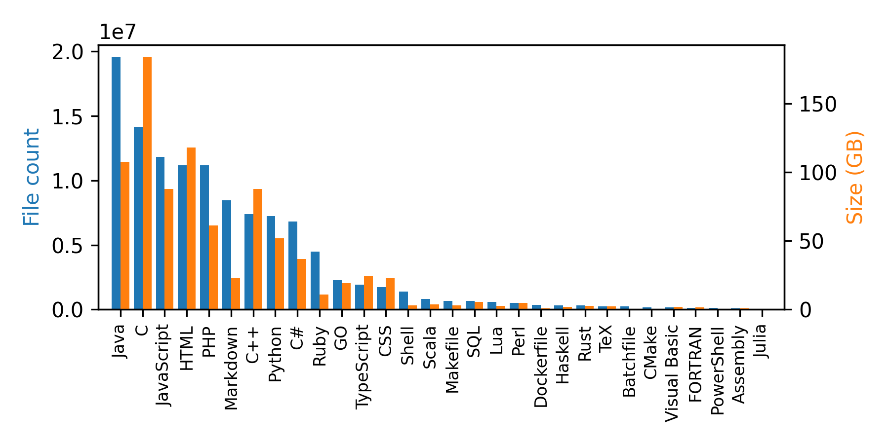

# 代码补全的数据集信息调研

时间：2022-07-20

### 目录：

- [1、codeparrot/github-code](https://huggingface.co/datasets/codeparrot/github-code)
- [2、code_contests](https://github.com/deepmind/code_contests)
- [3、The Pile](https://huggingface.co/datasets/the_pile)

- [4、code_search_net](https://huggingface.co/datasets/code_search_net)

- [5、APPS](https://github.com/hendrycks/apps)  (benchmarks )

- [6、MBPP](https://github.com/google-research/google-research/tree/master/mbpp)  (benchmarks )

- [7、facebook/incoder-6B](https://huggingface.co/facebook/incoder-6B)

- [8、openai_humanval](https://huggingface.co/datasets/openai_humaneval)

- [9、codeparrot/codeparrot-clean](https://huggingface.co/datasets/codeparrot/codeparrot-clean)


## [1、codeparrot/github-code](https://huggingface.co/datasets/codeparrot/github-code)

- 数据集描述

  GitHub代码数据集由来自GitHub的1.15亿个代码文件组成，这些文件有32种编程语言和60个扩展名，总共有1TB的数据。该数据集是由谷歌BiqQuery上的公共GitHub数据集创建的。

- 如何使用它

  GitHub Code 数据集是一个非常大的数据集，因此对于大多数用例，建议使用数据集的流式 API。您可以使用以下两行代码加载和迭代数据集：

  ```python
  from datasets import load_dataset
  
  ds = load_dataset("codeparrot/github-code", streaming=True, split='train')
  print(next(iter(ds)))
  
  #OUTPUT:
  {
   'code': "import mod189 from './mod189';\nvar value=mod189+1;\nexport default value;\n",
   'repo_name': 'MirekSz/webpack-es6-ts',
   'path': 'app/mods/mod190.js',
   'language': 'JavaScript',
   'license': 'isc',
   'size': 73
  }
  ```

  你可以看到，除了代码、 repo名称和路径之外，编程语言、许可证和文件的大小也是数据集的一部分。你也可以过滤数据集中的30种语言（见下面的完整列表）的任何子集。只要把语言列表作为一个列表传过去。例如，如果你的梦想是为Dockerfiles建立一个Codex模型，请使用以下配置。

  ```python
  ds = load_dataset("codeparrot/github-code", streaming=True, split="train", languages=["Dockerfile"])
  print(next(iter(ds))["code"])
  
  #OUTPUT:
  """\
  FROM rockyluke/ubuntu:precise
  
  ENV DEBIAN_FRONTEND="noninteractive" \
      TZ="Europe/Amsterdam"
  ...
  """
  ```

  我们还可以访问一个文件的原始版本的许可证，所以我们可以用过滤语言的同样方法来过滤许可证。

  ```python
  ds = load_dataset("codeparrot/github-code", streaming=True, split="train", licenses=["mit", "isc"])
  
  licenses = []
  for element in iter(ds).take(10_000):
      licenses.append(element["license"])
  print(Counter(licenses))
  
  #OUTPUT:
  Counter({'mit': 9896, 'isc': 104})
  ```

  当然，你也可以下载完整的数据集。请注意，这将下载~300GB的压缩文本数据，未压缩的数据集将占用~1TB的存储空间：

  ```python
  ds = load_dataset("codeparrot/github-code", split="train")
  ```

- Data Structure

  - Data Instances

    ```json
    {
     'code': "import mod189 from './mod189';\nvar value=mod189+1;\nexport default value;\n",
     'repo_name': 'MirekSz/webpack-es6-ts',
     'path': 'app/mods/mod190.js',
     'language': 'JavaScript',
     'license': 'isc',
     'size': 73
    }
    ```

  - Data Fields

    | Field     | Type   | Description                                   |
    | --------- | ------ | --------------------------------------------- |
    | code      | string | content of source file                        |
    | repo_name | string | name of the GitHub repository                 |
    | path      | string | path of file in GitHub repository             |
    | language  | string | programming language as inferred by extension |
    | license   | string | license of GitHub repository                  |
    | size      | int    | size of source file in bytes                  |

  - Data Splits

    该数据集只包含一个训练分割。

  - Languages

    该数据集包含 30 种编程语言和 60 多个扩展：

    ```json
    {
        "Assembly": [".asm"],
        "Batchfile": [".bat", ".cmd"],
        "C": [".c", ".h"],
        "C#": [".cs"],
        "C++": [".cpp", ".hpp", ".c++", ".h++", ".cc", ".hh", ".C", ".H"],
        "CMake": [".cmake"],
        "CSS": [".css"],
        "Dockerfile": [".dockerfile", "Dockerfile"],
        "FORTRAN": ['.f90', '.f', '.f03', '.f08', '.f77', '.f95', '.for', '.fpp'],
        "GO": [".go"],
        "Haskell": [".hs"],
        "HTML":[".html"],
        "Java": [".java"],
        "JavaScript": [".js"],
        "Julia": [".jl"],
        "Lua": [".lua"],
        "Makefile": ["Makefile"],
        "Markdown": [".md", ".markdown"],
        "PHP": [".php", ".php3", ".php4", ".php5", ".phps", ".phpt"],
        "Perl": [".pl", ".pm", ".pod", ".perl"],
        "PowerShell": ['.ps1', '.psd1', '.psm1'],
        "Python": [".py"],
        "Ruby": [".rb"],
        "Rust": [".rs"],
        "SQL": [".sql"],
        "Scala": [".scala"],
        "Shell": [".sh", ".bash", ".command", ".zsh"],
        "TypeScript": [".ts", ".tsx"],
        "TeX": [".tex"],
        "Visual Basic": [".vb"]
    }
    ```

  - Licenses

    每个例子都标明了相关资源库的许可证。总共有15个许可证。

    ```python
    [
      'mit',
      'apache-2.0',
      'gpl-3.0',
      'gpl-2.0',
      'bsd-3-clause',
      'agpl-3.0',
      'lgpl-3.0',
      'lgpl-2.1',
      'bsd-2-clause',
      'cc0-1.0',
      'epl-1.0',
      'mpl-2.0',
      'unlicense',
      'isc',
      'artistic-2.0'
     ]
    
    ```

- Dataset Statistics

  该数据集包含 115M 个文件，所有源代码文件大小的总和为 873 GB（请注意，由于额外的字段，数据集的大小更大）。下表中给出了每种语言的细分：

  

  

  |      |   Language   | File Count | **Size (GB)** |
  | :--: | :----------: | :--------: | :-----------: |
  |  0   |     Java     |  19548190  |    107.70     |
  |  1   |      C       |  14143113  |    183.83     |
  |  2   |  JavaScript  |  11839883  |     87.82     |
  |  3   |     HTML     |  11178557  |    118.12     |
  |  4   |     PHP      |  11177610  |     61.41     |
  |  5   |   Markdown   |  8464626   |     23.09     |
  |  6   |     C++      |  7380520   |     87.73     |
  |  7   |    Python    |  7226626   |     52.03     |
  |  8   |      C#      |  6811652   |     36.83     |
  |  9   |     Ruby     |  4473331   |     10.95     |
  |  10  |      GO      |  2265436   |     19.28     |
  |  11  |  TypeScript  |  1940406   |     24.59     |
  |  12  |     CSS      |  1734406   |     22.67     |
  |  13  |    Shell     |  1385648   |     3.01      |
  |  14  |    Scala     |   835755   |     3.87      |
  |  15  |   Makefile   |   679430   |     2.92      |
  |  16  |     SQL      |   656671   |     5.67      |
  |  17  |     Lua      |   578554   |     2.81      |
  |  18  |     Perl     |   497949   |     4.70      |
  |  19  |  Dockerfile  |   366505   |     0.71      |
  |  20  |   Haskell    |   340623   |     1.85      |
  |  21  |     Rust     |   322431   |     2.68      |
  |  22  |     TeX      |   251015   |     2.15      |
  |  23  |  Batchfile   |   236945   |      0.7      |
  |  24  |    CMake     |   175282   |     0.54      |
  |  25  | Visual Basic |   155652   |     1.91      |
  |  26  |   FORTRAN    |   142038   |     1.62      |
  |  27  |  PowerShell  |   136846   |     0.69      |
  |  28  |   Assembly   |   82905    |     0.78      |
  |  29  |    Julia     |   58317    |     0.29      |

- Dataset Creation

  数据集的创建分两步：

  1. 具有上述列表中给出的扩展名的文件是从 BigQuery 上的 GitHub 数据集检索的（此处为[完整查询](https://huggingface.co/datasets/codeparrot/github-code/blob/main/query.sql)）。该查询于 2022 年 3 月 16 日下午 6:23:39 UTC+1 执行。
  2. 行数超过1000个字符的文件和重复的文件（完全重复，忽略空白）被删除（完整的预处理脚本在[这里](https://huggingface.co/datasets/codeparrot/github-code/blob/main/github_preprocessing.py)）。

- 使用数据的注意事项

  该数据集由来自各种存储库的源代码组成。因此，它们可能包含有害或有偏见的代码以及密码或用户名等敏感信息。

- Releases

  您可以使用 revision 参数加载任何旧版本的数据集：

  ```python
  ds = load_dataset("codeparrot/github-code", revision="v1.0")
  ```

  - v1.0
    - Initial release of dataset
    - The query was executed on *Feb 14, 2022, 12:03:16 PM UTC+1*
  - v1.1
    - Fix missing Scala/TypeScript
    - Fix deduplication issue with inconsistent Python `hash`
    - The query was executed on *Mar 16, 2022, 6:23:39 PM UTC+1*


## 2、Code_Contests

结论：开源可下载

地址：https://github.com/deepmind/code_contests

CodeContests is a competitive programming dataset for machine-learning. This dataset was used when training [AlphaCode](https://deepmind.com/blog/article/Competitive-programming-with-AlphaCode).

It consists of programming problems, from a variety of sources:

| Site        | URL                                                         | Source                                                       |
| ----------- | ----------------------------------------------------------- | ------------------------------------------------------------ |
| Aizu        | [https://judge.u-aizu.ac.jp](https://judge.u-aizu.ac.jp/)   | [CodeNet](https://github.com/IBM/Project_CodeNet)            |
| AtCoder     | [https://atcoder.jp](https://atcoder.jp/)                   | [CodeNet](https://github.com/IBM/Project_CodeNet)            |
| CodeChef    | [https://www.codechef.com](https://www.codechef.com/)       | [description2code](https://github.com/ethancaballero/description2code) |
| Codeforces  | [https://codeforces.com](https://codeforces.com/)           | [description2code](https://github.com/ethancaballero/description2code) and Codeforces |
| HackerEarth | [https://www.hackerearth.com](https://www.hackerearth.com/) | [description2code](https://github.com/ethancaballero/description2code) |

Problems include test cases in the form of paired inputs and outputs, as well as both correct and incorrect human solutions in a variety of languages.

### **Downloading the dataset**

[Install the Cloud SDK](https://cloud.google.com/sdk/docs/quickstart), which provides the `gsutil` utility. You can then download the full data (~3GiB) with, e.g:

```
gsutil -m cp -r gs://dm-code_contests /tmp
```

The data consists of `ContestProblem` protocol buffers in [Riegeli](https://github.com/google/riegeli) format. See `contest_problem.proto` for the protocol buffer definition and documentation of its fields.

The dataset contains three splits:

| Split      | Filename                                 |
| ---------- | ---------------------------------------- |
| Training   | `code_contests_train.riegeli-*-of-00128` |
| Validation | `code_contests_valid.riegeli`            |
| Test       | `code_contests_test.riegeli`             |

There is example code for iterating over the dataset in C++ (in `print_names.cc`) and Python (in `print_names_and_sources.py`). For example, you can print the source and name of each problem in the validation data by [installing bazel](https://docs.bazel.build/versions/main/install.html) and then running:

```
bazel run -c opt \
  :print_names_and_sources /tmp/dm-code_contests/code_contests_valid.riegeli
```

Or do the same for the training data with the following command (which will print around 13000 lines of output):

```
bazel run -c opt \
  :print_names_and_sources /tmp/dm-code_contests/code_contests_train.riegeli*
```


## 3、The Pile

结论：开源可下载

地址：https://github.com/EleutherAI/the-pile

### The official website for the the Pile is [here](http://pile.eleuther.ai/).

The Pile is a large, diverse, open source language modelling data set that consists of many smaller datasets combined together. The objective is to obtain text from as many modalities as possible to ensure that models trained using The Pile will have much broader generalization abilities.

**This repository is for replicating or making variants of the Pile. IF YOU ARE HERE TO USE THE PILE DATASET, THIS REPO IS PROBABLY NOT WHAT YOU ARE LOOKING FOR. A copy of the Pile can be downloaded [here](https://the-eye.eu/public/AI/pile/).**

| Component                                                    | Raw Size   | Weight | Epochs | Effective Size | Mean Document Size |
| ------------------------------------------------------------ | ---------- | ------ | ------ | -------------- | ------------------ |
| [Pile-CC](https://github.com/leogao2/commoncrawl_downloader) | 227.12 GiB | 18.11% | 1.0    | 227.12 GiB     | 4.33 KiB           |
| [PubMed Central](https://github.com/EleutherAI/pile-pubmedcentral) | 90.27 GiB  | 14.40% | 2.0    | 180.55 GiB     | 30.55 KiB          |
| [Books3](https://twitter.com/theshawwn/status/1320282149329784833) | 100.96 GiB | 12.07% | 1.5    | 151.44 GiB     | 538.36 KiB         |
| [OpenWebText2](https://github.com/EleutherAI/openwebtext2)   | 62.77 GiB  | 10.01% | 2.0    | 125.54 GiB     | 3.85 KiB           |
| [ArXiv](https://gist.github.com/leogao2/e09b64eae3b987925ccf3b86401624c6) | 56.21 GiB  | 8.96%  | 2.0    | 112.42 GiB     | 46.61 KiB          |
| [Github](https://github.com/EleutherAI/github-downloader)    | 95.16 GiB  | 7.59%  | 1.0    | 95.16 GiB      | 5.25 KiB           |
| [FreeLaw](https://github.com/thoppe/The-Pile-FreeLaw)        | 51.15 GiB  | 6.12%  | 1.5    | 76.73 GiB      | 15.06 KiB          |
| [StackExchange](https://github.com/EleutherAI/stackexchange-dataset) | 32.20 GiB  | 5.13%  | 2.0    | 64.39 GiB      | 2.16 KiB           |
| [USPTO Backgrounds](https://github.com/EleutherAI/pile-uspto) | 22.90 GiB  | 3.65%  | 2.0    | 45.81 GiB      | 4.08 KiB           |
| [PubMed Abstracts](https://github.com/thoppe/The-Pile-PubMed) | 19.26 GiB  | 3.07%  | 2.0    | 38.53 GiB      | 1.30 KiB           |
| [Gutenberg (PG-19)](https://github.com/deepmind/pg19)        | 10.88 GiB  | 2.17%  | 2.5    | 27.19 GiB      | 398.73 KiB         |
| [OpenSubtitles](https://github.com/sdtblck/Opensubtitles_dataset) | 12.98 GiB  | 1.55%  | 1.5    | 19.47 GiB      | 30.48 KiB          |
| [Wikipedia (en)](https://github.com/noanabeshima/wikipedia-downloader) | 6.38 GiB   | 1.53%  | 3.0    | 19.13 GiB      | 1.11 KiB           |
| [DM Mathematics](https://github.com/deepmind/mathematics_dataset) | 7.75 GiB   | 1.24%  | 2.0    | 15.49 GiB      | 8.00 KiB           |
| [Ubuntu IRC](https://github.com/EleutherAI/pile-ubuntu-irc)  | 5.52 GiB   | 0.88%  | 2.0    | 11.03 GiB      | 545.48 KiB         |
| [BookCorpus2](https://github.com/shawwn/scrap/blob/master/epub2txt-all) | 6.30 GiB   | 0.75%  | 1.5    | 9.45 GiB       | 369.87 KiB         |
| [EuroParl](https://github.com/thoppe/The-Pile-EuroParl)      | 4.59 GiB   | 0.73%  | 2.0    | 9.17 GiB       | 68.87 KiB          |
| [HackerNews](https://github.com/EleutherAI/hn-scraper)       | 3.90 GiB   | 0.62%  | 2.0    | 7.80 GiB       | 4.92 KiB           |
| [YoutubeSubtitles](https://github.com/sdtblck/youtube_subtitle_dataset) | 3.73 GiB   | 0.60%  | 2.0    | 7.47 GiB       | 22.55 KiB          |
| [PhilPapers](https://github.com/thoppe/The-Pile-PhilPapers)  | 2.38 GiB   | 0.38%  | 2.0    | 4.76 GiB       | 73.37 KiB          |
| [NIH ExPorter](https://github.com/thoppe/The-Pile-NIH-ExPORTER) | 1.89 GiB   | 0.30%  | 2.0    | 3.79 GiB       | 2.11 KiB           |
| [Enron Emails](https://github.com/EleutherAI/pile-enron-emails) | 0.88 GiB   | 0.14%  | 2.0    | 1.76 GiB       | 1.78 KiB           |
| **Total**                                                    |            |        |        | 1254.20 GiB    | 5.91 KiB           |

(Epochs refers to the number of epochs elapsed after 1.2TB)

### **Usage**

Install:

```
pip install -e .
```

### To replicate pile

```
python the_pile/pile.py --interleave_output 30 --using pile_reprod
```

Use the pass 2 script [here](https://github.com/EleutherAI/The-Pile/tree/master/processing_scripts) to complete shuffling.

### Other

To force download all data:

```
python the_pile/pile.py --force_download
```

To generate fasttext training data for CC filtering (OWT2 only):

```
sudo apt install build-essential
python the_pile/pile.py --using owt2 --make_fasttext 
```


## 4、code_search_net

结论：可下载

地址：https://github.com/github/CodeSearchNet

### **Data Acquisition**

If you have run the [setup steps](https://github.com/github/CodeSearchNet#setup) above you will already have the data, and nothing more needs to be done. The data will be available in the `/resources/data` folder of this repository, with [this directory structure](https://github.com/github/CodeSearchNet/blob/master/resources/README.md).

### **Schema & Format**

Data is stored in [jsonlines](http://jsonlines.org/) format. Each line in the uncompressed file represents one example (usually a function with an associated comment). A prettified example of one row is illustrated below.

- **repo:** the owner/repo
- **path:** the full path to the original file
- **func_name:** the function or method name
- **original_string:** the raw string before tokenization or parsing
- **language:** the programming language
- **code:** the part of the `original_string` that is code
- **code_tokens:** tokenized version of `code`
- **docstring:** the top-level comment or docstring, if it exists in the original string
- **docstring_tokens:** tokenized version of `docstring`
- **sha:** this field is not being used [TODO: add note on where this comes from?]
- **partition:** a flag indicating what partition this datum belongs to of {train, valid, test, etc.} This is not used by the model. Instead we rely on directory structure to denote the partition of the data.
- **url:** the url for the code snippet including the line numbers

Code, comments, and docstrings are extracted in a language-specific manner, removing artifacts of that language.

```
{
  'code': 'def get_vid_from_url(url):\n'
          '        """Extracts video ID from URL.\n'
          '        """\n'
          "        return match1(url, r'youtu\\.be/([^?/]+)') or \\\n"
          "          match1(url, r'youtube\\.com/embed/([^/?]+)') or \\\n"
          "          match1(url, r'youtube\\.com/v/([^/?]+)') or \\\n"
          "          match1(url, r'youtube\\.com/watch/([^/?]+)') or \\\n"
          "          parse_query_param(url, 'v') or \\\n"
          "          parse_query_param(parse_query_param(url, 'u'), 'v')",
  'code_tokens': ['def',
                  'get_vid_from_url',
                  '(',
                  'url',
                  ')',
                  ':',
                  'return',
                  'match1',
                  '(',
                  'url',
                  ',',
                  "r'youtu\\.be/([^?/]+)'",
                  ')',
                  'or',
                  'match1',
                  '(',
                  'url',
                  ',',
                  "r'youtube\\.com/embed/([^/?]+)'",
                  ')',
                  'or',
                  'match1',
                  '(',
                  'url',
                  ',',
                  "r'youtube\\.com/v/([^/?]+)'",
                  ')',
                  'or',
                  'match1',
                  '(',
                  'url',
                  ',',
                  "r'youtube\\.com/watch/([^/?]+)'",
                  ')',
                  'or',
                  'parse_query_param',
                  '(',
                  'url',
                  ',',
                  "'v'",
                  ')',
                  'or',
                  'parse_query_param',
                  '(',
                  'parse_query_param',
                  '(',
                  'url',
                  ',',
                  "'u'",
                  ')',
                  ',',
                  "'v'",
                  ')'],
  'docstring': 'Extracts video ID from URL.',
  'docstring_tokens': ['Extracts', 'video', 'ID', 'from', 'URL', '.'],
  'func_name': 'YouTube.get_vid_from_url',
  'language': 'python',
  'original_string': 'def get_vid_from_url(url):\n'
                      '        """Extracts video ID from URL.\n'
                      '        """\n'
                      "        return match1(url, r'youtu\\.be/([^?/]+)') or \\\n"
                      "          match1(url, r'youtube\\.com/embed/([^/?]+)') or "
                      '\\\n'
                      "          match1(url, r'youtube\\.com/v/([^/?]+)') or \\\n"
                      "          match1(url, r'youtube\\.com/watch/([^/?]+)') or "
                      '\\\n'
                      "          parse_query_param(url, 'v') or \\\n"
                      "          parse_query_param(parse_query_param(url, 'u'), "
                      "'v')",
  'partition': 'test',
  'path': 'src/you_get/extractors/youtube.py',
  'repo': 'soimort/you-get',
  'sha': 'b746ac01c9f39de94cac2d56f665285b0523b974',
  'url': 'https://github.com/soimort/you-get/blob/b746ac01c9f39de94cac2d56f665285b0523b974/src/you_get/extractors/youtube.py#L135-L143'
}
```

Summary statistics such as row counts and token length histograms can be found in [this notebook](https://github.com/github/CodeSearchNet/blob/master/notebooks/ExploreData.ipynb)

### **Downloading Data from S3**

The shell script `/script/setup` will automatically download these files into the `/resources/data` directory. Here are the links to the relevant files for visibility:

The s3 links follow this pattern:

> https://s3.amazonaws.com/code-search-net/CodeSearchNet/v2/{python,java,go,php,javascript,ruby}.zip

For example, the link for the `java` is:

> https://s3.amazonaws.com/code-search-net/CodeSearchNet/v2/java.zip

The size of the dataset is approximately 20 GB. The various files and the directory structure are explained [here](https://github.com/github/CodeSearchNet/blob/master/resources/README.md).


## 5、APPS(Automated Programming Progress Standard --NeurIPS 2021)

结论：可下载

地址：https://github.com/hendrycks/apps

### **Measuring Coding Challenge Competence With APPS**

This is the repository for [Measuring Coding Challenge Competence With APPS](https://arxiv.org/pdf/2105.09938) by [Dan Hendrycks*](https://danhendrycks.com/), [Steven Basart*](https://stevenbas.art/), [Saurav Kadavath](http://www.sauravkadavath.com/), Mantas Mazeika, [Akul Arora](https://github.com/akulaarora), Ethan Guo, [Collin Burns](http://collinpburns.com/), Samir Puranik, [Horace He](http://horace.io/), [Dawn Song](https://people.eecs.berkeley.edu/~dawnsong/), and [Jacob Steinhardt](https://www.stat.berkeley.edu/~jsteinhardt/).

Download the [**APPS dataset here**](https://people.eecs.berkeley.edu/~hendrycks/APPS.tar.gz). (~1.3GB)

This repository contains both training and evaluation code.

Fine-tuned GPT-2 1.5B and GPT-Neo 2.7B weights are available [here](https://drive.google.com/file/d/1XW1Od9L-5l9zXl1HUCyER5pS9zQTbIvU/view?usp=sharing).

For other benchmarks of enormous Transformers, see a dataset which tests ability in [competition math](https://github.com/hendrycks/math), a dataset which tests knowledge of [ethics](https://github.com/hendrycks/ethics), and [a dataset spanning 50+ academic subjects](https://github.com/hendrycks/test).

### **How to Use**

The training instructions are specified in [train/README](https://github.com/hendrycks/apps/blob/main/apps/train/README.md) and similarly the evaluation instructions are specified in [eval/README](https://github.com/hendrycks/apps/blob/main/apps/eval/README.md).

### Hugging Face

The dataset is also available in [Hugging Face datasets](https://huggingface.co/datasets/codeparrot/apps) under apps.


## 6、MBPP

地址：https://github.com/google-research/google-research/tree/master/mbpp

下载地址：https://huggingface.co/datasets/mbpp

### **Mostly Basic Python Problems Dataset**

The benchmark consists of around 1,000 crowd-sourced Python programming problems, designed to be solvable by entry level programmers, covering programming fundamentals, standard library functionality, and so on. Each problem consists of a task description, code solution and 3 automated test cases.

As described in the paper, a subset of the data has been hand-verified by us. This data is `sanitized-mbpp.json`.

The dataset is in a .jsonl format (json per line).

Released as part of Program Synthesis with Large Language Models, Austin et. al., 2021.

### **Evaluation Details**

We specify a train and test split to use for evaluation. Specifically:

- Task IDs 11-510 are used for evaluation.
- Task IDs 1-10 and 511-1000 are used for training and/or prompting. We typically used 1-10 for few-shot prompting, although you can feel free to use any of the training examples.

In the paper "Program Synthesis with Large Language Models", Austin et al. 2021, we used three-shot prompts with task_ids 2, 3, and 4 for few-shot prompts. Our prompts had the format：

```tex
You are an expert Python programmer, and here is your task: {prompt} Your code should pass these tests:\n\n{tests}\n[BEGIN]\n{code}\n[DONE]
```

where the [BEGIN] and [DONE] tokens were used to delimit the model solution.


## 7、facebook/incoder-6B

地址：https://huggingface.co/facebook/incoder-6B

A 6B parameter decoder-only Transformer model trained on code using a causal-masked objective, which allows inserting/infilling code as well as standard left-to-right generation.

The model was trained on public open-source repositories with a permissive, non-copyleft, license (Apache 2.0, MIT, BSD-2 or BSD-3) from GitHub and GitLab, as well as StackOverflow. Repositories primarily contained Python and JavaScript, but also include code from 28 languages, as well as StackOverflow.

For more information, see our:

- [Demo](https://huggingface.co/spaces/facebook/incoder-demo)
- [Project site](https://sites.google.com/view/incoder-code-models)
- [Examples](https://sites.google.com/view/incoder-code-models/home/examples)
- [Paper](https://arxiv.org/abs/2204.05999)

A smaller, 1B, parameter model is also available at [facebook/incoder-1B](https://huggingface.co/facebook/incoder-1B).

### **Requirements**

`pytorch`, `tokenizers`, and `transformers`. Our model requires HF's tokenizers >= 0.12.1, due to changes in the pretokenizer.

```
pip install torch
pip install "tokenizers>=0.12.1"
pip install transformers
```


### **Usage**

See https://github.com/dpfried/incoder for example code.

This 6B model comes in two versions: with weights in full-precision (float32, stored on branch `main`) and weights in half-precision (float16, stored on branch `float16`). The versions can be loaded as follows:

*Full-precision* (float32): This should be used if you are fine-tuning the model (note: this will take a lot of GPU memory, probably multiple GPUs, and we have not tried training the model in `transformers` --- it was trained in Fairseq). Load with:

```
model = AutoModelForCausalLM.from_pretrained("facebook/incoder-6B")
```

*Half-precision* (float16): This can be used if you are only doing inference (i.e. generating from the model). It will use less GPU memory, and less RAM when loading the model. With this version it should be able to perform inference on a 16 GB GPU (with a batch size of 1, to sequence lengths of at least 256). Load with:

```
model = AutoModelForCausalLM.from_pretrained("facebook/incoder-6B", revision="float16", torch_dtype=torch.float16, low_cpu_mem_usage=True)
```

### Tokenizer

```
tokenizer = AutoTokenizer.from_pretrained("facebook/incoder-6B")
```

Note: the incoder-1B and incoder-6B tokenizers are identical, so 'facebook/incoder-1B' could also be used.

When calling `tokenizer.decode`, it's important to pass `clean_up_tokenization_spaces=False` to avoid removing spaces after punctuation:

```
tokenizer.decode(tokenizer.encode("from ."), clean_up_tokenization_spaces=False)
```

(Note: encoding prepends the `<|endoftext|>` token, as this marks the start of a document to our model. This token can be removed from the decoded output by passing `skip_special_tokens=True` to `tokenizer.decode`.)


## 8、openai_humanval -- Dataset Card for OpenAI HumanEval

地址： https://huggingface.co/datasets/openai_humaneval

### Dataset Summary

The HumanEval dataset released by OpenAI includes 164 programming problems with a function sig- nature, docstring, body, and several unit tests. They were handwritten to ensure not to be included in the training set of code generation models.

### Supported Tasks and Leaderboards

The programming problems are written in Python and contain English natural text in comments and docstrings.

### Dataset Structure

```python
from datasets import load_dataset
load_dataset("openai_humaneval")

DatasetDict({
    test: Dataset({
        features: ['task_id', 'prompt', 'canonical_solution', 'test', 'entry_point'],
        num_rows: 164
    })
})
```


### Data Instances

An example of a dataset instance:

```
{
    "task_id": "test/0",
    "prompt": "def return1():\n",
    "canonical_solution": "    return 1",
    "test": "def check(candidate):\n    assert candidate() == 1",
    "entry_point": "return1"
}
```


### Data Fields

- `task_id`: identifier for the data sample
- `prompt`: input for the model containing function header and docstrings
- `canonical_solution`: solution for the problem in the `prompt`
- `test`: contains function to test generated code for correctness
- `entry_point`: entry point for test

### Data Splits

The dataset only consists of a test split with 164 samples.

### Curation Rationale

Since code generation models are often trained on dumps of GitHub a dataset not included in the dump was necessary to properly evaluate the model. However, since this dataset was published on GitHub it is likely to be included in future dumps.

### Source Data

The dataset was handcrafted by engineers and researchers at OpenAI.


## 9、codeparrot/codeparrot-clean

地址：https://huggingface.co/datasets/codeparrot/codeparrot-clean

### CodeParrot 🦜 Dataset Cleaned

**What is it?**

A dataset of Python files from Github. This is the deduplicated version of the [codeparrot](https://huggingface.co/datasets/transformersbook/codeparrot).

**Processing**

The original dataset contains a lot of duplicated and noisy data. Therefore, the dataset was cleaned with the following steps:

- Deduplication
  - Remove exact matches
- Filtering
  - Average line length < 100
  - Maximum line length < 1000
  - Alpha numeric characters fraction > 0.25
  - Remove auto-generated files (keyword search)

For more details see the preprocessing script in the transformers repository [here](https://github.com/huggingface/transformers/tree/master/examples/research_projects/codeparrot).

**Splits**

The dataset is split in a [train](https://huggingface.co/datasets/codeparrot/codeparrot-clean-train) and [validation](https://huggingface.co/datasets/codeparrot/codeparrot-clean-valid) split used for training and evaluation.

```json
{
    "repo_name": "ahmedbodi\/AutobahnPython",
    "path": "examples\/asyncio\/websocket\/echo\/client_coroutines.py",
    "copies": "13",
    "size": "2044",
    "content": "###############################################################################\n##\n##  Copyright (C) 2013-2014 Tavendo GmbH\n##\n##  Licensed under the Apache License, Version 2.0 (the \"License\");\n##  you may not use this file except in compliance with the License.\n##  You may obtain a copy of the License at\n##\n##      http:\/\/www.apache.org\/licenses\/LICENSE-2.0\n##\n##  Unless required by applicable law or agreed to in writing, software\n##  distributed under the License is distributed on an \"AS IS\" BASIS,\n##  WITHOUT WARRANTIES OR CONDITIONS OF ANY KIND, either express or implied.\n##  See the License for the specific language governing permissions and\n##  limitations under the License.\n##\n###############################################################################\n\nfrom autobahn.asyncio.websocket import WebSocketClientProtocol, \\\n                                       WebSocketClientFactory\n\nimport asyncio\n\n\n\nclass MyClientProtocol(WebSocketClientProtocol):\n\n   def onConnect(self, response):\n      print(\"Server connected: {0}\".format(response.peer))\n\n   @asyncio.coroutine\n   def onOpen(self):\n      print(\"WebSocket connection open.\")\n\n      ## start sending messages every second ..\n      while True:\n         self.sendMessage(u\"Hello, world!\".encode('utf8'))\n         self.sendMessage(b\"\\x00\\x01\\x03\\x04\", isBinary = True)\n         yield from asyncio.sleep(1)\n\n   def onMessage(self, payload, isBinary):\n      if isBinary:\n         print(\"Binary message received: {0} bytes\".format(len(payload)))\n      else:\n         print(\"Text message received: {0}\".format(payload.decode('utf8')))\n\n   def onClose(self, wasClean, code, reason):\n      print(\"WebSocket connection closed: {0}\".format(reason))\n\n\n\nif __name__ == '__main__':\n\n   import asyncio\n\n   factory = WebSocketClientFactory(\"ws:\/\/localhost:9000\", debug = False)\n   factory.protocol = MyClientProtocol\n\n   loop = asyncio.get_event_loop()\n   coro = loop.create_connection(factory, '127.0.0.1', 9000)\n   loop.run_until_complete(coro)\n   loop.run_forever()\n   loop.close()\n",
    "license": "apache-2.0",
    "hash": 7822061744094950801,
    "line_mean": 31.4444444444,
    "line_max": 79,
    "alpha_frac": 0.6232876712,
    "autogenerated": false
}

{
    "repo_name": "ifduyue\/django",
    "path": "django\/core\/checks\/registry.py",
    "copies": "13",
    "size": "3108",
    "content": "from itertools import chain\n\nfrom django.utils.itercompat import is_iterable\n\n\nclass Tags:\n    \"\"\"\n    Built-in tags for internal checks.\n    \"\"\"\n    admin = 'admin'\n    caches = 'caches'\n    compatibility = 'compatibility'\n    database = 'database'\n    models = 'models'\n    security = 'security'\n    signals = 'signals'\n    templates = 'templates'\n    urls = 'urls'\n\n\nclass CheckRegistry:\n\n    def __init__(self):\n        self.registered_checks = set()\n        self.deployment_checks = set()\n\n    def register(self, check=None, *tags, **kwargs):\n        \"\"\"\n        Can be used as a function or a decorator. Register given function\n        `f` labeled with given `tags`. The function should receive **kwargs\n        and return list of Errors and Warnings.\n\n        Example::\n\n            registry = CheckRegistry()\n            @registry.register('mytag', 'anothertag')\n            def my_check(apps, **kwargs):\n                # ... perform checks and collect `errors` ...\n                return errors\n            # or\n            registry.register(my_check, 'mytag', 'anothertag')\n        \"\"\"\n        kwargs.setdefault('deploy', False)\n\n        def inner(check):\n            check.tags = tags\n            checks = self.deployment_checks if kwargs['deploy'] else self.registered_checks\n            checks.add(check)\n            return check\n\n        if callable(check):\n            return inner(check)\n        else:\n            if check:\n                tags += (check, )\n            return inner\n\n    def run_checks(self, app_configs=None, tags=None, include_deployment_checks=False):\n        \"\"\"\n        Run all registered checks and return list of Errors and Warnings.\n        \"\"\"\n        errors = []\n        checks = self.get_checks(include_deployment_checks)\n\n        if tags is not None:\n            checks = [check for check in checks if not set(check.tags).isdisjoint(tags)]\n        else:\n            # By default, 'database'-tagged checks are not run as they do more\n            # than mere static code analysis.\n            checks = [check for check in checks if Tags.database not in check.tags]\n\n        for check in checks:\n            new_errors = check(app_configs=app_configs)\n            assert is_iterable(new_errors), (\n                \"The function %r did not return a list. All functions registered \"\n                \"with the checks registry must return a list.\" % check)\n            errors.extend(new_errors)\n        return errors\n\n    def tag_exists(self, tag, include_deployment_checks=False):\n        return tag in self.tags_available(include_deployment_checks)\n\n    def tags_available(self, deployment_checks=False):\n        return set(chain.from_iterable(\n            check.tags for check in self.get_checks(deployment_checks)\n        ))\n\n    def get_checks(self, include_deployment_checks=False):\n        checks = list(self.registered_checks)\n        if include_deployment_checks:\n            checks.extend(self.deployment_checks)\n        return checks\n\n\nregistry = CheckRegistry()\nregister = registry.register\nrun_checks = registry.run_checks\ntag_exists = registry.tag_exists\n",
    "license": "bsd-3-clause",
    "hash": -2035686896372967697,
    "line_mean": 30.7142857143,
    "line_max": 91,
    "alpha_frac": 0.6023166023,
    "autogenerated": false
}
```

拆解其中的一个py文件进行分析：

```python
from itertools import chain

from django.utils.itercompat import is_iterable


class Tags:
    """
    Built-in tags for internal checks.
    """
    admin = 'admin'
    caches = 'caches'
    compatibility = 'compatibility'
    database = 'database'
    models = 'models'
    security = 'security'
    signals = 'signals'
    templates = 'templates'
    urls = 'urls'


class CheckRegistry:

    def __init__(self):
        self.registered_checks = set()
        self.deployment_checks = set()

    def register(self, check=None, *tags, **kwargs):
        """
        Can be used as a function or a decorator. Register given function
        `f` labeled with given `tags`. The function should receive **kwargs
        and return list of Errors and Warnings.

        Example::

            registry = CheckRegistry()
            @registry.register('mytag', 'anothertag')
            def my_check(apps, **kwargs):
                # ... perform checks and collect `errors` ...
                return errors
            # or
            registry.register(my_check, 'mytag', 'anothertag')
        """
        kwargs.setdefault('deploy', False)

        def inner(check):
            check.tags = tags
            checks = self.deployment_checks if kwargs['deploy'] else self.registered_checks
            checks.add(check)
            return check

        if callable(check):
            return inner(check)
        else:
            if check:
                tags += (check, )
            return inner

    def run_checks(self, app_configs=None, tags=None, include_deployment_checks=False):
        """
        Run all registered checks and return list of Errors and Warnings.
        """
        errors = []
        checks = self.get_checks(include_deployment_checks)

        if tags is not None:
            checks = [check for check in checks if not set(check.tags).isdisjoint(tags)]
        else:
            # By default, 'database'-tagged checks are not run as they do more
            # than mere static code analysis.
            checks = [check for check in checks if Tags.database not in check.tags]

        for check in checks:
            new_errors = check(app_configs=app_configs)
            assert is_iterable(new_errors), (
                "The function %r did not return a list. All functions registered "
                "with the checks registry must return a list." % check)
            errors.extend(new_errors)
        return errors

    def tag_exists(self, tag, include_deployment_checks=False):
        return tag in self.tags_available(include_deployment_checks)

    def tags_available(self, deployment_checks=False):
        return set(chain.from_iterable(
            check.tags for check in self.get_checks(deployment_checks)
        ))

    def get_checks(self, include_deployment_checks=False):
        checks = list(self.registered_checks)
        if include_deployment_checks:
            checks.extend(self.deployment_checks)
        return checks


registry = CheckRegistry()
register = registry.register
run_checks = registry.run_checks
tag_exists = registry.tag_exists
```

