# CERT:  Continual Pre-Training on Sketches for Library-Oriented Code Generation

# 面向库的代码生成草图的持续预训练

## 摘要

代码生成是一个长期存在的挑战，旨在生成基于自然语言描述的代码片段。通常，昂贵的文本代码配对数据对于训练代码生成模型至关重要。最近，由于预训练技术的成功，大型语言模型在大规模未标记代码语料库上进行了训练，并且在代码生成方面表现良好。在本文中，我们研究了如何利用未标记的代码语料库来训练面向库的代码生成模型。由于程序员重用第三方库是一种常见的做法，在这种情况下，由于库数量庞大，很难获得文本代码配对数据。我们观察到面向库的代码片段更有可能共享相似的代码草图。因此，我们通过两个步骤呈现 CERT：草图生成器生成草图，然后生成器填充草图中的细节。草绘器和生成器都在使用未标记数据的基础模型上不断进行预训练。此外，我们制作了两个名为 PandasEval 和 NumpyEval 的基准来评估面向库的代码生成。实验结果证明了 CERT 令人印象深刻的性能。例如，它在 PandasEval 上的 pass@1 方面超过了基本模型，绝对提升了 15.67%。我们的工作可在 https://github.com/microsoft/PyCodeGPT 找到。

## 1、Introduction

代码生成，旨在为给定的自然语言描述生成一个代码片段，是人工智能界的一个长期挑战。通常情况下，**为了训练具有良好性能的代码生成模型，大量的代码片段与自然语言描述配对是必不可少的**[Sun等人，2019；Lu等人，2021]。然而，对这样的数据集进行注释是昂贵而耗时的。为了缓解这个问题，受GPT-3强大的零点自然语言生成能力的启发[Brown等人，2021]，近年来出现了一种趋势，即**使用大规模的代码语料库（如GitHub）训练大型语言模型，并期望这些模型能够直接在代码生成任务上很好地工作，而无需在昂贵的文本-代码对上进行微调**。例如，Codex显示，一个12B参数的语言模型可以解决28.8%的独立Python编程问题。

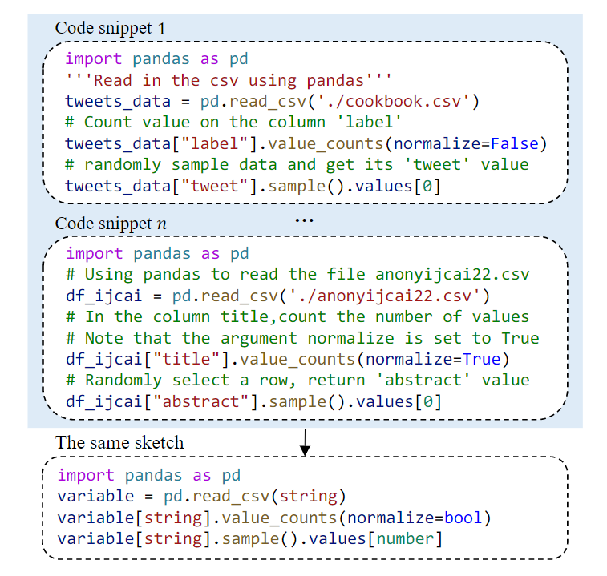

Figure 1. Python 中的一个示例：使用 Pandas 的多个代码片段在匿名用户定义的术语后可能具有相同的草图。 

在本文中，我们重点研究了在代码语料库上预训练的语言模型（没有经过配对标记数据的微调）是否以及如何生成面向库的代码片段而不是独立的代码片段。在软件开发过程中，程序员重用第三方库（如Pandas和NumPy）来实现所需功能是一种常见的做法。对于程序员来说，学习如何正确使用这些库并不容易。例如，根据我们的统计，超过40%的带有 "Python "标签的StackOverflow问题也至少有一个库标签。此外，对于面向库的代码生成，提出了在没有成对标记数据的情况下训练模型的必要性，因为程序员通常需要在不同的场景中重复使用不同的库，而为涵盖大多数这些库的足够的文本-代码对进行标记是非常昂贵的。

与独立的代码片断相比，面向库的代码片断更有可能共享类似的草图。草图是对代码中的用户定义术语（如变量名、方法名、常量等）进行匿名化处理后的代码结构，在之前关于软体数据挖掘的研究中也被认定为一种API使用模式[Zhong等人，2009；Wang等人，2013；Niu等人，2017]。图1中显示了一个例子。在对变量和常量进行匿名化处理后，使用Pandas APIs的多个代码片断可能具有相同（或类似）的草图。基于这一观察，改善面向库的代码生成的一个自然想法是将这一任务分解为两个子任务：生成草图，然后填写细节。在不同的代码生成任务中，已经提出了许多基于这一想法的方法（例如，Coarse-to-Fine [Dong and Lapata, 2018] 和 PLOTCODER [Chen et al., 2021b]），并表明这一想法可以有效地提高生成的代码片段的质量。然而，这些方法都是针对微调过程而提出的，在微调过程中，需要高质量的文本-代码对来得出两步生成的监督信号。因此，在我们没有提供成对标记数据的情况下，出现了一个研究问题：如何利用草图的洞察力来加强对无标记代码体的语言模型预训练，从而提高生成的面向图书馆的代码片段的质量？

为了应对这一挑战，本文提出了CERT（针对sketCher和gEneRaTor），这是一种针对面向库的代码生成的草图的持续预训练方法。在CERT中，一个草图绘制者首先专注于预测草图，其中省略了用户定义的细节；然后，生成器将草图作为提示，生成完整的代码。草图绘制者和生成器都是基于代码的基础语言模型不断进行预训练的，使用的是未标记的代码体，而不是成对标记的数据。此外，我们为Python库设计了两个评估基准，称为PandasEval和NumpyEval，每个基准包括101个分别使用Pandas和NumPy的编程问题。我们对CERT进行了广泛的实验。结果表明，CERT在面向库的代码生成方面有很好的性能。我们通过彻底的分析进一步得出了一些见解。

## 2、Task Formulation

在深入研究我们提出的方法的细节之前，我们先对任务进行正式描述。**代码生成是为了解决一个编程问题：根据上下文生成目标代码**。上下文包含代码注释形式的自然语言问题描述，以及包括导入、函数头和变量定义等语句的代码片断；目标代码是解决上文中描述的编程问题的代码片断。例如，让 $\mathbf{x}=\left(x_{1}, x_{2}, \cdots, x_{N}\right)$ 表示上下文，其中每个 $x_n$可以是一个代码标记或一个自然语言token。给定 $x$ ，代码生成模型可以表述为 $\mathbf{y}=\mathcal{M}(\mathbf{x})$，其中 $\mathbf{y}=\left(y_{1}, y_{2}, \cdots, y_{M}\right)$ 表示目标代码，每个 $y_m$是一个代码标记。

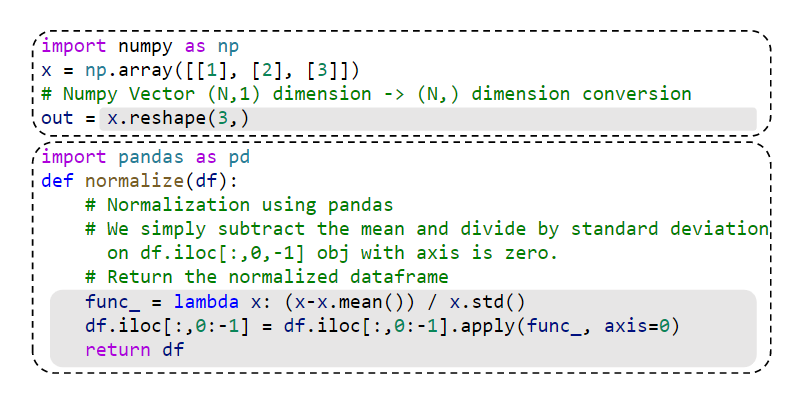

Figure 2: PandasEval 和 NumpyEval 基准测试中的两个编程问题示例。上下文以白色背景显示，目标代码以灰色背景显示。 

对于独立的代码生成，编程问题有望通过一个代码片段来解决，而无需使用第三方库；相反，对于面向库的代码生成，目标代码 $y$ 包含库的API调用。图2中可以找到两个面向库的编程问题的例子。请注意，仔细标记的上下文和代码对对于模型的微调是必不可少的，而我们提出的方法只需要对未标记的代码体进行持续的预训练。

## 3、Mechodology

在本节中，我们将介绍我们的基础模型，然后是我们提出的 CERT 方法的详细信息。

### 3.1、**Base Model** 

Codex [Chen et al., 2021a] 是一个里程碑式的预训练模型，可以生成体面的代码，但尚未公开发布。已经进行了几次尝试来重现 Codex 强大的代码生成能力，例如 CodeClippy2 和 CodeParrot，但它们在 Python 中的性能并不令人满意。为此，我们提出了 PYCODEGPT，这是一种预训练的语言模型，它能够生成非常好的独立 Python 代码，例如，在 HumanEval [Chen et al., 2021a] 上实现了 8.33% 的 pass@1。特别是，PYCODEGPT 是基于 GPT-Neo [Black et al., 2021] 的 110M 参数模型。我们收集了 60.6M 原始 python 文件，总大小为 330GB。经过一系列的数据预处理策略，如去重python文件、清洗和格式化内容等，最终的预训练语料包含约13.0M的高质量python文件，大小为96GB。PYCODEGPT 在具有 32GB 内存的 16 个 NVIDIA V100 GPU 集群上针对 200K 步和 100B 令牌进行了预训练。预训练时间约为2天。我们总结了使 PY-CODEGPT 强大的三个关键点：1）大量经过仔细清洗的数据用于预训练； 2）一个新训练的分词器，专门用于python； 3）优先考虑高质量数据的重采样策略。除了 PYCODEGPT，我们还将 CODEGEN (MONO 350M) [Nijkamp et al., 2022] 作为我们的基础模型之一，这是迄今为止 HumanEval 上性能最好的公开可用模型。

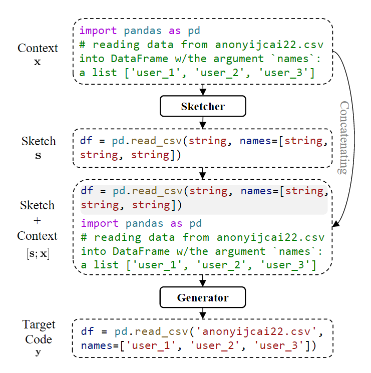

Figure 3:  CERT 概述：草图绘制器和生成器。

### 3.2、**CERT**

如第2节所述，代码生成是基于上下文$ x$ 生成目标代码 $y$ 。由于我们观察到面向库的代码片段更有可能共享相似的草图，我们提出了一种新颖的方法CERT，并将代码生成模型 $\mathcal{M}$ 分解为两个模块：一个草图生成器 $\mathcal{M}_{\mathrm{S}}$ 和一个生成器 $\mathcal{M}_{\mathrm{G}}$。图3显示了CERT的概况和Pandas中的一个具体例子。给定 $x$ 作为输入，sketcher预测 $s$，也就是目标代码 $y$ 的草图。sketcher生成多个候选草图（在我们的实验中为200个），我们选择出现最多的一个。然后，生成器的输入是 $s$ 和 $x$ 的串联。形式上，CERT的过程可以写成 $\mathrm{s}=\mathcal{M}_{\mathrm{S}}(\mathrm{x})$ 和 $\mathbf{y}=\mathcal{M}_{\mathrm{G}}([\mathbf{s} ; \mathbf{x}])$。请注意，如果草图 $s$ 已经是一个完整的代码片段，没有匿名符号，我们直接把它作为最终预测，而不是使用生成器；如果草图 $s$ 是一个空序列，我们直接把 $x$ 输入生成器。

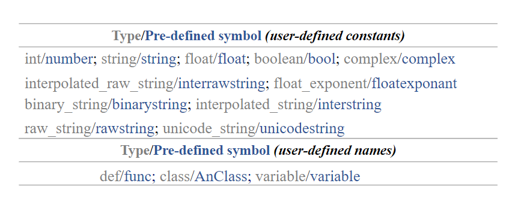

Figure 4:  草绘器中的预定义符号。

我们通过持续的预训练在基础模型（PYCODEGPT或CODEGEN）的基础上建立草图生成器和发电机。首先，我们从整个预训练语料库（第3.1节中提到的13.0M个文件）中提取使用特定库（例如Pandas）的python文件，并得到用D表示的子语料库。

#### **Sketcher**

给定面向库的子语料 $\mathcal{D}$，我们对每个文件 $\mathbf{d} \in \mathcal{D}$ 执行草图操作。图 5 的上半部分显示了一个示例。草图操作用于使用我们的预定义符号对代码文件中的用户定义术语进行匿名化。草图后的文件表示为̄d。我们设计了三种不同类型的草图操作：1）仅匿名化用户定义的常量（默认 CERT）； 2) 只匿名化用户定义的名称，包括函数名、类名和变量名（CERT-N）； 3）匿名用户定义的常量和名称（CERT-NC）。例如，在图 5 中，常量“user 1”使用预定义的符号“string”进行匿名化。预定义符号的详细信息如图 4 所示。然后，我们在草绘后不断地在面向库的语料库上对基础模型进行预训练，得到草绘器模型。预训练目标与基础模型相同。**我们在具有 32GB 内存的 8 个 NVIDIA V100 GPU 集群上对模型进行了 100K 步的预训练**。

#### **Generator**

为了准备生成器的预训练语料库，我们首先将原始文件 $d$ 和草图文 $\overline{\mathrm{d}}$ 拆分为K个block，得到$d = (d_1,d_2,···,d_K)$,  $\overline{\mathbf{d}}=\left(\bar{d}_{1}, \bar{d}_{2}, \cdots, \bar{d}_{K}\right)$。每个块都是一个相对完整的代码片段，例如一个函数或一个类。请注意，在拆分之前，我们从草图文件中删除自然语言代码注 $\overline{\mathrm{d}}$ 。然后，将这两个文件交叉合并得到合并文件 $\hat{\mathbf{d}}=\left(\bar{d}_{1}, d_{1}, \bar{d}_{2}, d_{2}, \cdots, \bar{d}_{K}, d_{K}\right)$。这是为了模拟将草图作为每个块的提示的过程。图 5 的下半部分显示了一个示例。然后，基础模型在所有合并的文件 ^d 上不断进行预训练，我们获得了生成器模型。与草图模型一样，我们不断地预训练 100K 步。

## 4、Benchmark Construction

第三方库在现实中被广泛使用，而评估面向库的代码生成的工作却做得很少。为了应对这一挑战，我们设计了PandasEval和NumpyEval这两个Python中面向库的代码生成的基准测试。基准中的每个样本都是一个由上下文和目标代码组成的编程问题。这些编程问题使用库来解决，其中Pandas代表PandasEval，NumPy代表NumpyEval。这些基准应该是多样化的、真实的、高质量的、适度困难的，并且在预训练中没有见过。

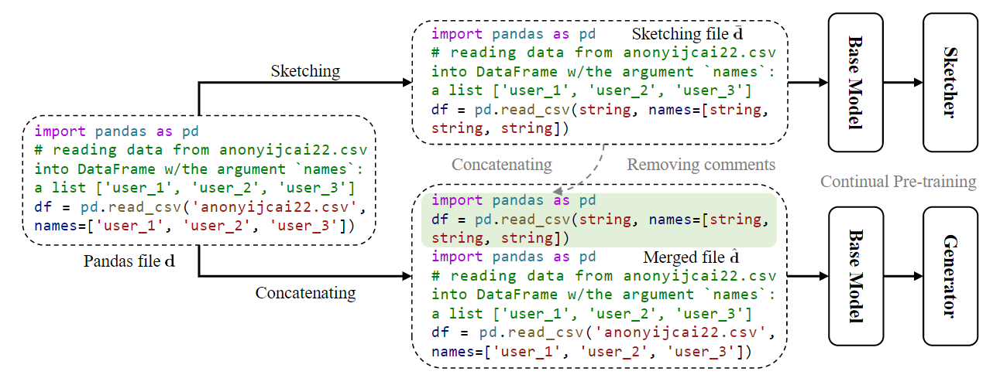

Figure 5:  使用 Pandas 中的示例为草绘器和生成器准备训练数据

为了精心设计使用库的编程问题，我们参考了StackOverflow，一个针对程序员的问答网站。这里有大量由真实用户发布的真实世界的编程问题，这有助于我们提高数据的真实性。具体来说，我们在StackOverflow上搜索使用库标签的帖子，并选择那些具有高票数的帖子。为了保证质量，我们只参考有公认答案的帖子。我们浏览帖子的问题和它所接受的答案，然后将它们手工整理成我们的基准分数所需要的形式，其中包括背景和目标代码。我们还对所有的编程问题进行抛光，以使问题的描述清晰，代码正确。请注意，我们在最大程度上保持了编程问题的意图和描述与职位的一致性。最后，我们邀请两位在图书馆有三年以上编码经验的程序员作为代码生成模型，检查数据的质量。

因此，我们为PandasEval和NumpyEval分别设计了101个编程问题。每个编程问题都配备了用于评估的测试案例。对于函数形式的编程问题，如图2中的底部问题，我们为每个问题创建了20个测试案例。对于其他不包含函数的问题，如图2中的顶部问题，我们提供1个测试用例来检查预测变量的正确性（例如，图2中的out）。总的来说，PandasEval中64%的编程问题和NumpyEval中30%的编程问题都配备了20个测试案例。此外，我们精心设计的编程问题参考了StackOverflow而不是GitHub，还仔细组织和打磨了这些问题，以确保它们不被预先训练的模型所发现。

## 5、Experiments

在本节中，我们在PandasEval和NumpyEval上评估了CERT，以验证其有效性。

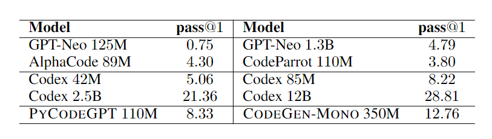

Table 1: 在 HumanEval 基准测试中的 pass@1 (%) 结果。我们省略了 CodeT5 (220M)、CodeGPT-Adapted (124M) 和 CodeClippy (125M) 作为它们的 pass@1 = 0。 

**Evaluation Metrics**

我们使用 *pass@k* 作为指标。当每个问题生成 k 个代码样本时，pass@k 表示正确代码样本的比例。 但是以这种方式计算 pass@k 可能会有很大的差异。因此，我们遵循 Chen 等人[2021a] 为每个问题生成 $n \geq k$ 个代码样本(在我们的实验中 n = 200)并计算正确样本的数量 $c$。 如果 $n-c<k$，则 *pass@k* = 1；否则，*pass@k* $=1-\prod_{i=n-c+1}^{n}(1-k / i)$。 请注意，如果预测代码可以通过所有测试用例，则它是正确的。

**Implementation Details**

我们使用PyTorch[Paszke等人，2019]、HuggingFace的transform- ers库[Wolf等人，2019]和DeepSpeed实现我们的方法。在PYCODEGPT的训练阶段，我们将批次大小设置为10，窗口大小为1024，学习率为5e-4，梯度累积步骤为4，权重衰减为0.1。sketcher和生成器的设置与PYCODEGPT相同。我们使用FP16的混合精度来加速预训练。在推理阶段，我们将温度设置为[0.1,0.2,0.3,0.4,0.5,0.6,0.7,0.8,0.9,1.0]其中之一。在上述各种超参数中，报告了最佳性能。

### 5.1、Main Results

在评估CERT之前，我们想在HumanEval[Chen et al., 2021a]上评估我们的基础模型PYCODEGPT与几个先进的预训练模型相比。如表1所示，PYCODEGPT(110M)实现了竞争性的8.33%的 pass@1。它在很大程度上超过了其他具有可比性参数的模型，例如AlphaCode(89M)[Li et al., 2022]，CodeClippy(125M) 和CodeParrot（110M），也优于较大的模型GPT-Neo(1.3B)。

然后，我们提出的 CERT 在 PandasEval 和 NumpyEval 上进行评估。我们在两个基础模型上训练 CERT，包括 PYCODEGPT 和 CODEGEN，分别命名为 PYCODEGPT-CERT 和 CODEGEN-CERT。对于每个基准，我们提取相应的面向库的文件来训练 CERT。 Pandas 的文件数约为 0.61M，NumPy 的文件数约为 2.62M。基线包括我们的基本模型 PY-CODEGPT 和 CODEGEN； PYCODEGPT-XL 和 CODEGEN-XL，它们是在提取的面向库的文件上持续预训练的 PYCODEGPT 和 CODEGEN；以及用于代码的高级预训练模型，例如 CodeT5 [Wang et al., 2021]、CodeGPT [Lu et al., 2021]、CodeClippy 和 CodeParrot。表 2 总结了性能。 CERT 始终大幅优于所有基线。相对于 PYCODEGPT 和 CODEGEN 的绝对改进以红色显示，这是显着的，例如 NumpyEval 上 CODEGEN-CERT 的 12.69% pass@1 和 PYCODEGPT-CERT 的 13.43% pass@1。结果证明了 CERT 的有效性以及利用草图生成面向库的代码的想法。

此外，我们还想研究CERT在目标代码中涉及的API调用数量方面的性能。我们根据API的数量，将每个基准中的编程问题分为四个部分。如图6所示，与PYCODEGPT相比，PYCODEGPT-CERT在每个部分都有稳定的改进。这表明，CERT可以提高不同难度的面向库的代码生成的性能。

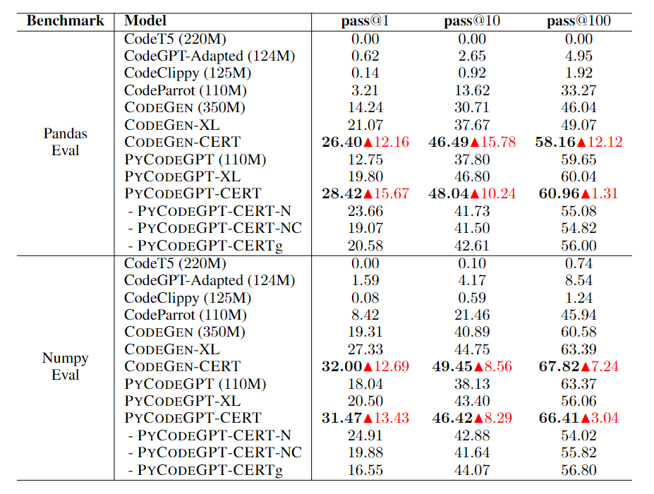

Table 2: PandasEval 和 NumpyEval 上的 pass@k(%) 结果。 CERT 相对于基本模型的绝对改进以红色突出显示。此外，我们报告了不同草图操作（CERT-N 和 CERT-NC）的性能以及为通用代码生成训练的 CERTg 的性能。 

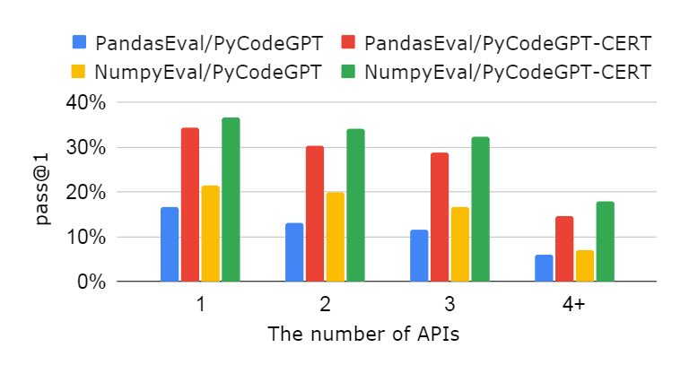

Figure 6: 关于 API 数量的 pass@1 结果。 

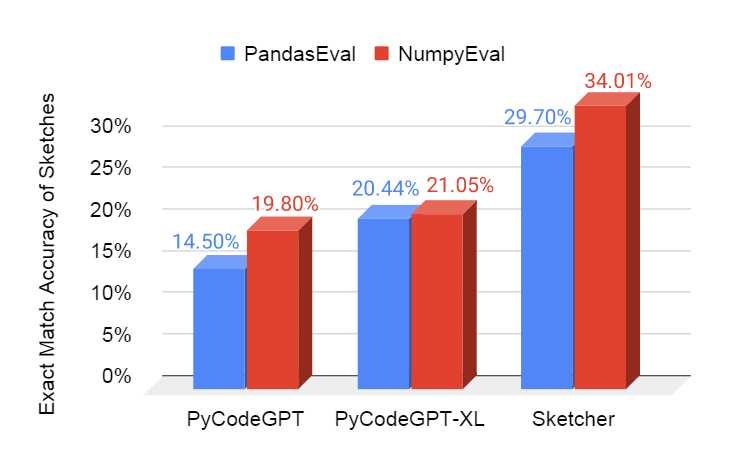

Figure 7:  草图的精确匹配精度。草绘器是指 PYCODEGPT-CERT 中的草绘器。 

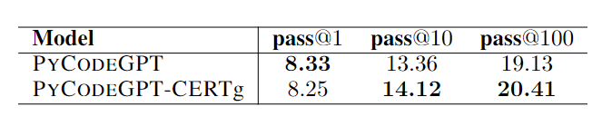

Table 3:  HumanEval 上 PYCODEGPT 和 PY-CODEGPT-CERTg 的 pass@k(%) 结果。

### 5.2、**Closer Analysis**

我们进行了一些更深入的分析以提供更多见解。

**Different Types of Sketching**

正如第3.2节中提到的，我们提出了三种类型的草图操作。默认情况下，CERT只对用户定义的常量进行匿名化。其他两种类型包括CERT-N和CERT-NC，前者只对用户定义的名称进行匿名处理，后者对用户定义的常量和名称都进行匿名处理。如表2所示，默认设置的CERT实现了最佳性能。这一观察可能与Pandas和NumPy的固有特性有关。它们通常用于数据统计和分析，经常涉及对数据常量的操作。因此，有必要对用户定义的常量进行匿名处理。对用户定义的常量和名称都进行匿名化，可能会使草图过于抽象。

**Quality of Generated Sketches**

直观地说，生成草图比生成完整代码更容易。因此，我们想评估 CERT 的草图绘制者生成的草图的质量。我们使用精确匹配准确度作为指标，并包括 PYCODEGPT 和 PYCODEGPT-XL 进行比较。对于 PYCODEGPT 和 PYCODEGPT-XL，我们将预测代码中的用户定义常量匿名化以获得草图。如图 7 所示，我们的草图在 PandasEval 和 NumpyEval 上分别超过基线 15.20% 和 14.21%。这表明草图绘制者可以生成高质量的草图，并且这样的草图进一步使生成者受益。此外，生成器不一定需要完全正确的草图，因为草图只是一个提示（5.3 节将讨论一个案例）。

**CERT for General Code Generation**

从技术上讲，CERT 也可用于一般代码生成任务，而不仅仅是面向库的任务。 具体来说，按照图 5 中的过程，我们可以使用整个 13.0M python 语料库而不是提取的面向库的文件不断地预训练 PYCODEGPT，并获得我们称为 CERTg 的模型。 与基本模型 PYCODEGPT 相比，我们在 HumanEval 上评估 CERTg 的通用代码生成。 如表 3 所示，它们具有相似的 pass@k 结果。 这一观察验证了我们的假设，即面向库的代码片段更有可能共享相似的草图，因此在这种情况下使用草图作为提示是有益的。 但在一般情况下，它是没有用的。 同时 CERTg 在 PandasEval 和 NumpyEval 上的结果如表 2 所示。CERTg 不如 CERT，这表明提取面向库的文件对于 CERT 学习面向库的草图知识至关重要。

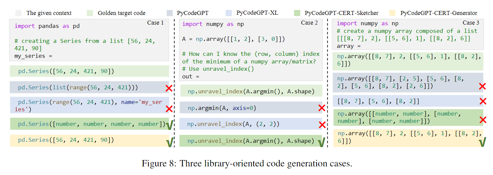

Figure 8.  三个面向库的代码生成案例

**Evaluation of GPT-3 and Codex**

我们评估了GPT-3和Codex，看看这些极其庞大的模型在PandasEval和NumpyEval上的表现如何。如表4所示，CERT在只有110M参数的情况下具有竞争力。这种观察证明了CERT在面向库的编程问题上强大的代码生成能力。

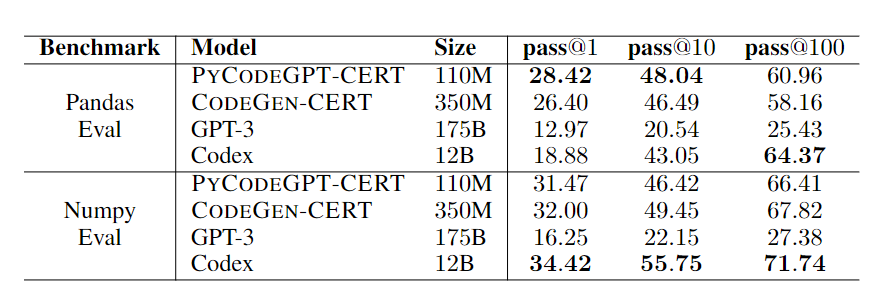

Table 4:  PandasEval 和 NumpyEval 上的 GPT-3 和 Codex。 

### 5.3、**Case Study**

为了进行更全面的比较，我们在图8中显示了三个案例。我们依次展示了上下文，黄金目标代码，PYCODEGPT和PYCODEGPT-XL的预测代码，PYCODEGPT- CERT生成的草图和PYCODEGPT-CERT的预测代码。案例1来自PandasEval，PYCODEGPT-CERT的sketcher和generator都达到了正确的结果，而基线则没有。它揭示了sketcher和generator可以很好地一起工作。案例2来自NumpyEval，sketcher预测了正确的草图，其中没有匿名符号，那么这个草图就是最终预测的代码。这表明sketcher有能力预测没有用户定义常量的代码。最后，在案例3中，sketcher做出了错误的预测pd.Series([[number\*2]\*3])，而正确的草图是pd.Series([[number\*2], number, [[number\*2], number]\*2)。但是PYCODEGPT-CERT的生成器纠正了它，并最终生成了正确的代码。由于草图只是作为一个提示，它不一定要完全正确，这使生成器具有坚实的鲁棒性。

## 6、Related Work

最相关的工作是用于代码的大型预训练模型系列。至于编码器式的预训练模型，它们不能直接用于生成代码，如CuBERT [Kanade等人, 2020], CodeBERT [Feng等人, 2020], 以及GraphCodeBERT [Guo等人, 2020]。至于解码器式或编码器-解码器式的，它们是在大型无标签的代码库上训练的，可以直接用于代码生成任务，如CodeT5 [Wang et al, 2021]、CodeGPT[Lu等人，2021]、PLBART[Ahmad等人，2021]、PolyCoder[Xu等人，2022]、CODEGEN[Nijkamp等人，2022]、AlphaCode[Li等人，2022]以及Codex[Chen等人，2021a]。所有这些都专注于生成独立的代码，而我们则研究面向库的代码生成。

此外，与我们的想法类似，还有一些利用代码草图的作品，例如，Coarse-to-Fine [Dong and Lapata, 2018]、BAYOU [Murali et al., 2018]、SKETCHADAPT [Nye et al., 2019]和 PLOTCODER [Chen 等人，2021b]。然而，它们需要标记的文本代码配对数据进行微调，而我们的模型不断地在未标记的代码语料库上进行预训练。对于代码生成基准，工作很少，包括 APPS [Hendrycks et al., 2021]、HumanEval [Chen et al., 2021a] 和 PlotCoder 的数据集 [Chen et al., 2021b]。前两个专注于评估生成独立代码的能力，最后一个主要致力于生成绘图 API 和可视化代码。 PandasEval 和 NumpyEval 致力于评估面向库的代码生成的性能。

## 7、Conclusion

在本文中，我们提出了一种新的方法CERT，用于面向库的代码生成。它利用了代码草图，由一个草图生成器和一个生成器组成。素描器和生成器在一个使用无标签代码体的基础模型上不断地进行预训练。同时，我们精心设计了两个基准点来评估面向库的代码生成，即PandasEval和NumpyEval。实验结果和深入的分析表明了CERT的有效性。在未来的工作中，我们对数据较少的私有库的代码生成有兴趣。