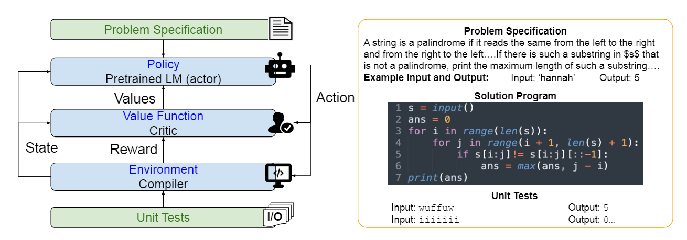

# Code RL: Mastering Code Generation through Pretrained Models and Deep Reinforcement Learning

# CodeRL：通过预训练模型和深度强化学习掌握代码生成

项目地址：https://github.com/salesforce/CodeRL

## 摘要

程序综合或代码生成旨在生成满足问题规范的程序。最近使用大规模预训练语言模型 (LM) 的方法已显示出可喜的结果，但它们也存在一些严重的局限性。特别是，他们经常遵循标准的监督微调程序，仅从自然语言问题描述和真实程序对训练代码生成模型。这种范式在很大程度上忽略了问题规范中的一些重要但可能有用的信号，例如单元测试，因此在解决复杂的看不见的编码任务时通常会导致性能下降。为了解决这些限制，我们提出了“CodeRL”，这是一个通过预训练 LM 和深度强化学习 (RL) 进行程序合成任务的新框架。具体来说，在训练过程中，我们将生成代码的 LM 视为一个 actor 网络，并引入一个经过训练的评论家网络，以预测生成程序的功能正确性并向演员提供密集的反馈信号。在推理过程中，我们引入了具有关键采样策略的新一代过程，该策略允许模型根据来自示例单元测试和批评分数的反馈自动重新生成程序。对于模型主干，我们扩展了 CodeT5 的编码器-解码器架构，具有增强的学习目标、更大的模型尺寸和更好的预训练数据。我们的方法不仅在具有挑战性的 APPS 基准上取得了新的 SOTA 结果，而且在更简单的 MBPP 基准上显示出强大的零样本传输能力和新的 SOTA 结果。

Figure 1:  我们用于程序合成的CodeRL框架的高层次概述（左图）：我们将预先训练好的代码语言模型（LM）视为随机策略，将代码代数视为行动，并且可以根据编译器（环境）输出程序的单元测试结果来估计奖励。一个程序合成任务的例子（右）。每个任务都是由自然语言的问题说明来定义的，通常包含输入和输出对的例子。预期的输出是一个程序，要根据一些单元测试来检查功能的正确性。

## 1、Introduction

程序合成或代码生成是设计和建立一个满足问题规范的可执行计算机程序的任务（见图1，右图，为一个例子）。由于程序合成研究对软件行业的重大影响，包括更好的生产力和编程工作和教育的可及性，它已经获得了很多关注。开发一个可以根据人类需求自动生成程序的人工智能模型，可以极大地改变编程工具和我们使用它们的方式。

最近的尝试采用了深度学习方法，特别是基于Transformer的预训练语言模型（LM）Vaswani等人[2017]，Brown等人[2020]，这些方法最初是用于自然语言学习任务，以生成独特的计算机程序。这些方法Hendrycks等人[2021]，Chen等人[2021a]，Austin等人[2021]认为程序合成是一个序列到序列的任务，它接收输入序列作为自然语言的问题规范，并生成一个代码序列作为输出程序。虽然这些模型取得了有希望的结果，特别是在基本的编程任务中[Chen et al., 2021a, Austin et al., 2021]，但我们观察到，它们仍然无法生成解决复杂问题的代码，如编程比赛中的问题[Hendrycks et al., 2021, Li et al., 2022]。

有两个主要限制。首先，当前模型使用传统的下一个标记预测 (NTP) 目标进行训练，该目标最大化下一个真实标记的可能性。正如在 NLP 领域 Bengio 等人所述。 [2015]，兰萨托等人。 [2016]，以“教师强制”方式仅具有下一个令牌预测目标的训练模型通常会导致在测试期间累积错误，此时令牌是通过调节先前采样的令牌而不是真实令牌生成的。这个问题在程序合成领域变得更加严重，其中 BLEU [Papineni et al., 2002, Ren et al., 2020] 等令牌匹配分数更适合部分程序合成任务（即代码完成）[Husain等人，2019]，但未能衡量完整程序的功能正确性 [Hendrycks 等人，2021，陈等人，2021a]。因此，仅以 NTP 为目标的训练对于解决完整的程序生成以解决编程问题并不理想。

其次，当前的模型未能利用来自单元测试的潜在有意义的信号，这些信号直接通过程序的功能正确性决定了模型的性能。当前的方法在模型优化和生成过程中忽略了这一重要信号。在优化过程中，可以将单元测试纳入学习目标，以匹配生成语义正确程序的最终目标。在推理过程中，由于单元测试通常是问题描述的一部分（即示例单元测试），因此它们对于进一步改进输出程序具有潜在的强大功能。 [Li et al., 2022] 等相关方法使用示例单元测试来过滤和排列最终输出程序。虽然这种方法自然会选择更好的候选程序，但它不允许模型根据初始（示例）单元测试结果改进程序。

为了解决上述问题，我们引入了“CodeRL”，这是一个新的框架，通过深度强化学习来改进预训练的 LMs 以用于程序合成任务（参见图 1 左侧和第 3 节了解更多详细信息）。具体来说，我们提出了一种训练策略，该策略可以优化预先训练的 LM，以在演员-评论家 RL 方法中进行程序合成任务 [Konda and Tsitsiklis, 1999, Sutton et al., 1999]。我们将预训练的 LM 视为一个参与者网络，并从该参与者中综合采样序列，包括正确和不正确的程序。这些程序样本被传递给一个批评模型，该模型被训练为一个错误预测器，以评估这些样本的功能正确性。我们使用从学习到的批评模型中提取的标记级隐藏状态来估计这些合成样本的输出标记的值/分数。然后演员网络在这些合成样本上进行微调，这些样本由他们的评论分数加权。

在推理过程中，作为 CodeRL 框架的一部分，我们引入了一个新一代程序，该程序系统地利用示例单元测试信号来允许模型进一步改进程序。首先，对于通过示例单元测试的样本，我们使用评论模型来过滤和选择子序列。这些子序列被用作“种子”，使模型重新采样新的令牌并获得新的输出程序。其次，在失败的程序中，critic 根据它们通过单元测试的可能性来选择最佳程序。这些候选程序与从编译器接收到的错误信息连接起来，并传递给程序修复模块。此生成过程支持双重策略，以在测试期间根据输出程序的功能正确性自动优化和修复输出程序。

与 CodeRL 一起，我们将 CodeT5 扩展为具有改进的预训练策略的基础模型，包括更好的预训练目标、更大的模型大小和海量的预训练数据。我们的综合实验（第 4 节）表明，我们的模型可以在具有挑战性的 APPS 基准测试中实现 SOTA 性能 [Hendrycks et al., 2021]。具体来说，我们的模型达到超过 2% pass@1、6% pass@5 和 20% pass@1000。由于我们的 RL 方法与模型无关，因此我们还将其应用于各种大型模型并获得一致的性能提升。我们在更简单的 MBPP 基准测试 [Austin et al., 2021] 上进一步测试了它的零样本传输能力，在该基准测试中，它设置了 63.0% pass@80 的新 SOTA 结果，超过了微调的 GPT-137B 的 61.4%。我们进行定性分析以了解模型成功或未能解决的问题。最后，我们发布了改进的 CodeT5-large (770M) 模型，它优于许多更大尺寸的预训练 LM。

## 2、Related Work

### 2.1、Program Synthesis

程序合成任务可以追溯到机器学习研究 Waldinger 和 Lee [1969]、Manna 和 Waldinger [1971] 的早期采用。早期的任务包括输入输出 (IO) 示例形式的问题规范 [Summers, 1977, Gulwani et al., 2012]，综合方法仅限于概率方法 [Liang et al., 2010] 或简单的编程概念 [Joulin和 Mikolov，2015 年，Kurach 等人，2015 年]。随着深度学习方法变得流行，后来的方法采用神经模型来诱导输出程序，假设在给定足够数量的程序样本的情况下存在归纳偏差 [Parisotto et al., 2016, Balog et al., 2016, Devlin et al., 2017] 。

最近，我们见证了程序合成任务的出现，其中输出程序被扩展为通用编程语言[Yin和Neubig，2017年，Xu等人，2018年，Chen等人，2021a]，程序规范完全由自然英语文本描述[Hendrycks等人，2021年，Austin等人，2021年，Poesia等人，2022]。这些扩展鼓励了越来越多的预训练语言模型（LM）应用于程序合成，以利用从代码和自然语言的海量数据中学习到的上下文表征[Feng等人，2020，Clement等人，2020，Wang等人，2021，Wang和Komatsuzaki，2021，陈等人，2022]。Nijkamp等人[2022]提出了一种具有大型预训练语言模型的对话式程序合成方法。尽管在基本的编程问题上取得了令人印象深刻的结果并进行了初步的商业部署3，但现有的模型在面对复杂的问题时仍然表现不佳，例如来自Codeforces上的编程竞赛的问题[Hendrycks等人，2021，Li等人，2022]。

### 2.2、Reinforcement Learning for Sequence Generation

与程序合成任务相关的是序列生成的研究领域，在这些领域中，RL方法已经显示出显著的成就。在这些领域中，RL方法被用来利用手头任务的非差异性指标的信号。早期的工作如[Ranzato等人，2016]采用这种策略与REINFORCE算法[Williams，1992]直接优化基于序列的测试指标的模型，如BLEU[Papineni等人，2002]和ROUGE[Lin，2004]翻译模型的得分。在同一领域，Bahdanau等人[2016]引入了一个演员批评框架[Sutton, 1984, Konda and Tsitsiklis, 1999]。在视觉字幕领域，Rennie等人[2017]、Wang等人[2018]提出使用RL来优化图像字幕模型，使用CIDEr评分的变体[Vedantam等人，2015]。另外，Ren等人[2017]使用视觉语义嵌入得出了一个新的目标导向的回报估计。Johnson等人[2017]、Trivedi等人[2021]引入程序生成作为辅助任务，以学习问题回答和合成导航任务中的可解释政策。

与之前的领域不同，在程序合成中，Austin等人[2021]、Chen等人[2021a]、Li等人[2022]证明了基于令牌的相似度指标与程序的功能正确性之间的相关性非常低。因此，在这个领域定义一个合适的优化目标并不简单。我们建议在模型优化和测试时间生成阶段利用单元测试信号，这些信号直接表现出程序的功能正确性。与我们的工作更相关的是基于RL的程序合成[Guu等人，2017，Bunel等人，2018，Liang等人，2018，Zhong等人，2018]和执行引导的合成方法[Ellis等人，2019，Chen等人，2021b]。然而，这些都只限于在特定应用领域内定义的编程语言。

### 2.3、Program Completion

与我们的工作相关的是自动程序完成或代码完成的研究。代码完成的目的是以部分代码（如函数签名、有空白的代码）为条件生成程序，输出的程序通常是简短的片段，作为潜在的代码建议。早期的工作，如Robbes和Lanza[2008]，Bruch等人[2009]表明，在代码建议的相关性方面，足够的程序样本和先前的程序历史可以促进更好的代码完成系统。Raychev等人[2014]，White等人[2015]引入了基于深度学习的方法，将任务视为使用神经语言模型预测标记或句子的概率的NLP问题。Svyatkovskiy等人[2021]、Guo等人[2021]通过重新排序策略改进代码完成系统，以选择更好的程序候选者，并通过结构化预测来生成更多语法正确的程序。最近的工作，如[Clement等人，2020，Svyatkovskiy等人，2020]采用预训练的语言模型来利用从大型源代码数据中学习的表征，[Aye等人，2021]解决了现实世界的代码完成问题。

与代码完成相比，程序合成需要系统从头开始生成完整的程序，这些程序通常通过一些单元测试来评估其功能正确性，Hendrycks等人[2021]，Li等人[2022]。在这项工作中，虽然我们专注于从自然问题描述中进行程序合成，但我们在生成程序中采用了与代码完成类似的策略来改进输出程序。

## 3、CodeRL

### 3.1、Program Synthesis Task

遵循序列到序列的方法，程序合成任务包含问题描述作为输入序列 $D$ 和程序的输出序列 $\hat{W}=\left(\hat{w}_{1}, \ldots, \hat{w}_{T}\right)$, $\hat{w}_{t} \in \mathcal{V}$ 可以解决问题。 每个解码步骤 t 的输出是词汇 V 上的分布，由 softmax 函数 $\hat{w}_{t} \sim \operatorname{softmax}\left(\operatorname{Linear}\left(s_{t}\right)\right)$计算，其中 $s_t$ 是解码步骤$ t $的上下文隐藏状态。 传统上，在训练期间，模型参数$ θ$ 通过最大化真实参考程序的可能性来学习。 将 $W=\left(w_{1}, \ldots w_{T}\right)$ 表示为 ground-truth 程序，目标是最小化交叉熵损失：
$$
\mathcal{L}_{c e}(\theta)=-\sum_{t} \log p_{\theta}(W \mid D)=-\sum_{t} \log \left[p_{\theta}\left(w_{t} \mid w_{1: t-1}, D\right)\right]
$$
其中条件概率  $p_{\theta}$ 按照上述 softmax 函数进行参数化。在测试期间，模型通过从分布  $p_{\theta}\left(. \mid \hat{w}_{1: t-1}, D\right)$ 中自回归采样令牌  $\hat{w}_{t}$ 来生成程序序列。模型根据与问题对应的单元测试进行评估。每个测试包括一对输入和真值输出。在现实世界的程序综合任务中 [Hendrycks et al., 2021]，示例单元测试通常作为问题规范的一部分给出。

### 3.2、Pretraining Language Models on Code

我们采用Transformer模型作为我们程序合成系统的骨干。具体来说，本文扩展了CodeT5模型[Wang et al., 2021]作为CodeRL的基础模型。

**CodeT5**

CodeT5 [Wang et al., 2021]是一个多语言的代码感知语言模型，在从Github策划的大规模源代码语料库上进行预训练。凭借统一的编码器-解码器架构，CodeT5在CodeXGLUE基准[Lu等人，2021]的各种代码智能任务中实现了最先进的性能，包括代码理解和生成任务。

**Improving Pretrained Data**

我们使用最近发布的大规模Github代码数据集5来扩大Python预训练数据集。 我们过滤数据集，只保留至少允许学术使用的许可证的代码（"mit", "apache-2", "bsd-3-clause", "bsd-2-126 clause", "cc0-1.0", "unlicense", "isc"）。由此产生的Python数据集（GCPY）有10.5亿个标记，比原始CodeT5[Wang等人，2021]中使用的CodeSearchNet（CSN）语料库[Husain等人，2019]大10倍。

Figure 2: 我们的 actor-critic 框架概述，以优化用于程序合成的预训练 LM：我们将 LM 视为一个参与者网络，并从该参与者中采样合成样本。另一个神经网络被训练为批评模型，以根据这些合成样本通过单元测试的概率来评估它们。回报是根据评论分数估计的，最后考虑到学习目标 Lrl 中，以使用合成样本微调演员 LM 网络。

**Improving Pretraining Objective**

虽然 CodeT5 中的预训练任务（如掩码跨度预测 (MSP)）有利于代码理解任务，但它们与程序综合目标存在很大差异。为了缩小这一差距，我们在 CodeT5 中引入了下一个令牌预测 (NTP) 的预训练任务。具体来说，我们为每个代码样本统一采样一个枢轴位置，然后将枢轴之前的内容传递给编码器，并将剩余的内容传递给解码器。为了控制输入和输出序列的长度，我们将主元限制在原始序列的 10% 到 90% 范围内。

### 3.3、Program Synthesis as an RL Problem

我们建议将程序合成表述为一个RL问题（见图1，左），并应用行为者批评的RL方法，通过利用模型优化（见图2）和生成程序（见图4）中的单元测试信号来提高预训练LM的性能。

更正式地说，我们可以把LM模型的学习参数 $θ$ 看作是一个随机的策略，它决定一个行动作为每个标记的预测。在每次行动之后，LM模型都会更新其隐藏状态表征，这些表征被策略用来决定下一个解码步骤中的下一个行动。在生成情节结束时（即观察到一个\<endoftext>标记），LM模型收到一个由生成程序的功能正确性衡量的回报r。RL微调的目标是使预期回报最小化：
$$
\mathcal{L}_{r l}(\theta)=-\mathbb{E}_{W^{s} \sim p_{\theta}}\left[r\left(W^{s}\right)\right]
$$
其中 $W^{s}=\left(w_{1}^{s}, \ldots, w_{T}^{s}\right)$ 是一个合成样本，其中每个标记 $w_{t}^{s}$ 在解码时间步长 $t$ 时被LM模型采样。 按照REINFORCE算法[Williams, 1992, Sutton and Barto, 2018]和政策梯度定理[Sutton et al., 1999]，我们可以将无差别回报 $r$ 的梯度 $\nabla_{\theta} L(\theta)$ 的估计定义为：
$$
\begin{aligned}
\nabla_{\theta} \mathcal{L}_{r l}(\theta) & \approx-\mathbb{E}_{W^{s} \sim p_{\theta}}\left[r\left(W^{s}\right) \nabla_{\theta} \log p_{\theta}\left(W^{s} \mid D\right)\right] \\
& \approx-\mathbb{E}_{W^{s} \sim p_{\theta}}\left[r\left(W^{s}\right) \sum_{t} \nabla_{\theta} \log p_{\theta}\left(w_{t}^{s} \mid w_{1: t-1}^{s}, D\right)\right]
\end{aligned}
$$

### 3.3.1、Defining Return by Unit Test Signals

对于每个样本序列 $W_s$，可以通过检查其功能正确性来启发式地定义返回 $r$。我们把生成的程序和相应的单元测试一起交给编译器。从测试的输出中，我们可以确定返回值 $r$：
$$
r\left(W^{s}\right)= \begin{cases}-1.0 & , \text { if } W^{s} \text { cannot be compiled (i.e. compile error) } \\ -0.6 & \text {, if } W^{s} \text { cannot be executed with unit tests (i.e. runtime error) } \\ -0.3 & , \text { if } W^{s} \text { failed any unit test } \\ +1.0 & , \text { if } W^{s} \text { passed all unit tests }\end{cases}
$$

Figure 3. 我们的批评者模型的概述。批评者模型是作为一个错误预测器来学习的。该模型接收问题规格和程序作为输入序列。对于每个程序，该模型被训练来预测四个可能的测试结果之一。{编译错误，运行时间错误，测试失败，测试通过}。然后，从批评者那里学到的隐藏状态代表被用来估计合成样本的回报，以微调行为者网络。为了改善和稳定训练过程，我们考虑了基线程序，并将相对收益计入损失函数以优化演员网络。 

然而，在相关领域，例如 text-to-SQL 研究 [Zhong et al., 2018, Xu et al., 2018]，我们注意到这种估计收益的方法会导致模型训练不稳定，梯度估计的方差很大遵循方程式。 (3) 用小批量训练。

### 3.3.2、Return with a Baseline

为了缓解这种差异，我们采用了“基线”[Sutton and Barto, 2018]。具体来说，我们使用贪心解码策略作为基线，并且任何超过该基线的生成样本都被给予正回报估计，否则给予负回报估计。这种相对标准化技术允许模型探索不完美的程序，只要它们的回报优于基线。给定一个训练样本，我们表示基线 r(Wb) 的返回，预期梯度计算如下：
$$
\nabla_{\theta} \mathcal{L}_{r l}(\theta) \approx-\mathbb{E}_{W^{s} \sim p_{\theta}}\left[\left(r\left(W^{s}\right)-r\left(W^{b}\right)\right) \sum_{t} \nabla_{\theta} \log p_{\theta}\left(w_{t}^{s} \mid w_{1: t-1}^{s}, D\right)\right]
$$
请注意，在每个解码步骤 $t$，我们的贪婪解码基线与行动 $w_{t}^{s}$ 无关，因此，公式(3)中的预期梯度项$\nabla_{\theta} \mathcal{L}_{r l}(\theta)$在公式中保持不变。

### 3.3.3、Intermediate Return by Critic as Error Predictor

我们观察到，上述梯度估计只基于解码过程结束时的最终返回。然而，程序往往遵循固定的语法规则，其中一个单一的标记，如一个额外的白字，就可以使程序出错。因此，公式（8）变得过于严格。一个直接的解决方案是使用每个子序列 $W_{1: t}^{s}$ 和基础事实之间的基于标记的相似性分数[Papineni等人，2002，Ren等人，2020]）。然而，由于代码匹配与程序正确性的相关性较差[Hendrycks等人，2021，Chen等人，2021a，Austin等人，2021]，只能针对完全完整的程序进行测量，因此代码匹配不是一个理想的返回措施。

或者，我们引入一个批评家模型。图3显示了我们的批评者模型的概况。批评者模型的参数是一个具有参数 $\phi$ 的神经网络，它接收的输入是问题描述D和采样程序 $W^{s}=\left\{w_{1}^{s}, \ldots, w_{T}^{s}\right\}$。批评者被训练来推断单元测试的结果；如公式（4）至（7）中的返回定义所描述的{编译错误，运行时间错误，测试失败，测试通过}之一。批评者$\phi$的训练目标可以表示为：
$$
\mathcal{L}_{\text {critic }}(\phi)=-\log p_{\phi}\left(u \mid W^{s}, D\right)
$$
其中$\mathcal{U}$ 表示编译器在将$W^{s}$传递给与问题对应的单元测试后给出的真实单元测试结果。 我们使用比actor模型更小的Transformer模型作为critic模型的基础架构。 从critic模型解码器获得的程序标记 $\left(h_{1}, \ldots, h_{T}\right)$ 的上下文隐藏状态沿序列长度维度 $h^{\text {pool }}=\operatorname{Pooling}\left(h_{1}, \ldots, h_{T}\right)$ 进行最大池化。 评论家对单元测试结果的预测计算为 $\hat{u}=\operatorname{softmax}\left(\operatorname{Linear}\left(h^{\mathrm{pool}}\right)\right)$。

Figure 4:  我们在推理过程中用于程序合成的批判性采样方法概述：根据相应问题的示例单元测试的结果对程序进行改进和修复。程序候选者通过他们在令牌或序列级别的评论家预测分数进行抽样。虚线表示在程序改进或修复期间应用的可选过程。

给定一个学习过的批评家，我们使用概率分布 $\hat{v}_{t}=\operatorname{softmax}\left(\operatorname{Linear}\left(h_{t}\right)\right)$ 来估计 $w_{t}^{s}$ 相对于真实单元测试输出的令牌级值 $\hat{q}$（请注意，我们使用令牌级上下文表示 $h_{t}$ 这里，在池化操作之前）。具体来说，$\hat{q}_{\phi}\left(w_{t}^{s}\right)=\hat{v}_{t}[u]$ 其中 $\hat{v}[.]$ 表示四个可能的特定单元测试结果的概率。我们使用这个估计来训练具有中等回报的 actor LM 模型：
$$
\nabla_{\theta} \mathcal{L}_{r l}(\theta) \approx-\mathbb{E}_{W^{s} \sim p_{\theta}}\left[\left(r\left(W^{s}\right)-r\left(W^{b}\right)\right) \sum_{t} \hat{q}_{\phi}\left(w_{t}^{s}\right) \nabla_{\theta} \log p_{\theta}\left(w_{t}^{s} \mid w_{1: t-1}^{s}, D\right)\right]
$$
请注意，由于我们的critic 模型应用于具有可用ground truth 的监督学习环境，因此我们还使用完美输出程序 $W$ 的训练样本并为它们分配默认测试结果 $u=$ PassedTest 来训练critic。

### 3.3.4、Generating Programs with Example Unit Tests and Critic

我们也利用输入问题描述中提供的单元测试来改进推理过程中的生成过程（参见图 4 的概述）。对于每个问题，我们生成 $N$ 个程序，每个程序都传递给示例单元测试，这些单元测试通常作为问题规范的一部分嵌入。在 $N $个程序中，我们将通过示例测试的程序表示为集合 $P$，其余失败的程序表示为集合$\mathcal{F}$。

### Program Refining

请注意，尽管 $\mathcal{P}$ 中的程序成功通过了示例测试，但不能保证这些程序能够成功通过最终的隐藏测试。隐藏测试通常更全面，并且可能包含挑战这些程序的极端案例。因此，我们可以应用另一轮生成来进一步细化程序。

具体来说，我们使用来自 $\mathcal{P}$ 的这些程序样本的子序列作为演员 LM 的提示（或“种子”序列）。 我们采用单独的批评模型（$\phi_{\text {test }}$）来指导我们从这些过滤样本中选择子序列。 这个批评模型的训练目标与等式相似。 (9)，但在带有 {FailedTest,PassedTest} 标签的二进制分类设置中。 令 $W^{\text {pass }}=\left\{w_{1}, \ldots, w_{T}\right\}$ 表示生成的样本通过了示例单元测试。 我们使用评论模型为每个标记分配一个值：
$$
\hat{q}_{\phi_{\text {test }}}\left(w_{t}\right)=p_{\phi_{\text {test }}}\left(\hat{u}=\text { PassedTest } \mid w_{1: t}, D\right)
$$
对应于 critic 预测的子序列直到 $t$ 通过单元测试的概率。我们在对应于最高批评者分配值的位置 $t_{\max }$ 处分割序列，并使用左分割作为下一阶段的种子。如果直到 $t_{\max }$ 的这个种子序列包含一个 $p_{\phi_{\text {test }}}($ FailedTest $)>p_{\phi_{\text {test }}}($ PassedTest $)$ 的标记，我们通过删除右侧的标记进一步在这个标记处切割它。这样做是为了挑选可能在下一轮生成成功程序的提示。

我们使用这些种子来初始化和调节 (actor) LM 以重新采样新的标记，直到我们遇到 \<endoftext > 标记。在这一轮中，每个种子序列可以堆叠 N/|P| 次进行上采样。这导致与第一轮生成相同数量的输出程序N。最后，我们针对隐藏单元测试评估这 N 个精炼程序。

### Program Repairing

生成程序来解决问题，尤其是竞赛级编程问题，涉及到可能程序的巨大搜索空间。很多时候，我们观察到所有程序在示例测试中都失败的完全失败，即$|\mathcal{F}|=N$。因此，对于这些情况，我们采用额外的生成步骤来首先修复程序，然后再改进它们。

具体来说，我们使用同样用于程序精炼的批评模型，从集合 $\mathcal{F}$ 中抽取最佳候选者。让 $W^{\text {fail }}$ 表示生成的样本未通过示例单元测试。我们使用critic模型为这个样本赋值：
$$
\hat{q}_{\phi_{\text {test }}}\left(W^{\text {fail }}\right)=p_{\phi_{\text {test }}}\left(\hat{u}=\operatorname{PassedTest} \mid W^{\text {fail }}, D\right)
$$
对应于critic 对程序通过单元测试的预测概率。我们选择概率最高的前 $M $个程序，并将它们传递给程序修复模型 $ ω$。

这个程序修复模型被设计成一个序列到序列的生成模型。输入序列是问题描述 $D$ 和错误程序 $W^{\text {fail }}$的串联。我们还包括从单元测试结果中收到的额外信号，包括测试结果的类型（如公式（4）到（7）中的返回定义，以及错误子类型（如语法错误、索引外错误）。错误类型是从编译器返回的错误痕迹中提取的。为了训练程序修复模型，我们利用了最初用于我们RL训练的合成样本，即错误程序 $W^{\text {fail }}=W^{s}$。地面真实程序W可以被用作预期的正确程序。程序修复模型的训练目标是使交叉熵损失最小：
$$
\mathcal{L}_{c e}^{\text {repair }}(\omega)=-\sum_{t} \log p_{\omega}\left(W \mid D, W^{\text {fail }}, u, c\right)=-\sum_{t} \log \left[p_{\omega}\left(w_{t} \mid w_{1: t-1}, D, W^{\text {fail }}, u, c\right)\right]
$$
其中 $u$ 是 {CompileError,RuntimeError,FailedTest,PassedTest} 之一，$c$ 是错误子类型。在测试期间，每个选定的失败序列可以堆叠 $N/M$ 次以进行上采样。这导致与第一轮生成相同数量的输出程序$N$。最后，我们通过这 $N$ 个修复的程序，并像以前一样应用代码精炼过程。

### Critic Sampling

我们把程序修复和完善的双重策略称为 "批评性抽样"（CS）。这种双重策略允许模型在推理过程中从成功案例（程序精炼）和失败案例（程序修复）中生成并改进程序。在实践中，我们使用小批量生成来提高推理过程中的效率，并采用批量大小为 $N=200$ 的核抽样。请注意，在程序精炼过程中，虽然我们使用种子序列重新取样会产生额外的计算成本，但在重新生成阶段，我们只需要生成部分程序，使这一阶段的成本低于传统生成。

### 3.4、Implementation Details

由于潜在的大量轨迹（即 $\mathcal{V}^{T}$）来生成序列以及演员和评论家之间不稳定的反馈回路 [Lillicrap 等人，2015 年，Wang 等人，2018 年]，我们将模仿学习应用于第一次热启动一个预训练的 LM 模型，$\mathcal{L}_{c e}$ 最多只能运行 10 个 epoch。然后，我们从这个演员网络中采样程序序列来训练评论家，同时保持演员网络的参数冻结。对于 CodeT5 演员模型的实验，我们使用 CodeT5-small 架构作为评判模型，当演员模型是 GPT 变体时，我们使用 GPT2-small 评判架构。继 [Bahdanau et al., 2016] 之后，由于我们的 RL 方法应用于监督学习任务，除了合成程序外，我们还使用训练样本的 ground-truth 程序来训练评论家。这些样本被认为是完美的程序，并且总是带有 PassedTest 的标签。在训练了critic之后，我们使用相同权重的 $\mathcal{L}_{c e}$ 和 $\mathcal{L}_{r l}$ 来微调actor网络。为了优化 LM 演员网络，在实践中，按照之前的工作 [Bahdanau et al., 2016, Rennie et al., 2017, Wang et al., 2018]，在每个训练优化步骤中，我们可以简单地用单个样本 $W_{s} \sim p_{\theta}$：
$$
\nabla_{\theta} \mathcal{L}_{r l}(\theta) \approx-\left(r\left(W^{s}\right)-r\left(W^{b}\right)\right) \sum_{t} \hat{q}_{\phi}\left(w_{t}^{s}\right) \nabla_{\theta} \log p_{\theta}\left(w_{t}^{s} \mid w_{1: t-1}^{s}, D\right)
$$

## 4、Experiments

### 4.1、Experimental Setups

**Pretraining**

我们按照 T5-large 的架构从头开始预训练 CodeT5-large 模型 (770M) [Raffel et al., 2020]。我们遵循 CodeT5 [Wang et al., 2021] 中的预训练设置，并进行了第 3.2 节中提出的修改。具体来说，我们采用了 Wang 等人的代码特定标记器。 [2021]。我们在 CodeSearchNet [Husain et al., 2019] (CSN) 中使用 6 种编程语言 (PL)，而不是 CodeT5 中的 8 种 PL，因为 C/C# 数据集不公开。我们仅应用 Wang 等人的掩蔽跨度预测 (MSP) 的预训练任务。 [2021] 因此，不必将程序解析为抽象语法树 (AST) 来获取标识符信息。其他原始预训练任务（如掩码标识符预测）需要最后一个预处理步骤 [Wang et al., 2021]。为了进一步加快训练，我们将数据样本连接到批量大小为 512 以使用 MSP 进行预训练，得到的令牌数为 1.1B。为了验证使用这种新的预训练 CodeT5 作为我们的基础模型的好处，我们在 CodeXGLUE [Lu et al., 2021] 上评估了这个模型并获得了新的 SOTA 结果（参见附录 A.1）。

我们在谷歌云平台上带有16个A100-40G GPU的kubernetes上进行实验，总的预训练时间约为21天。在使用MSP的第一个预训练阶段，我们采用了 $15%$ 的腐败率，$2e-4$的峰值学习率（LR），以及 $2048$ 的批处理量。我们在CSN上预训练了 $150$ 个历时（10天），然后在GCPY上预训练了10个历时（5天）。对于用NTP进行的第二阶段预训练，我们采用1e-4的峰值LR和256的批次大小，并预训练10个历时（6天）。为实现这一目标，我们将源序列和目标序列的最大长度分别设为768和600。在所有的实验中，我们采用AdamW优化器[Loshchilov和Hutter, 2019]，其权重衰减为$0.05$，线性衰减LR调度器，预热步骤为 $1000$。

**Evaluation**

我们遵循[Hendrycks等人, 2021, Chen等人, 2021a]，使用pass@k度量来评估模型，即每个问题使用k个生成的程序解决的百分比。我们也跟随Li等人[2022]，使用n@k度量，即每个问题只考虑k个生成程序中的n个候选子集。n个候选子集通常是通过过滤方法选择的，通过生成的程序通过作为问题描述一部分的例子测试[Chen等人, 2021a, Li等人, 2022]。

### 4.2、Program Symthesis Benchmarks

- APPS Benchmark
- MBPP Benchmark

### 4.6、Qualitative Analysis

#### **Analysis by Unit Test Outcomes**

Figure 8.   测试结果的定性结果：使用带有和不带有 CodeRL 的 CodeT5 模型，我们在 APPS 上为每个测试样本生成 200 个程序，并通过单元测试结果报告每个样本的程序百分比，包括 CompileError、RuntimeError、FailedTest 和 PassedTest。测试结果根据我们在方程式中的定义进行定义。 (4) 至 (7)

图 8 展示了每个问题生成程序的平均百分比，按测试结果分组。 具体来说，我们使用 CodeT5 或 CodeRL+CodeT5 生成程序，并在 APPS 测试拆分中每个测试样本随机选择 200 个生成的程序。 我们将程序传递给示例单元测试或隐藏单元测试，并根据测试结果对输出程序进行分组。 结果根据我们在方程式中的定义进行分类。 (4)到(7)，包括CompileError、RuntimeError、FailedTest和PassedTest。

首先，在示例单元测试和隐藏单元测试中，我们观察到整合CodeRL可以提高程序通过测试的可能性，并降低程序不能通过一个或多个单元测试的概率。在入门级的编程问题中，通过单元测试的概率得到了更大的提高。

其次，我们注意到在 CodeRL 生成的程序中编译错误的百分比降低了，对面试和竞赛级问题的影响更大。由于 CodeRL 程序不太可能发生编译错误，因此这些程序仍然存在运行时错误。这导致 CodeRL 程序包含运行时错误的可能性更高。附录 B.1 中描述了对编译和运行时失败的更多分析。

我们注意到，示例单元测试（图 8a）和隐藏单元测试（图 8b）之间的测试结果存在相当大的性能差距。这一观察表明，示例测试不如隐藏测试全面，因此，由于误报，限制了我们的 CodeRL 生成过程的积极影响。我们建议使用其他方法来改进示例单元测试，例如通过改变输入/输出对来增强数据 [Austin et al., 2021]。

#### **Example Generated Program**

图 9 显示了来自 APPS 基准测试的编程问题示例以及由 CodeT5 变体生成的相应程序。具体来说，基于相同的基础预训练 CodeT5（使用 GCPY 数据和 NTP 目标进行预训练），我们比较了仅由 Lce 微调的 CodeT5 模型和遵循我们的 CodeRL 框架的另一个模型。在 CodeRL+CodeT5 中，我们进一步展示了应用 CS 过程之前和之后的程序。我们发现应用 CodeRL 可以生成更合适的程序，并且使用 CS 过程进一步提高了它们的功能正确性。例如，在图 9 中，CodeT5 模型误解了问题，只专注于寻找 a 和 b 之间的最大公约数。相反，CodeRL 模型避免了这个错误，并解决了在 a 和 b 的阶乘之间找到最大公约数的问题。

我们还发现 CodeRL 可以提高生成程序的复杂性，这是复杂编程问题的一个重要品质。例如，在图 9 中的采访级程序中，我们注意到在不应用 CS 的情况下，生成的程序在功能上是正确的，但在执行过程中由于超时错误而失败。该程序仅计算 a 和 b 的单独阶乘，这将在 a 或 b 非常大的情况下减慢执行速度。应用 CS 过程可以对先前程序的某些部分设置模型，并（重新）生成新的令牌以产生更有效的程序。在图 9 的示例中，阶乘是在 min(a,b) 上计算的，以提高程序的效率。因此，生成的最终程序能够通过所有隐藏单元测试（包括具有极大值的测试）而不会出现超时错误。

## 5、Limitations and Broader Impacts

Figure 9. CodeT5 变体生成的面试级 APPS 编程任务和程序示例：CodeT5 模型生成的程序未通过所有单元测试，而 CodeRL+CodeT5（没有 CS 生成）可以生成功能正确的程序。然而，这个程序在极端测试用例中会导致运行时错误。应用 CS 生成程序后，程序得到改进，能够通过所有隐藏单元测试。 

## 6、Conclusion

我们提出了 CodeRL，一种用于程序合成的新框架，通过在训练和推理阶段利用单元测试信号，使用深度强化学习来改进预训练的 LM。具体来说，我们引入了一种actor-critic 训练方法来优化预训练的LM，在合成代码样本上具有密集的反馈信号。在推理过程中，我们提出了一个带有关键采样的新一代程序，它使模型能够根据单元测试和评论分数的反馈自动重新生成程序。我们将 CodeRL 与改进的 CodeT5-large 模型 (770M) 集成在一起，并在 APPS 和 MBPP 基准测试中取得了新的 SOTA 结果，通过具有更大模型大小的大量预训练 LM 超过了之前的 SOTA。我们的综合分析表明，CodeRL 在用于代码生成任务的传统预训练 LM 上取得了一致的改进。 CodeRL 是一个通用框架，将预训练的 LMs 和 RL 整体集成用于程序合成，并且可以通过各种方式进行扩展和改进。例如，它可以很容易地与其他更好的预训练 LM 集成，并且可以通过来自环境的更细粒度的反馈来改进，例如从静态代码分析器接收到的反馈。
