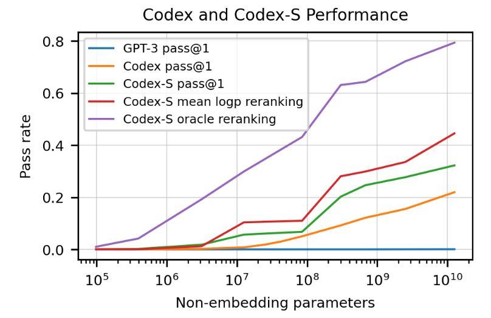
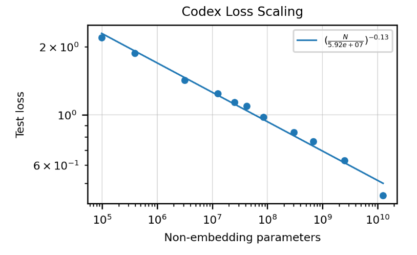
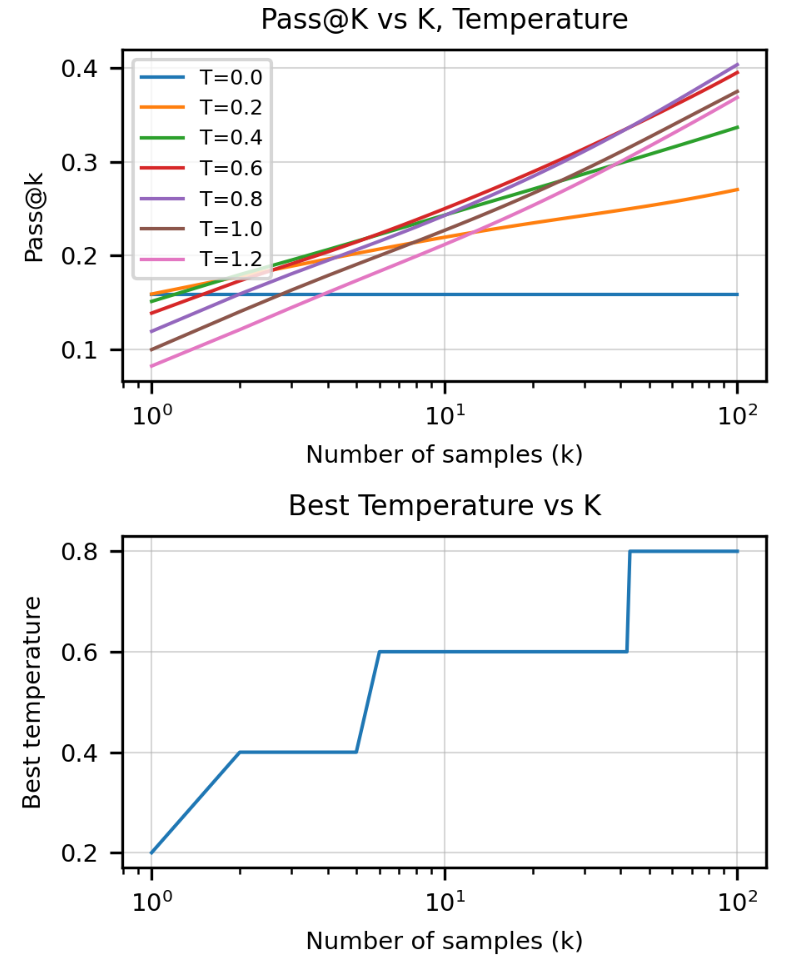
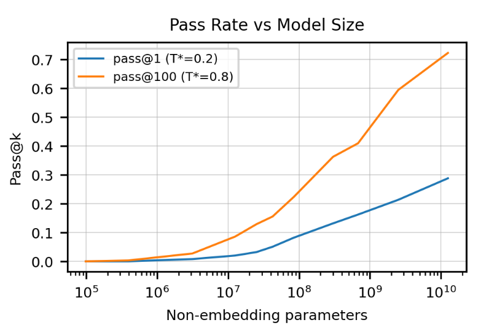
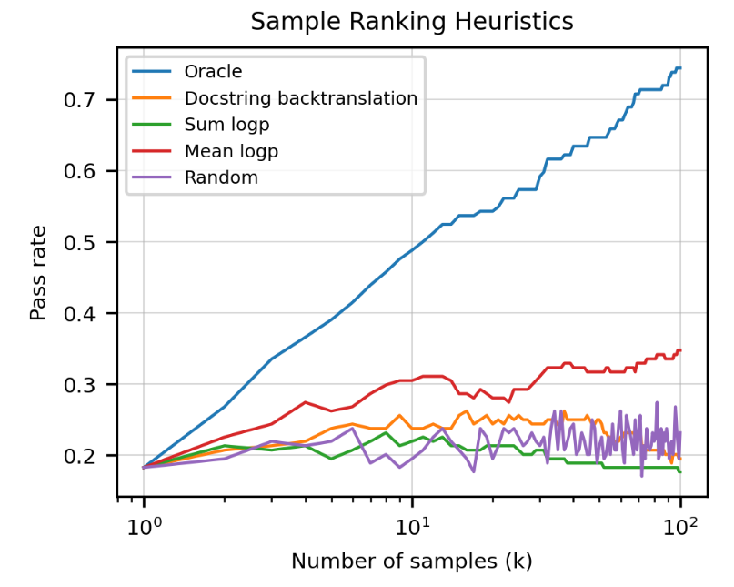
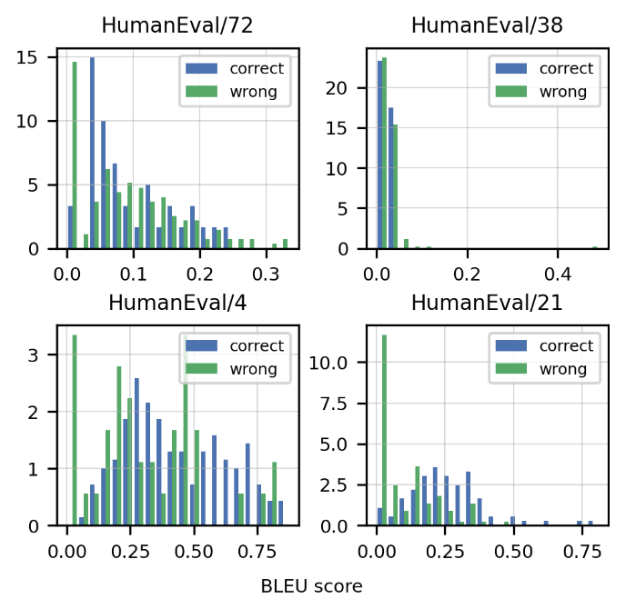
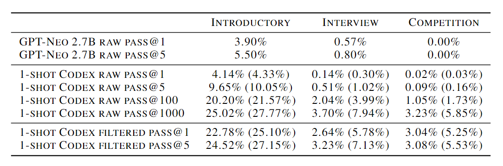
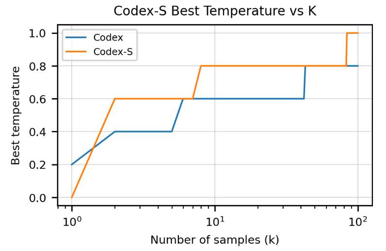
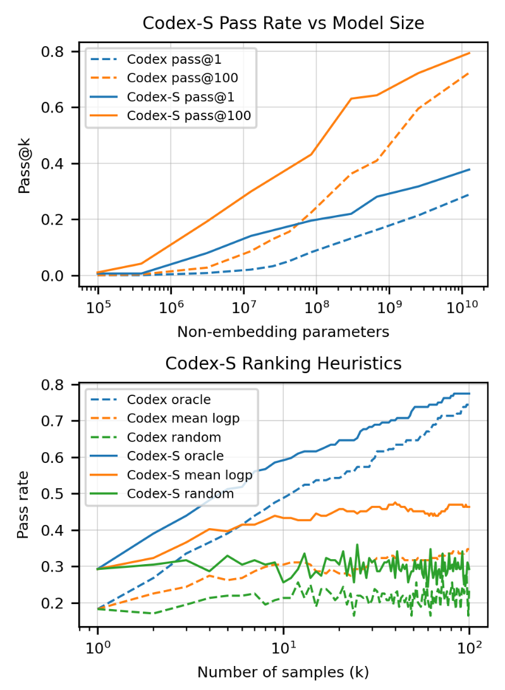

# Codex:   Evaluating Large Language Models Trained on Code

# 评估经过代码训练的大型语言模型


## 摘要

我们介绍了Codex，一个根据GitHub的公开代码进行微调的GPT语言模型，并研究了其Python代码编写能力。Codex的一个独特的生产版本为GitHub Copilot提供动力。在HumanEval上，我们发布了一个新的评估集，用于衡量从文档串合成程序的功能正确性，我们的模型解决了28.8%的问题，而GPT-3解决了0%，GPT-J解决了11.4%。此外，我们发现，从模型中反复抽样是一个令人惊讶的有效策略，可以为困难的提示提供工作解决方案。使用这种方法，我们在每个问题有100个样本的情况下解决了70.2%的问题。对我们的模型进行的仔细调查揭示了它的局限性，包括在描述长操作链的文件串和将操作与变量绑定方面的困难。最后，我们讨论了部署强大的代码生成技术的潜在的更广泛的影响，包括安全、保安和生态学。


## 1、Introduction

可扩展的序列预测模型（Graves，2014；Vaswani等人，2017；Child等人，2019）已经成为许多领域中生成和表示学习的通用方法，包括自然语言pro-cessing（Mikolov等人，2013；Sutskever等人，2014；Dai & Le，2015；Peters等人，2018；Radford等人，2018；Devlin等人。2018）、计算机视觉（Van Oord等人，2016；Menick & Kalchbrenner，2018；Chen等人，2020；Bao等人，2021）、音频和语音处理（Oord等人，2016；2018；Dhari- wal等人。2020年；Baevski等人，2020年）、生物学（Alley等人，2019年；Rives等人，2021年），甚至跨多种模式（Das等人，2017年；Lu等人，2019年；Ramesh等人，2021年；Zellers等人，2021年）。最近，语言模型也推动了程序合成这一长期挑战的进展（Simon, 1963; Manna & Waldinger, 1971），大型数据集中存在的代码（Husain等人，2019；Gao等人，2020）以及在这些数据集上训练的语言模型所产生的编程能力（Wang & Komatsuzaki, 2021）。流行的语言建模目标，如屏蔽语言建模（Devlin等人，2018年）和跨度预测（Raffel等人，2020年）也被调整为训练其编程对应的CodeBERT（冯等人，2020年）和PyMT5（Clement等人，2020年）。

同样，我们对GPT-3（Brown等人，2020）的早期调查显示，它可以从Python文档串中生成简单的程序。虽然是初级的，但这种能力是令人兴奋的，因为GPT-3没有被明确地训练为代码生成。鉴于大型语言模型在其他模式中的巨大成功和大量公开可用的代码，我们假设一个专门的GPT模型，称为Codex，可以在各种编码任务中表现出色。本文描述了几个早期的Codex模型，其后代为GitHub Copilot和OpenAI API中的Codex模型提供动力。



<center>Figure 1: 我们的模型在HumanEval数据集上的通过率是模型大小的函数。当为每个问题生成一个样本时，GPT-12B没有解决任何问题，但Codex（对代码进行微调）解决了28.8%的问题，而Codex-S（对正确实施的独立函数进一步微调）解决了37.7%的问题。从这里开始，通过为每个问题生成100个样本并选择具有最高平均对数概率的样本（44.5%得到解决）或选择通过单元测试的样本（77.5%得到解决），可以实现进一步的收益。所有样本的生成温度为0.8。 </center>
在这项工作中，我们专注于从文档串中生成独立的Python函数的任务，并通过单元测试自动评估代码样本的正确性。这与自然语言生成形成鲜明对比，在自然语言生成中，样本通常由启发式方法或人类评估员来评估。为了准确衡量我们的模型，我们创建了一个由164个带有单元测试的原始编程问题组成的数据集。这些问题评估了语言理解、算法和简单的数学，其中一些问题与简单的软件面试问题相当。我们将这些数据与评估框架一起发布在https://www.github.com/openai/human-eval。

为了解决我们测试集中的问题，我们从模型中生成多个样本，并检查它们中的任何一个是否通过了单元测试。只需一个样本，12B 参数 Codex 解决了 28.8% 的这些问题，300M 参数 Codex 解决了 13.2% 的这些问题。相比之下，6B 参数 GPT-J (Wang & Komatsuzaki, 2021) 在同一数据集上达到 11.4%，而所有 GPT 模型均达到接近 0%。为了提高我们的模型在从文档字符串进行函数合成任务的性能，我们在独立的、正确实现的函数上微调 Codex。生成的模型 Codex-S 使用单个样本解决了 37.7% 的问题。图 2 展示了我们数据集中不同难度的问题，以及正确的模型生成解决方案。

现实世界的编程任务往往涉及方法的迭代和错误的修正，这一点通过从我们的模型中生成许多样本并选择一个通过所有单元测试的样本来近似。在100个样本中，Codex-S能够为77.5%的问题生成至少一个正确的函数。这个结果表明，准确的代码样本可以通过启发式排名来选择，而不是完全评估每个样本，后者在部署中可能不可能或不实际。事实上，我们发现具有最高平均对数概率的样本在44.5%的问题上通过了单元测试。

最后，我们讨论了这些 Codex 模型以及更普遍地日益强大的代码生成模型的局限性和潜在的更广泛影响。


## 2、Evaluation Framework

在这一节中，我们将讨论我们评估框架的细节。我们首先定义了pass@k指标，并解释了它相对于标准匹配指标的优势。接下来，我们描述了被称为 "HumanEval "的手写问题数据集，我们创建这个数据集的目的是为了给我们的模型做基准。最后，我们讨论了我们用来安全执行模型生成的代码的沙盒环境。

### 2.1、Functional Correctness

代码的生成模型主要是通过与参考方案的匹配来衡量的，匹配可以是精确的，也可以是模糊的（如BLEU分数）。然而，最近的工作显示了基于匹配的代码衡量标准的缺陷。例如，Ren等人（2020年）发现BLEU在捕捉代码特有的语义特征方面存在问题，并建议对该分数进行一些语义上的修改。

更为根本的是，基于匹配的度量无法计算出与参考方案功能相当的庞大而复杂的程序空间。因此，最近在无监督代码翻译（Lachaux等人，2020年）和伪代码到代码翻译（Kulal等人，2019年）方面的工作已经转向功能正确性，如果一个样本通过了一组单元测试，则认为它是正确的。我们认为，这种衡量标准也应适用于以文档串为条件的代码生成。

也许评估功能正确性的最有说服力的理由是，人类开发者用它来判断代码。一个被称为 "测试驱动开发 "的框架规定，在开始实施之前，将软件需求转化为测试用例，而成功的定义是通过这些测试的程序。虽然很少有组织采用完全的测试驱动开发，但新代码的集成通常取决于创建和通过单元测试。


<center>Figure 2. 来自HumanEval数据集的三个例子问题，其中Codex-12B的单个样本通过单元测试的概率为0.9、0.17和0.005。提供给模型的提示以白色背景显示，而模型生成的成功完成则以黄色背景显示。虽然不能保证问题的新颖性，但所有的问题都是手写的，而不是从现有的资源中用程序复制的。 </center>
Kulal等人（2019）使用 *pass@k* 指标评估功能正确性，每个问题生成 $k$ 个代码样本，如果有任何样本通过单元测试，则认为问题已解决，并报告问题解决的总比例。然而，以这种方式计算 *pass@k* 会有很高的变异性。相反，为了评估 *pass@k*，我们为每个任务生成 $n≥k$ 的样本（在本文中，我们使用 $n=200$，$k≤100$），计算通过单元测试的正确样本 $c ≤ n $的数量，并计算出无偏估计器：
$$
\text { pass@ } k:=\underset{\text { Problems }}{\mathbb{E}}\left[1-\frac{\left(\begin{array}{c}
n-c \\
k
\end{array}\right)}{\left(\begin{array}{l}
n \\
k
\end{array}\right)}\right]
$$
直接计算这个估计值会导致非常大的数字和数值上的不稳定。在图3中，我们包括一个数值稳定的numpy实现，它简化了表达式并逐项评估了乘积。人们可能会想用 $1-(1-\hat{p})^{k}$ 来估计pass@k，其中 $\hat{p}$ 是pass@1的经验估计值，但我们在附录A中表明它是有偏见的。

用于计算 pass@k 的无偏估计的数值稳定脚本：

```python
def pass_at_k(n, c, k):
    """
    :param n: total number of samples
    :param c: number of correct samples
    :param k: k in pass@k
    """
    if n - c < k: return 1.0
    return 1.0 - np.prod(1.0 - k/np.arange(n - c + 1, n + 1))
```

后来，我们提供证据表明，BLEU分数可能不是功能正确性的可靠指标，因为我们的模型生成的功能不等的程序（保证在某些输入上与参考解不一致）往往比功能等效的程序有更高的BLEU分数。


### 2.2、HumanEval:  Hand-Written Evaluation Set

我们在一组164个手写的编程问题上评估功能正确性，我们称之为HumanEval数据集。每个问题都包括一个函数符号、文件串、主体和几个单元测试，每个问题平均有7.7个测试。这些任务必须是手写的，因为我们的模型是在GitHub的很大一部分上训练的，而GitHub已经包含了来自不同来源的问题的解决方案。例如，有十多个公共资源库包含了Codeforces问题的解决方案，它们构成了最近提出的APPS数据集的一部分。

HumanEval数据集中的编程任务评估语言理解、推理、算法和简单数学。我们发布HumanEval数据集，以便其他人能够评估功能的正确性并衡量他们的模型的解决问题的能力。数据集可以在此处找到：https://www.github.com/openai/human-eval. 


### 2.3、Sandbox for Exxcuting Generated Programs

由于公开的程序具有未知的意图，而且生成的程序往往不正确，执行这些程序会带来安全风险。事实上，已知GitHub包含改变或更改其环境的恶意程序(Rokon等人，2020)。

因此，我们开发了一个沙盒环境，以便针对单元测试安全地运行不受信任的程序。我们的目标是防止这些程序修改、获得持久性、访问敏感资源，或从主机或网络上渗出数据。由于OpenAI的训练基础设施是建立在Kubernetes和云服务上的，我们设计的沙盒可以解决这些环境的局限性，同时保持与它们的使用模式相适应。

我们选择gVisor容器运行时间（Lacasse，2018）作为主要的主机保护组件。由于像Docker这样的容器运行时可以与容器共享主机资源，恶意容器可能会损害主机。gVisor通过模拟其资源来保护主机，在主机和其容器之间引入安全边界。与网络相邻的主机和服务受到基于eBPF的防火墙规则的保护，除了实验控制所需的连接外，这些规则阻止了入站和出站的连接。


## 3、Code Fine-Tuning

我们在代码上对包含多达12B个参数的GPT模型进行了微调，以产生Codex。与GPT相比，Codex在HumanEval数据集上表现出非同一般的性能。事实上，如果我们为每个问题生成和评估100个样本，并挑选一个通过单元测试的样本，Codex能够解决HumanEval中的大多数问题。当限制在每个问题进行一次评估的预算内时，用Codex生成多个样本并选择平均对数概率最高的一个，就能获得显著的收益。

### 3.1. Data Collection

我们的训练数据集是在2020年5月从GitHub上的54个百万级公共软件库中收集的，包含179GB的1MB以下的独特Python文件。我们过滤掉了可能是自动生成的、平均行长大于100的、最大行长大于1000的、或含有少量字母数字字符的文件。过滤之后，我们的最终数据集共有159GB。

### 3.2. Methods

由于 Codex 是根据自然语言提示进行评估的，我们假设从 GPT-3（Brown 等人，2020）模型系列中进行微调将是有益的，该系列已经包含强大的自然语言表示。令人惊讶的是，从预先训练的语言模型开始时，我们没有观察到改进，可能是因为微调数据集太大了。尽管如此，从 GPT 微调的模型收敛得更快，因此我们将此策略应用于所有后续实验。

我们使用与相关的GPT模型相同的学习率来训练Codex，采用175步线性预热和余弦学习率衰减。我们总共训练了1000亿个标记，使用Adam 优化器，$\beta_{1}=0.9$，$\beta_{2}=0.95$，$\epsilon=10^{-8}$，权重衰减系数为0.1。

为了最大限度地利用GPT的文本表示，我们的代码词法以GPT-3文本标记器为基础。由于GitHub代码中的单词分布与自然文本不同，这个标记器对表示代码不是很有效。最大的低效率来源来自于对空白处的编码，因此我们增加了一组额外的标记，用于表示不同长度的空白处。这使我们能够使用大约30%的标记来表示代码。

为了计算 pass@k，我们将每个 HumanEval 问题组合成一个由标题、签名和文档字符串组成的提示，如图 2 所示。我们从 Codex 中采样令牌，直到遇到以下停止序列之一： '\nclass'、'\ndef'、'\n#'、'\nif' 或 '\nprint'，因为模型将继续生成其他函数或语句。我们使用核采样 (Holtzman et al., 2020)，顶部 p = 0.95 进行这项工作中的所有采样评估。

### 3.3、Results




<center>Figure 4.  模型交叉熵测试损失是在我们的 Python GitHub 代码语料库的保留拆分上测量的。即使在代码微调之后，在 GPT-3 中观察到的性能与模型大小的平滑幂律缩放似乎仍然成立。</center>
在图 4 中，我们根据 Codex 模型大小绘制了保留验证集上的测试损失。 我们发现，正如语言模型测试损失遵循模型大小的幂律 (Kaplan et al., 2020)，代码微调后的测试损失遵循具有函数形式的类似幂律 ($\left(\frac{N}{5.92 \times 10^{7}}\right)^{-0.13}$ )其中 $N$ 是模型中非嵌入参数的数量。



<center>Figure 5.  在上图中，我们将pass@k与不同温度设置下的样本数（k）进行对比。当样本数较多时，温度越高越好，这可能是由于样本多样性的增加。在下图中，我们绘制了每个k的最佳温度设置，通过取上图的上半部分得到。 </center>
在评估 pass@k 时，重要的是针对特定的 k 值优化采样温度。在图 5 中，我们绘制了 pass@k 与样本数 k 和采样温度的关系。我们发现较高的温度对于较大的 k 是最佳的，因为生成的样本集具有更高的多样性，并且该度量仅奖励模型是否生成任何正确的解决方案。



<center>Figure 6. 使用 pass@1 和 pass@100 的最佳温度 0.2 和 0.8，我们将这两个指标绘制为模型大小的函数。性能似乎可以平滑地扩展为对数参数中的 sigmoid。 </center>
特别是，对于 679M 参数模型，pass@1 的最佳温度是 T∗= 0.2，而 pass@100 的最佳温度是 T∗= 0.8。在这些温度下，我们发现 pass@1 和 pass@100 作为模型大小的函数平滑缩放（图 6）。

Pass@k也可以解释为对 $k$ 个样本中的最佳样本进行评估的结果，其中最佳样本是由一个事先了解单元测试的神谕者挑选的。从实际的角度来看，我们也对这样的设定感兴趣，即我们必须从 $k$ 个样本中选择一个单一的样本，而不能接触到神谕。例如，当模型被用作用户提供提示的自动完成工具时，我们没有单元测试，但希望只返回一个完成度给用户进行评估，以便不至于让他们不知所措。

受语言建模中类似工作的启发，我们发现选择具有最高平均令牌对数概率的样本优于评估随机样本，而根据总对数概率选择样本的效果会比随机挑选略差。图7显示了对Codex-12B的样本（温度为0.8）应用这些启发式方法的好处。



<center>Figure 7. 在我们可以生成多个样本，但只评估一个样本的情况下，模型的性能。我们可以通过选择具有最高平均对数概率的解决方案（红色）或具有最高反译分数的解决方案（橙色）来做得更好，这在第5节中有所描述。蓝线代表了使用具有单元测试先验知识的神谕获得的理论上的最佳性能。 </center>
最后，我们根据参考解决方案计算所有 Codex-12B HumanEval 样本（温度为 0.8）的 BLEU 分数。对于每个问题，当我们绘制正确和错误解决方案的 BLEU 分数分布时，我们会注意到显着的重叠（图 8）。由于保证了不正确的解决方案在功能上与参考解决方案不等效，因此我们得出结论，BLEU 分数的提高可能并不表明实践中功能正确率的提高。



<center>Figure 8. 来自Codex-12B的4个随机任务的正确（蓝色）和错误（绿色）解决方案的BLEU得分概率密度，来自HumanEval。请注意，这些分布并不是完全可分的，这表明对BLEU分数的优化并不等同于对功能正确性的优化。</center>


### 3.4、Comparative Analysis of Related Models and Systems--相关模型和系统对比分析

最近两项与Codex精神相似的工作是GPT-Neo（Black等人，2021）和GPT-J（Wang & Komatsuzaki，2021），它们是在The Pile（Gao等人，2020）上训练的，该数据集包含来自不同来源的文本以及8%的GitHub代码。更广泛的研究界发现，这些模型在定性编程评估中优于现有的GPT系统（Woolf, 2021）。

我们使用 HumanEval 数据集证实了这些发现，表明 GPT-Neo 达到了 6.4% 的 pass@1 和 21.3% 的 pass@100，而同等规模的 GPT 模型在这两个指标上都达到了接近 0%。 我们看到了性能的显着进步，GPT-Neo-2.7B 大致相当于 Codex-85M（参数减少 30 倍）。 同样，GPT-J-6B 达到 11.6% pass@1 和 27.7% pass@100，大致相当于 Codex-300M（少 20 倍参数）。 通过率通过在 GPT-Neo 的 0.2、0.4 和 0.8 温度下以及 GPT-J 的 0.2 和 0.8 温度下评估的最佳结果获得。 多种模型尺寸的详细结果见表 1。

<center>Table 1. 针对 HumanEval 的 Codex、GPT-Neo 和 TabNine 评估。我们发现 GPT-J pass@1 介于 Codex-85M 和 Codex-300M 性能之间。</center>


最后，我们将 Codex 与来自 Tabnine 的最大免费模型进行了基准测试，这是一种领先的代码自动完成系统，达到 2.6% pass@1（T = 0.4）和 7.6% pass@100（T = 0.8）。这大致相当于我们套件中最小的模型之一 Codex-12M。

### 3.5、Results on the APPS Datasets

最近，Hendrycks等人（2021）引入了APPS数据集来衡量语言模型的编码挑战能力。APPS数据集由5000个编码问题的训练和5000个测试例子组成，每个例子都有一组单元测试，对于训练数据，有一组正确的解决方案。大多数APPS测试问题不是作为单一功能的合成任务，而是作为全程序的合成，从stdin读取输入并将输出打印到stdout，与主要的Codex训练数据不同。

<center>Table 2.  来自上面引用的 APPS 论文的微调 GPT-Neo 数字。对于 Codex-12B，在某些测试中超时的通过程序的数量在括号中。我们使用温度 0.6 进行采样以覆盖 pass@k 中的所有 k，因此原始 pass@1 结果可以通过较低的温度得到改善。</center>



在介绍 APPS 的论文中，作者对一些语言模型进行了基准测试并报告了两个指标：模型找到正确解决方案的问题百分比（称为“严格准确性”）和单元测试通过的百分比，即使解决方案是不正确的。 报告后一个度量只是为了减少测量的方差，因为第一个度量的结果非常低。 我们避免使用这个指标，只关注“严格的准确性”， 与前面的部分一样，我们报告各种 k 的 pass@k 数字（表 2）。 我们还考虑了另外两个在编码竞赛中众所周知的因素：

- 在编码竞赛和APPS数据集中，任务描述中提供了3个输入/输出的例子。我们利用这一点，从模型中抽出1000个解决方案，只过滤掉那些通过这3个单元测试的解决方案（如果存在这样的解决方案）。然后，我们计算这个过滤集的通过率，并称其为过滤后的pass@k。没有过滤的结果被称为原始pass@k。
- 在编码竞赛和 Codex 的结果中通常都会找到正确的解决方案，但它在算法上的效率不足以被视为通过。虽然这在比赛中是不可接受的，但我们还报告了 Codex 生成的解决方案的数量，这些解决方案在任何单元测试中都没有失败，但在其中一些测试中超时。我们在评估中使用 3 秒的超时时间。

为了弥补 Codex 没有在 APPS 上微调的事实，我们将任务描述中的单个输入/输出示例附加到文档字符串作为格式提示。我们在表 2 中将此设置表示为“1-shot”，并发现 Codex-12B 评估的 1-shot 实现了与在 APPS 上微调的 GPT-Neo 模型相当的性能。与我们之前的发现一致，每个任务生成和评估多达 1000 个样本有很大的好处，尽管对于更困难的问题，解决方案通常效率不够高，无法通过时间限制。最后，评估通过每个问题的 3 个公共单元测试的第一个样本会产生比原始 pass@100 样本更高的性能。


## 4、Supervised Fine-Tuning

除了独立函数之外，GitHub 上的 Python 代码还包含类实现、配置文件、脚本，甚至是用于存储数据的文件。这段代码似乎与从文档字符串合成函数无关，我们假设分布不匹配会降低 HumanEval 的性能。

为了使 Codex 适应感兴趣的任务的分布，我们从正确实现的独立函数中构建了一组训练问题，并将它们用于额外的监督微调。我们描述了收集这些示例的两种方法：来自竞争性编程网站和来自具有持续集成的存储库。我们将监督微调模型称为 Codex-S，并表明它们在模型大小上产生一致的增益。

### 4.1、Problems from Competitive Programming

编程竞赛和面试准备网站使用隐藏单元测试来自动判断提交的功能正确性。这些问题是独立的，带有编写良好的问题陈述，并且通常具有出色的测试覆盖率。此外，这些问题测试了广泛的核心技能和困难的算法推理。

我们从几个流行的编程竞赛和面试准备网站收集了问题陈述、函数签名和解决方案。然后我们将这些组合成类似于 HumanEval 的编程任务，使用问题描述作为文档字符串。由于完整的测试套件通常是隐藏的，我们从问题陈述中找到的示例创建单元测试，或者通过提交不正确的解决方案提取额外的测试用例。总共，我们以这种方式策划了 10,000 个问题。


### 4.2、Problems from Continuous Integration--持续集成的问题

接下来，我们整理了开源项目中的编程问题。利用 sys.setprofile，我们能够跟踪和收集集成测试期间调用的所有函数的输入和输出。然后可以使用此数据为功能创建单元测试。

采用持续集成 (CI) 的项目是跟踪的理想候选者。我们按照 CI 配置文件中的命令（包含构建和测试命令）来设置虚拟环境、安装依赖项并运行集成测试。

我们考虑使用 travis 和 tox 作为其 CI 框架的 GitHub 存储库，因为它们是两个最流行的 CI 工具。我们还使用了来自 python 包索引 (PyPI) 中的 pip 包的公开源代码。由于这些项目包含不受信任的代码，因此在上述沙盒环境中运行集成测试非常重要。

虽然有数百万个潜在的函数可以解决问题，但我们只收集了大约 40,000 个，因为并非所有函数都接受输入和返回输出。即使他们这样做了，大多数在运行时捕获的对象也不能在沙盒外被提取和恢复，除非该项目被安装。

由于我们的跟踪方法为所有调用的函数生成输入和输出，即使是项目导入的内置和库调用也变成了问题。出于这个原因，来自跟踪的函数往往是命令行实用程序的构建块。要在这些任务中表现出色，模型不需要了解高级算法和数据结构。相反，它需要能够按照说明来实现文档字符串中指定的功能。因此，追踪补充了编码竞争问题的难题性质，并拓宽了任务的分布。


### 4.3、Filtering Problems

在前面的章节中，我们介绍了我们用来自动创建训练问题的两种方法。然而，目前还不清楚如何控制质量。有些提示没有充分说明所实现的功能，在这种情况下，一个完全有效的解决方案可能会被单元测试错误地惩罚。有些问题是有状态的，随后的执行可能导致不同的结果。

为了解决这些问题，我们使用Codex-12B为每个策划的问题生成100个样本。如果没有样本通过单元测试，我们就认为该任务是模糊的或太难了，并将其过滤掉。我们重新进行了几次验证，以去除有状态或不确定的问题。


### 4.4、Methods

我们根据这些训练问题对 Codex 进行微调，以生成一组“监督微调”模型，我们称之为 Codex-S。为了从训练问题中生成示例，我们将问题组装成图 2 所示的格式。如果批次中有不同长度的提示，我们将较短的提示填充到最长提示的长度，以便参考解决方案中的第一个标记在上下文中排列。

我们训练以最小化参考解决方案的负对数似然，并掩盖提示中任何标记的损失。我们使用与微调 Codex 一样大的 1/10 学习率进行训练，但遵循相同的学习率时间表，并训练直到验证损失达到稳定水平(小于 10B 令牌)。


### 4.5、Results

与 Codex 一样，我们首先计算$ 1 ≤k ≤100$ 时评估 pass@k 的最佳温度。我们发现对于所有$ k > 1$，Codex-S 更喜欢稍高的温度，这可能反映了 Codex-S 捕获的分布比 Codex 更窄的事实。我们使用 $T^∗= 0 $来计算 pass@1 和 $T^∗= 1 $来计算 pass@100。

接下来，我们将 Codex-S 与 Codex 在 pass@1 和 pass@100 上进行比较。 Codex-S 在 pass@1 上的平均优势比相应的 Codex 高 6.5 个百分点，在 pass@100 上的平均优势更大，为 15.1 个百分点。

我们还绘制了 Codex-S-12B 的不同样本选择启发式方法与 Codex-12B 的相同启发式方法的性能。当按平均对数概率对 1 到 100 个样本进行排序时，随机排序的平均收益为 11.6 个百分点，比 Codex 的相应收益高出 2 个百分点以上。



<center>Figure 9. 最佳采样温度是 Codex 和 Codex-S 生成的样本数量的函数。对于任何特定的 k 值，Codex-S 通常需要更高的温度，这可能是为了补偿它模拟更窄分布的事实。 </center>




<center>Figure 10. 在第 3 节中提出的指标上比较 Codex-S 与 Codex。Codex-S 在 pass@1 和 pass@100 上的参数效率要高一到两个数量级，并且使用 Codex-S 的 log-prob 样本排序产生类似的结果优于 Codex 所做的随机抽样。 </center>


## 5、Docstring Generation

使用 Codex 从文档字符串生成代码是可能的，因为代码通常跟随在文档字符串之后，但是诱导 Codex 从代码生成文档字符串并不容易。尽管如此，出于安全原因，我们还是有动力生成文档字符串编写模型，因为这样的模型可用于描述生成代码背后的意图。使用上一节中描述的训练问题，我们可以轻松地为代码条件文档字符串生成创建训练数据集。

具体来说，对于每个训练问题，我们通过连接函数签名、参考解决方案和文档字符串来组装一个训练示例。正如我们通过最小化参考解决方案的负对数似然来训练 Codex-S 一样，我们通过最小化文档字符串的负对数似然来训练文档字符串生成模型 Codex-D。

当我们对代码生成模型进行基准测试时，我们在 HumanEval 数据集上测量 pass@k，其中正确性是通过通过一组单元测试来定义的。但是，没有类似的方法可以自动评估文档字符串样本。因此，我们手动对示例文档字符串进行分级，如果文档字符串唯一且准确地指定了代码主体，则认为该文档字符串是正确的。由于此过程耗时，我们仅对每个问题的 10 个样本进行评分，总共 1640 个问题，来自 Codex-D-12B，温度为 0.8。

Codex-D 经常生成不正确的单元测试以及文档字符串，但我们在评分期间会忽略这些。但是，当模型只是将代码体复制到文档字符串中时，我们认为文档字符串不正确。我们观察到的最常见的失败模式是文档字符串模型遗漏了一个重要的细节（例如“答案必须保留两位小数”）或者当它对函数名称进行过度条件并发明与函数体无关的问题时。

<center>Table 3. 我们的文档字符串生成模型 Codex-D 的通过率，由于缺乏真实的自动评估，该模型通过对每个任务的 10 个样本进行手动评分来评估。与 Codex-S 相比，我们发现类似但通过率较低。 </center>
|    MODEL    | PASS@$1$ | PASS@$10$ |
| :---------: | :------: | :-------: |
| CODEX-S-12B |  32.2%   |   59.5%   |
| CODEX-D-12B |  20.3%   |   46.5%   |

如表 3 所示，Codex-D 的通过率较低，但与相同温度下 Codex-S 的相应通过率相当。对于哪个方向应该产生更高的通过率，我们没有强有力的假设。虽然生成文档字符串可能更宽容，因为自然语言语法没有代码语法那么严格，但我们数据集中的文档字符串可能质量较低，因为开发人员倾向于花费更少的时间来编写文档字符串。事实上，我们的模型会生成诸如“我刚刚在网上找到这个函数”和“这个测试没有正确编写，这不是我的解决方案”之类的文档字符串。

最后，使用文档字符串模型，我们还有另一种方法可以从一组$ k$ 个样本中选择一个样本。 我们可以选择使反向翻译目标 P (ground truth docstring|generated sample) 最大化的样本，而不是像前两节中研究的那样选择具有最佳平均对数概率的样本，其中 $P$ 是使用 Codex-D 评估的。 不幸的是，在图 7 中，我们展示了通过反向翻译对样本进行排序的情况下执行平均对数概率排序，尽管它优于随机排序。 这种启发式方法似乎也很快过拟合。


## 8、Related Work

深度学习的复兴导致了程序学习领域的巨大进步。两种流行的神经程序学习方法是程序归纳和程序合成。

在程序归纳中，模型直接从潜在程序表示生成程序输出。 Learning to Execute (Zaremba & Sutskever, 2014) 证明模型可以执行简单的任务，例如加法和记忆。 后来的程序归纳尝试结合了基于现代计算设备的归纳偏差，例如神经图灵机（Graves 等人，2014）、记忆网络（Weston 等人，2015；Sukhbaatar 等人，2015）、神经 GPU (Kaiser & Sutskever, 2015) 和可微神经计算机 (Graves et al., 2016)。 最近的方法，如神经程序解释器（Reed &德弗雷塔斯，2016； 申等人，2018； Pierrot 等人，2021 年）和 Universal Transformer（Dehghani 等人，2019 年）发现递归是程序归纳中的一个有用组成部分。

在程序合成中，模型显式地生成程序，通常来自自然语言规范。最流行的经典方法之一使用概率上下文无关语法 (PCFG) 来生成程序的抽象语法树 (AST)。 Maddison & Tarlow (2014) 通过学习用于条件子节点扩展的状态向量来改进此设置。后来，Allamanis 等人。 (2015) 将这一想法应用于文本到代码的检索，Yin & Neubig (2017) 将其用于文本条件代码生成。 Code2seq (Alon et al., 2018) 发现 AST 也可以用于代码到文本的生成。

程序也可以在不通过 AST 表示的情况下合成。欣德尔等人。 (2012) 研究了代码的 n-gram 语言模型，发现代码比自然语言更容易预测。 Latent Predictor Networks (Ling et al., 2016) 表明，当借助允许卡片属性的潜在模式辅助时，字符级语言模型可以生成用于在在线竞技场中实现 Magic the Gathering 卡片的工作代码。被复制到代码中。 DeepCoder (Balog et al., 2017) 训练了一个模型来预测源代码中出现的函数，该模型可用于指导程序搜索。

随着大型自然语言模型的成功（Devlin et al., 2018; Radford et al., 2019; Liu et al., 2019; Raffel et al., 2020; Brown et al., 2020）也被应用于程序合成。 Code-BERT (Feng et al., 2020) 在与函数配对的文档字符串上训练了 BERT 目标，并在代码搜索上获得了很好的结果。 PyMT5 (Clement et al., 2020) 在精神上与我们的工作相似，并使用 T5 目标来训练一个系统，该系统可以在 {signature, docstring, body} 的非重叠子集之间进行转换。

我们使用功能正确性来对我们的模型进行基准测试，并通过更多采样观察到该指标的改进。 SPoC (Kulal et al., 2019) 考虑了从具有固定编译预算的伪代码生成功能正确代码的问题，这类似于我们的 pass@k 指标。 TransCoder (Lachaux et al., 2020) 训练了一个系统以无监督的方式在编程语言之间进行翻译，并且还观察到功能正确性比 BLEU 分数更好地捕捉了他们模型的能力。事实上，ContraCode (Jain et al., 2020) 利用功能正确程序的大空间来训练对比代码模型，从而提高了模型在类型推断等任务上的性能。最后，RobustFill (Devlin et al., 2017) 观察到，找到与输入示例一致的程序的最佳方法是通过波束搜索合成多个样本。

两个早期用于对神经编程系统进行基准测试的特定领域数据集是 FlashFill (Gulwani, 2011; Gulwani et al., 2012) 和 Hearthstone (Ling et al., 2016)，尽管社区已经趋向于更广泛和更困难的数据集. Barone & Sennrich (2017) 提出了一个由 Python 声明、文档字符串和从 GitHub 抓取的正文组成的大型训练和评估数据集。 CodeSearchNet 挑战（Husain 等人，2019 年）从 GitHub 构建了一个更大的语料库，其中包含来自多种流行编程语言的数据。最近，CodeXGLUE (Lu et al., 2021) 利用最近提出的 CodeBLEU 指标 (Ren et al., 2020) 聚合了几个编程基准。与我们的评估工作最相关的是 APPS (Hendrycks et al., 2021) 基准，用于根据竞争性编程网站 Codeforces 的问题测量功能正确性。

最后，我们注意到编码是一项广泛的活动，它所涉及的不仅仅是从文档字符串中合成代码。Tufano等人（2020）使用 Transformers 为代码生成单元测试，其性能优于商业产品。Aye等人（2021）为 Facebook 构建了一个内部自动完成工具，并发现接受用户完成的培训提高了系统性能。开发还需要定位和修复错误。早期作品使用静态或动态代码分析（Agrawal 等人，1995；Korel & Rilling，1997）、学习关联规则（Jeffrey 等人，2009）和遗传编程（Goues 等人，2012）来调试错误代码.这些方法依赖于针对测试套件运行，不仅可以评估建议的正确性，还可以暴露执行跟踪或搜索解决方案中的问题。最近的作品（Tufano 等人，2019 年；Drain 等人，2021 年）将错误修复视为从错误程序到正确程序的神经机器翻译。然而，这些作品使用与参考的精确匹配而不是功能正确性，引用 Qi 等人（2015 年）的发现，（Goues 等人，2012 年）中通过遗传搜索提出的大多数解决方案都通过删除失败的功能通过了弱测试套件。人类开发人员经常编写覆盖范围有限但有针对性的测试套件，但这并不总是对算法有效，突出了评估程序正确性的挑战。

## 9、Conclusion

我们研究了是否有可能训练大型语言模型从自然语言文档字符串中生成功能正确的代码体。 通过在 GitHub 上对 GPT 代码进行微调，我们发现我们的模型在人工编写问题的数据集上表现出强大的性能，其难度与简单的面试问题相当。 通过在与评估集更相似的分布上进行训练，以及从模型中生成多个样本，可以提高模型性能。 我们还发现训练一个模型来完成从代码体生成文档字符串的反向任务很简单，并且这些模型的性能配置文件相似。 最后，我们扩展了代码生成模型的更广泛影响，并讨论了模型限制，发现了很大的改进空间。


