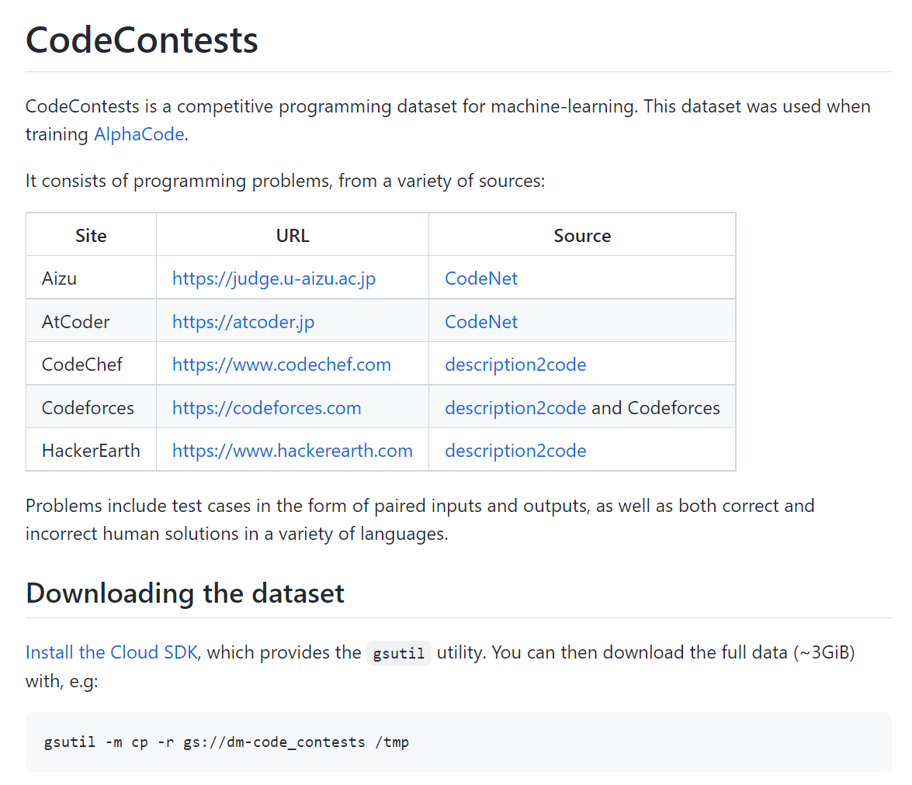
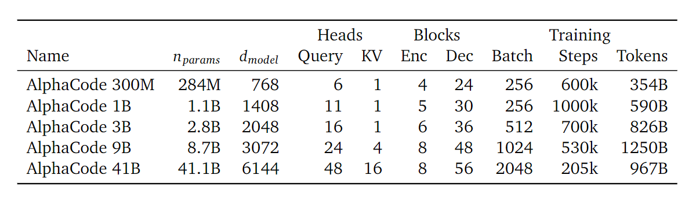

# Competition-Level Code Generation with AlphaCode

编程是一种强大且无处不在的解决问题的工具。开发可以帮助程序员甚至独立生成程序的系统可以使编程更加高效和可访问，但迄今为止，在人工智能中融入创新已被证明具有挑战性。最近的大规模语言模型已经展示了令人印象深刻的代码生成能力，并且现在能够完成简单的编程任务。然而，当对更复杂、看不见的问题进行评估时，这些模型仍然表现不佳，这些问题需要解决问题的技能，而不仅仅是将指令翻译成代码。例如，需要了解算法和复杂自然语言的竞争性编程问题仍然极具挑战性。为了解决这一差距，我们引入了 AlphaCode，这是一种代码生成系统，可以为这些需要更深入推理的问题创建新颖的解决方案。在 Codeforces 平台上最近的编程比赛的模拟评估中，AlphaCode 在超过 5,000 名参与者的比赛中平均排名前 54.3%。我们发现三个关键组件对于实现良好和可靠的性能至关重要：(1) 用于训练和评估的广泛而干净的竞争性编程数据集，(2) 大型且高效采样的基于转换器的架构，以及 (3) 大型-规模模型抽样以探索搜索空间，然后根据程序行为过滤到一小组提交。

## 1、Introduction

计算机编程已成为贯穿科学、工业和日常生活的通用问题解决工具。作为这种增长的一部分，对可以提高程序员生产力（Matsakis 和 Klock，2014 年）或使编程和编程教育更容易获得（Resnick 等人，2009 年）的工具的需求不断增加。开发能够有效建模和理解代码的人工智能系统可以改变这些工具以及我们与它们交互的方式。可以生成代码的系统不仅有用，而且是可以更好地理解人工智能及其与编程的关系的垫脚石。

生成解决指定任务的代码需要在可能程序的巨大结构空间中进行搜索，而奖励信号非常稀少。单个字符的编辑可以完全改变程序的行为，即使它们不会导致崩溃，即使是同一个问题，解决方案看起来也会有很大的不同，而且判断一个部分或不正确的程序是否有用是一个困难的挑战。因此，大多数先前的工作都局限于有限的特定领域的编程语言（Gulwani，2011）或短代码片段（Bruch等人，2009；Raychev等人，2014）。

最近，基于转化器的大规模语言模型（Vaswani等人，2017），用于实现生成文本的显著性能（Brown等人，2020），已经成功生成了解决Python中简单编程问题的代码（Austin等人，2021；陈等人，2021）。我们模型的精简版，没有第4节中描述的修改，与Codex的表现相似（表A3）。然而，Codex论文和类似工作中使用的问题主要由简单的任务描述和简短的解决方案组成--远远不是现实世界编程的全部复杂性。从一个长的自然语言任务描述开始，用通用编程语言（如C++或Python）生成整个程序，仍然是一个开放的问题。生成短代码片段和整个程序之间的难度差异可以类似于指令性问题和声明性问题的解决。生成简短的代码片段通常相当于将任务描述直接翻译成代码，有时也会简化为调用正确的API调用。相比之下，生成整个程序往往依赖于对任务的理解，并弄清楚如何完成它，这需要更深入的算法推理。

竞争性编程问题代表了在所有这些方面向前迈出的重要一步。解决此类问题需要理解复杂的自然语言描述，对以前未曾见过的问题进行推理，掌握广泛的算法和数据结构，并精确地实现可以跨越数百行的解决方案。通过在详尽的未知测试套件上执行解决方案来评估解决方案，检查边缘情况下的正确行为以及执行速度。用于评估的测试用例是隐藏的这一事实是挑战的重要组成部分。这些复杂的问题是为每场比赛新创建的，参赛者可以利用以前比赛的解决方案（隐含地，通过记住旧问题，或明确地，通过搜索它们）。此外，竞争性编程非常流行；国际大学编程竞赛 (ICPC, 2021) 和国际信息学奥林匹克竞赛 (IOI, 2021) 等活动被广泛认为是计算机科学领域最负盛名的竞赛，吸引了来自世界各地的数十万参与者。使用人类从此类经过实战考验的竞赛中发现具有挑战性的问题可确保对捷径的鲁棒性，并为智能的许多方面提供有意义的基准。

Figure 1. AlphaCode在10次模拟Codeforces竞赛中的排名和估计评分（右为佳）。AlphaCode在10场比赛中，在比赛参与者中平均排名前54.3%，并取得了1238的估计平均评分。(a)显示了参赛者的评分（Y轴）和他们在每场比赛中的排名（X轴），以及AlphaCode在10场比赛中的排名。(b)显示了AlphaCode在过去6个月内至少参加过1次比赛的用户中的估计评分。AlphaCode的估计评分为1238分，大于这些用户的72%。 

早期使用程序合成进行竞争性编程的工作表明，大型转化器模型可以实现较低的个位数解决率（Chen等人，2021；Hendrycks等人，2021），但还不能可靠地生成绝大多数问题的解决方案。此外，正如我们在第3.2.1节中所表明的，现有的竞争性编程数据集缺乏足够的测试案例，使得在这些数据集上定义的指标容易出现高假阳性率（有30%或更多的程序通过了所有测试，但实际上并不正确），因此对于衡量研究进展是不可靠的。

在本文中，我们提出了AlphaCode，一个应用于解决竞争性编程问题的代码生成系统。我们使用大型转化器语言模型来生成代码，对选定的GitHub代码进行预训练，并对我们策划的竞争性编程问题集进行微调。对于每一个未见过的问题，我们都会生成一大组程序样本，根据问题描述中的示例测试的执行结果对其进行过滤，然后将剩余的样本进行聚类，得到一小组候选程序，提交给评估。我们在第4节中详细描述了AlphaCode。

开发我们系统的一个核心部分是确保提交的问题得到严格的评估，并且评估问题在训练期间是真正未见过的，所以困难的问题不能通过复制训练集来解决。为了实现这个目标，我们发布了一个新的训练和评估竞争性编程数据集，CodeContests1(第3节)。这个数据集结合了各种来源的数据，在时间上进行了分割，因此所有的训练数据都早于所有的评估问题，增加了额外的生成测试以确保正确性，并在一个反映竞争性编程的环境中对提交的数据进行评估。在我们的评估中(第3.2.1节)，CodeContests将现有数据集的假阳性率从30-60%降低到4%。在这个数据集中，我们的最佳模型解决了34.2%的竞争性编程问题，每个问题最多使用10个提交的数据(与人类相当)，而之前报道的现有数据集的解决率约为1-5%(见第5.4节)。

## 2、Problem setup

### 2.1、竞赛性编程

编程竞赛始于 1970 年代，此后越来越受欢迎，全世界有数十万参与者参加。一年一度的国际大学生编程竞赛吸引了来自 3,000 多所大学的近 60,000 名学生（ICPC Factsheet，2020 年），包括 Google（Google Code Jam，2021 年）和 Facebook（Facebook 黑客杯，2021 年）在内的公司定期举办比赛。本文通篇使用的流行 Codeforces 平台拥有超过 500,000 名活跃用户，并每周举行数万人参加的比赛（Mirzayanov，2020）。

编程比赛的具体形式因比赛而异，但一般情况下，个人或参赛团队会给出 5 到 10 个问题描述（图 2），以及大约 3 小时编写程序（图 3）以正确解决尽可能多的问题可能的。程序提交被发送到服务器，该服务器会根据一组详尽的隐藏测试自动评估它们（图 A1）。参赛者被告知他们的提交是否通过了所有测试，尽管不一定是失败的确切原因。根据每个问题的错误提交数量和解决每个问题所花费的时间（ICPC 规则，2021），会受到处罚。提交的内容可以用多种编程语言编写，其中 C++ 和 Python 是目前最流行的。问题通常被给予等级来表示难度，更难的问题值得更多的分数。

解决问题涉及三个步骤。首先，参与者必须阅读并理解跨越多个段落的自然语言描述，其中包含：通常与问题无关的叙述背景、竞争对手需要仔细理解和解析的所需解决方案的描述、输入和输出格式的规范、以及一个或多个示例输入/输出对（我们称之为“示例测试”）。

下一步是创建解决问题的有效算法。 从“问题是什么”到“如何解决问题”是一个巨大的飞跃，需要对问题的理解和推理，以及对广泛的算法和数据结构的深刻理解。 这种飞跃与以前的作品有很大的不同，以前的作品倾向于明确指定要实现的内容。 该算法还必须足够高效，以便在问题指定的输入大小和时间限制内及时执行，这通常会消除更简单、幼稚的尝试。

最后，必须实现算法。考虑到执行时间的限制，实现效率很重要（更难的问题有时只能用更快的语言，如 C++ 来解决），微妙的边缘情况可能难以解释，解决方案本身可能超过一百行精确的代码。参与者会获得一些小的示例测试用例来运行，并且经常在尝试针对隐藏的测试用例进行正式提交之前多次调试、修复和重新运行他们的候选提交。图 3 给出了 AlphaCode 为图 2 中的问题生成的正确解决方案示例，详细的结果和分析可以在第 5 节和第 6 节中找到。

### 2.2、Evaluation

尽管针对实时编程竞赛运行系统是一种公正的评估，但它增加了很大程度的复杂性并且不是一个稳定的基准。为了缓解这个问题，我们开发了一种适用于研究迭代的代理度量，类似于大多数监督学习数据集中存在的开发集。我们的措施反映了比赛的基本结构，同时简化了附带的细节。我们使用的度量标准是“使用每个问题的样本提交解决的问题的百分比”，表示为@。

该指标表示如果首先允许为每个问题创建样本，然后根据隐藏测试评估这些样本的 ≤ ，则模型可以解决的问题的百分比。如果这些评估中的任何一个通过所有测试，则认为问题已解决。过滤方法取决于系统本身，但应仅基于竞争对手可用的信息（例如，作为问题描述的一部分给出的示例测试，而不是隐藏测试）。为了减少运行之间的差异，假设 和 都是有限的，我们报告的指标是使用自举计算的期望值，这些样本通常比（附录 A.3）大得多。通过期望减少方差使改进的比较更有意义，因为我们的验证和测试集相对较小，并且从单个模型中抽样时存在显着差异。

将提交的数量限制为模拟对不正确提交的惩罚，并防止系统通过对隐藏测试进行不合理次数的评估来利用评估指标。修复对于比较不同的评估很重要，因为我们发现性能随着样本数量的增加而增加（第 5 节）。我们使用自举确保我们仍然可以从通过生成更大的样本集来估计@度量而获得的方差减少中受益。

我们用来模拟编程竞赛的设置是 10@k ——每个问题从样本中提交 10 次。我们还使用pass@k（样本解决率），以与 Chen 等人保持一致。 (2021)，假设所有样本都可以提交评估。 𝑝𝑎𝑠𝑠@𝑘 =𝑘@𝑘，并且是使用样本的上限度量。我们展示了关于不同值的解决率，因为在低样本预算下的良好结果不一定与在高样本预算下的良好性能相关。

## 3、Datasets

我们所有的模型首先在GitHub的开放源代码集合上进行预训练，随后在我们创建的编程竞赛数据集（CodeContests，[在此](https://github.com/deepmind/code_contests)发布）上进行微调。预训练阶段帮助模型学习代码的良好表示并流畅地生成代码，而微调阶段帮助模型适应目标竞争性编程领域。

### 3.1、Pre-training dataset

我们的预训练数据集是基于2021/07/14所选的GitHub公共存储库的快照。我们包括了几种流行语言的所有代码文件。C++, C#, Go, Java, JavaScript, Lua, PHP, Python, Ruby, Rust, Scala, 和 TypeScript。按照以前的工作(Chen等人，2021)，我们过滤掉了所有大于1MB或行数超过1000个字符的文件，以排除自动生成的代码。我们还删除了同一文件的重复部分，忽略了比较中的空白部分。经过过滤，我们最终的预训练数据集共包含715.1GB的代码。不同语言的数据集构成可以在附录中找到(表A1)。

### 3.2、CodeContests fine-tuning dataset

在GitHub上预先训练的模型可以生成良好的代码，并解决简单的编程问题，但如附录B.3所示，它们可以解决很少的竞技编程问题。在专门的竞技编程数据集上对模型进行微调对性能至关重要。

为了便于微调和评估，我们策划了一个新的竞争性编程问题数据集，名为CodeContests。该数据集包括我们从Codeforces平台上刮来的问题、解决方案和测试案例，以及混入我们训练集的现有公共竞争性编程数据集。更具体地说，训练数据集结合了从Codeforces（Mirzayanov，2020）刮来的新数据和来自Description2Code（Caballero等人，2016）和CodeNet（Puri等人，2021）的现有数据。数据集的验证和测试部分完全由新搜刮的Codeforces问题组成。为了防止数据泄露，我们采用了严格的时间分割：所有预训练和微调训练数据在任何验证问题之前就已在线，所有验证问题在测试问题之前就已在线。根据我们的GitHub预训练数据集快照日期，CodeContests中的所有训练数据都在2021/07/14或之前公开发布。验证问题出现在2021/07/15和2021/09/20之间，而测试集包含2021/09/21之后发布的问题。这种时间上的分割意味着只有人类可能看到的信息可用于训练模型（更多细节和分析见附录B.3）。这个数据集的一些基本统计数据见表1。

我们从Codeforces搜罗的数据包括完整的问题描述，如图2所示，以及每个问题的元数据。元数据包括难度等级和标签，表明解决该问题可能需要哪些方法（例如 "贪婪 "或 "DP"）。在比赛时，难度等级和标签都是不可见的（所以不应该在测试时使用）。我们的数据集还包括用最流行的提交语言编写的正确和错误的人类提交。C++，Python，和Java。每个问题都包括可以从平台上获得的所有测试用例：问题陈述中的示例测试和隐藏的测试用例，这些测试用例在竞赛结束后的评估结果页面上可以获得。为了提高数据质量和一致性，并避免合并数据集所涉及的重复问题，我们使用附录B.2中的程序对这些数据进行了清理。

程序的正确性是通过在测试用例上执行，并将程序的输出与预期的正确输出进行比较来检查的。关于这个正确性检查过程的更多细节记录在附录A.2中。

Table 1:  我们的CodeContests数据集的统计数据。每个分项中的问题数量，以及每个问题的测试案例数量、解决方案数量和解决方案正确率的平均数。

Table 2. 数据集假阳性率。最下面一行是我们使用的数据集，而 "CodeContests raw "没有使用生成的测试，没有过滤掉测试不足的问题。CodeContests和APPS都使用了验证拆分。我们随机选择了50个我们的1B参数模型解决的问题（APPS从每个问题的10,000个样本中选出，HumanEval为200个，CodeContests为1,000,000个），并手动检查每个问题的一个解决方案，以检查它们是否为假阳性或缓慢的解决方案。HumanEval在大多数问题上没有时间限制，所以没有慢速率。 

### 3.2.1、False positive and additional generated tests

我们希望测试用例尽可能的详尽，这样提交的文件就不能通过利用测试覆盖率的不足而被标记为正确。不幸的是，高质量的测试案例并不容易获得。例如，Codeforces平台不显示完整的测试案例，如果这些案例长于大约400个字符。测试覆盖面的缺乏导致了 "假阳性"，即不正确的提交被标记为正确，以及 "慢阳性"，即正确但在算法上效率不高，不符合时间和内存限制的解决方案被标记为正确（例如，一个复杂度等级错误的解决方案）。这些误报并不影响第5.1节所述的对Codeforces的评估。

值得注意的是，这两个问题在之前的数据集和程序综合文献中都很常见，因为输入/输出实例是对程序行为的欠规范化（Gulwani等人，2017）。表2显示了我们的数据集与APPS（Hendrycks等人，2021）和HumanEval（Chen等人，2021）相比的估计假阳性率，后者都有很多假阳性。每个问题的平均测试数量高并不一定表示测试详尽，因为有些问题的测试数量可能远低于平均水平，而且有些测试可能会检查类似的案例。

我们通过产生额外的测试案例来降低我们的数据集的假阳性率，这些案例是通过改变现有的测试输入而产生的。可能的变异是对二进制输入进行比特翻转，随机增加或减少整数，以及交换和改变字符串中的字符。变异的输入通过运行30个正确的解决方案来验证，并检查所有解决方案是否产生相同的输出。这个过程在每个问题上运行了最多10个CPU小时或200个生成的测试。由于复杂的输入格式，我们未能对6.3%的问题生成完整的200个测试。

最后，我们过滤掉了验证和测试部分中测试覆盖率不足的问题，只保留了至少有5个隐藏的问题或产生了至少2个不同输出的测试案例。这确保了一个模型不能通过总是输出一个常数，如YES或NO，来简单地解决问题。如表2所示，生成的测试和过滤将我们的假阳性率从62%降低到4%。CodeContests的假阳性率明显好于之前的工作，尽管我们在APPS和HumanEval中抽取的样本较少，而且这些数据集中的问题相对不那么复杂（这两点往往会降低假阳性率）。然而，仍然有大量的问题是缓慢但语义正确的解决方案被测试所接受。

## 4、Approach

生成解决一个特定任务的代码需要在一个巨大的结构化的程序空间中搜索，其奖励信号非常稀少。更糟糕的是，对于包括竞争性编程在内的许多领域，可供学习的此类任务和解决方案的例子数量有限。最后，由于我们限制了每个问题的提交量，我们的模型可以做的，每个提交量必须被明智地使用。

我们的系统 AlphaCode 旨在应对所有这些挑战。我们的方法的高级视图可以在图 4 中看到。主要过程是：

1. 使用标准语言建模目标在 GitHub 代码上预训练基于转换器的语言模型。该模型可以合理地表示人工编码的空间，大大减少了问题的搜索空间;
2. 在我们的竞技编程数据集上微调模型，使用GOLD（Pang和He，2020）与tempering（Dabre和Fujita，2020）作为训练目标。这进一步减少了搜索空间，并通过利用预训练弥补了少量的竞争性编程数据;
3. 从我们的模型中为每个问题生成大量样本;
4. 通过使用示例测试和聚类根据程序行为挑选样本，过滤样本以获得一小组候选提交（最多 10 个），以在隐藏的测试用例上进行评估。

其中，大规模采样和滤波是我们的设置所独有的，我们发现这个过程大大提高了问题的解决率。因此，我们的许多设计决策都是为了促进高效和有效的采样。

Table 3.  我们的模型在不同参数尺度下的架构配置。该表列出了模型中的参数总数 n_params，转化器块的隐藏维度 d_model，查询和键值头的数量，编码器和解码器中转化器块的数量，训练批次的大小，梯度更新步骤的数量，以及总训练令牌的数量。头的大小总是128，前馈扇出率为6。 

### 4.1、Model architecture

竞争性编程代码生成问题可以被看作是一个序列到序列(Sutskever等人，2014)的翻译任务：给定一个自然语言的问题描述(如图2)，产生一个相应的编程语言的解决方案(如图3)。这自然促使我们为AlphaCode选择了一个编码器-解码器转化器架构(Vaswani等人，2017)，它的模型是  $p(Y \mid X)$。该架构将问题描述作为一个扁平的字符序列(包括元数据，标记化)作为编码器的输入，并从解码器中每次对一个标记进行自动采样，直到产生一个代码结束的标记，此时代码可以被编译和运行(见附录F的例子 ，对，以及https://alphacode.deepmind.com/，用于交互式模型可视化)。

与通常用于语言建模和生成的仅有解码器的架构相比，编码器-解码器架构允许双向的描述表示（描述开头的令牌可以参加结尾的令牌），并具有额外的灵活性，可以将编码器结构与解码器解开。由于问题描述的平均长度是其相应的人类解决方案的两倍，我们使用了一个非对称的架构，编码器有1536个标记，但解码器只有768个标记。我们进一步发现，使用浅层的编码器和深层的解码器可以在不损害问题解决率的情况下显著提高训练的效率。表3列出了我们模型的具体架构。9B和41B模型是使用模型的并行性进行训练的，每个分片有一个键和值头。我们使用JAX（Bradbury等人，2018）和Haiku（Hennigan等人，2020）建立了我们的模型，并在TPUv4加速器上使用bfloat16精度进行训练。

为了降低我们模型的采样成本，我们利用了多查询关注的优势（Shazeer，2019）。使用一整套查询头，但在每个关注块中共享键和值头，大大减少了内存使用和缓存更新成本，这是采样期间的主要瓶颈。这种内存的减少也允许更大的批次规模进行采样，进一步提高效率。

对于标记化，我们使用了SentencePiece标记器（Kudo和Richardson，2018），其词汇量为8000个标记，在GitHub和CodeContests的混合数据上进行训练。这种训练组合确保它能够有效地对一系列语言的程序以及问题的自然语言描述进行标记。我们模型中的编码器和解码器使用相同的标记器。

### 4.2、Pre-training

我们在第3节所述的GitHub数据集上对我们的模型进行了预训练，对解码器采用了标准的交叉熵下一标记预测损失，对编码器采用了掩蔽的语言建模损失(Devlin等人，2018)。掩盖的语言建模损失对于改善编码器的表示学习至关重要。我们通过均匀地采样支点位置来分割GitHub文件，将支点之前的内容作为编码器的输入，而将支点之后的内容用于解码器。

我们的基础1B参数模型被训练了$10^6$ 个步骤，批次大小为256。按照Kaplan等人(2020)的做法，我们调整了其他模型大小的训练量，使大的模型训练得更多，小的模型训练得更少，以优化计算的使用。然而，由于资源的限制和对计算的最佳利用，我们最大的41B模型的训练被提前停止，因此与其他规模的模型相比，这个模型的训练相对不足(表3)。

我们使用Adam opti- miser（Kingma和Ba，2014）的AdamW变体（Loshchilov和Hutter，2017）训练所有模型，对于{300M，1B，3B}模型，$\beta_1=0.9$，$\beta_2=0.999$，对于{9B，41B}模型，$\beta_2=0.95$。我们使用0.1的权重衰减来加强正则化。我们用 $10^{-4}$ 的初始学习率来训练模型，然后在预训练结束后将其余弦衰减到 $10^{-5}$。在最初的预训练步骤中，我们将学习率从 $10^{-9}$ 线性升温到 $10^{-4}$，并将全局梯度规范剪裁到保持在1.0以下。

### 4.3、Fine-tuning

我们在CodeContests数据集上微调了我们的模型。在微调过程中，我们将自然语言问题描述用于编码器，将程序解决方案用于解码器。与预训练类似，我们同时使用了标准的下一个标记预测和掩盖的语言建模损失。我们还采用了额外的调节和修改，我们发现这些调节和修改提高了总体解决率：下面描述的回火、价值调节和预测、GOLD以及附录C.2中描述的元数据调节。我们将初始学习率设定为 $10^{-5}$，并在微调结束时将其余弦衰落到 $106$。在前1000个训练步骤中，我们对学习率使用了相同的线性预热阶段。

**Tempering**

Tempering是由Dabre和Fujita(2020)提出的，是一种正则化技术，通过在softmax层之前将模型的输出对数除以一个标量温度，在训练时使令牌概率分布人为地更加平滑或尖锐。我们观察到，当使用 $T=0.2<1$ 时，回火有助于避免对我们的微调数据集的过度拟合，使训练分布更尖锐，从而使推理分布更平滑。值得注意的是，这与Dabre和Fujita(2020)的建议相反，即使用 $T>1$ 来使推断分布更加尖锐。在采样时，我们将对数除以在验证集上调整的另一个温度T′ (对于只用回火训练的模型，$T'=0.12$；对于用回火和GOLD训练的模型，$T' = 0.25$)。

**Value conditioning & prediction -- 价值调节和预测**

CodeContests包含正确和错误的问题提交。我们使用价值调节和预测来区分这两种类型的提交，提供一个额外的训练信号，并允许使用可能误导模型的数据。例如，Vinyals等人（2019）也使用了类似的方法。在价值调节中，我们将提交的数据是否正确插入问题描述中，这样模型就可以对这些信息进行调节，如图5所示。在采样时，模型总是以样本正确为条件。在价值预测中，我们在训练中加入了一个辅助的价值预测任务，这样在投射到对数之前的最后一层标记表示也被用于一个小型的Transformer中，以分类提交的内容是否正确。采样阶段不使用价值预测。

**GOLD**

从描述中解决竞争性编程问题本身就是一个多对多的任务（Nandwani等人，2021）：每个独特的问题都有许多不同的解决方案，这些解决方案取决于算法的选择和实现等。CodeContests包含比描述多几个数量级的解决方案（表1）。标准的最大似然目标通过对训练集中的每个解决方案给予一定的权重来使损失最小化（如召回率），而我们的指标是衡量一个模型是否能在提交的尝试预算中找到一个正确的解决方案（如精确度）。为了解决这一差异，我们采用了GOLD（Pang和He，2020）的变体，这是一种离线RL算法，它允许模型既从它已经赋予高可能性的标记中学习，又忽略不在其分布中的标记（允许它专注于精度）。为了结合GOLD和tempering，我们在预训练和微调之间引入一个简短的训练阶段。

### 4.4、Large scale sampling

从变压器模型中取样可以很容易地并行化，这使我们能够将每个问题的样本量扩展到数百万个--这是性能提高的一个关键驱动力。为了确保在如此大量的样本中具有足够的多样性，我们采取了单一的训练模型，并。(i) 用Python和C++生成一半的样本，(ii) 在自然语言提示中随机化问题标签和评级（更多细节见图5和附录C.2），以及(iii) 使用相对较高的采样温度。单一的模型，通过我们附加的元数据条件，可以产生不同语言、标签和评级的解决方案。为了最有效地利用我们的样本，我们随后应用过滤（第4.5节）和聚类（第4.6节）来获得少量的候选提交。

对于问题标签和评分条件，我们从最流行的50个标签中随机挑选了一些标签作为模型的条件，并在800到3500的范围内均匀地抽查了评分，因为这些元数据对于比赛中未见过的新问题是不可见的。我们发现，对随机标签和评级的调节可以提高性能，可能是通过增加样本的多样性。

最佳采样温度取决于总的样本数（一般来说，样本越多，最佳温度越高）。然而在很宽的范围内不同的温度并不明显改变解决率（图A5）。因此，我们在所有使用回火和GOLD的实验中使用固定的采样温度T'=0.25，只使用回火时T'=0.12，其他情况下单独调整采样温度。

我们还尝试了顶部（Fan 等人，2018 年）和细胞核采样（Holtzman 等人，2019 年）。如图 A5 所示，尽管运行了详尽的超参数扫描，但我们没有观察到这些方法的性能显着提高。因此，我们在实验中使用带温度的定期采样。附录 F 中提供了一些模型提示和示例的完整示例。 

### 4.5、Filtering

为了准确地代表竞争性编程竞赛和惩罚，我们的表述限制了我们，无论我们抽取多少样本，每个问题只能提交10个。选择这些提交材料的一个强有力的工具是过滤样本，只过滤那些通过问题陈述中给出的例子测试的样本。过滤可以去除大约99%的模型样本，尽管确切的数量取决于问题和模型，而且过滤仍然可以为许多问题留下数以万计的候选样本。找到通过例子测试的解决方案本身就是一个困难的问题，在大约10%的问题上，我们的模型不能找到一个这样的程序。事实上，我们设置的这个较容易的版本是一个经典的程序合成表述，其中任务是由一个给定的输入/输出对的列表指定的(Gulwani等人，2017)。

### 4.6、Clustering

使用示例测试进行过滤，每个问题仍然会有成千上万的候选程序。从这个池子里随机挑选，会把有限的提交预算浪费在语法上不同但语义上相等的程序上。如果我们有额外的测试输入，通过在这些输入上执行所有剩余的程序，并将产生相同输出的程序归为一组，就可以检测出语义等同的程序。这样我们就可以避免从相同的群组中反复挑选。

我们训练了一个单独的测试输入生成模型，使用与主要模型相同的架构，并从相同的GitHub预训练的检查点初始化。这个模型被训练来预测来自问题描述的测试输入，使用例子、隐藏的和生成的测试输入作为训练数据。训练结束后，这个模型被用来为未见过的问题创建新的测试输入。请注意，虽然这些创建的测试输入不能保证有效，特别是当问题有复杂的约束条件时，不完善的甚至无效的测试输入仍然可以对采样程序进行分组。

这种学习的测试输入生成模型与第3.2.1节中用来增加我们的数据集的基于突变的测试生成过程不同。后者需要正确的解决方案（这些解决方案在测试时是不可用的）来过滤掉坏的测试案例。

在对程序行为进行聚类后，我们发现从每个聚类中从大到小选择一个解决方案的效果最好，也许是因为解决方案有很多方式是不正确的，而正确的解决方案往往表现相同，因此被归入较大的聚类。如果一个问题的候选方案形成的集群少于10个（或者在提交超过10个的情况下更多），在达到最小的集群后，我们从第一个集群开始重复，跳过已经提交的样本。

## 5、Results

在这一节中，我们介绍了对我们的模型性能有深入了解的实验结果，以及指导我们设计决策的证据。我们强调了在Codeforces平台（第5.1节）和CodeContests（第5.2节）上的评估结果，在第5.3节中介绍了对我们的数据集的模型性能的详细研究，最后在第5.4节中与文献中公开的APPS（Hendrycks等人，2021）编程问题基准的模型进行比较。为了确保我们的基线模型与过去的工作相比较，我们还在附录C.5中把我们的纯解码器基线与Chen等人（2021）的HumanEval基准进行了直接比较。

Table 4.  我们的系统在10个Codeforces竞赛中的估计百分比排名（越低越好）。对于每个竞赛，我们显示了使用模拟时间和错误提交惩罚的排名（估计），以及使用最小和最大可能的时间惩罚作为估计的最佳和最差的排名，平均为3个评价。百分比是指有多少用户的表现比AlphaCode好。我们的系统在10场比赛中平均取得了54.3%的总排名。

### 5.1、Codeforces competitions evaluation

与评估我们的数据集相比，评估编程竞赛更彻底地检查程序的正确性，这些数据集具有已知的弱点，包括误报、接受算法效率低下的解决方案以及处理具有多个可接受输出的问题。此外，在真实环境中进行评估使我们能够在这项任务中与表现最好的人进行基准测试：人类竞争对手。

我们在2021/12/01至2021/12/28的所有Codeforces比赛中评估了我们的最佳系统，每场比赛有超过5000名参与者，总共有10场比赛。该系统是由41B和9B模型组成的合集，在我们的验证集上表现最好，但结果是比单独使用41B模型的合集略差（关于合集的更多信息见附录C.1）。对于每个竞赛，我们模拟运行AlphaCode，为每个问题生成样本，用实例测试进行过滤，7然后进行聚类，以获得候选提交。我们将这些被选中的候选者提交给Codeforces平台，8并计算出AlphaCode在每个竞赛中的位置。在第一次运行后，我们又重复了两次这个程序，以衡量10个以上的提交物的差异和性能。差异的来源包括问题分布、模型训练、采样、过滤和聚类。具体的评估程序见附录D，全部结果见表A5和表A6。

表4显示了10项竞赛的评估结果。对于每个比赛，我们显示了使用模拟惩罚的估计百分位数排名，以及假设零和最大提交时间惩罚的上下限。界限代表了排名如何取决于比赛期间用于抽取样本的加速器的数量。对于第二和第三次运行，表A6显示了在不限制每个问题提交10次的情况下估计的百分位数（仍然考虑到对错误提交的惩罚），虽然这不像人类，但确实遵循了竞争规则。我们发现，当给予更多的尝试时，模型仍然继续解决问题，尽管速度下降了。该模型倾向于解决比赛中较容易的问题，但它确实能够解决较难的问题，包括一个1800分的问题。

Table 5. 在验证集和测试集上解决我们最好的系统的比率 

总体而言，我们的系统平均排名前 54.3%，每个问题限制为 10 次提交，实际每个问题平均提交 2.4 次。9 当每个问题（第二次和第三次评估）允许超过 10 次提交时，AlphaCode 获得了 排名前 48.8%，平均每解决一个问题有 28.8 个提交。 我们每个问题结果的 10 次提交对应于估计的 Codeforces 评分 1238，这是过去 6 个月参加比赛的前 28% 的用户（所有程序员的一小部分和选定的子集）。 据我们所知，这是计算机系统第一次在编程竞赛中与人类参与者竞争。

### 5.2、CodeContests evaluation

除了Codeforces评估，我们还在CodeContests的验证和测试集上评估了我们的模型。测试集是第5.1节中使用的比赛的超集。我们的数据集上的指标方差较小，而且更容易测量，因为它们不涉及向外部网站提交。对于CodeContests（包括这里和第5.3节），我们主要关注第2.2节中讨论的两个主要指标：

- pass@k： 当我们为每个问题从模型中抽取样本，并将所有样本提交给隐藏测试进行评估时，问题解决的百分比。如果在指定的样本预算中的任何解决方案都能解决一个问题，那么这个问题就被算作已经解决。因此，这个指标主要衡量抽样过程的搜索方面，并在第5.3节中使用。
- 10@k:  当我们为每个问题从模型中抽取样本，但只能提交其中的QP用于评估隐藏测试时，问题解决的百分比。这衡量的因素包括过滤过程和模型在非常多的样本下的表现。

结果如表 5 所示。每个问题最多有一百万个样本，我们可以解决验证集中 34.2% 的问题；使用 10 万个样本，我们解决了验证集中 31.8% 的问题和测试集中 29.6% 的问题。由于时间分裂，我们的模型在训练期间没有发现任何一组问题。考虑到这些问题的难度（因为它们是给那些尝试竞争性编程的自选群体的问题），这是数据集的很大一部分。

验证集和测试集之间解决率的差异是由问题分布的变化（因为测试集和验证集是在时间上不相连的时期收集的），以及一些过度拟合造成的。然而，这两个集子之间的性能差异仍然有限。41B的表现一直优于9B模型，聚类也一直提供了改进。

## 6、AlphaCode's capabilities & limitations

我们对模型的功能和局限性进行了详细分析。特别是，我们发现我们的模型不是简单地从训练集中复制（第 6.1 节），而且我们的模型对问题描述和用于调节的元数据的各种变化很敏感（第 6.3 和 6.4 节），这两者都表明我们没有通过利用任务结构中的明显弱点来解决问题。

我们还分析了模型找到的解决方案的特征，包括语法正确性、死代码以及它可以解决的问题类型（第 6.2 节）。我们进一步表明，使用验证损失作为模型性能的代理存在几个问题（第 6.5 节）。我们的模型和方法的更多分析包含在附录 E 中，注意力可视化以及模型生成的示例问题和解决方案可以在 https://alphacode.deepmind.com/ 找到。除非另有说明，否则所有分析结果均未经聚类报告。

Table 10  |  n@k results on APPS.  如果没有过滤，那么𝑛 =𝑘，度量是 pass@k。 Hendrycks 等人报告的微调 GPT-Neo 数字。 (2021)，Chen 等人的法典编号。 （2021 年）。 我们使用每次测试 3 秒的时间限制来匹配 Codex 12B，并报告 AlphaCode 的 3 次不同微调运行的平均数字。 请注意，这不包括第 4 节中描述的所有组件，并且不使用 CodeContests 数据集。

### 6.1、Copying from training data

对在大量数据上训练的大型语言模型普遍提出的担忧是，它们可以通过简单地记忆训练集来解决下游问题（例如 Albert Ziegler (2021)；Carlini 等人 (2021)）。为了使竞争性编程成为对问题解决能力的良好测试，我们期望模型需要提出新颖的解决方案来解决新问题。

根据附录 B.3 中的结果，简单地从训练集中复制完整的解决方案不足以解决未见过的验证集中的任何问题。但是，如果问题与以前的问题足够相似，则可以通过复制以前解决方案的大部分或关键部分来解决问题。为了对此进行调查，我们发现了模型生成的正确验证问题解决方案与整个训练数据集（GitHub + CodeContests，忽略空格）之间的最长公共子字符串，并将这些匹配的长度分布与人类解决方案进行了比较。图 9 包含这些结果，使用 50 个 C++ 和 50 个 Python 解决方案，从 16 个验证问题中选出有这么多解决方案。

Figure 9  |  解决方案和训练数据之间的最长公共子串的长度。 人类解决方案分布为蓝色，模型为橙色，并将结果与 GitHub 和 CodeContests 数据集进行比较。模型和人类解决方案具有相似的分布。在 CodeContests 上，大约 3% 的人类解决方案和不到 1% 的模型解决方案有一个长度大于 600 的公共子串。

该图显示模型和人类解决方案以相似的速率与训练数据共享子字符串，尽管模型解决方案的平均最长公共子字符串略高，人类解决方案的尾部更重。模型解决方案和训练数据之间的公共子字符串大多包含用于读取和解析输入数据格式的样板代码，而不是解决问题的关键逻辑（例如，FastIO Python 类的长度为 805，出现在所有人类 Python 解决方案的 1.66% 中） ）。因此，AlphaCode 似乎无法通过复制长代码块来解决问题。

为了调查解决方案和训练数据之间最长的公共子串，我们对 50 个模型生成的解决方案进行了更详细的定性分析。我们采用每个解决方案，并从中迭代地删除最长的公共子字符串，从而为每个解决方案创建一个分区，该分区由来自微调训练数据的子字符串组成。图 10 显示了一个示例。我们没有发现任何证据表明我们的模型从训练数据中复制了核心逻辑。

Table 11  | Solve rate (10@10k) for the 10 most common problem types at different model sizes.标签按受欢迎程度排序，“贪婪”是最受欢迎的。

### 6.2、Model solution characteristics

我们针对每种语言和模型大小测量了模型中语法正确（即为 C++ 编译，并且不为 Python 生成 SyntaxError）的样本比例。如表 A7 所示，我们的模型倾向于生成大部分语法正确的 Python 程序，而 C++ 语法比 Python 更难掌握。

我们进一步分析了我们的解决方案中死代码的数量（即对程序行为没有影响的代码行）。此类代码存在于我们的训练数据中；例如，竞争对手有时会复制粘贴未使用的导入或功能。大量死代码可能表明模型对其生成的内容了解不足。图 11 显示了在正确的 Python 人类和模型解决方案上应用标准代码格式化程序和 Python 的抽象语法树 (ast) 模块以删除未使用的导入、函数和类的结果。 AlphaCode 生成的死代码数量与人类大致相同。

表 11 显示了我们的模型在使用每个问题的标签指定的不同问题类型中的解决率。值得注意的是，随着模型随着规模的扩大而改进，所有标签的整体解决率都会上升。我们的模型在处理位掩码、排序、数学和贪心算法的问题上相对较好，但在动态规划 (DP) 和构造算法方面明显较差。

Figure 10. | 左：从微调数据集中将模型解决方案分解为子字符串的示例。每个新颜色表示一个新子字符串。右：共享最长子字符串（183 个字符）的文档。该解决方案不会重复核心逻辑。但是，它确实共享解析输入和构建图形邻接列表的片段。来自 Codeforces 的文档。 

## 7、Related work

### 7.1、Program synthesis -- 程序生成

程序合成包括自动生成一个满足任务规范的程序。表达任务的可能方式包括自然语言描述、一组输入/输出实例或一系列的约束。作为一个研究课题，程序合成有很长的历史。大多数经典方法将问题表述为在底层编程语言定义的搜索空间中搜索程序，其中的程序必须满足定义任务的所有约束条件。一个值得注意的例子是演绎综合法（Green, 1969; Manna and Waldinger, 1971），它将任务规范转化为约束条件，使用定理检验器找到一个满足所有约束条件的证明，并从证明中提取程序。后来，基于输入/输出的任务规范变得更加流行，著名的例子有FlashFill（Gulwani，2011）。最后，基于草图的方法（Solar-Lezama，2008），从提供的目标程序的骨架中合成程序，大大减少了搜索空间。Gulwani等人（2017）对这些程序合成方法做了很好的调查。

近年来，深度学习作为一种有用的程序合成工具出现了。Yin和Neubig（2017）使用带有注意力的递归网络将文本映射到抽象的语法树，然后是代码。Ling等人（2016）使用类似的模型，用指针网络，从混合的自然语言和炉石牌的结构化规范中生成复杂的类结构。习得的模型现在可以用来指导程序搜索（Balog等人，2016），生成程序草图（Guo等人，2021；Murali等人，2017），将伪代码转换为代码（Kulal等人，2019），直接生成目标程序（Devlin等人，2017），甚至在强化学习设置中生成程序性策略（Trivedi等人，2021）。

自动代码完成也与我们的工作有关，并且已经成为大多数代码编辑器和集成开发环境（IDE）的一个组成部分。在打字的时候，这些工具会提示可能的延续，极大地提高了编程效率。最早的代码完成系统是纯粹基于语法的。Hindle等人（2012年）提供了经验证据，证明代码可以通过统计学上的gram语言模型来建模，并利用这一点为Java开发了一个简单的代码完成引擎。最近的智能代码完成系统可以从历史（Robbes和Lanza，2018）和大量的现有代码数据中学习（Aye等人，2021；Svyatkovskiy等人，2020）。

### 7.2、Transformers for program synthesis

最近，大型转化器在自然语言建模方面的成功（Brown等人，2020）引起了人们对使用转化器模型进行代码检索、翻译和生成的兴趣（Chen等人，2021；Clement等人，2020；Feng等人，2020），在程序合成挑战方面取得了重大进展。在涵盖互联网上各种文本的巨大数据集上进行训练，这些模型能够以前所未有的流畅性生成文本。与我们最相关的工作是最近的Codex系统（Chen等人，2021），这是一个在GitHub的公共代码上训练的GPT语言模型（Radford等人，2019）。这个模型表现出令人印象深刻的性能，在正确完成给定的函数签名和文件串的Python函数方面取得了很高的成功率，特别是在类似的数据集上进行了微调之后。Codex被用来建立交互式程序合成系统，该系统能够解决(Drori and Verma, 2021; Tang et al., 2021)中的大学水平的线性代数和概率及统计问题，并进一步用于在GitHub Copilot中创建一个高级自动完成系统。Austin等人（2021）训练了一个与Codex类似的模型，他们也表明，对编程任务数据集的一部分进行微调可以提高类似任务的成功率。

然而，与竞争性编程问题的全部范围相比，这些作品所解决的编程任务是简单的，因为在竞争性编程问题中，任务说明和解决方案都是比较复杂的。例如，在我们的数据集中，问题描述长度的中位数是1628个字符，解决方案长度的中位数是606个字符，而HumanEval基准（Chen等人，2021年）的描述长度中位数是396个字符，解决方案长度是148.5个字符，两者都短4倍。HumanEval问题也倾向于包括关于具体实施的指示，而竞争性编程问题则提出了一个没有建议实施的问题。最后，目前还不清楚未看到的任务是怎样的。虽然它们是手写的，而不是从现有资源中复制的，但像排序数组或检查一个数字是否是素数这样的任务，其解决方案可以从训练数据集中复制。我们的工作使用转化器，但将模型的性能向前推了一大步，从生成函数的完成度到创建完整的解决方案，以保持竞争编程问题。

### 7.3、Scaling sampling

与我们的抽样和过滤类似，尽管规模要小得多，Chen等人（2021）、Austin等人（2021）和Cobbe等人（2021）发现，**对同一问题的重复抽样会显著提高找到正确解决方案的概率**。Cobbe等人（2021年）进一步介绍了一种通过多数投票从多个样本中选择少量最终提交的方法。他们还展示了用于判断模型样本正确性的验证器（价值函数），作为对样本重新排序的一种方式。

### 7.4、Evaluation metrics

随着模型本身的改进，评估指标也在不断发展。早期的工作是通过测量生成的代码在标记层面、语法树层面或完整程序层面与地面真相参考代码的匹配程度来评估性能（Ren等人，2020）。这些指标决定了代码是否匹配，而不是程序是否正确（语法上不同的程序在功能上可能是相同的），所以随着模型的改进，能够完全解决编程问题，执行程序和测量功能正确性的评估过程（Chen等人，2021；Hendrycks等人，2021；Kulal等人，2019）已经变得越来越流行。然而Chen等人（2021）和Hendrycks等人（2021）作为基准都有一定的局限性，因为我们发现，由于测试覆盖率有限，不正确的程序被标记为正确的情况很常见（表2）。

### 7.5、Competitive programming

最后，如果没有用于训练和评估的竞技编程数据集，就不可能在开发能够解决竞技编程问题的模型方面取得进展。Caballero等人（2016）发布了一个由几千个竞争性编程问题组成的数据集，以及从流行的竞争性编程平台收集的相应的Python和C++解决方案。Zavershynskyi等人（2018）引入了另一个竞争性编程问题和解决方案的数据集，尽管他们将解决方案转换为一种中间编程语言，这使得使用预训练的模型变得困难。Puri等人（2021年）发布了一个数据集，其中有大量各种编程语言的解决方案，有正确和不正确的解决方案，还有丰富的元数据。最后Hendrycks等人（2021）介绍了APPS数据集，这是一个集合了10,000个编码竞赛问题的数据集，并且是第一个对竞争性编程进行评估的大型变换器语言模型。作者发现，使用大型语言模型的面试或竞赛级问题的总体解决率仍然接近0%。然而，他们的评估形式并不代表竞争性编程，而且如上所述，由于缺乏测试覆盖率，这个解决率是一个上限，因为存在假阳性（表2）。我们的数据集建立在Caballero等人（2016）和Puri等人（2021）的基础上，并有我们自己从Codeforces平台上的额外搜刮。

## 9、Conclusion

在这项工作中，我们提出了AlphaCode，一个应用于竞争性编程的代码生成系统，它可以为未见过的编程问题生成新的解决方案。在Codeforces上进行评估，AlphaCode的表现大致与中位竞争者的水平相当。我们发现，大规模地扩大采样规模，然后将采样过滤和聚类到一个小的集合，再加上新的采样效率高的变压器架构来支持大规模的采样，是实现良好性能的关键。我们干净的数据集和强大的评估程序也极大地促进了指导我们的研究进展。我们还通过详细的分析表明，没有证据表明AlphaCode复制了以前解决方案的重要部分或利用了问题结构中的弱点。这表明我们的模型确实能够解决它以前从未见过的问题，即使这些问题需要大量的推理。最后，我们介绍了各种模型探测的结果，并讨论了这种代码生成模型的更广泛的影响和危害性。

## 数据集

地址：https://github.com/deepmind/code_contests

## 官网效果图

地址：https://alphacode.deepmind.com/

