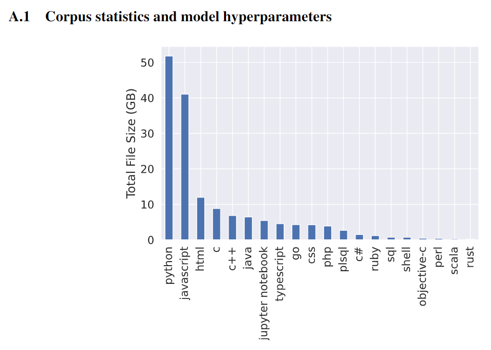
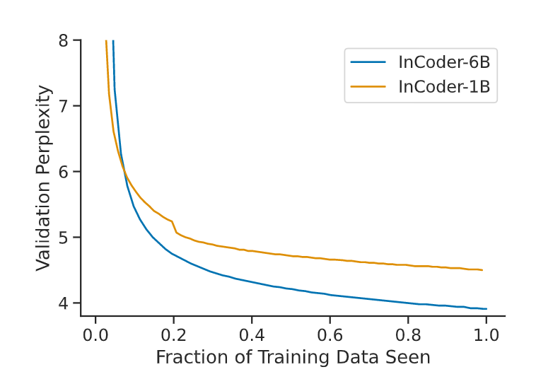

# InCoder: A Generative Modelfor Code Infilling and Synthesis

# InCoder：代码填充和合成的生成模型

**Paper**: [https://arxiv.org/abs/2204.05999](https://www.google.com/url?q=https%3A%2F%2Farxiv.org%2Fabs%2F2204.05999&sa=D&sntz=1&usg=AOvVaw0V90IdCIFbKgtpffQ7gVvF) 

**Demo:** [https://huggingface.co/spaces/facebook/incoder-demo](https://www.google.com/url?q=https%3A%2F%2Fhuggingface.co%2Fspaces%2Ffacebook%2Fincoder-demo&sa=D&sntz=1&usg=AOvVaw3IcuVBoMRILHeMyx_pLFgO) 

**Model weights and instructions:** [https://github.com/dpfried/incoder/blob/main/README.md](https://www.google.com/url?q=https%3A%2F%2Fgithub.com%2Fdpfried%2Fincoder%2Fblob%2Fmain%2FREADME.md&sa=D&sntz=1&usg=AOvVaw04lOXrtAM_ye-Z-VK4I6uR) 

**Examples:** [https://sites.google.com/view/incoder-code-models/home/examples](https://www.google.com/url?q=https%3A%2F%2Fsites.google.com%2Fview%2Fincoder-code-models%2Fhome%2Fexamples&sa=D&sntz=1&usg=AOvVaw2kZguBzltjp52trZh_L4IB) 

## 摘要

代码很少是在一次从左到右的过程中编写的，而是被反复编辑和完善。我们介绍了INCODER，一个统一的生成模型，它可以进行程序合成（通过从左到右的生成）以及编辑（通过填充）。InCoder经过训练，可以从一个大型的许可代码语料库中生成代码文件，其中的代码区域被随机屏蔽并移到每个文件的末尾，允许用双向的上下文填充代码。我们的模型是第一个能够填充任意代码区域的大型生成性代码模型，我们在类型推断、注释生成和变量重命名等具有挑战性的任务中对其进行了零次评估。我们发现，以双向上下文为条件的能力极大地提高了这些任务的性能，同时与在类似规模下预训练的仅从左到右的模型相比，在标准程序合成基准上仍有相当的性能。INCODER模型和代码已公开发布。

## 1、Introduction

在大量代码存储库上训练的大型语言模型在神经程序合成和相关任务方面取得了显着进展。但是，此类模型从左到右生成代码，这使得它们不太直接适用于许多普遍存在的代码编辑任务，例如修复错误、添加注释或重命名变量。我们介绍了 INCODER，一个用于程序合成和编辑的统一模型。与之前的工作一样，INCODER 被训练为最大化代码语料库的可能性。然而，我们采用了因果掩蔽目标，允许 INCODER 填充以任意左右上下文为条件的代码块。

更具体地说，我们通过用标记标记随机替换代码段并将它们移动到序列的末尾来学习填充（图 1，顶部）。该模型经过训练，可以按照这种排列顺序预测完整序列中的所有标记。在推理过程中，我们可以通过用标记标记替换跨度来编辑代码，用新序列提示模型，并让它生成新标记来替换被屏蔽的跨度（图 1，底部）。因为该模型也可以在没有标记标记的情况下轻松生成，所以结果是程序合成（通过从左到右生成）和编辑（通过填充）的统一方法。

为了进一步开展代码填充和生成工作，我们在以下网站公开发布我们的模型: https://sites.google.com/view/incoder-code-models，即：

## 2、Infilling and Synthesis via Causal Masking--通过因果掩蔽的填充和合成

用于代码生成的神经模型要么使用从左到右（因果）自回归语言建模目标 [16, 18]，要么像 BERT 那样使用掩码语言建模目标 [22, 24]。两种方法都有优点和缺点。因果模型仅以生成标记左侧的上下文为条件，从而防止填充，但它们可以自回归生成整个文档。

另一方面，掩蔽语言模型可以同时以左右上下文为条件来填充掩蔽区域，但是，它们的训练目标通常仅限于生成大约 15% 的文档。**在本文中，我们采用了最近提出的因果掩蔽目标 [2]，旨在结合因果语言模型和掩蔽语言模型的优势**。

Figure 1:  在训练时（顶部），我们的因果掩蔽目标对训练文档中的一个或多个代码段进行采样（在左上图中，单个跨度）并将这些跨度移动到文档的末尾，它们的原始位置用特殊符号表示屏蔽哨兵令牌。训练自回归语言模型以生成这些完整的蒙面文档，使其能够学习生成以双向上下文为条件的插入文本。在推理时（底部），我们可以通过在所需位置插入掩码标记并允许模型生成代码以插入该位置，以零样本方式执行各种代码编辑和填充任务。显示的所有示例都是我们的 INCODER-6.7B 模型的真实输出，模型插入的区域以橙色突出显示。

### 2.1、Training

在训练时，因果掩蔽程序在每个文档中抽取一些连续的标记的跨度来掩蔽（图1，左上）。我们从平均数为1的泊松分布中抽取跨度，截断到支持度[1,256]，因此通常有少量的跨度（大约 $50%$ 的时间有一个跨度），但分布有一个长尾（多达 $256$ 跨度）。每个跨度的长度从文件的长度中均匀地取样，如果有跨度重叠，取样的跨度集将被拒绝并重新取样。

一旦跨度被采样，每个跨度 $k$ 被替换成一个特殊的掩码哨兵标记，\<Mask:k>。然后，跨度中的标记序列被移到文档的末尾（图$1$，右上角），并将掩码前哨标记和一个特殊的掩码结束标记\<EOM>标记附加起来。换句话说，当屏蔽标记在从左到右的排序中第一次出现时，它标志着跨页被移除的位置；当它第二次出现时，它标志着被移动的跨页文本的开始。更正式地说，假设我们有一个有N个标记的文档D，我们已经取样了一个跨度Span = $\mathrm{D}_{i: j}$ 。让Left代表左边的上下文语境 $\mathrm{D}_{0: i}$，Right代表右边的上下文语境$\mathrm{D}_{j: N}$。然后，我们最大限度地提高被屏蔽文件的对数概率：
$$
\log P([\text { Left; <Mask: }>>; \text { Right; <Mask: }\rangle>; \text { Span; <EOM> }])
$$
其中;表示序列连接。如果有一个以上的跨度被取样，每个跨度将被类似地依次附加在文档的末尾。如同标准的从左到右的生成语言建模一样，我们自动递归地计算序列的概率，并使用交叉熵损失对所有标记进行训练，除了掩码哨兵标记\<Mask:k>，这样模型在推理过程中就不会产生这些标记。

### 2.2、Inference

在推理过程中，该模型既可以以标准的方式（通过从模型中自动采样，不使用任何特殊的标记）用于从左到右的生成，也可以通过在所需的位置插入\<Mask:k>标记，在文档的末尾继续生成，在现有文档中的任意位置插入代码。为简单起见，假设我们只想在一个位置插入文本，我们通过从分布中取样标记的自回归方式，在该位置的左和右上下文序列之间生成一个跨度来插入文本：
$$
P(\cdot \mid[\text { Left; <Mask: } \theta>; \text { Right; <Mask: }\rangle>])
$$
直到生成 <EOM> 令牌或达到与任务相关的停止标准。

更普遍的是，当在多个位置插入时，我们对文件的条件是插入多个掩码哨兵令牌，并附加最后的掩码令牌。例如，要在两个位置插入，我们使用[A；\<Mask:0>；C；\<Mask:1>；E；\<Mask:2>]）并依次填入掩码，附加适当的\<Mask:k>哨兵令牌以示开始生成下一个跨度，即。两个插入位置的完整文档由[A；\<Mask:0>；C；\<Mask:1>；E；\<Mask:2>；\<Mask:0>；B；\<EOM>；\<Mask:1>；D；\<EOM>]表示，其中区域B和D已经被填充。

当应用于代码时，这使我们能够以零起点的方式执行受益于双向上下文的任务，如图1，底部所示。例如，我们可以根据左侧上下文（函数签名）和右侧上下文（函数实现）来执行Python文档串的生成。我们还可以填充多个相互依赖的区域，例如，生成模型正在生成的一个函数所需要的导入语句。

## 3、Training Data

我们在一个语料库上训练我们的模型，这个语料库包括：(1)具有允许的、非盗版的、开源许可证的公共代码；(2)StackOverflow问题、答案和评论。我们在本文中主要关注的是Python语言，但我们也包括28种语言的代码文件和所有可用的StackOverflow内容。在经过下面概述的过滤和重复数据删除步骤之后，我们的语料库总共包含了159GB的代码，其中52GB是Python语言，以及总共 $57GB$ 来自StackOverflow的内容。按语言划分的总数据量见附录中的图$5$。

Figure 5:  根据文件扩展名确定的最常见语言的总文件大小的代码语料库组成(在重复数据删除和过滤之后)。

### 3.1、Code

- **Sources**

  我们通过GitHub和GitLab的公共API，在截至2021年12月9日的一段时间内，从这两个网站获得了代码文件和存储库元数据。我们获得了大约670,000个公共非分叉仓库，这些仓库被GitHub/GitLab检测为主要包含Python、JavaScript或Jupyter Notebook文件，并且具有MIT、Apache 2.0、BSD-2或BSD-3条款许可。由于Python文件也可以包含在非主流Python库中，我们也包括了所有其他可以通过BigQuery上的GitHub档案获得的Python和Jupyter文件，我们没有直接从GitHub获得。我们对Jupyter笔记本进行预处理，包括所有的文本和代码（文本单元中的Markdown格式已被删除），单元格由XML风格的标签划分（见3.3节）。

- **Deduplication**

  最近的工作表明，去重训练数据可以提高模型性能并降低记忆训练数据的风险 [5, 43, 38]。 我们的重复数据删除方案使用文件中字母数字标记序列的精确匹配来删除代码文件。这删除了大约 75% 的文件大小的语料库（从 1 TB 减少到 250 GB），因为有许多重复的存储库，库依赖项包括 源文件和常见的样板代码文件（例如，用于 Python Web 框架）。 我们还使用正则表达式来检测代码文件中的电子邮件地址并将其替换为虚拟地址，以降低模型记住真实电子邮件地址或产生幻觉的风险。

- **Decontamination**

  为了确保我们的代码生成模型可以在多个当前代码生成基准上进行评估，我们执行数据去污：消除我们的训练数据和这些基准的评估集之间的重叠。我们删除了 CodeSearchNet [34] 的验证和测试集中包含的任何存储库，因为它们用于为 CodeXGLUE 中的几个任务构建验证和测试集。

- **Filtering**

  我们的过滤类似于过去在代码生成模型上的工作 [18, 46, 68]：我们删除包含任何行超过 3000 个标记或平均行长度大于 100 个标记的文件，它们的字符少于 40% 字母数字或下划线，或似乎是自动生成的，我们使用子字符串匹配由自动代码和文档生成系统生成的少量短语来确定。 我们的去污和过滤步骤一起删除了大约 10% 的 Python 文件。

### 3.2、StackOverflow

我们语料库的第二个组成部分包括来自 StackOverflow 的问题、答案和评论。用于训练我们在第 6 节中比较的最近生成代码模型的 The Pile [26] 也包含这些问题和答案，但不包含评论。我们包括所有至少有一个答案的问题，每个问题最多十个答案的非负分数（按分数排序），每个问题/答案最多五个评论。定性地说，我们发现注释以及模型的填充能力使我们的模型具有一定的能力，可以在语言指导下进行交互式代码编辑（参见附录中的图 11）。

Figure 11. 在StackOverflow 上的预训练以及我们模型的填充能力，使其能够对函数执行零样本交互式细化。在第一个示例中，模型根据用户描述生成了橙色区域。在第二个示例中，用户添加了一个注释，指定了对函数的改进，并选择了模型要替换的文本。在第三个示例中，橙色区域已被模型填充。 

### 3.3、Metadata

我们在训练数据中直接包含代码文件和 StackOverflow 问题/答案的一些元数据，以允许属性条件生成 [40, 75] 和属性预测。对于代码文件数据，我们的属性是代码文件名、文件扩展名（作为语言的代理）、文件源（GitHub 或 GitLab），对于 GitHub 存储库，分为六个存储桶的星数。在执行模型的从左到右提示时元数据是可选的，我们以$ 50% $的概率将每个属性插入其文档的开头（允许模型学习元数据条件）；否则，我们将其插入其文档的末尾（允许元数据预测）。有关示例，请参见附录中的图 6a 和图 6b。对于 StackOverflow，我们的元数据属性是主题的问题标签（例如，python、django）和每个问题和答案的投票数，与存储库星的方式相同。我们直接在为其编写的问题或答案之后插入评论。有关示例，请参见附录中的图 6c。

### 3.4、Tokenization

为了增加我们的代码模型可以调节的上下文数量、模型可以生成的文档长度以及训练和推理的效率，我们训练了一个字节级 BPE 标记器 [56, 51]。我们允许标记跨越空格（不包括换行符），以便常见的代码习惯用法（例如，import numpy as np）在词汇表中表示为单个标记。这大大提高了标记器的效率——相对于 GPT-2 的字节级 BPE 标记器和词汇表，将我们的训练语料库编码所需的标记总数减少了 45%。

## 4、Training 

我们的主要模型是INCODER-6.7B，一个6.7B Transformer[62]语言模型。我们使用与[8]中描述的密集的6.7B模型相同的架构；Fairseq架构描述可以在附录中的表8中找到。INCODER-6.7B在248个V100 GPU上进行了24天的训练。我们对训练数据进行了一次历时，对每个训练文件正好使用一次。我们的实现利用了Fairseq[47]中的因果掩码实现[2]，底层库是PyTorch[49]。我们每个GPU的批处理量为8，最大令牌序列长度为2048。我们将所有的梯度规范剪辑为1.0，并使用亚当优化器，$β_1=0.9$，$β_2=0.98$[41]。对于我们的学习率调度器，我们使用了[49]中内置的多项式衰减学习率调度器，有1500个预热更新。Fairscale被用于通过完全分片的模型状态来提高内存效率。

Figure 2. 损失曲线表明，在一个 epoch 之后，困惑度仍在改善，并且随着模型大小的增大，困惑度得到了显着改善。这表明增加时期、数据大小或模型大小将提高性能。

Figure 3.  INCODER-6.7B 在 HumanEval 从左到右综合基准上的性能通常会在预训练过程中提高。我们通过自举重采样绘制了一条最佳拟合线以及 95% 的置信区间。

我们在图 2 中比较了 6B 参数模型和较小的 1.3B 参数模型（有关此 1.3B 模型的训练的详细信息，请参见第 6.2 节）的验证困惑度，显示了与 Aghajanyan 等人报告的可比缩放定律。 [2]。 我们的模型还没有饱和，将受益于进一步的训练； 我们在 HumanEval Python 函数综合基准 [18] 上报告了 6.7B 模型的性能（有关此基准的描述，请参见第 6.1 节），并看到在训练过程中性能持续提高（图 3）。

## 5、Infilling Experiments

我们的主要评估是为各种编程任务执行零样本填充：填充多行代码、预测函数返回类型、生成文档字符串、重命名变量以及在完形填空任务中插入缺失的代码标记。我们将每个任务制定为填充一个或多个被屏蔽的代码区域。

为了评估INCODER在生成填充物时如何从双向上下文中获益，我们比较了三种不同的推理方法：第2节中描述的因果掩蔽推理程序、标准的从左到右的生成方法（从左到右的单一）和从左到右的生成和重排方法（从左到右的重排）。由于我们的模型也能从左到右生成，我们可以用同一个INCODER-6.7B模型来比较这三种推理方法，从而避免由于模型的变化而产生的混杂影响。对于所有三种推理方法，我们使用Fairseq的top-p（核）抽样[33]的实现[47]从模型中获得世代，p=0.95，并使用任务的发展数据为每个任务和推理方法调整了温度参数。在所有的生成实验中，我们在提示前加了元数据，表明生成的代码应该是Python (i.e., <| file ext=.py |>; see Section 3.3)。

**Left-to-right single**

此基线根本不使用被屏蔽位置右侧的上下文。它通过以左侧上下文为条件并从模型 P(⋅ ∣ Left) 中自回归地对标记进行采样，直到达到特定于任务的停止条件（例如，对于注释生成，生成注释结束分隔符）来生成位置的单个补全; 对于多行填充，生成指定数量的行）。

**Left-to-right reranking**

这个基线只使用左边的上下文来提出填补空白的候选人，但同时使用左边和右边的上下文来选择这些候选人。具体来说，我们首先为空白区域生成K个可能的填充物，$Span_1$ ... $Span_K$，按照从左到右的单一程序，除非另有说明，否则使用$K = 10$。然后，我们对每个候选者进行评估，将其替换到空白区域并对完成的文件进行评分。我们使用完成文档的总对数概率 log P([Left; $Span_k$; Right])，或者按照[18]，将完成文档中的标记数量平均为对数概率。我们利用任务开发数据的表现，在这两种评分方法中为每个任务进行选择。

Table 1:  在我们从 HumanEval 构建的单行和多行代码填充基准中，我们的因果屏蔽 (CM) 方法在功能测试通过率方面都比从左到右的单个候选和从左到右的重新排序基线获得了实质性改进和完全匹配。

### 5.1、Infilling Lines of Code  (HumanEval)

我们为 HumanEval 数据集 [18] 中的完整代码行创建了一个填充基准。该数据集提供了与每个函数的规范实现配对的函数的注释描述以及函数应该传递的几个输入-输出对。 HumanEval 是作为综合整个 Python 函数的基准引入的；我们将在第 6.1 节中在这个原始合成设置上评估我们的模型。我们使用这个数据集是因为它提供了对已完成代码的功能测试（而不是仅仅依赖于对代码表面形式的评估），这在填充具有更多潜在正确完成方式的较长区域时尤其重要。我们从 HumanEval 数据集构建了两个不同的填充任务，用于单行和多行：

**Single-line infilling**

在这个任务中，我们依次屏蔽掉典型函数实现中的每一行非空白代码（为一个有N行非空白的函数创建N个例子）。任务是根据函数的自然语言描述和空白前后的代码行，为空白处生成一个单行补全。我们使用（1）通过率：完成的函数通过所有函数的输入输出对的比率（即类似于Chen等人[18]的pass@1度量）和（2）精确匹配：完成的行与典型实现中的屏蔽行精确匹配的百分比。性能是数据集中所有程序产生的所有例子的平均值。

**Multi-line infilling**

这项任务的构建方式与上述单行填空相同，但允许每个遮蔽区域包含多行代码，为一个具有N个非空行的函数创建N×(N+1)/2个例子。我们再次使用通过率和精确匹配来评估完成情况，在所有填充实例中取平均值。

**Inference details**

为了选择何时结束由我们的推理方法产生的填充，我们将由从左到右（L-R）基线产生的候选人截断为空白区域的实际行数。对于我们的因果掩码（CM）填充方法，我们在模型产生<EOM>标记时结束填充。对于L-R单一和CM填充方法，我们使用 $0.2$ 的温度。对于L-R rerank方法，我们使用 $0.8$ 的温度对 $K =10$ 个候选人进行抽样，并以完成函数的总对数概率重新评分。

**Results**

表 1 显示了单行（左）和多行设置（右）的结果。 在这两种设置中，CM 填充比 L-R 单基线和 L-R 重新排序基线有显着改善。 请注意，这些结果是通过对所有示例进行平均来计算的，其中包括函数中所有位置的屏蔽区域（包括开始，当没有左上下文可用时，以及结束，当没有右上下文可用时）。 

Figure 4:  单线填充（左）和多线填充（右）的填充通过率，由函数中提供给必须填充的区域右边的线的比例决定。阴影区域给出了95%的置信区间，用自举重样法估计。我们的因果掩码（CM）填充方法，蓝色，一直优于从左到右（L-R）的基线，当更多的右侧背景可用时，收益更大（两个图的右侧）。

图 4 显示了一个更细粒度的比较，其中我们按规范函数中包含在填充右侧的上下文中的行的分数对示例进行分组。 随着更多右侧上下文可用（即，当空白区域出现在函数中较早时），CM 填充方法比 L-R 基线有更大的改进。

### 5.2、Docstring generation (CodeXGLUE)

接下来我们评估文档字符串（docstring）的生成，其中模型必须生成一个自然语言文档字符串，该文档字符串总结了 Python 代码片段。正确的上下文对于文档字符串的生成可能特别有用，因为对函数体的调节可以让模型生成更多信息量的描述。先前的神经代码生成模型在受监督的文档字符串代码对上进行了微调以执行此任务（例如，[18,45,4]），我们在没有明确的文档字符串监督的情况下评估我们的模型零样本。

我们使用 CodeXGLUE 代码到文本文档字符串生成任务 [45]，该任务由 CodeSearchNet [34] 构建，由从公开可用的 GitHub 存储库中抓取的文档字符串代码对组成。 L-R 单个候选基线在文档字符串之前的左侧上下文中使用函数签名进行提示。 CM 填充和 L-R 重新排序方法也观察由函数体组成的正确上下文。

Table 2:  CodeXGLUE Python Docstring 生成 BLEU 分数。我们的模型在零样本设置中进行评估，没有对文档字符串生成进行微调，但它接近了在任务的 250K 示例（底部块）上微调的预训练代码模型的性能。

我们按照任务的原始自动评估设置比较模型。在表 2 中，我们使用数据集中提供的参考文档字符串报告了所有模型的平滑 4-gram BLEU 分数。 这些引用已经过预处理，以从原始抓取的文档字符串中去除无关内容（例如，参数定义）。 我们对 CM 填充和 L-R 单一候选生成方法使用贪婪生成，并在温度 0.8 下采样 $K = 10$ 个候选，L-R 重新排序方法的平均对数概率得分（通过调整任务的验证集来选择）。 对于所有推理方法，如果模型生成换行符，我们将终止生成。 我们还包括 CodeXGLUE 论文中报告的监督基线的性能。 该基线是一个编码器-解码器模型，其中一个 CodeBERT 编码器在数据集中的 $250k$ 个训练示例上进行了微调。 我们的零样本性能接近微调 CodeBERT 模型的性能。

### 5.3、Code Cloze (CodeXGLUE)

CodeXGLUE 完形填空是从 CodeSearchNet 创建的，用于评估 CodeBERT，由简短的自然语言描述和几种编程语言的代码组成。我们评估 max/min 子任务，其中模型必须决定给定的掩码是否应该填充 max 或 min。由于此任务中只有两个选项，因此我们可以通过对两个选项进行评分并选择具有最高可能性的序列来仔细比较因果掩蔽填充和从左到右的设置。

表 3 包含主要结果。使用带有单个标记（包含最小值/最大值）的因果屏蔽填充格式作为屏蔽区域（CM 填充标记）比仅使用左侧上下文执行得更好，但不如从左到右对整个序列进行评分。屏蔽较大的区域（CM 填充区域），在被屏蔽的区域中包含左侧前缀和 10 个右侧标记，其性能与对整个序列的评分相当。填充区域长度和标记化会影响性能，请参阅 A.2 了解更多详细信息和更多比较。

请注意，将填充不同的序列的分数与从左到右的设置进行比较比使用 CM 填充设置在计算上更昂贵，因为 Transformer 中间激活可以被缓存并在相同的序列前缀之间共享，并且在 CM 填充设置中，所有序列差异都发生在末端。

### 5.4、Return Type Prediction

预测 Python 函数的返回类型提示是一项具有挑战性的结构化生成任务（参见图 1，“类型推断”）。我们在两个数据集上进行评估：一个是我们从 CodeXGLUE 构建的，另一个是来自 TypeWriter OSS [50] 的数据集。

**CodeXGLUE**

我们使用代码到文本（文档字符串生成）任务中使用的相同 Python CodeXGLUE 数据集开发返回类型预测的基准。 我们在此数据集的开发和测试集中的所有函数上运行抽象语法树 (AST) 处理器和转换器，以 (1) 识别具有 PEP 48413 返回类型提示注释的函数，该注释不是 None 和 (2) 删除所有其他类型 来自函数的提示（例如，函数参数和变量声明）。 这样一来，开发中的 232 个函数和测试集中的 469 个函数。

Table 4: 在两个数据集上预测 Python 函数返回类型提示的结果。我们看到因果掩蔽填充比使用从左到右推理的基线方法有显着改进。 

任务是以函数签名和主体为条件并预测类型提示。 我们将各种方法预测的类型提示与原始函数中的注释类型提示进行比较，使用规范化类型提示的精确匹配精度。

为了比较我们的三种生成方法，我们在生成 : 时停止生成，这结束了类型提示并表示函数体的开始。我们在开发集上调整推理超参数，我们使用 0.2 的温度用于从左到右的单次，0.8 用于从左到右的重新排序，以及用于因果掩码填充的贪婪生成。表 4a 给出了测试集的结果。以正确的上下文（即函数体）为条件在从左到右的重新排序设置中提供了一些好处，但通过我们的因果掩蔽填充提供了实质性的改进。

**TypeWriter  OSS**

最近的一些工作已经开发了监督机器学习方法来预测动态类型语言的类型注释，包括 Python [69, 6, 50] 和 TypeScript [31, 66, 36]。我们将我们的零样本模型与 Python 的一种此类方法 Type-Writer [50] 进行了比较，该方法将类型提示预测的神经架构与基于搜索的增量类型验证过程相结合。

为了与有监督的 TypeWriter 方法进行比较，我们获得了它对该工作 [50] 中使用的开源软件 (OSS) 数据集的预测，该数据集由来自 GitHub 的 Python 函数组成。不幸的是，我们无法评估他们的完整评估集，因为其中大部分都包含在我们模型的训练数据中。我们过滤到未包含在我们的训练数据中的实例，我们能够通过 AST 解析从中获取文件并提取函数和类型，并且具有非无返回类型提示。这留下了 2,092 个示例（约占其评估集的 12%）。否则，我们会模拟它们的确切设置，这允许我们的模型以文件导入、函数体和函数签名为条件来预测返回类型提示。我们使用与 CodeXGLUE 类型提示预测相同的推理超参数。

我们在两个表格中展示了我们的结果：表 4b 表示跨非 None 类型的指标，以及附录中的表 11，其中也包括 None 类型（如下 [50]）。我们再次看到因果掩蔽填充能力的巨大好处在生成返回类型时以函数体为条件，我们发现我们的零样本模型在该数据集上优于监督 TypeWriter 模型。

Table 5:  我们从 CodeXGLUE 构建的变量重命名基准的结果。我们的模型受益于在选择（L-R 重新排序和 CM 填充）和提议（CM 填充）变量名称时使用右侧上下文。

|         Method          | Accuracy |
| :---------------------: | :------: |
|  Left-to-right single   |   18.4   |
| Left-to-right reranking |   23.5   |
| Causal-masked infilling |   30.6   |

### 5.5、Variable Name Prediction

变量名预测是一种约束较少的代码生成任务，需要对双向上下文进行建模。我们再次使用 CodexGlue 代码到文本任务（文档字符串生成）中的测试集并运行 AST 转换以隔离并屏蔽所有出现的变量名称（填充）或从第一个变量中获取最左边的上下文名称（从左到右模式）。在填充设置中，鉴于我们生成的掩码数量等于看到变量的次数，我们选择最常见的预测作为我们的奇异预测。此外，我们只评估包含四个或更多字符的变量名称集。对于我们的重新排名，我们考虑了一个包含 25 个变量的候选集。我们在表 5 中展示了我们的结果。我们再次看到同时使用左右上下文的显着好处：从左到右的重新排序和因果屏蔽填充都优于从左到右的单一基线（仅使用左上下文） .在从左到右的重新排序方法上进行因果屏蔽填充，证明了在提出候选完成时对正确上下文进行调节的价值。

## 6、Model Comparisons

在本节中，我们将我们的模型与其他生成代码模型进行比较。 据我们所知，所有已发布的代码生成模型都是从左到右的。 我们在第 6.1 节中比较了两个从左到右的 Python 程序合成基准上的现有模型，发现我们的模型获得了与在相似数量的数据上训练的相似大小的模型相似的性能。 我们还在第 6.2 节中执行模型消融和损失、训练数据和模型大小的变化。 例如模型输出（用于填充和从左到右生成），具体看附录A.4。

### 6.1、Comparison to Left-to-Right Generative Models on Code Synthesis

我们与过去在 HumanEval [18] 和 MBPP [10] 基准上发表的关于生成代码模型的工作进行比较，这需要模型以自然语言描述（文档字符串）为条件来生成 Python 程序（通常是单个函数），并评估整体功能使用每个程序的多个测试用例的示例的准确性（通过率）。

我们在这两个基准上对我们的 INCODER-6.7B 模型进行了零样本评估。 对于 HumanEval，我们遵循过去的工作，通过函数签名和文档字符串描述进行提示，对 200 个候选程序完成进行采样，并使用 Chen 等人的无偏采样估计器计算 pass@1、pass@10 和 pass@100。 [18]。 对于不包含函数签名的 MBPP，我们仅使用文档字符串描述进行提示，并使用单个候选者计算 pass@1 [21]。 我们使用 p = 0.95 的 top-p 采样，pass@1 的温度为 0.2，pass@10 和 pass@100 的温度为 0.8。

Table 6. 我们的INCODER-6.7B模型与已发表的代码生成系统的比较，使用的是HumanEval和MBPP基准上采样的通过率@K候选人。所有的模型都是仅有解码器的变换器模型。"Permissive "代码许可证表明模型只在具有非盗版许可证的开源资源库中训练。GPT-J、GPT-NeoX和CodeGen模型是在The Pile[26]上预训练的，其中包含一部分没有任何许可证过滤的GitHub代码，包括6GB的Python。尽管LaMDA模型没有在代码库上进行训练，但其训练语料库包括来自网络文档的∼18 B的代码标记。LaMDA语料库的总文件大小没有被报告，但它总共包含2.8T个标记。我们使用报告的代码数据大小和语料库中每一部分的标记计数来估计PaLM的语料库大小。 

我们在表 6 中将我们的 INCODER-6.7B 模型与过去工作的模型（全部都是从左到右）进行了比较，给出了报告的模型大小和训练数据汇总统计数据（或估计，在只有论文的情况下） 在这些论文中报告令牌计数，因为令牌生成器效率不同）。 尽管跨论文和实验设置的 Transformer 模型架构、数据集和训练程序的细节存在差异，因此无法进行严格的比较，但我们注意到，我们的模型在 HumanEval 指标上的性能与 CodeGen-Multi [46] 大致相当，这也是 在大致相同数量的 Python 代码上训练的 ∼6B 参数模型，以及 AlphaCode 的 1.1B 仅解码器模型 [44]，它也使用相似数量的 Python 训练数据。

### 6.2、Ablation Experiments

为了更严格地比较使用因果掩蔽训练模型的效果，以及分析模型大小和训练数据的影响，我们训练了模型的几个变体。我们比较了 HumanEval [18] 和 MBPP [10] 从左到右综合基准上的模型 pass@1 分数，结果如表 7 所示。

**Objective**

比较在相同的训练数据上用因果掩蔽（CM）目标（第2行）和标准的从左到右的语言建模（LM）目标（第3行）训练的1.3B参数模型，我们看到，因果掩蔽模型在HumanEval和MBPP任务中获得的性能略高，在pass@1 score。这进一步证明了因果掩蔽训练并不损害模型进行标准的从左到右生成的能力。

**Model Size**

在数据保持不变的情况下，增加模型大小会持续提高性能（比较第 1 行和第 2 行中的 6.7B 和 1.3B CM 模型，以及第 3 和第 6 行中的 1.3B 和 2.3B LM 模型）。

**Effects of fata**

我们将在我们的整个多代码语言和StackOverflow数据集上训练的模型（多语言+SO，在第3.1节中描述）与只在Python代码文件和StackOverflow上训练的数据消融（Python+SO）和只在Python代码文件上训练的模型（Python）进行比较。我们发现，在多语言上的训练使这些Python评估的性能略有下降。然而，比较第4行和第5行，我们看到在训练中包括StackOverflow的数据，大大改善了HumanEval和MBPP的性能。这表明，未来关于语言引导的合成任务的生成性代码模型的工作应该考虑使用StackOverflow或其他混合自然语言和代码的语料作为训练数据。

Table 7. 消融结果，比较了模型在从我们的训练语料库以及HumanEval和MBPP基准中取出的验证集的Python部分的性能。我们根据模型的大小（以十亿为单位）、目标（因果屏蔽，CM，与标准的从左到右的语言建模，LM）、训练数据和训练中的总计算量（以Zettaflops，1×1021的浮点运算）进行比较。

## 8、Related Work

**Language Models for Code**

最近有一系列关于在源代码上训练大规模神经语言模型的工作。现有模型的架构设计和训练目标不同，例如，仅解码器语言模型 [10, 18, 35, 68, 46]，仅编码器掩码语言模型 [24, 37] 和编码器-解码器模型 [4, 44、54、64]。仅解码器语言模型最近越来越流行，因为它们可以通过从左到右的方式生成零样本程序合成。另一方面，InCoder 是一种仅解码器的因果屏蔽语言模型，可以填充任意文本范围。这允许模型执行零样本程序合成和无数其他代码填充任务。

**Infilling Models**

许多现实世界的应用程序需要使用左右上下文填充序列，例如，编辑句子 [57]、恢复古代文本 [9] 以及修复源代码中的错误。 不幸的是，标准的从左到右的语言模型不能直接填充文本，流行的掩码语言模型主要被训练来填充非常短的跨度 [17、22、52、54]。 最近的工作通过改变模型架构、推理过程和训练目标来解决这个问题 [2, 59, 67, 3]。 与我们的方法最相关的是 Donahue 等人的工作。 [23] 和 CM3 [2]，他们训练从左到右的语言模型来填充不同长度的掩码标记段； 和 Alon 等人的工作。 [7]，他们在较小的规模上训练了一个具有填充能力的、AST 结构的代码生成模型。 此外，在我们工作的同时，OpenAI 发布了一个支持代码和文本填充的 API，尽管它们的模型不是开源的，技术细节也不公开。

**Machine Learning for Code Assistance**

在使用机器学习模型来帮助人类程序员方面有大量的文献。这包括推断变量类型[50, 66]，生成单元测试[25]，修复程序[30, 70, 20, 71]，以及验证程序正确性[55]。我们的InCoder模型可以填充任意跨度的代码，这使得它可以在一个统一的零散的方法中自然地完成上述的许多任务。

**Machine Learning for Program Synthesis**

程序综合方法直接从功能规范中生成程序 [29]。 此类模型通过将所需程序的输入输出示例 [12、28、19、13]、部分实现 [58] 或自然语言描述 [74、73、72、42、18] 作为输入来工作。 我们的 InCoder 模型与过去的工作不同，因为它可以合成和填充任意范围的代码，以自然语言和部分实现为条件。

## 9、Conclusion

我们证明了在训练代码生成模型时使用因果掩蔽目标能够在许多具有挑战性和实用性的代码填充和编辑任务上实现强大的零散性能。该模型的额外填充能力似乎并不损害其进行标准的从左到右生成的能力：消融和比较实验表明，我们的因果掩蔽模型在标准的从左到右的语言到代码合成基准上具有与类似资源的模型相当的性能。

展望未来，我们希望我们的模型性能能够随着更多的参数、数据和训练步骤而继续提高[39, 32]。此外，微调将使我们的模型能够更好地对自然语言指令和其他人类意图的指示进行调节[76, 65, 48]。最后，我们的模型为未来通过模型微调进行监督性填充和编辑的工作奠定了基础，以及执行迭代解码，其中模型可用于完善其自身的输出[27]。

