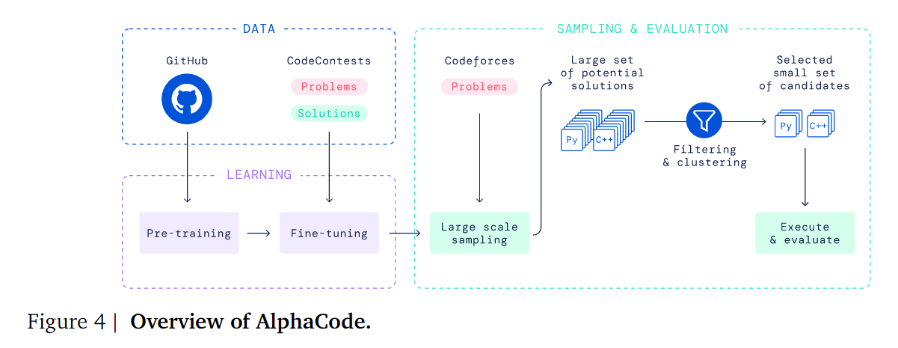
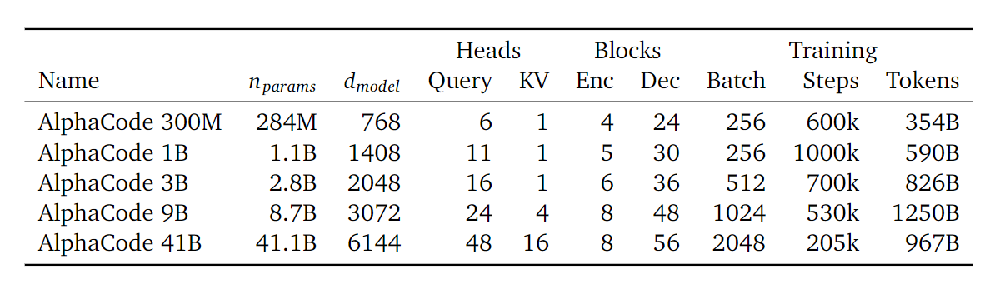
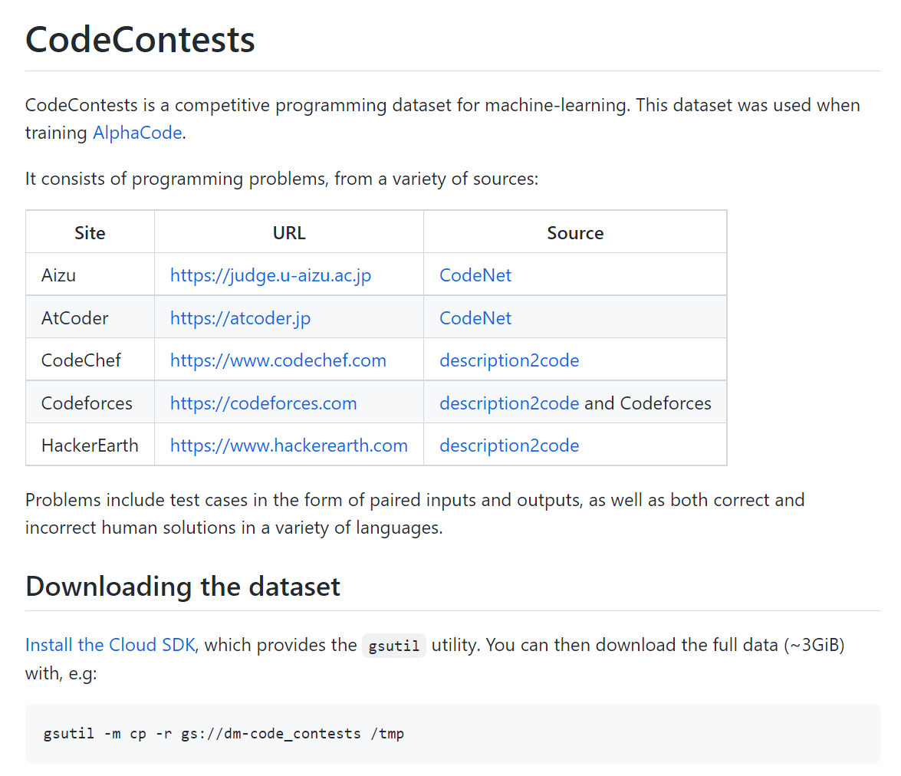
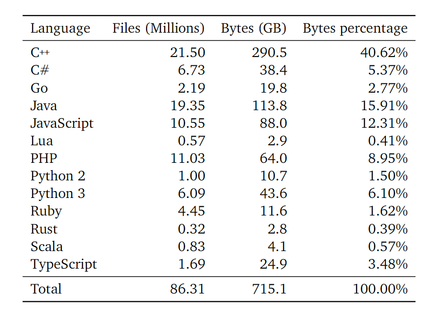

# AlphaCode提取

### 1、算法介绍

系统 AlphaCode 的高级视图可以在图 4 中看到，主要过程是：

1. 使用标准语言建模目标在 GitHub 代码上预训练基于转换器的语言模型。该模型可以合理地表示人工编码的空间，大大减少了问题的搜索空间;
2. 在我们的竞技编程数据集上微调模型，使用GOLD（Pang和He，2020）与tempering（Dabre和Fujita，2020）作为训练目标。这进一步减少了搜索空间，并通过利用预训练弥补了少量的竞争性编程数据;
3. 从我们的模型中为每个问题生成大量样本;
4. 通过使用示例测试和聚类根据程序行为挑选样本，过滤样本以获得一小组候选提交（最多 10 个），以在隐藏的测试用例上进行评估。

其中，大规模采样和滤波是我们的设置所独有的，我们发现这个过程大大提高了问题的解决率。因此，我们的许多设计决策都是为了促进高效和有效的采样。

### 2、模型构建

竞争性编程代码生成问题可以被看作是一个序列到序列(Sutskever等人，2014)的翻译任务：给定一个自然语言的问题描述(如图2)，产生一个相应的编程语言的解决方案(如图3)。这自然促使我们为AlphaCode选择了一个编码器-解码器转化器架构(Vaswani等人，2017)，它的模型是  $p(Y \mid X)$。该架构将问题描述作为一个扁平的字符序列(包括元数据，标记化)作为编码器的输入，并从解码器中每次对一个标记进行自动采样，直到产生一个代码结束的标记，此时代码可以被编译和运行.

1. Pre-training

   在GitHub数据集上对模型进行了预训练，对解码器采用了标准的交叉熵下一标记预测损失，对编码器采用了掩蔽的语言建模损失(Devlin等人，2018)。

2. Fine-tuning

   在CodeContests数据集上微调了模型。在微调过程中，本文将自然语言问题描述用于编码器，将程序解决方案用于解码器。与预训练类似，同时使用了标准的下一个标记预测和掩盖的语言建模损失。本文还采用了额外的调节和修改，本文发现这些调节和修改提高了总体解决率：下面描述的回火、价值调节和预测、GOLD以及附录C.2中描述的元数据调节。

### 3、数据集

本文所有的模型首先在GitHub的开放源代码集合上进行预训练，随后在我们创建的编程竞赛数据集（CodeContests，[在此](https://github.com/deepmind/code_contests)发布）上进行微调。预训练阶段帮助模型学习代码的良好表示并流畅地生成代码，而微调阶段帮助模型适应目标竞争性编程领域。

预训练数据集是基于2021/07/14所选的GitHub公共存储库的快照。我们包括了几种流行语言的所有代码文件。C++, C#, Go, Java, JavaScript, Lua, PHP, Python, Ruby, Rust, Scala, 和 TypeScript。按照以前的工作(Chen等人，2021)，我们过滤掉了所有大于1MB或行数超过1000个字符的文件，以排除自动生成的代码。我们还删除了同一文件的重复部分，忽略了比较中的空白部分。经过过滤，我们最终的预训练数据集共包含715.1GB的代码。不同语言的数据集构成可以在附录中找到(表A1)。

Appendix Table A1  | 本文的 GitHub 预训练数据集的组成。Python 2 和 3 的区别在于代码是否可以使用 Python 3 的解析器成功解析。 

