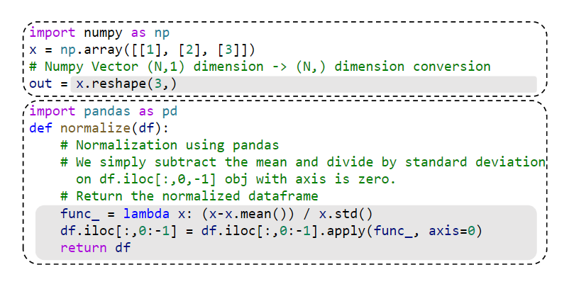

# CERT (PyCodeGPT) 提取

- GitHub： https://github.com/microsoft/PyCodeGPT

  

### 1、算法介绍

最近，由于预训练技术的成功，大型语言模型在大规模未标记代码语料库上进行了训练，并且在代码生成方面表现良好。在本文中，我们研究了如何利用未标记的代码语料库来训练面向库的代码生成模型。由于程序员重用第三方库是一种常见的做法，在这种情况下，由于库数量庞大，很难获得文本代码配对数据。我们观察到面向库的代码片段更有可能共享相似的代码草图。因此，我们通过两个步骤呈现 CERT：草图生成器生成草图，然后生成器填充草图中的细节。草绘器和生成器都在使用未标记数据的基础模型上不断进行预训练。

Figure 1. Python 中的一个示例：使用 Pandas 的多个代码片段在匿名用户定义的术语后可能具有相同的草图。 

图1中显示了一个例子。在对变量和常量进行匿名化处理后，使用Pandas APIs的多个代码片断可能具有相同（或类似）的草图。基于这一观察，改善面向库的代码生成的一个自然想法是将这一任务分解为两个子任务：生成草图，然后填写细节。在不同的代码生成任务中，已经提出了许多基于这一想法的方法（例如，Coarse-to-Fine [Dong and Lapata, 2018] 和 PLOTCODER [Chen et al., 2021b]），并表明这一想法可以有效地提高生成的代码片段的质量。

这些方法都是针对微调过程而提出的，在微调过程中，需要高质量的文本-代码对来得出两步生成的监督信号。因此，在我们没有提供成对标记数据的情况下，出现了一个研究问题：如何利用草图的洞察力来加强对无标记代码体的语言模型预训练，从而提高生成的面向图书馆的代码片段的质量？

为了应对这一挑战，本文提出了CERT（针对sketCher和gEneRaTor），这是一种针对面向库的代码生成的草图的持续预训练方法。在CERT中，一个草图绘制者首先专注于预测草图，其中省略了用户定义的细节；然后，生成器将草图作为提示，生成完整的代码。草图绘制者和生成器都是基于代码的基础语言模型不断进行预训练的，使用的是未标记的代码体，而不是成对标记的数据。

上下文包含代码注释形式的自然语言问题描述，以及包括导入、函数头和变量定义等语句的代码片断；目标代码是解决上文中描述的编程问题的代码片断。例如，让 $\mathbf{x}=\left(x_{1}, x_{2}, \cdots, x_{N}\right)$ 表示上下文，其中每个 $x_n$可以是一个代码标记或一个自然语言token。给定 $x$ ，代码生成模型可以表述为 $\mathbf{y}=\mathcal{M}(\mathbf{x})$，其中 $\mathbf{y}=\left(y_{1}, y_{2}, \cdots, y_{M}\right)$ 表示目标代码，每个 $y_m$是一个代码标记。

Figure 2: PandasEval 和 NumpyEval 基准测试中的两个编程问题示例。上下文以白色背景显示，目标代码以灰色背景显示。 

### 2、模型构建

使 PY-CODEGPT 强大的三个关键点：

- 1）大量经过仔细清洗的数据用于预训练； 
- 2）一个新训练的分词器，专门用于python； 
- 3）优先考虑高质量数据的重采样策略。

除了 PYCODEGPT，我们还将 CODEGEN (MONO 350M) [Nijkamp et al., 2022] 作为我们的基础模型之一，这是迄今为止 HumanEval 上性能最好的公开可用模型。

Figure 3:  CERT 概述：草图绘制器和生成器。

Figure 5:  使用 Pandas 中的示例为草绘器和生成器准备训练数据

### 3、相关工作

最相关的工作是用于代码的大型预训练模型系列。至于编码器式的预训练模型，它们不能直接用于生成代码，如CuBERT [Kanade等人, 2020], CodeBERT [Feng等人, 2020], 以及GraphCodeBERT [Guo等人, 2020]。至于解码器式或编码器-解码器式的，它们是在大型无标签的代码库上训练的，可以直接用于代码生成任务，如CodeT5 [Wang et al, 2021]、CodeGPT[Lu等人，2021]、PLBART[Ahmad等人，2021]、PolyCoder[Xu等人，2022]、CODEGEN[Nijkamp等人，2022]、AlphaCode[Li等人，2022]以及Codex[Chen等人，2021a]。所有这些都专注于生成独立的代码，而本文则研究面向库的代码生成。

### 4、数据集

本文收集了 60.6M(数量) 原始 python 文件，总大小为 330GB。经过一系列的数据预处理策略，如去重python文件、清洗和格式化内容等，最终的预训练语料包含约13.0M的高质量python文件，大小为96GB。PYCODEGPT 在具有 32GB 内存的 16 个 NVIDIA V100 GPU 集群上针对 200K 步和 100B 令牌进行了预训练。预训练时间约为2天。
