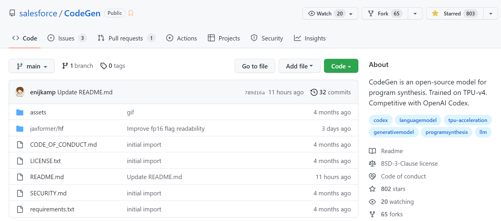
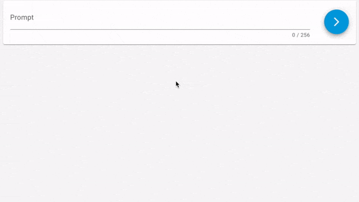
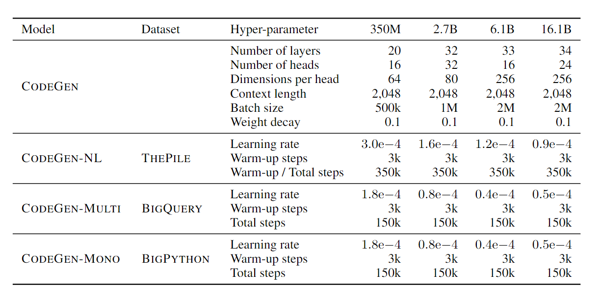

# CODEGEN提取

- GitHub:  https://github.com/salesforce/CodeGen

使用演示：

### 算法介绍

本文采用语言模型进行程序合成的基本思路，并以单次用户意图规范研究程序合成能力。此外，本文在以下三个方面做出了贡献：

1. 本文研究了在缩放定律下从简单的自回归语言建模中产生的会话能力，并利用它来引入会话程序合成方法；
2. 本文使用新开发的多轮编程基准来研究它的属性；
3. 本文开源了一个自定义库 JAXFORMER，其中包括本文的训练代码以及模型检查点。

在多语言编程语言数据（BIGQUERY）上进一步训练CODEGEN-NL，可以得到CODEGEN-MULTI。多语言CODEGEN模型在很大程度上超过了在THEPILE（GPT-NEO、GPT-J、CODEGEN-NL）上训练的模型。然后，我们在Python数据集（BIGPYTHON）上对CODEGEN-MULTI进行了微调，形成了CODEGEN-MONO。程序合成能力得到了进一步的大幅提高。因此，Python程序的合成能力随着Python训练数据量的增加而增强。对于几乎所有的模型，正如预期的那样，增加模型的规模可以提高整体性能。

在每个回合，我们的模型考虑到了作为Python注释的提示（即" "，它可以通过合成的子程序获得。为了整合这两者，我们在每个转弯处用提示和生成的样本的交错串联来喂养模型。串联的历史长度在转弯时线性增加，如果超过了模型的最大输入长度，则从头开始截断。

### 模型构建及性能测试

采用标准的基于Transformer的自回归语言模型，改变（1）模型参数的数量（350M、2.7B、6.1B、16.1B）和（2）训练语料库中的编程语言标记。为了扩展模型，开发了一个自定义库 $JAX_{FORMER}$，用于在 TPU-v4 硬件上训练大型语言模型，并将作为开源发布，包括训练后的模型权重。

模型是自回归变换器，以常规的下一个标记预测语言模型为学习目标。CODEGEN模型家族被训练成各种规模，有350M、27B、61B和161B的参数。前三种配置可以与在文本语料库上训练的开源大型语言模型GPT-NEO(350M，2.7B)(Black等人，2021)和GPT-J(6B)(Wang和Komatsuzaki，2021)直接比较。模型规格见表。

该架构遵循一个标准的变压器解码器，具有从左到右的因果掩码。当模型和数据的规模扩大时，对话能力就会出现。

### 数据集

