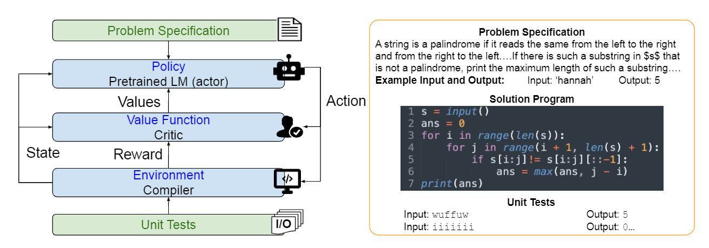
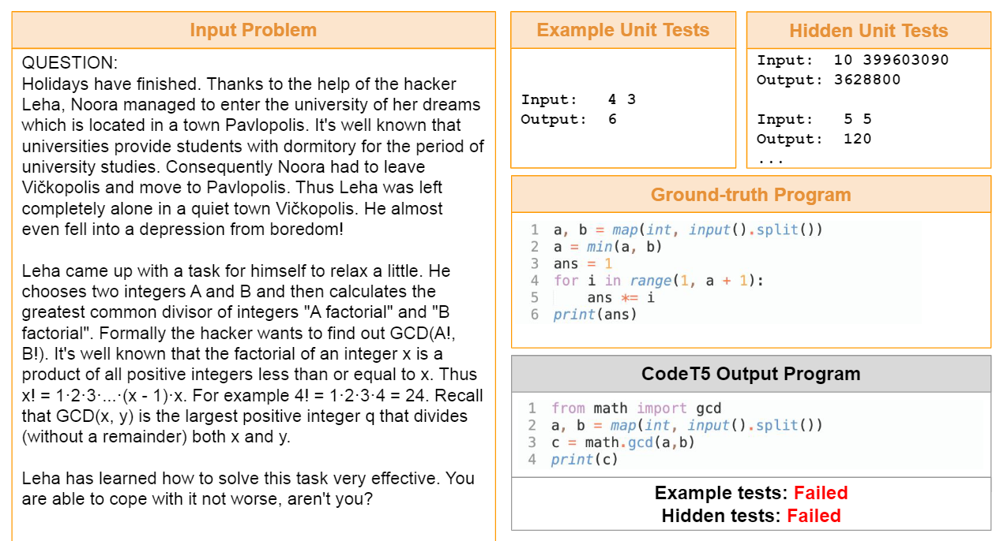

# Code RL提取

### 算法介绍

最近使用大规模预训练语言模型 (LM) 的方法已显示出可喜的结果，但它们也存在一些严重的局限性。特别是，他们经常遵循标准的监督微调程序，仅从自然语言问题描述和真实程序对训练代码生成模型。这种范式在很大程度上忽略了问题规范中的一些重要但可能有用的信号，例如单元测试，因此在解决复杂的看不见的编码任务时通常会导致性能下降。

为了解决这些限制，我们提出了“CodeRL”，这是一个通过预训练 LM 和深度强化学习 (RL) 进行程序合成任务的新框架。具体来说，在训练过程中，我们将生成代码的 LM 视为一个 actor 网络，并引入一个经过训练的评论家网络，以预测生成程序的功能正确性并向演员提供密集的反馈信号。在推理过程中，我们引入了具有关键采样策略的新一代过程，该策略允许模型根据来自示例单元测试和批评分数的反馈自动重新生成程序。对于模型主干，我们扩展了 CodeT5 的编码器-解码器架构，具有增强的学习目标、更大的模型尺寸和更好的预训练数据。

Figure 1:  我们用于程序合成的CodeRL框架的高层次概述（左图）：我们将预先训练好的代码语言模型（LM）视为随机策略，将代码代数视为行动，并且可以根据编译器（环境）输出程序的单元测试结果来估计奖励。一个程序合成任务的例子（右）。每个任务都是由自然语言的问题说明来定义的，通常包含输入和输出对的例子。预期的输出是一个程序，要根据一些单元测试来检查功能的正确性。

### Pretraining Language Models on Code

我们采用Transformer模型作为我们程序合成系统的骨干。具体来说，本文扩展了CodeT5模型[Wang et al., 2021]作为CodeRL的基础模型。

**CodeT5**

CodeT5 [Wang et al., 2021]是一个多语言的代码感知语言模型，在从Github策划的大规模源代码语料库上进行预训练。凭借统一的编码器-解码器架构，CodeT5在CodeXGLUE基准[Lu等人，2021]的各种代码智能任务中实现了最先进的性能，包括代码理解和生成任务。

**Improving Pretrained Data**

我们使用最近发布的大规模Github代码数据集5来扩大Python预训练数据集。 我们过滤数据集，只保留至少允许学术使用的许可证的代码（"mit", "apache-2", "bsd-3-clause", "bsd-2-126 clause", "cc0-1.0", "unlicense", "isc"）。由此产生的Python数据集（GCPY）有10.5亿个标记，比原始CodeT5[Wang等人，2021]中使用的CodeSearchNet（CSN）语料库[Husain等人，2019]大10倍。

Figure 2: 我们的 actor-critic 框架概述，以优化用于程序合成的预训练 LM：我们将 LM 视为一个参与者网络，并从该参与者中采样合成样本。另一个神经网络被训练为批评模型，以根据这些合成样本通过单元测试的概率来评估它们。回报是根据评论分数估计的，最后考虑到学习目标 Lrl 中，以使用合成样本微调演员 LM 网络。

### Program Synthesis as an RL Problem

我们建议将程序合成表述为一个RL问题（见图1，左），并应用行为者批评的RL方法，通过利用模型优化（见图2）和生成程序（见图4）中的单元测试信号来提高预训练LM的性能。

更正式地说，我们可以把LM模型的学习参数 $θ$ 看作是一个随机的策略，它决定一个行动作为每个标记的预测。在每次行动之后，LM模型都会更新其隐藏状态表征，这些表征被策略用来决定下一个解码步骤中的下一个行动。在生成情节结束时（即观察到一个\<endoftext>标记），LM模型收到一个由生成程序的功能正确性衡量的回报r。RL微调的目标是使预期回报最小化：
$$
\mathcal{L}_{r l}(\theta)=-\mathbb{E}_{W^{s} \sim p_{\theta}}\left[r\left(W^{s}\right)\right]
$$
其中 $W^{s}=\left(w_{1}^{s}, \ldots, w_{T}^{s}\right)$ 是一个合成样本，其中每个标记 $w_{t}^{s}$ 在解码时间步长 $t$ 时被LM模型采样。 按照REINFORCE算法[Williams, 1992, Sutton and Barto, 2018]和政策梯度定理[Sutton et al., 1999]，我们可以将无差别回报 $r$ 的梯度 $\nabla_{\theta} L(\theta)$ 的估计定义为：
$$
\begin{aligned}
\nabla_{\theta} \mathcal{L}_{r l}(\theta) & \approx-\mathbb{E}_{W^{s} \sim p_{\theta}}\left[r\left(W^{s}\right) \nabla_{\theta} \log p_{\theta}\left(W^{s} \mid D\right)\right] \\
& \approx-\mathbb{E}_{W^{s} \sim p_{\theta}}\left[r\left(W^{s}\right) \sum_{t} \nabla_{\theta} \log p_{\theta}\left(w_{t}^{s} \mid w_{1: t-1}^{s}, D\right)\right]
\end{aligned}
$$

### 3.3.1、Defining Return by Unit Test Signals

对于每个样本序列 $W_s$，可以通过检查其功能正确性来启发式地定义返回 $r$。我们把生成的程序和相应的单元测试一起交给编译器。从测试的输出中，我们可以确定返回值 $r$：
$$
r\left(W^{s}\right)= \begin{cases}-1.0 & , \text { if } W^{s} \text { cannot be compiled (i.e. compile error) } \\ -0.6 & \text {, if } W^{s} \text { cannot be executed with unit tests (i.e. runtime error) } \\ -0.3 & , \text { if } W^{s} \text { failed any unit test } \\ +1.0 & , \text { if } W^{s} \text { passed all unit tests }\end{cases}
$$

Figure 3. 我们的批评者模型的概述。批评者模型是作为一个错误预测器来学习的。该模型接收问题规格和程序作为输入序列。对于每个程序，该模型被训练来预测四个可能的测试结果之一。{编译错误，运行时间错误，测试失败，测试通过}。然后，从批评者那里学到的隐藏状态代表被用来估计合成样本的回报，以微调行为者网络。为了改善和稳定训练过程，我们考虑了基线程序，并将相对收益计入损失函数以优化演员网络。 

然而，在相关领域，例如 text-to-SQL 研究 [Zhong et al., 2018, Xu et al., 2018]，我们注意到这种估计收益的方法会导致模型训练不稳定，梯度估计的方差很大遵循方程式。 (3) 用小批量训练。

Figure 9. CodeT5 变体生成的面试级 APPS 编程任务和程序示例：CodeT5 模型生成的程序未通过所有单元测试，而 CodeRL+CodeT5（没有 CS 生成）可以生成功能正确的程序。然而，这个程序在极端测试用例中会导致运行时错误。应用 CS 生成程序后，程序得到改进，能够通过所有隐藏单元测试。 

