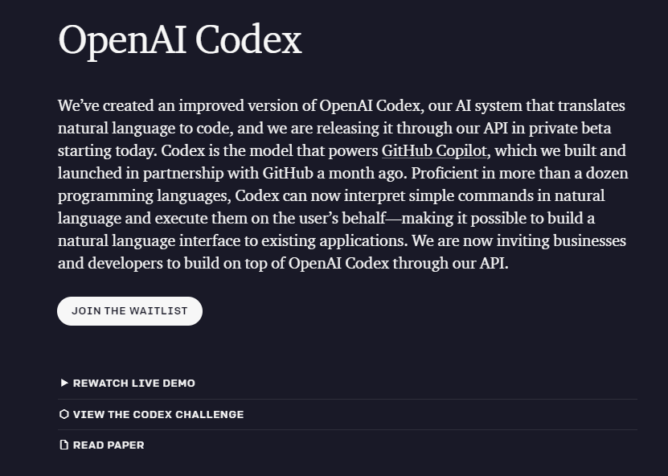
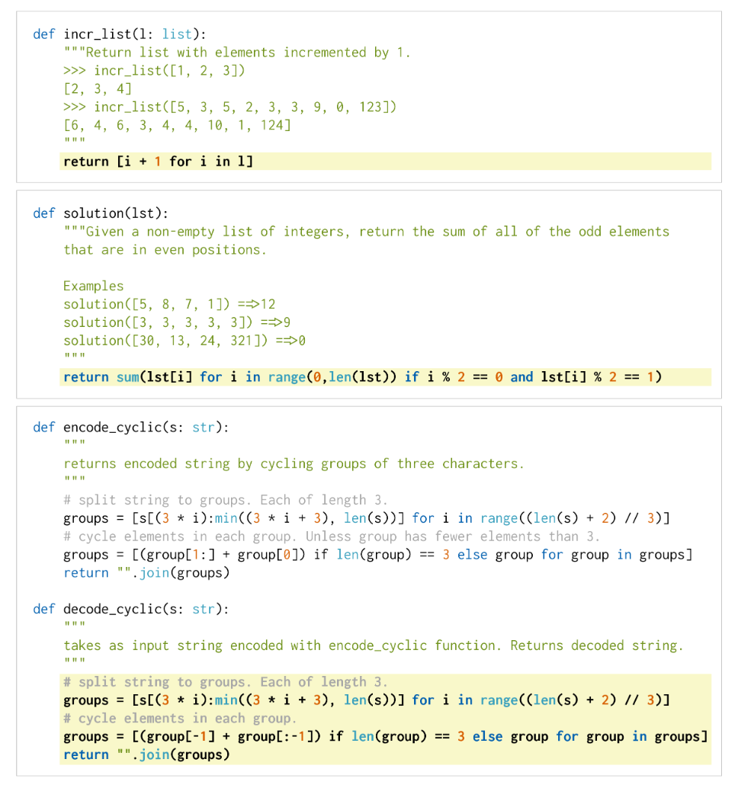
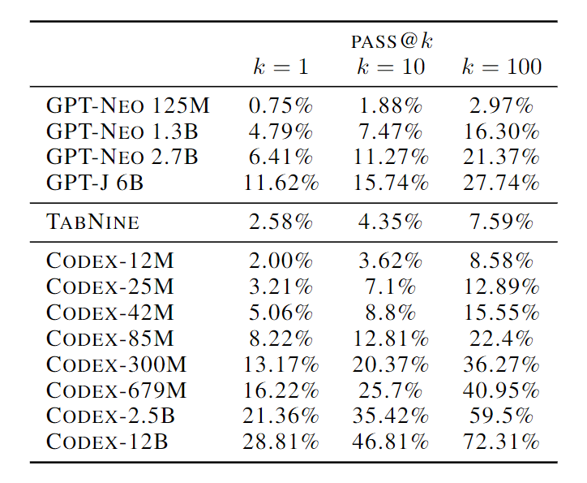
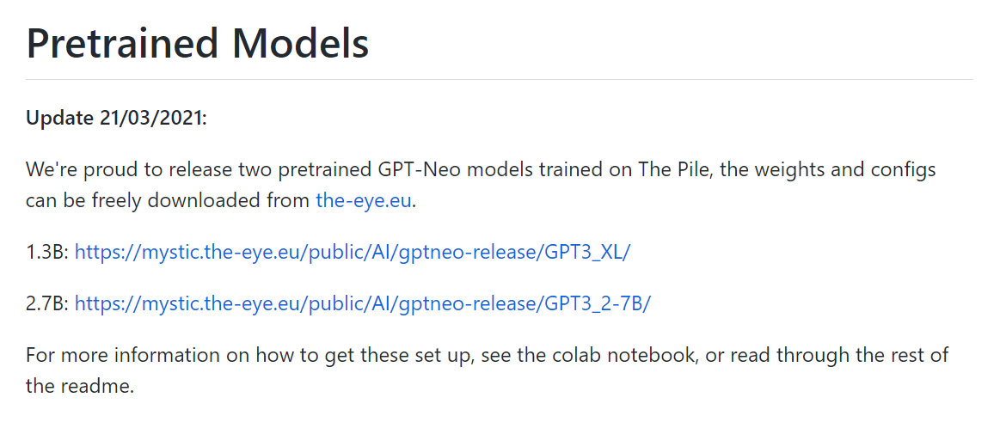

# Codex提取

### 1、方法介绍：

根据GitHub的公开代码对GPT语言模型进行微调训练而成的模型。Codex的一个独特版本为GitHub Copilot提供工业生产的技术支撑。训练数据集是在2020年5月从GitHub上的54个百万级公共软件库中收集的，包含179GB的1MB以下的独特Python文件。作者过滤掉了可能是自动生成的、平均行长大于100的、最大行长大于1000的、或含有少量字母数字字符的文件。过滤之后，最终数据集共有159GB。

为了解决测试集中的问题，本文从模型中生成多个样本，并检查它们中的任何一个是否通过了单元测试。只需一个样本，12B 参数 Codex 解决了 28.8% 的这些问题，300M 参数 Codex 解决了 13.2% 的这些问题。相比之下，6B 参数 GPT-J (Wang & Komatsuzaki, 2021) 在同一数据集上达到 11.4%，而所有 GPT 模型均达到接近 0%。为了提高本文的模型在从文档字符串进行函数合成任务的性能，作者在独立的、正确实现的函数上微调 Codex。生成的模型 Codex-S 使用单个样本解决了 37.7% 的问题。图 2 展示了数据集中不同难度的问题，以及正确的模型生成解决方案。

Figure 2. 来自HumanEval数据集的三个例子问题，其中Codex-12B的单个样本通过单元测试的概率为0.9、0.17和0.005。提供给模型的提示以白色背景显示，而模型生成的成功完成则以黄色背景显示。虽然不能保证问题的新颖性，但所有的问题都是手写的，而不是从现有的资源中用程序复制的。 

Table 1. 针对 HumanEval 的 Codex、GPT-Neo 和 TabNine 评估。作者发现 GPT-J pass@1 介于 Codex-85M 和 Codex-300M 性能之间。

### 2、评估指标

Kulal等人（2019）使用 *pass@k* 指标评估功能正确性，每个问题生成 $k$ 个代码样本，如果有任何样本通过单元测试，则认为问题已解决，并报告问题解决的总比例。然而，以这种方式计算 *pass@k* 会有很高的变异性。相反，为了评估 *pass@k*，我们为每个任务生成 $n≥k$ 的样本（在本文中，我们使用 $n=200$，$k≤100$），计算通过单元测试的正确样本 $c ≤ n $的数量，并计算出无偏估计器：
$$
\text { pass@ } k:=\underset{\text { Problems }}{\mathbb{E}}\left[1-\frac{\left(\begin{array}{c}
n-c \\
k
\end{array}\right)}{\left(\begin{array}{l}
n \\
k
\end{array}\right)}\right]
$$

### 3、使用的数据集

- 来源：GitHub公开数据集

- 不可获得、未公开

### 4、Reference

- GPT-J

  GPT-J 6B 是使用 Ben Wang 的 Mesh Transformer JAX 训练的变压器模型。 “GPT-J”表示模型的类别，“6B”表示可训练参数的数量。

  - https://huggingface.co/EleutherAI

- [GPT-Neo](https://github.com/EleutherAI/gpt-neo)

  

  预训练模型可获得，且训练的数据集ThePile可获得。

  - https://huggingface.co/EleutherAI