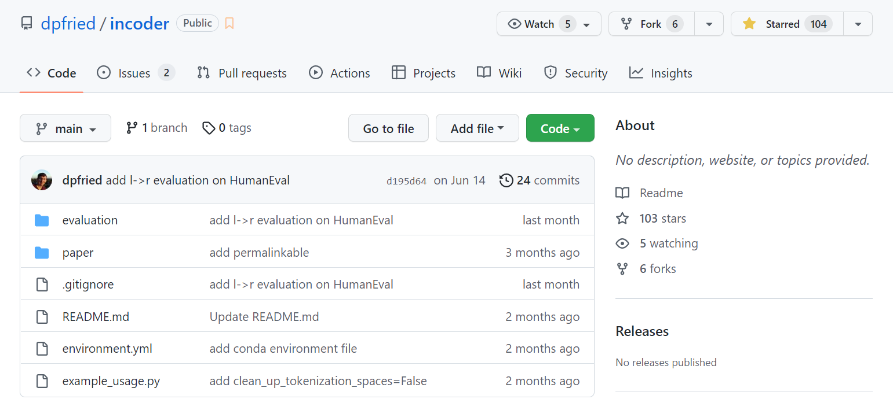
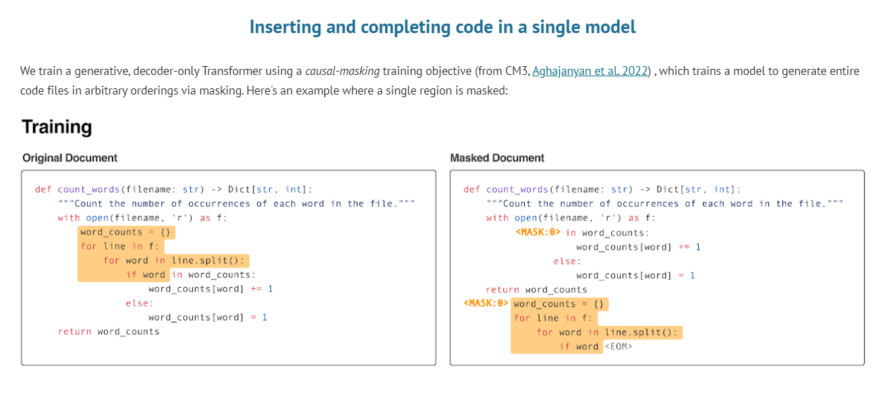
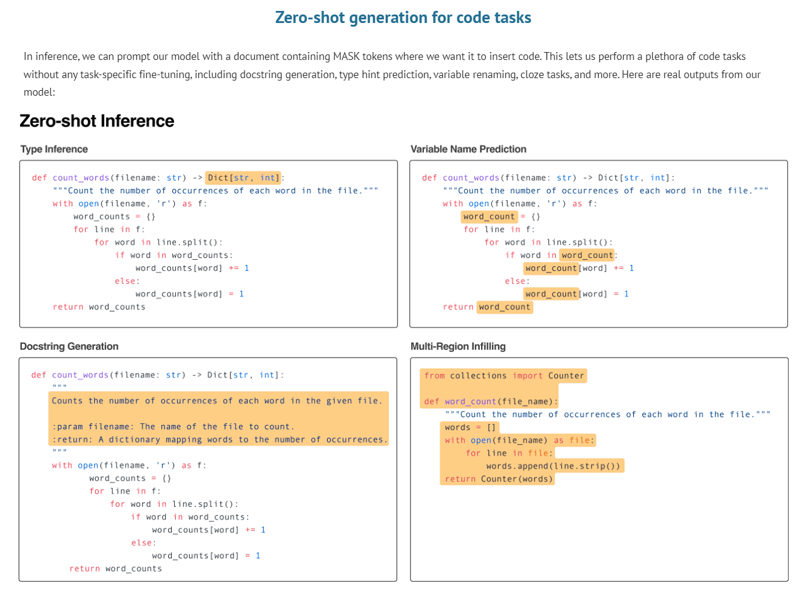
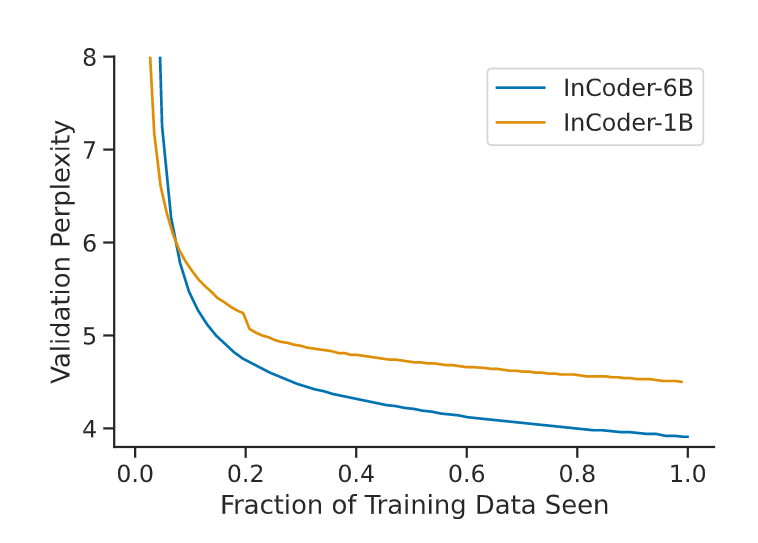
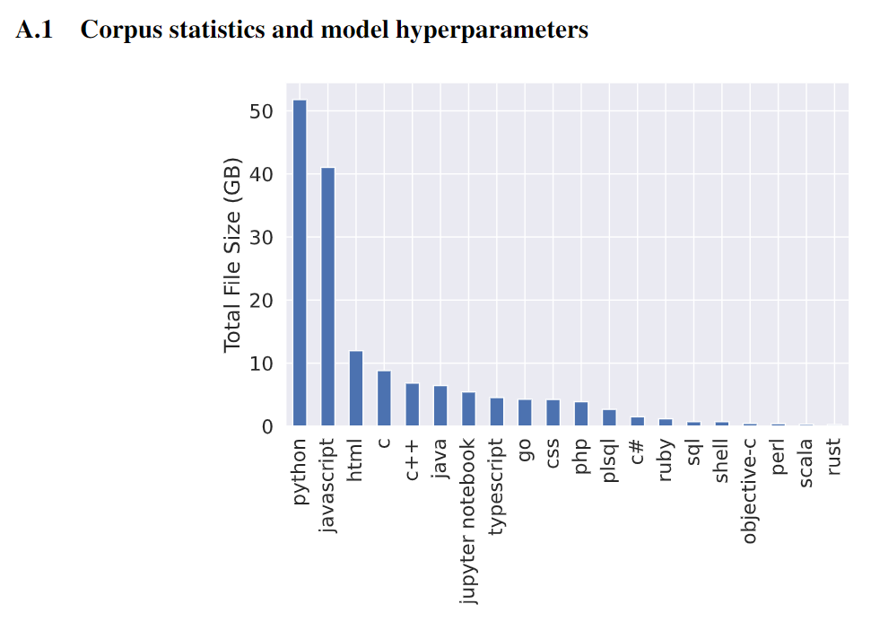

# InCoder提取

### 算法介绍

INCODER，一个用于程序合成和编辑的统一模型。与之前的工作一样，INCODER 被训练为最大化代码语料库的可能性。然而，本文采用了因果掩蔽目标，允许 INCODER 填充以任意左右上下文为条件的代码块。

更具体地说，本文通过用标记标记随机替换代码段并将它们移动到序列的末尾来学习填充（图 1，顶部）。该模型经过训练，可以按照这种排列顺序预测完整序列中的所有标记。在推理过程中，可以通过用标记标记替换跨度来编辑代码，用新序列提示模型，并让它生成新标记来替换被屏蔽的跨度（图 1，底部）。因为该模型也可以在没有标记标记的情况下轻松生成，所以结果是程序合成（通过从左到右生成）和编辑（通过填充）的统一方法。

**在本文中，我们采用了最近提出的因果掩蔽目标 [2]，旨在结合因果语言模型和掩蔽语言模型的优势**。

### Training

在训练时，因果掩蔽程序在每个文档中抽取一些连续的标记的跨度来掩蔽（图1，左上）。我们从平均数为1的泊松分布中抽取跨度，截断到支持度[1,256]，因此通常有少量的跨度（大约 $50%$ 的时间有一个跨度），但分布有一个长尾（多达 $256$ 跨度）。每个跨度的长度从文件的长度中均匀地取样，如果有跨度重叠，取样的跨度集将被拒绝并重新取样。

一旦跨度被采样，每个跨度 $k$ 被替换成一个特殊的掩码哨兵标记，\<Mask:k>。然后，跨度中的标记序列被移到文档的末尾（图$1$，右上角），并将掩码前哨标记和一个特殊的掩码结束标记\<EOM>标记附加起来。换句话说，当屏蔽标记在从左到右的排序中第一次出现时，它标志着跨页被移除的位置；当它第二次出现时，它标志着被移动的跨页文本的开始。更正式地说，假设我们有一个有N个标记的文档D，我们已经取样了一个跨度Span = $\mathrm{D}_{i: j}$ 。让Left代表左边的上下文语境 $\mathrm{D}_{0: i}$，Right代表右边的上下文语境$\mathrm{D}_{j: N}$。然后，我们最大限度地提高被屏蔽文件的对数概率：
$$
\log P([\text { Left; <Mask: }>>; \text { Right; <Mask: }\rangle>; \text { Span; <EOM> }])
$$
其中;表示序列连接。如果有一个以上的跨度被取样，每个跨度将被类似地依次附加在文档的末尾。如同标准的从左到右的生成语言建模一样，我们自动递归地计算序列的概率，并使用交叉熵损失对所有标记进行训练，除了掩码哨兵标记\<Mask:k>，这样模型在推理过程中就不会产生这些标记。

### Inference

在推理过程中，该模型既可以以标准的方式（通过从模型中自动采样，不使用任何特殊的标记）用于从左到右的生成，也可以通过在所需的位置插入\<Mask:k>标记，在文档的末尾继续生成，在现有文档中的任意位置插入代码。为简单起见，假设我们只想在一个位置插入文本，我们通过从分布中取样标记的自回归方式，在该位置的左和右上下文序列之间生成一个跨度来插入文本：
$$
P(\cdot \mid[\text { Left; <Mask: } \theta>; \text { Right; <Mask: }\rangle>])
$$
直到生成 <EOM> 令牌或达到与任务相关的停止标准。

更普遍的是，当在多个位置插入时，我们对文件的条件是插入多个掩码哨兵令牌，并附加最后的掩码令牌。例如，要在两个位置插入，我们使用[A；\<Mask:0>；C；\<Mask:1>；E；\<Mask:2>]）并依次填入掩码，附加适当的\<Mask:k>哨兵令牌以示开始生成下一个跨度，即。两个插入位置的完整文档由[A；\<Mask:0>；C；\<Mask:1>；E；\<Mask:2>；\<Mask:0>；B；\<EOM>；\<Mask:1>；D；\<EOM>]表示，其中区域B和D已经被填充。

当应用于代码时，这使我们能够以零起点的方式执行受益于双向上下文的任务，如图1，底部所示。例如，我们可以根据左侧上下文（函数签名）和右侧上下文（函数实现）来执行Python文档串的生成。我们还可以填充多个相互依赖的区域，例如，生成模型正在生成的一个函数所需要的导入语句。

### 模型架构

主要模型是INCODER-6.7B，一个6.7B Transformer[62]语言模型。使用与[8]中描述的密集的6.7B模型相同的架构；Fairseq架构描述可以在附录中的表8中找到。INCODER-6.7B在248个V100 GPU上进行了24天的训练。我们对训练数据进行了一次历时，对每个训练文件正好使用一次。我们的实现利用了Fairseq中的因果掩码实现，底层库是PyTorch。我们每个GPU的批处理量为8，最大令牌序列长度为2048。

Figure 2. 损失曲线表明，在一个 epoch 之后，困惑度仍在改善，并且随着模型大小的增大，困惑度得到了显着改善。这表明增加时期、数据大小或模型大小将提高性能。

### 数据集

- **Sources**

  我们通过GitHub和GitLab的公共API，在截至2021年12月9日的一段时间内，从这两个网站获得了代码文件和存储库元数据。我们获得了大约670,000个公共非分叉仓库，这些仓库被GitHub/GitLab检测为主要包含Python、JavaScript或Jupyter Notebook文件，并且具有MIT、Apache 2.0、BSD-2或BSD-3条款许可。由于Python文件也可以包含在非主流Python库中，我们也包括了所有其他可以通过BigQuery上的GitHub档案获得的Python和Jupyter文件，我们没有直接从GitHub获得。我们对Jupyter笔记本进行预处理，包括所有的文本和代码（文本单元中的Markdown格式已被删除），单元格由XML风格的标签划分（见3.3节）。

  我们在一个语料库上训练我们的模型，这个语料库包括：(1)具有允许的、非盗版的、开源许可证的公共代码；(2)StackOverflow问题、答案和评论。我们在本文中主要关注的是Python语言，但我们也包括28种语言的代码文件和所有可用的StackOverflow内容。在经过下面概述的过滤和重复数据删除步骤之后，我们的语料库总共包含了159GB的代码，其中52GB是Python语言，以及总共 $57GB$ 来自StackOverflow的内容。按语言划分的总数据量见附录中的图$5$。

Figure 5:  根据文件扩展名确定的最常见语言的总文件大小的代码语料库组成(在重复数据删除和过滤之后)。

- **StackOverflow**

  我们语料库的第二个组成部分包括来自 StackOverflow 的问题、答案和评论。用于训练我们在第 6 节中比较的最近生成代码模型的 The Pile [26] 也包含这些问题和答案，但不包含评论。我们包括所有至少有一个答案的问题，每个问题最多十个答案的非负分数（按分数排序），每个问题/答案最多五个评论。定性地说，我们发现注释以及模型的填充能力使我们的模型具有一定的能力，可以在语言指导下进行交互式代码编辑（参见附录中的图 11）。